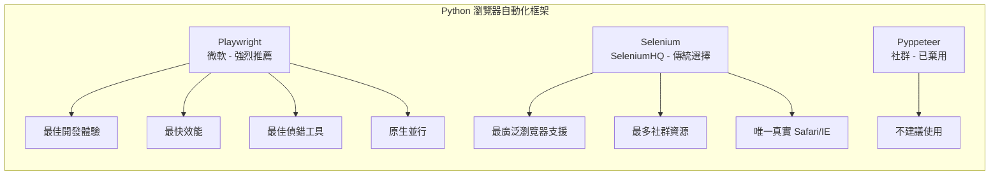

# Python 瀏覽器自動化三強對比：Playwright vs Selenium vs Puppeteer

## 概述

本文比較 Python 生態系中三個主要的瀏覽器自動化框架：**Playwright**（微軟維護）、**Selenium**（SeleniumHQ 維護）、以及 **Puppeteer**（Google 開發，無官方 Python 支援）。針對安裝流程、瀏覽器支援度、執行效能、API 設計、偵錯工具、社群活躍度、並行能力、網路攔截、以及適用場景進行全面分析。

---

## 1. Puppeteer 在 Python 中的特殊處境

Puppeteer 由 Google 開發，原設計為 **JavaScript/TypeScript 專用**，**沒有官方 Python 支援**[^puppeteer-gh]。Python 社群曾透過 **Pyppeteer**（非官方移植）使用 Puppeteer 功能，然而：

- Pyppeteer 最後穩定版為 **0.0.25**（約 2021 年），GitHub 上無正式 release[^pyppeteer-gh]
- 專案 README 明確聲明：**"This repo is unmaintained... Please consider playwright-python as an alternative"**[^pyppeteer-readme]
- 瀏覽器支援僅限 **Chromium**，無法操作 Firefox 或 Safari

因此，**Python 使用者實際上只在 Playwright 與 Selenium 之間做選擇**。Puppeteer（Pyppeteer）已非可行選項。

---

## 2. 安裝流程與環境設定

| 面向 | Playwright | Selenium | Pyppeteer（已棄用） |
|------|-----------|----------|---------------------|
| 安裝指令 | `pip install playwright` + `playwright install` | `pip install selenium` + 手動下載 driver | `pip install pyppeteer` |
| 驅動管理 | **無需**——框架內建瀏覽器二進位檔 | **手動**——需安裝對應版本的 ChromeDriver/GeckoDriver | 自動下載 Chromium |
| 設定複雜度 | 極低——一條指令搞定 | 中等——driver 版本不符是常見痛點 | 中等——非官方移植，維護不佳 |
| 瀏覽器二進位 | 內建 patched Chromium、Firefox、WebKit（各約 300-400MB） | 使用系統已安裝的瀏覽器 | 預設下載 Chromium |
| CI/CD 整合 | 極簡——Docker 中執行 `playwright install --with-deps` | 需在 Docker 中安裝瀏覽器 + 對應 driver | 需 Node.js（Pyppeteer 仍需依賴原生 Puppeteer） |

Playwright 的 **bundled browser binaries** 是關鍵優勢——消除了「在我機器上可以跑」的問題。Selenium 的 driver 版本管理在 CI/CD 環境中是持續的痛點[^zenrows]。

---

## 3. 瀏覽器支援

| 瀏覽器 | Playwright | Selenium | Pyppeteer |
|--------|-----------|----------|-----------|
| **Chrome/Chromium** | ✅ 一級支援 | ✅ 一級支援 | ✅ 主要支援 |
| **Firefox** | ✅ 一級支援 | ✅ 一級支援 | ❌ |
| **Safari/WebKit** | ✅ 一級支援（patched WebKit） | ✅ SafariDriver（真實 Safari） | ❌ |
| **Edge** | ✅ Chromium 版本 | ✅ 一級支援 | ❌ |
| **Internet Explorer** | ❌ | ✅ 傳統支援 | ❌ |
| **Opera** | ✅ Chromium 版本 | ✅ | ❌ |

關鍵差異：
- **Playwright** 對三種引擎（Chromium、Firefox、WebKit）提供一致 API，但其 Safari 是 patched WebKit，**並非真實 Safari**。
- **Selenium** 使用真實安裝的瀏覽器加 W3C WebDriver 協議——這是測試真實 Safari/iOS Safari 行為的**唯一選擇**[^browserstack]。
- Pyppeteer 實質上僅支援 Chromium。

---

## 4. 執行效能

### 4.1 通訊協議架構

| 工具 | 協議 | 連線方式 | 相對速度 |
|------|------|---------|---------|
| **Selenium** | W3C WebDriver（HTTP） | 請求-回應經 WebDriver 伺服器 | **最慢**——每個動作一次 HTTP 往返 |
| **Playwright** | 自訂協議（CDP + patched 瀏覽器 API） | 持久 WebSocket | **最快**——無 WebDriver 中介 |
| **Puppeteer** | Chrome DevTools Protocol (CDP) | 持久 WebSocket | **快**——但 Python 無官方支援 |

### 4.2 實測基準

| 指標 | Playwright | Selenium |
|------|-----------|----------|
| **每次動作平均耗時** | ~290ms | ~536ms（慢 1.85 倍）[^zenrows] |
| **瀏覽器啟動 + 導航** | ~1-2s | ~2-4s |
| **CSS 選擇器尋找元素** | ~5-20ms | ~20-50ms |
| **每小時測試吞吐量** | ~1,240 個 | ~670 個（少 46%）[^testdino] |
| **React SPA（250 個 E2E 測試）** | **3m 48s** | 6m 52s（慢 44%）[^pynions] |
| **伺服器渲染應用** | **5m 10s** | 5m 55s（慢 13%）[^pynions] |
| **SPA 測試不穩定率** | **1.4%** | 5.1%（高 3.6 倍）[^pynions] |

### 4.3 記憶體與資源使用

| 指標 | Playwright | Selenium |
|------|-----------|----------|
| **10 個並行測試的 RAM** | ~2.1 GB | ~4.5 GB[^testdino] |
| **8 核心機器上的並行測試數** | 15–30 個 | 4–8 個 |
| **瀏覽器行程數** | 1 個共享（多個 context） | 每測試 1 個 |
| **每日 5,000 測試的 CI 時數** | 16 小時 | 32 小時[^testdino] |

Playwright 每個測試**少用 50-60% 記憶體**，同硬體可執行 **2-3 倍並行測試**，CI 分鐘數減少約 50%[^testdino]。

---

## 5. API 設計：同步 vs 非同步

| 功能 | Playwright | Selenium | Pyppeteer |
|------|-----------|----------|-----------|
| **同步 API** | ✅ `playwright.sync_api`——一級支援、設計優良 | ✅ `webdriver.Chrome()`——完全同步 | ❌ 無同步 API |
| **非同步 API** | ✅ `playwright.async_api`——原生、完善 | ❌ 無原生 async（需 thread） | ✅ 完全非同步 |
| **自動等待** | ✅ **內建**——動作前自動等待元素可見、穩定、啟用 | ❌ 手動 `WebDriverWait` 或 `implicitly_wait` | ❌ 手動 `waitForSelector` |
| **定位器 API** | ✅ `page.locator()`——延遲評估、可組合、可重試 | ❌ `find_element()`——即時評估、傳統風格 | ❌ `page.$()` / `page.$$()` |

Playwright 的 **自動等待（auto-waiting）** 是其殺手級功能。當呼叫 `page.click('button.submit')` 時，框架會自動等待元素：
1. 存在於 DOM 中
2. 可見（未被 CSS 隱藏）
3. 穩定（無動畫）
4. 已啟用（非 disabled）
5. 可接收指標事件（未被遮擋）

這消除了 Selenium 腳本中因時序問題導致的 **40-60% 不穩定失敗**[^checkly]。

---

## 6. 偵錯工具

| 功能 | Playwright | Selenium | Puppeteer |
|------|-----------|----------|-----------|
| **程式碼生成** | ✅ **Codegen**——錄製操作自動生成程式碼 | ❌ | ❌ |
| **Trace Viewer** | ✅ 視覺化回放每個動作的前後 DOM 快照 | ❌ | ❌ |
| **Inspector** | ✅ Playwright Inspector——逐步偵錯 | ❌（僅外部工具） | ✅ Chrome DevTools |
| **影片錄製** | ✅ 內建 | ❌ | ❌ |
| **失敗自動截圖** | ✅ 內建 | ✅ 需手動實作 | ✅ 需手動實作 |

**Playwright 在偵錯工具面上壓倒性勝出**。Trace Viewer 能顯示每個動作前後的 DOM 快照，省去數小時的除錯時間[^playwright-dev]。

---

## 7. 並行執行

| 面向 | Playwright | Selenium |
|------|-----------|----------|
| **原生並行** | ✅ **內建**——Test Runner 預設多 worker | ❌ 需 Selenium Grid（複雜架構） |
| **Browser Contexts** | ✅ 單一瀏覽器實例中可有多個隔離 context（輕量） | ❌ 每個並行 session = 獨立瀏覽器實例 |
| **10 個並行 session 的記憶體** | ~1-2GB（共享瀏覽器行程） | ~3-5GB（10 個獨立實例） |

Playwright 的 **browser contexts** 是架構上的關鍵優勢。可在單一瀏覽器行程中運行 10 個隔離的 scraping session（不同 cookie、proxy、locale），而 Selenium 需要 10 個獨立瀏覽器實例——記憶體用量多 2-3 倍[^browsercat]。

---

## 8. 網路攔截

| 功能 | Playwright | Selenium |
|------|-----------|----------|
| **攔截/修改請求** | ✅ 內建——`page.route()` | ❌ 需 `selenium-wire` 或外部 proxy |
| **攔截回應** | ✅ 內建 | ❌ 僅外部工具 |
| **加速爬蟲（阻擋圖片/字型）** | ✅ 原生——頁面加載快 30-50% | ⚠️ 可透過 proxy 但複雜 |
| **模擬 API 回應** | ✅ 內建 | ❌ 外部工具 |

---

## 9. 社群狀態與維護

| 指標 | Playwright (Python) | Selenium (Python) | Pyppeteer |
|------|--------------------|-------------------|-----------|
| **GitHub Stars** | ~15,000 ⭐[^playwright-gh] | ~34,500 ⭐[^selenium-gh] | ~3,900 ⭐[^pyppeteer-gh] |
| **最新版本** | v1.63.0（2026-09） | v4.49.0（2026-09） | v0.0.25（~2021） |
| **發行週期** | 約每月 | 約每 2-4 週 | 已停止 |
| **維護狀態** | ✅ 非常活躍（微軟） | ✅ 非常活躍（SeleniumHQ） | ❌ **已棄用** |
| **Python 版本需求** | >= 3.10 | >= 3.10 | >= 3.8 |
| **文件品質** | 極佳 | 極佳 | 過時 |

Selenium 擁有最大的絕對社群和最多的 Stack Overflow 資源，但 Playwright 是**成長最快**的框架，目前已成為綠地專案的預設推薦[^browseruse]。

---

## 10. 適用場景總結

| 使用場景 | 最佳工具 | 原因 |
|---------|---------|------|
| **新專案 E2E 測試** | **Playwright** | 最佳開發體驗、自動等待、Trace Viewer、預設並行 |
| **跨瀏覽器測試（現代）** | **Playwright** | Chromium + Firefox + WebKit 單一 API |
| **真實 Safari/iOS 測試** | **Selenium** | 唯一能測真實 Safari 的選項 |
| **舊版瀏覽器/IE 支援** | **Selenium** | 唯一支援 Internet Explorer |
| **已存在 Selenium 基礎設施** | **Selenium** | 遷移成本可能大於效益 |
| **大量網頁爬蟲** | **Playwright** | 最佳效能、記憶體效率、並行 context |
| **AI Agent / LLM 資料管線** | **Playwright** | 最可靠、最佳反偵測、多語言 |
| **多人語言團隊（Ruby/Kotlin/PHP）** | **Selenium** | 最廣泛的語言支援 |
| **快速原型/學習** | **Playwright** | Codegen、最低學習曲線 |

---

## 11. 結論

對於 **2025-2026 年的新 Python 專案**，**Playwright 是預設推薦**。它具有最佳的開發體驗、最快的執行效能、最好的偵錯工具、原生 Python 同步與非同步 API，以及微軟積極維護。Selenium 僅在以下情況仍有其價值：
- 需要測試**真實 Safari/iOS Safari**（非模擬）
- 需要 **Internet Explorer** 支援
- 組織已有**大規模 Selenium 測試基礎設施**，遷移成本過高

Puppeteer 在 Python 生態系中**已無實際地位**——其唯一非官方移植 Pyppeteer 已被專案自身宣告棄用，並建議使用者轉向 Playwright。

---

## 參考資料

[^puppeteer-gh]: Puppeteer. (n.d.). puppeteer/puppeteer. GitHub. Retrieved 2026-09-25, from https://github.com/puppeteer/puppeteer

[^pyppeteer-gh]: Pyppeteer. (n.d.). pyppeteer/pyppeteer. GitHub. Retrieved 2026-09-25, from https://github.com/pyppeteer/pyppeteer

[^pyppeteer-readme]: Pyppeteer. (n.d.). README. GitHub. Retrieved 2026-09-25, from https://github.com/pyppeteer/pyppeteer#readme

[^playwright-gh]: Microsoft. (n.d.). microsoft/playwright-python. GitHub. Retrieved 2026-09-25, from https://github.com/microsoft/playwright-python

[^selenium-gh]: SeleniumHQ. (n.d.). SeleniumHQ/selenium. GitHub. Retrieved 2026-09-25, from https://github.com/SeleniumHQ/selenium

[^zenrows]: ZenRows. (2024). Playwright vs Selenium: In-Depth Comparison. Retrieved 2026-09-25, from https://www.zenrows.com/blog/playwright-vs-selenium

[^checkly]: Checkly. (2024). Puppeteer vs Selenium vs Playwright Speed Comparison. Retrieved 2026-09-25, from https://www.checklyhq.com/blog/puppeteer-vs-selenium-vs-playwright-speed-comparison/

[^testdino]: TestDino. (2026). Performance Benchmarks of Playwright, Cypress, and Selenium in 2026. Retrieved 2026-09-25, from https://testdino.com/blog/performance-benchmarks

[^pynions]: Pynions. (2026). Playwright vs Selenium (2026): Python Developer's Guide. Retrieved 2026-09-25, from https://pynions.com/playwright-vs-selenium

[^browserstack]: BrowserStack. (2026). Playwright vs Selenium: Which to Choose in 2026. Retrieved 2026-09-25, from https://www.browserstack.com/guide/playwright-vs-selenium

[^browsercat]: BrowserCat. (2025). Playwright vs Selenium: Deep Technical Comparison. Retrieved 2026-09-25, from https://www.browsercat.com/post/playwright-vs-selenium-deep-comparison

[^browseruse]: Browser-use. (n.d.). Playwright vs Selenium vs Puppeteer. Retrieved 2026-09-25, from https://browser-use.com/posts/playwright-vs-selenium-vs-puppeteer

[^autonoly]: Autonoly. (2025). Playwright vs Selenium vs Puppeteer: Full Comparison. Retrieved 2026-09-25, from https://www.autonoly.com/blog/playwright-vs-selenium-vs-puppeteer

[^octobrowser]: Octo Browser. (n.d.). Playwright vs Puppeteer vs Selenium: Comparing the Frameworks. Retrieved 2026-09-25, from https://blog.octobrowser.net/playwright-vs-puppeteer-vs-selenium-comparing-the-frameworks

[^scrapingcentral]: Scraping Central. (n.d.). Browser Automation: Playwright vs Selenium vs Puppeteer. Retrieved 2026-09-25, from https://scrapingcentral.com/guides/browser-automation/21-playwright-vs-selenium-vs-puppeteer