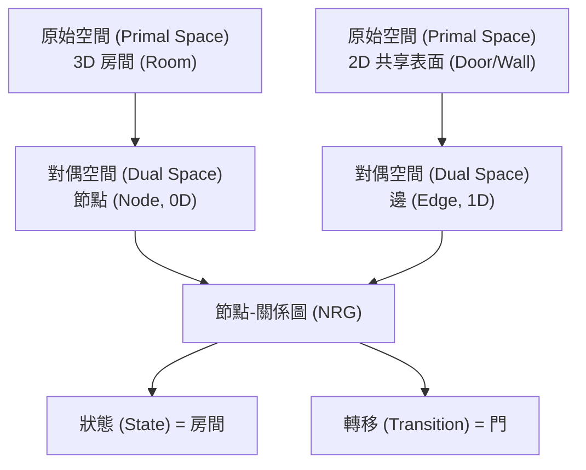
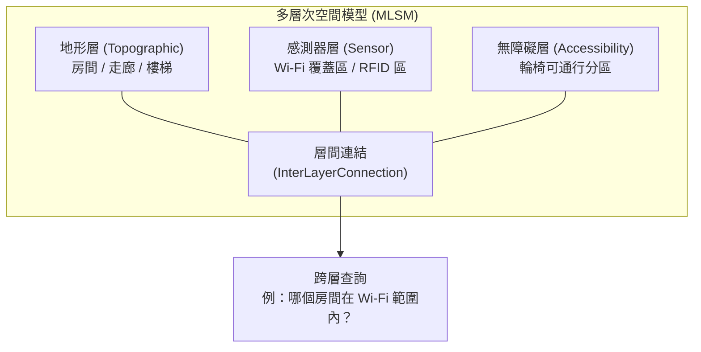

# IndoorGML 與 CityGML 室內空間描述差異分析

## 摘要

IndoorGML 與 CityGML 皆為 OGC（Open Geospatial Consortium）制定的開放地理空間標準，但兩者在室內空間的描述上採取了截然不同的方法。CityGML 以建築構件為核心、以幾何驅動的方式描述室內空間，而 IndoorGML 則以細胞（cell）為核心、以拓撲為導向的方式描述室內空間的導航與定位語義。本報告從目的範疇、資料模型、幾何與語義處理方式、導航模型、多層次空間模型等面向進行比較分析，並探討兩者如何互補使用。

## 1. 目的與範疇

### CityGML

CityGML 是 OGC 制定的 3D 城市模型標準，旨在提供一個概念模型與交換格式，用以表達、儲存與交換虛擬 3D 城市模型。其範疇涵蓋整個都市環境：地形、建築物、植被、基礎設施、交通、水域與土地使用，適用於都市規劃、智慧城市、數位孿生、災害管理、行動通訊、3D 地籍、導航與能源模擬等應用[^ogc-citygml]。

建築物在 CityGML 中被視為十三個主題模組之一，室內空間僅在最高細節層級（LOD4）中被納入建築模型的一部分。

### IndoorGML

IndoorGML 是 OGC 制定的室內空間資訊專用標準，其焦點**僅限於室內空間的導航用途**。它並不打算在幾何或建築細節上與 CityGML、IFC 或 KML 競爭，而是提供一個**最小的架構框架**，來表達與導航、定位及位置服務相關的室內空間拓撲與語義屬性[^ogc-indoorgml]。

IndoorGML 的發展背景是室內定位服務、路徑規劃與緊急控制領域強烈且迫切的標準化需求。官方網站明確指出：

> *「本標準的主要焦點是表達如房間與走廊等空間元件，以及如門等約束條件……而非表達建築構件。」*[^indoorgml-net]

## 2. 資料模型核心差異

### 2.1 核心概念

| 面向 | CityGML (LOD4) | IndoorGML |
|------|----------------|-----------|
| **核心單位** | 建築構件（Roof、Wall、Floor、Room、Door、Window、Furniture） | 細胞（Cell），即導航的基本空間單元（房間、走廊等） |
| **主要幾何** | 明確的 3D 幾何，使用 Boundary Representation（Brep）、Solid、MultiSurface | 幾何為選項：三種模式——(1) 外部參考 CityGML/IFC，(2) 明確的 GM_Solid/GM_Surface，(3) 無幾何 |
| **拓撲** | 隱含式：透過共享邊界/XLinks 連結相鄰表面 | 明確式：節點-關係圖（NRG），經由龐加萊對偶（Poincaré duality）推導 |
| **語義豐富度** | 豐富的建築語義：RoomType、Installation、Furniture、IntBuildingInstallation、BuildingFurniture | 極簡細胞語義：可導航性分類、使用類型、細胞類型 |
| **導航模型** | 非內建，須外部推導或透過 ADE 擴充 | 核心功能：狀態-轉移模型（節點=細胞/狀態，邊=門/通道） |
| **細節層級** | 5 個固定 LOD（0–4），幾何與語義耦合 | 無 LOD 概念，而是用多層次空間模型處理不同粒度 |
| **多脈絡支援** | 單一建築解譯 | 原生多層次空間模型，同一空間可同時表達為地形層、感測器層、Wi-Fi 覆蓋層等 |

### 2.2 語義處理方式

**CityGML** 將室內空間建模為建築構件的集合，並賦予詳細的語義。例如，一個 Room 由 WallSurface、FloorSurface、CeilingSurface、Door 與 Window 所界定，家具與室內設備則明確建模為子物件[^mdpi-citygml-indoor]。

**IndoorGML** 將室內空間建模為**細胞**，賦予極簡語義。最關鍵的語義區分是該細胞是否**可導航**（房間、走廊、門）或**不可導航**（牆壁、障礙物）。細胞具有識別碼（如房間號碼）與選擇性分類。這種簡潔性是刻意設計的——IndoorGML 定位為 CityGML 與 IFC 的**互補標準**，而非替代品[^tudelft-indoorgml]。

## 3. IndoorGML 處理室內空間的方式

### 3.1 細胞空間模型（Cellular Space Model）

IndoorGML 建立在**細胞空間模型**之上，將室內空間視為一組**不重疊的細胞**。每個細胞具有唯一識別碼（如房間號碼），細胞之間共享邊界但不重疊，所有細胞的聯集即為完整的室內空間。在細胞空間中，位置是由細胞識別碼而非 (x,y,z) 座標指定的，這反映了室內空間的本質：歐幾里得距離在室內具有誤導性，兩點間的實際距離取決於門、牆與走廊的存在[^indoorgml-net]。

模型整合了四個主要組成部分：
1. **細胞幾何**（選擇性，2D 或 3D）
2. **細胞間拓撲**（相鄰性、連通性）
3. **細胞語義**（分類、用途）
4. **多層次空間模型**（同一空間的多重解譯）

### 3.2 龐加萊對偶（Poincaré Duality）

這是 IndoorGML 中基礎性的數學概念，為將 3D 室內空間映射為節點-關係圖（Node-Relation Graph, NRG）提供了理論基礎[^indoorgml-net]：

> *「根據龐加萊對偶，原始（primal）N 維空間中的 k 維物體，會被映射到對偶（dual）空間中的 (N−k) 維物體。因此，原始 3D 空間中的 3D 實體物件（如建築物內的房間）會被映射為對偶空間中的節點（0D）。由兩個實體物件共享的 2D 表面（如帶有門的牆壁）則被轉換為連結兩個節點的邊（1D）。」*

這種轉換將複雜的 3D 空間關係簡化為一個圖結構，對於路徑規劃、導航與分析而言計算效率極高。該圖由**狀態**（State，代表對偶空間中的細胞節點）與**轉移**（Transition，代表細胞間的連通性/門）所構成。

**結構化空間模型（Structured Space Model）** 將此概念形式化，區分原始空間（幾何）與對偶空間（拓撲），並分為四個象限：
- 左上：原始空間中的幾何表示
- 右上：原始空間中的邏輯表示
- 左下：幾何 NRG（嵌入座標）
- 右下：邏輯 NRG（純拓撲，無幾何）

### 3.3 多層次空間模型（Multi-Layered Space Model, MLSM）

這是 IndoorGML 最強大的特性之一。同一個室內空間可以**同時被語義解譯為不同的細胞空間**。例如：

- **地形層（Topographic layer）**：房間、走廊、樓梯（適用於行人導航）
- **感測器層（Sensor layer）**：Wi-Fi 覆蓋區域、RFID 感測器覆蓋區域
- **無障礙層（Accessibility layer）**：無障礙通道分區

每一層都有自己獨立的 NRG。各層之間透過**層間連結**（InterLayerConnection）連接，當不同層的節點對應之細胞內部相交時，即可建立連結。這使得我們可以查出某個房間落在哪個 Wi-Fi 覆蓋區內，或找出某個感測器覆蓋了哪些地形細胞[^indoorgml-net]。

**MultiLayeredGraph** 彙總各 SpaceLayer 與 InterLayerConnection，使跨越同一物理空間多重解譯的複雜查詢成為可能。

## 4. CityGML 處理室內空間的方式

### 4.1 LOD4——室內細節層級

CityGML 定義五個細節層級（LoD0–LoD4），其中僅 LoD4 包含室內特徵[^tudelft-lod]：

| LOD | 描述 |
|-----|------|
| LoD0 | 2.5D 足跡 / 數值地形模型 |
| LoD1 | 區塊模型（平屋頂，無紋理） |
| LoD2 | 具屋頂結構與主題表面的紋理模型 |
| LoD3 | 具開口（門、窗）的詳細建築模型 |
| **LoD4** | **完整室內模型：房間、室內設備、家具、室內邊界** |

在 LoD4 下，建築模型包含以 **Room** 特徵類型表示的室內空間，由室內牆面、地板與天花板表面所界定。**IntBuildingInstallation** 與 **BuildingFurniture** 代表室內物體。門窗則將室內空間之間以及室內與外部連接起來。

### 4.2 CityGML 室內方式的主要特徵

1. **幾何驅動**：房間由其三維幾何邊界（牆、地板、天花板）以 Boundary Representation（Brep）或 Solid 幾何定義。

2. **豐富語義**：每個建築構件都有特定的特徵類型（Room、Door、Window、BuildingInstallation、BuildingFurniture）與屬性。

3. **隱含拓撲**：雖然 CityGML 支援 XLinks 來參考相鄰房間間的共享邊界表面，但並未提供明確的導航拓撲圖。網路推導必須在外部進行。

4. **單一室內 LOD**：目前的 LoD 概念僅提供一個室內描述層級（LoD4），「因嚴格耦合幾何與語義而受限」，無法為不同的導航目的提供粒度[^researchgate-lod]。

5. **CityGML 3.0 改進**：最新版本（3.0）允許以**不同細節層級**表達室內空間，並提供與 BIM 更好的整合，但仍保留了建築構件為核心的焦點[^ogc-citygml]。

## 5. 適用情境與互補關係

### 5.1 使用 CityGML 的時機

- 建築物與城市的 **3D 視覺化**（都市數位孿生）
- 需要建築構件的**詳細幾何與語義模型**
- **室內與室外整合**（都市尺度的脈絡）
- **建築管理與設施管理**應用
- **能源模擬、噪音測繪、環境分析**
- 需要完整、擬真的 3D 城市模型

### 5.2 使用 IndoorGML 的時機

- **室內導航與路徑規劃**（行人、無障礙、機器人）
- **室內定位與位置服務**
- 室內空間的**拓撲分析**（連通性、可及性）
- **多脈絡空間建模**（同一空間透過不同感測器/層面解譯）
- **緊急應變與疏散規劃**
- 室內環境的**軌跡分析**（細胞空間模型比歐幾里得空間更相關）

### 5.3 互補關係

學術界的共識明確：**CityGML 與 IndoorGML 是設計來協同工作，而非競爭**。Kim、Yoo 與 Li（2014）指出：

> *「雖然 CityGML 與 IndoorGML 都為室內空間提供了標準資料模型框架，但這些標準的目標與方法不同，兩者可以互補使用。」*[^kim-2014]

相同的論文也指出：

> *「CityGML 與 IFC 關注建築構件如屋頂、天花板、地板與牆壁的特徵類型，而 IndoorGML 的主要關注點則是室內空間的表示，稱為 Cell，這是 IndoorGML 資料模型中的基本空間單元。」*

典型的互補工作流程為：

1. **CityGML** 提供建築物的詳細 3D 幾何與豐富語義
2. **IndoorGML** 透過外部參考引用 CityGML 物件，並提供導航圖、拓撲關係與多層次解譯

## 6. 兩者之間的整合機制

### 6.1 外部參考（IndoorGML → CityGML）

IndoorGML 原生支援透過 `xlink` 屬性的**外部參考**。IndoorGML 中的細胞可以指向 CityGML 資料集中相對應的 Room 物件。這使得 IndoorGML 可以保持輕量（專注於拓撲與導航），同時在需要時借用 CityGML 的詳細幾何[^indoorgml-net]：

> *「IndoorGML 文件不直接明確表達幾何，而是包含指向其他資料集（如 CityGML）中物體的外部連結，這些外部資料集中的參考物件包含幾何資訊。IndoorGML 中的細胞與其他資料集中對應物件之間須有 1:1 或 n:1 的對應關係。」*

### 6.2 從 CityGML 自動推導 IndoorGML

Kim、Yoo 與 Li（2014）提出了從 CityGML LOD4 資料**自動推導 IndoorGML 資料**的方法[^kim-2014]：
1. 從 CityGML 中提取 Room 幾何
2. 將其分解為細胞
3. 從 CityGML 的開孔關係推導連通性（房間間的門）
4. 建立 NRG（State-Transition 圖）
5. 生成 IndoorGML XML 實例

### 6.3 CityGML 應用領域擴充（ADE）

另一種方法是不使用 IndoorGML，而是開發 **CityGML ADE** 來直接在 CityGML 中增加室內導航與路徑規劃能力。例如，Dutta 等人（2017）建立了「室內路徑規劃與定位 ADE」，在 CityGML 的建築模組中擴充了[^dutta-2017]：
- CityGML 內的網路資料集建立
- 室內路徑規劃功能
- 室內特徵的定位屬性

### 6.4 OGC Indoor Pilot：CityGML 到 IndoorGML 轉換

Safe Software 的 FME 平台包含一個**導航建模器**，可將 CityGML（包括 Public Safety ADE）轉換為 OGC IndoorGML，展示了這兩個標準之間的實際轉換管道[^fme-pilot]。

## 7. 總結比較

| 面向 | CityGML | IndoorGML |
|------|---------|-----------|
| **標準版本** | 1.0, 2.0, 3.0 | 1.0, 1.1, 2.0 |
| **範疇** | 3D 城市模型（都市＋室內） | 僅限室內空間 |
| **主要目的** | 3D 城市資料的表達與交換 | 室內導航與定位 |
| **核心單元** | 建築構件（Room、Wall、Door） | 細胞（不重疊的空間單元） |
| **幾何** | 強制、詳細（Brep/Solid） | 選擇性（可參考外部） |
| **拓撲** | 隱含式（共享邊界） | 明確式（經由龐加萊對偶的 NRG） |
| **導航** | 須外部推導或透過 ADE 擴充 | 原生狀態-轉移圖 |
| **多脈絡** | 每資料集單一解譯 | 原生多層次空間模型 |
| **最佳適用** | 視覺化、BIM 整合、都市建模 | 路徑規劃、LBS、感測器融合、緊急應變 |
| **互補角色** | 為 IndoorGML 提供幾何與語義 | 為 CityGML 提供拓撲與導航 |

## 8. 主要資料來源的批判性反思

本報告主要引用 IndoorGML 官方網站（indoorgml.net）與 OGC 標準頁面，這些屬於一級來源，權威性最高但可能帶有推廣該標準的傾向。學術論文（Kim, Yoo & Li 2014; Dutta et al. 2017）經過同儕審查，可信度佳，但發表時間較早（2014-2017），可能未完全反映 IndoorGML 1.1 或 CityGML 3.0 的最新發展。MDPI 與 ISPRS 等開放取用期刊的論文亦經審查，但品質參差，本報告優先採用了與 OGC 標準直接相關的內容。整體而言，各來源對於 CityGML 與 IndoorGML 互補關係的結論一致，沒有發現重大矛盾。

---

[^ogc-citygml]: Open Geospatial Consortium. (n.d.). *CityGML*. Retrieved 2026-09-25, from https://www.ogc.org/standards/citygml/

[^ogc-indoorgml]: Open Geospatial Consortium. (n.d.). *IndoorGML*. Retrieved 2026-09-25, from https://www.ogc.org/standards/indoorgml/

[^indoorgml-net]: IndoorGML. (n.d.). *IndoorGML — Official Information Site*. Retrieved 2026-09-25, from https://www.indoorgml.net/

[^tudelft-indoorgml]: Bry, A. (n.d.). *GEO1003 Shared Notes — IndoorGML: A Standard Approach for Indoor Maps*. Delft University of Technology. Retrieved 2026-09-25, from https://alexandre-bry.github.io/GEO1003-Shared_Notes/content/books/indoor_books/OGC_IndoorGML/

[^tudelft-lod]: Ledoux, H., & Biljecki, F. (2016). *An improved LOD specification for 3D building models*. Delft University of Technology. Retrieved 2026-09-25, from https://3d.bk.tudelft.nl/hledoux/pdfs/16_ceus_lod_specs.pdf

[^mdpi-citygml-indoor]: MDPI Applied Sciences. (2020). *A Simplified CityGML-Based 3D Indoor Space Model for Indoor Applications*, 10(20), 7218. Retrieved 2026-09-25, from https://www.mdpi.com/2076-3417/10/20/7218

[^kim-2014]: Kim, J., Yoo, J., & Li, K. (2014). *Integrating IndoorGML and CityGML for Indoor Space*. In: Web and Wireless Geographical Information Systems (W2GIS 2014). Springer. Retrieved 2026-09-25, from https://link.springer.com/chapter/10.1007/978-3-642-55334-9_12

[^researchgate-lod]: ResearchGate. (n.d.). *Comparison between two OGC standards for indoor space: CityGML and IndoorGML*. Retrieved 2026-09-25, from https://www.researchgate.net/publication/307695480_Comparison_between_two_OGC_standards_for_indoor_space_CityGML_and_IndoorGML

[^dutta-2017]: Dutta, A., Saran, S., & Senthil Kumar, A. (2017). *Development of CityGML ADE for Indoor Routing and Positioning*. Journal of the Indian Society of Remote Sensing. Retrieved 2026-09-25, from https://link.springer.com/article/10.1007/s12524-017-0665-y

[^fme-pilot]: Safe Software. (n.d.). *OGC Indoor GML Pilot (CityGML to IndoorGML Transformation)*. FME Support Center. Retrieved 2026-09-25, from https://support.safe.com/hc/en-us/articles/25407604543885-OGC-Indoor-GML-Pilot