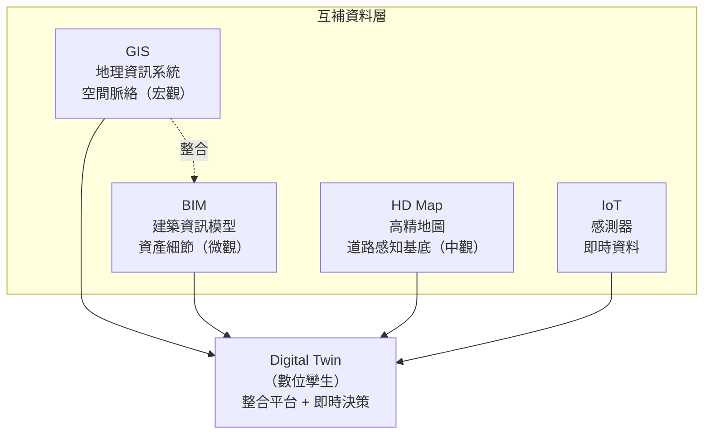

# Digital Twin（數位孿生）與 HD Map、GIS、BIM 之關係探討

## 摘要

本文探討 HD Map（高精地圖）、GIS（地理資訊系統）、BIM（建築資訊模型）三者與 Digital Twin（數位孿生）之間的關係。核心結論為：**此三者並非 Digital Twin 的子集，而是構成 Digital Twin 所必需的互補性資料層（layer）**——BIM 定義資產細節、GIS 提供空間脈絡、HD Map 提供釐米級道路環境，而 Digital Twin 是它們在即時資料（IoT）驅動下融合而成的動態決策系統。

---

## 一、問題定位

產業界與學術界經常將 Digital Twin 與 BIM、GIS、HD Map 混為一談，或誤以為三者的結合即為完整的 Digital Twin。事實上，四者在**尺度、動態性、定位與核心問題**上皆有明確區別。

---

## 二、各技術之定義與定位

### 2.1 Digital Twin（數位孿生）

數位孿生是物理資產、系統或流程的虛擬表示，透過即時資料與物理世界保持同步，並支援模擬、預測與決策[^nvidia]。

[^nvidia]: NVIDIA 台灣官方部落格. (2023). 數位孿生是什麼？ Retrieved 2026-09-25, from https://blogs.nvidia.com.tw/blog/what-is-a-digital-twin/

Esri 定義：「A digital twin is a virtual representation of reality, including physical objects, processes, and relationships。」[^esri]

[^esri]: Esri. (n.d.). Digital Twin Technology & GIS. Retrieved 2026-09-25, from https://www.esri.com/en-us/digital-twin/overview

核心特徵：
- **動態性**：與物理世界雙向同步
- **即時性**：IoT 資料驅動
- **預測性**：可進行模擬與 what-if 分析

### 2.2 GIS（地理資訊系統）——空間脈絡層

定位：**空間脈絡層（Spatial Context Layer）**，提供地理空間框架，讓數位孿生中的資產能夠在真實世界中定位並理解其與周遭環境的關係[^esri_gis]。

[^esri_gis]: Esri. (n.d.). Digital Twin Technology & GIS. Retrieved 2026-09-25, from https://www.esri.com/en-us/digital-twin/overview

| 項目 | 說明 |
|------|------|
| 核心功能 | 地圖、空間分析、大尺度地理資料管理、環境脈絡 |
| 能力範圍 | 城市級到全球級（macro-scale） |
| 產業代表 | Esri（ArcGIS）、QGIS |
| 標準格式 | Shapefile、GeoJSON、CityGML |
| 局限性 | 缺乏資產級別的細部幾何與語義資訊 |

Esri 明確指出：「When built on a foundation of geography, it becomes a geospatial digital twin。」——GIS 是數位孿生的「地理位置基底」[^esri_gis2]。

[^esri_gis2]: Esri. (n.d.). Digital Twin Technology & GIS. Retrieved 2026-09-25, from https://www.esri.com/en-us/digital-twin/overview

### 2.3 BIM（建築資訊模型）——資產細節層

定位：**資產細節層（Asset Detail Layer）**，提供建築或基礎設施的完整數位化表示，包含幾何、材料、管線、結構等豐富語義資訊[^acca]。

[^acca]: ACCA Software. (n.d.). Geospatial Digital Twin (usBIM.geotwin). Retrieved 2026-09-25, from https://www.accasoftware.com/en/geospatial-digital-twin

| 項目 | 說明 |
|------|------|
| 核心功能 | 3D 建模、碰撞檢測、生命週期管理（設計→施工→營運） |
| 能力範圍 | 單一建築到設施群（micro-scale） |
| 產業代表 | Autodesk Revit、Bentley、Tekla、ArchiCAD |
| 標準格式 | IFC（Industry Foundation Classes） |
| 局限性 | 通常缺乏地理空間定位；專案移交後常淪為靜態模型 |

ACCA Software 的 FAQ 精準區分：「BIM：detailed representation of a building or infrastructure with all its components (geometric, MEP, material-related)。GIS：information system that manages geographical and territorial data。」[^acca2]

[^acca2]: ACCA Software. (n.d.). Geospatial Digital Twin (usBIM.geotwin). Retrieved 2026-09-25, from https://www.accasoftware.com/en/geospatial-digital-twin

### 2.4 HD Map（高精地圖）——道路環境感知基底層

定位：**道路環境感知基底層（Perception Foundation Layer for Transportation）**，專為自動駕駛設計的超高精度地圖，以釐米級精度描述道路的三維幾何形狀、車道邊界、交通標誌等，作為自動駕駛系統的「先驗知識庫」[^nature]。

[^nature]: Nature Index. (n.d.). High Definition Mapping for Autonomous Vehicle Systems. Retrieved 2026-09-25, from https://www.nature.com/nature-index/topics/l4/high-definition-mapping-for-autonomous-vehicle-systems

| 項目 | 說明 |
|------|------|
| 核心功能 | 超視距感知、精準定位、路徑規劃 |
| 能力範圍 | 車道級到道路網路級 |
| 精度 | 絕對精度 10-20cm，相對精度 2-5cm |
| 產業代表 | HERE Technologies、TomTom、Waymo、百度 |
| 資料結構 | 三層架構（靜態→半動態→動態） |
| 局限性 | 僅限道路環境；初期建置成本極高；需持續更新 |

Nature Index 指出：「By fusing LiDAR point clouds, high-resolution imagery and inertial measurements, HD maps form a static but continually updated digital twin of the driving environment。」[^nature2]

[^nature2]: Nature Index. (n.d.). High Definition Mapping for Autonomous Vehicle Systems. Retrieved 2026-09-25, from https://www.nature.com/nature-index/topics/l4/high-definition-mapping-for-autonomous-vehicle-systems

SAGE 期刊論文進一步闡述：「While high-definition maps serve as the foundation layer for the perception stack of autonomous vehicles by providing centimeter-level accuracy, the evolution from static mapping to dynamic digital twin represents an advanced paradigm shift。」[^sage]

[^sage]: SAGE Journals. (2025). From High-Definition Maps to Digital Twins for Autonomous and Connected Vehicles. Retrieved 2026-09-25, from https://journals.sagepub.com/doi/10.3233/ATDE251198

---

## 三、四者關係對比分析

### 3.1 核心對比表

| 系統 | 回答的核心問題 | 尺度 | 動態性 | 資料來源 |
|------|---------------|------|--------|---------|
| **BIM** | What was built？（蓋了什麼？） | 建築/設施級（微觀） | 通常靜態 | IFC、Revit |
| **GIS** | Where is it located？（在哪裡？） | 城市/區域/全球級（宏觀） | 半動態 | Shapefile、GeoJSON |
| **HD Map** | Where exactly is the road/lane？（道路車道精確在哪？） | 車道/道路級（中觀） | 靜態基礎 + 動態更新 | LiDAR 點雲、NDS |
| **Digital Twin** | What should we do next？（接下來做什麼？） | 跨尺度整合 | 即時動態雙向同步 | IoT、BIM、GIS、HD Map |

### 3.2 互補關係

產業界已形成共識：Digital Twin = BIM + GIS + IoT + 其他資料來源[^linkedin]。

[^linkedin]: Bhoda, S. K. (2025). BIM, GIS, and Digital Twins: How They Fit Together. LinkedIn. Retrieved 2026-09-25, from https://www.linkedin.com/pulse/bim-gis-digital-twins-how-fit-together-santosh-kumar-bhoda-it0zc

BIM 與 GIS 的整合作為城市數位孿生的核心基礎：

- MDPI 期刊論文：「Urban Digital Twins (UDTs) demand both simplified geometry and rich semantic information from BIM to be effectively integrated into GIS。」[^mdpi]
- IEC 白皮書：「The integration of BIM, GIS and IoT technologies enables the implementation of the digital reproduction of physical cities... namely CIM (City Information Modelling)。」[^iec]
- FME Safe Software 指南：「The main challenge when implementing an urban digital twin is integrating data from GIS, BIM, IoT systems, LiDAR, imagery, and operational databases。」[^fme]

[^mdpi]: MDPI. (2025). An Effective Approach to Geometric and Semantic BIM/GIS Data Integration. Retrieved 2026-09-25, from https://www.mdpi.com/2220-9964/14/12/478
[^iec]: IEC. (2024). City Information Modelling and Urban Digital Twins. Retrieved 2026-09-25, from https://www.iec.ch/system/files/2024-04/iec_tec_cim_udt_en.pdf
[^fme]: FME Safe Software. (n.d.). Digital Twins in Urban Planning. Retrieved 2026-09-25, from https://fme.safe.com/guides/spatial-computing/digital-twins-in-urban-planning/

### 3.3 HD Map 的獨特定位

HD Map 不同於 GIS 和 BIM，其獨特性體現在：

1. **精度差異**：HD Map 達釐米級，遠超一般 GIS 地圖（公尺級）[^nature3]
2. **應用場景**：專注於道路環境，而非建築物或自然地理
3. **動態架構**：三層結構（靜態道路幾何 → 半動態施工區等 → 動態交通狀況）[^sciencedirect]
4. **產業驅動力**：由自動駕駛產業驅動，而非傳統測繪或建築業

[^nature3]: Nature Index. (n.d.). High Definition Mapping for Autonomous Vehicle Systems. Retrieved 2026-09-25, from https://www.nature.com/nature-index/topics/l4/high-definition-mapping-for-autonomous-vehicle-systems
[^sciencedirect]: ScienceDirect. (2025). A high-definition map architecture for transportation digital twin. Retrieved 2026-09-25, from https://www.sciencedirect.com/science/article/pii/S1569843225004698

學術研究指出 HD Map 是「交通運輸數位孿生」的關鍵基底層。Zhou et al. 提出了一種「輕量化行為認知架構，利用 HD 地圖支援交通運輸數位孿生中的多尺度資訊表示」[^sciencedirect2]。

[^sciencedirect2]: ScienceDirect. (2025). A high-definition map architecture for transportation digital twin. Retrieved 2026-09-25, from https://www.sciencedirect.com/science/article/pii/S1569843225004698

---

## 四、概念關係圖

---

## 五、結論

1. **HD Map、GIS、BIM 皆不是 Digital Twin 的子集**——它們是構成 Digital Twin 所必需的互補性資料層（layer），各自解決不同尺度和面向的問題。

2. **BIM + GIS 是城市/建築數位孿生的兩大支柱**——學術界與產業界公認，都市數位孿生必須整合 BIM 的資產細節與 GIS 的空間脈絡[^mdpi2][^iec2]。

[^mdpi2]: MDPI. (2025). An Effective Approach to Geometric and Semantic BIM/GIS Data Integration. Retrieved 2026-09-25, from https://www.mdpi.com/2220-9964/14/12/478
[^iec2]: IEC. (2024). City Information Modelling and Urban Digital Twins. Retrieved 2026-09-25, from https://www.iec.ch/system/files/2024-04/iec_tec_cim_udt_en.pdf

3. **HD Map 可被視為交通運輸領域數位孿生的專屬基底層**——它以釐米級精度為自動駕駛和智慧交通提供感知先驗，並從靜態地圖逐步演化為動態的交通數位孿生[^sage2]。

[^sage2]: SAGE Journals. (2025). From High-Definition Maps to Digital Twins for Autonomous and Connected Vehicles. Retrieved 2026-09-25, from https://journals.sagepub.com/doi/10.3233/ATDE251198

4. **真正的 Digital Twin 必須加上 IoT 即時資料**並實現雙向動態同步——沒有即時性的三維模型只是靜態展示，而非數位孿生。

5. **四者之間不存在替代關係**，而是必須協同運作：BIM 告訴你建築長什麼樣，GIS 告訴它在哪裡，HD Map 告訴你道路怎麼走，Digital Twin 告訴你接下來該怎麼做。

---

## 參考文獻

ACCA Software. (n.d.). Geospatial Digital Twin (usBIM.geotwin). Retrieved 2026-09-25, from https://www.accasoftware.com/en/geospatial-digital-twin

Bhoda, S. K. (2025). BIM, GIS, and Digital Twins: How They Fit Together. LinkedIn. Retrieved 2026-09-25, from https://www.linkedin.com/pulse/bim-gis-digital-twins-how-fit-together-santosh-kumar-bhoda-it0zc

Esri. (n.d.). Digital Twin Technology & GIS. Retrieved 2026-09-25, from https://www.esri.com/en-us/digital-twin/overview

FME Safe Software. (n.d.). Digital Twins in Urban Planning. Retrieved 2026-09-25, from https://fme.safe.com/guides/spatial-computing/digital-twins-in-urban-planning/

IEC. (2024). City Information Modelling and Urban Digital Twins. Retrieved 2026-09-25, from https://www.iec.ch/system/files/2024-04/iec_tec_cim_udt_en.pdf

MDPI. (2025). An Effective Approach to Geometric and Semantic BIM/GIS Data Integration. Retrieved 2026-09-25, from https://www.mdpi.com/2220-9964/14/12/478

Nature Index. (n.d.). High Definition Mapping for Autonomous Vehicle Systems. Retrieved 2026-09-25, from https://www.nature.com/nature-index/topics/l4/high-definition-mapping-for-autonomous-vehicle-systems

NVIDIA 台灣官方部落格. (2023). 數位孿生是什麼？ Retrieved 2026-09-25, from https://blogs.nvidia.com.tw/blog/what-is-a-digital-twin/

SAGE Journals. (2025). From High-Definition Maps to Digital Twins for Autonomous and Connected Vehicles. Retrieved 2026-09-25, from https://journals.sagepub.com/doi/10.3233/ATDE251198

ScienceDirect. (2025). A high-definition map architecture for transportation digital twin. Retrieved 2026-09-25, from https://www.sciencedirect.com/science/article/pii/S1569843225004698