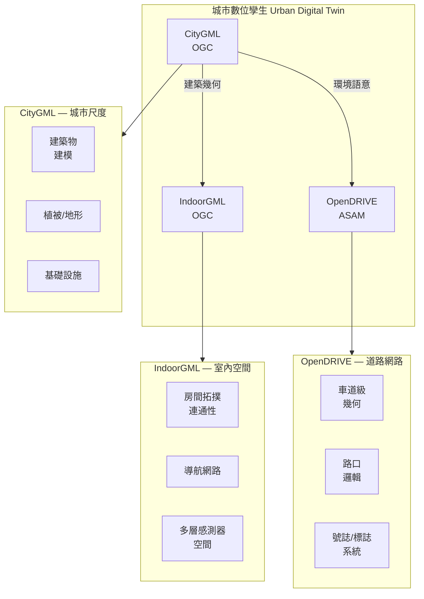

# CityGML、IndoorGML、OpenDRIVE 三者皆屬數位孿生，但以不同面向切入

## 摘要

數位孿生 (Digital Twin) 的定義包含「一個整合數據驅動的虛擬表現」、「與實體系統即時同步」、「用於模擬、預測與最佳化」等核心特徵。CityGML、IndoorGML 與 OpenDRIVE 這三種標準分別從城市尺度、室內空間、道路網路三個截然不同的切面來實現數位孿生，彼此之間互補而非競爭。本文透過 Web Search/Fetch 工具收集的權威資料來驗證這個觀點。

## 1. 數位孿生 (Digital Twin) 的定義

數位孿生一詞最早由 NASA 的 John Vickers 在 2010 年正式提出，但其概念可追溯至 Michael Grieves 在 2002 年提出的「鏡像空間」概念[^dt-nasa]。

權威組織對數位孿生的定義包括：

| 來源 | 定義 |
|---|---|
| **Digital Twin Consortium** | 「一個整合數據驅動的虛擬表現，代表現實世界的實體與流程，並以指定頻率與保真度進行同步互動」[^dtc-def] |
| **IBM** | 「一個利用即時數據準確反映其現實世界對應體之行為、效能與條件的虛擬表現」[^ibm-def] |
| **Wikipedia** | 「一個計算模型，代表一個意圖中的或實際的現實世界產品、系統或流程（物理孿生），作為其數位對應體，用於模擬、整合、測試、監控與維護等目的」[^wiki-dt] |
| **維基百科 (中文)** | 「在信息化平台內模擬物理實體、流程或者系統，類似實體系統在信息化平台中的雙胞胎」[^zh-dt] |

共通的核心要素為：(1) 虛擬表現（virtual representation），(2) 即時數據同步（real-time data synchronization），(3) 雙向互動（bidirectional interaction），(4) 全生命週期支援，(5) 模擬、預測與最佳化能力。

## 2. CityGML — 城市尺度的數位孿生標準

CityGML 是由 **OGC（Open Geospatial Consortium）** 維護的開放標準，用於儲存與交換城市及其景觀的 **3D 模型**[^citygml-ogc]。

```
├─ 標準機構：OGC（ISO TC211 共同維護）
├─ 最新版本：CityGML 3.0
├─ 編碼格式：GML/XML、JSON、資料庫模式
└─ 層級：LoD 0（2.5D 地形）到 LoD 4（室內細節）
```

**涵蓋物件：** 建築物、道路、橋樑、河流、植被、城市家具、土地利用、地形等。

**與數位孿生的關聯 — 直接來自 OGC 官方：**

> 「CityGML 標準……促進了城市地理資料的整合，應用於**智慧城市與城市數位孿生**，包括都市與景觀規劃、BIM、災害管理、3D 地籍、車輛與行人導航、自駕輔助、設施管理以及能源、交通與環境模擬。」[^citygml-ogc]

CityGML 3.0 新增了更好的 BIM 整合、室內空間在不同 LoD 的表現、來自感測器與模擬的動態資料支援，以及 JSON 編碼方式。

**切入視角：城市室外（及室內）的三維語意環境。** CityGML 回答的是「城市裡有什麼」的問題。

## 3. IndoorGML — 室內空間的數位孿生標準

IndoorGML 是由 **OGC** 維護的開放標準，專門用於描述 **室內空間資訊**，核心聚焦於 **導航用途的室內空間建模**[^indoorgml-ogc]。

```
├─ 標準機構：OGC
├─ 最新版本：IndoorGML 2.0 Part 1
├─ 編碼格式：GML 3.2.1、SQL、JSON
└─ 核心概念：拓撲空間圖（space-graph）
```

**有別於 CityGML 的定位：**

IndoorGML 官方文件明確指出其與 CityGML 的互補關係：

> 「雖然有數種 3D 建築建模標準（如 CityGML、KML、IFC）從幾何、製圖與語意的角度處理建築內部空間，**IndoorGML 刻意專注於導航目的的室內空間建模**。」[^indoorgml-ogc]

IndoorGML 不負責 3D 幾何細節，而是著重於：
- **空間**（房間、走廊等）及其**拓撲關係**
- **導航網路**（用於路徑計算的連通性圖）
- **多層空間表現**（不同感測器層、WiFi、藍牙等）

**切入視角：室內空間的導航拓撲。** IndoorGML 回答的是「如何在建築物內部移動」的問題。

## 4. OpenDRIVE — 道路網路的數位孿生標準

OpenDRIVE 是由 **ASAM e.V.**（自動化與測量系統標準化協會）維護的開放格式，用於描述**道路網路的邏輯**——包括幾何、車道、路口、號誌與交通基礎設施，主要應用於駕駛模擬與自駕車開發[^opendrive-asam]。

```
├─ 標準機構：ASAM e.V.（非 OGC）
├─ 最新版本：ASAM OpenDRIVE 1.9.0（2026年5月發布）
├─ 編碼格式：XML（.xodr）
└─ 幾何典範：參考線（reference line）為基礎的參數化建模
```

**涵蓋內容：** 道路幾何（參考線、高程、橫坡）、車道與車道類型、交叉路口、交通號誌與控制器、路面標線、路側物體、路面屬性。

**與數位孿生的關聯：**

學術界與產業界已直接使用「OpenDRIVE 數位孿生」一詞。例如：

> **「OpenDRIVE 數位孿生生成器」**——一個 GitHub 專案，用於「從高速公路測量資料與 OpenStreetMap 重建可用於模擬的 OpenDRIVE 數位孿生」[^opendrive-dt-gen]。

在 OpenTwinMap 研究論文中也提到：

> **「城市環境的數位孿生在推進自駕車（AV）研究中扮演關鍵角色，因為它們能實現模擬、驗證並與新興的生成式世界模型整合。」**[^opentwinmap]

**切入視角：道路網路的車道級邏輯。** OpenDRIVE 回答的是「車輛如何在道路上行駛」的問題。

## 5. 三者關係：互補而非競爭

### CityGML 與 IndoorGML

兩者皆為 **OGC 標準**，明確設計為互補：

| 面向 | CityGML | IndoorGML |
|---|---|---|
| 建築 | 3D 幾何與語意（外觀+內部結構） | 室內拓撲（房間連通性、門、走廊） |
| 用途 | 視覺化、模擬、都市規劃 | 導航、路線計算、室內定位 |
| 幾何 | B-Rep（邊界表現）明確座標 | 空間圖（space-graph）拓撲關係 |

### CityGML 與 OpenDRIVE

兩者由 **OGC 與 ASAM 聯合探索整合**（「ASAM OpenDRIVE with CityGML」專案）。專案結論指出：與其將 OpenDRIVE 擴展成完整的環境模型，不如採用**物件層級的連結**：

> 「概念驗證顯示，**ASAM OpenDRIVE 可以繼續作為駕駛相關道路資訊的主要來源**，而應用程式在需要更豐富的幾何與環境資料時，可從 **CityGML 取得**。」[^asam-citygml]

兩者的幾何典範本質上不同：

| 面向 | CityGML | OpenDRIVE |
|---|---|---|
| 幾何 | B-Rep 明確座標（離散面） | 參考線參數化 |
| 道路表現 | 無縫隙路面幾何 | 分析性道路描述 |
| 焦點 | 全 3D 環境語意 | 駕駛邏輯 |

### IndoorGML 與 OpenDRIVE

無直接關聯，但在整合的數位孿生中，可在建築出入口處銜接，實現無縫的室內外導航（例如自駕車抵達建築物後，由室內導航接手）。

## 6. 整合的生態系圖景



## 7. 結論

**是——CityGML、IndoorGML 與 OpenDRIVE 三者皆屬於數位孿生的範疇，但以截然不同的面向切入：**

| 標準 | 範疇 | 核心問題 | 標準機構 | 主要用途 |
|---|---|---|---|---|
| **CityGML** | 城市室外 + 室內三維環境 | 「城市裡有什麼？」 | OGC | 智慧城市、都市規劃、BIM 整合、環境模擬 |
| **IndoorGML** | 室內空間導航拓撲 | 「如何在建築物內部移動？」 | OGC | 室內導航、緊急應變、設施管理、室內定位 |
| **OpenDRIVE** | 道路網路車道級邏輯 | 「車輛如何在道路上行駛？」 | ASAM | 自駕車模擬、ADAS 驗證、交通模擬、高精地圖 |

三者在一個完整的城市數位孿生中互補——CityGML 提供城市環境的 3D 語意模型，IndoorGML 補充建築內部的導航邏輯，OpenDRIVE 提供道路網路的駕駛模擬能力。OGC 與 ASAM 之間也已有正式的標準整合專案，進一步說明了**它們是同一個大生態系中不同面向的標準化工具**，而非相互競爭的替代方案。

---

## 參考資料

[^dt-nasa]: Wikipedia. (n.d.). Digital twin. Retrieved 2026-09-26, from https://en.wikipedia.org/wiki/Digital_twin
[^dtc-def]: Digital Twin Consortium. (n.d.). Definition of a Digital Twin. Retrieved 2026-09-26, from https://www.digitaltwinconsortium.org/initiatives/the-definition-of-a-digital-twin/
[^ibm-def]: IBM. (n.d.). What is a digital twin? Retrieved 2026-09-26, from https://www.ibm.com/topics/what-is-a-digital-twin
[^wiki-dt]: Wikipedia. (n.d.). Digital twin. Retrieved 2026-09-26, from https://en.wikipedia.org/wiki/Digital_twin
[^zh-dt]: 維基百科. (n.d.). 数字映射. Retrieved 2026-09-26, from https://zh.wikipedia.org/wiki/%E6%95%B0%E5%AD%97%E5%AD%AA%E7%94%9F
[^citygml-ogc]: OGC. (n.d.). CityGML Standard. Retrieved 2026-09-26, from https://www.ogc.org/standards/citygml/
[^indoorgml-ogc]: OGC. (n.d.). IndoorGML Standard. Retrieved 2026-09-26, from https://www.ogc.org/standards/indoorgml/
[^opendrive-asam]: ASAM. (n.d.). ASAM OpenDRIVE. Retrieved 2026-09-26, from https://www.asam.net/standards/detail/opendrive/
[^opendrive-dt-gen]: Graz University of Technology. (n.d.). OpenDRIVE Digital Twin Generator. Retrieved 2026-09-26, from https://github.com/ftgTUGraz/opendrive-digital-twin-generator
[^opentwinmap]: arXiv. (2025). OpenTwinMap: An Open-Source Digital Twin Generator for Urban Autonomous Driving. Retrieved 2026-09-26, from https://arxiv.org/html/2511.21925
[^asam-citygml]: ASAM. (n.d.). ASAM OpenDRIVE with OGC CityGML. Retrieved 2026-09-26, from https://www.asam.net/standards/asam-opendrive-with-citygml/