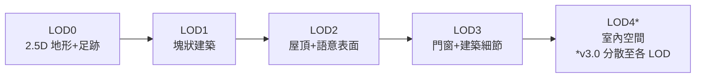
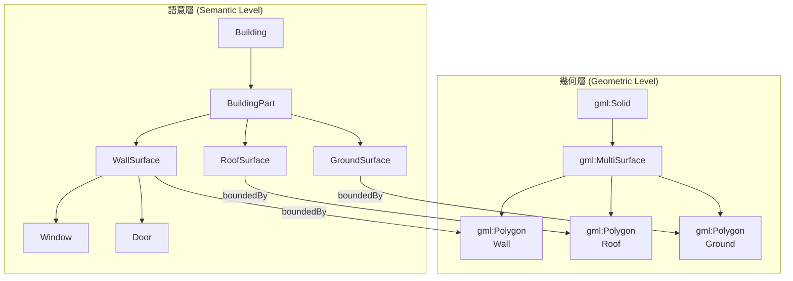

# CityGML 入門者指南：必備領域與模型知識

## 什麼是 CityGML？

CityGML（City Geography Markup Language，城市地理標記語言）是 **Open Geospatial Consortium (OGC)** 與 ISO TC211 制定的開放國際標準，用於儲存、交換虛擬 3D 城市與景觀模型[^ogc-standard]。它基於 GML3（Geography Markup Language 3.1.1）編碼，以 XML 為序列化格式。

**與純 3D GIS 模型最大的差別在於：CityGML 不僅存放幾何形狀，還存放語意（semantics）與主題屬性（thematic properties）。** 傳統的 3D 城市模型多為純圖形/幾何表示，只能用於視覺化；而 CityGML 讓城市物件同時攜帶「這是什麼」的語意資訊，支援主題查詢、分析和空間資料探勘[^ogc-guide]。

### 發展簡史

| 年份 | 里程碑 |
|------|--------|
| 2002 | 德國 SIG 3D（Special Interest Group 3D）啟動開發，超過 70 個機構參與 |
| 2008-08-20 | CityGML 1.0 被 OGC 採納為官方標準 |
| 2012-04-04 | CityGML 2.0 發布，引入 13 個主題擴展模組與 ADE 架構 |
| 2021-09 | CityGML 3.0 概念模型（Conceptual Model）核准 |
| 2023-07 | CityGML 3.0 Part 2（GML 編碼）成為正式標準[^grokipedia] |

---

## 二、Level of Detail（LOD）— 細節層次

CityGML 最核心的概念之一：同一座城市可以用**五種細節層次**表示，從宏觀輪廓到室內格局[^csdn-lod][^ogc-guide-lod]。

### LOD 0 — 區域／景觀層級

本質上是 **2.5 維的數值地形模型（DTM）**，覆蓋航空影像或地圖。建築物僅以足跡（footprint）或屋頂邊緣多邊形表示。

- 適用：區域規劃、地籍
- 垂直精度：≤5 m

### LOD 1 — 城市／區域層級

**塊狀模型（Block Model）** — 建築物是帶平屋頂的稜柱體，無屋頂結構細節。

- 適用：全市尺度的陰影模擬、熱島效應分析
- 定位精度：≤5 m，最小建築足跡 6 m × 6 m

### LOD 2 — 街區／專案層級

建築物有**不同的屋頂形狀**（山形、斜屋頂、平頂等）與不同主題的邊界表面。牆面、屋頂面、地面在語意上被區分。

- 適用：能源模擬、街區尺度的都市設計
- 定位精度：≤2 m，最小建築足跡 4 m × 4 m

### LOD 3 — 建築外觀層級

建築有詳細的牆面與屋頂結構，可能包含**門窗開口**、陽台、立面細節，以及更高解析度的紋理。

- 適用：疏散模擬、聲學分析、都市設計
- 定位精度：≤0.5 m，最小建築足跡 2 m × 2 m

### LOD 4 — 建築室內層級（僅 v2.0）

在 LOD3 基礎上增加**內部結構**：房間、室內門、樓梯、家具、設備等。

- 適用：室內導航、緊急應變
- 定位精度：≤0.2 m

### CityGML 3.0 的 LOD 更新

CityGML 3.0 將 LOD 從五層（0–4）**精簡為四層（0–3）**，不再將 LOD4 視為獨立層級，而是允許**在所有 LOD 中表示室內空間**，使一致性更高[^ogc-guide-lod]。此外也將 LOD 概念細分為 **GLOD（幾何細節層次）** 與 **SLOD（語意細節層次）**。



---

## 三、語意模型（Semantic Model）

CityGML 最重要的設計原則：**語意與幾何／拓撲屬性的一致性建模**[^geodoer][^gisbox]。

### 雙層結構

模型由兩個層次結構組成：



- **語意層**：真實世界的實體由 **Feature（要素）** 表示，如 `Building`、`WallSurface`、`Window`、`Room`。要素間具有屬性、關係與聚合層次結構（part-whole hierarchy）。
- **幾何層**：基於 ISO 19107 標準，使用**邊界表示法（Boundary Representation, B-Rep）** — 一個實體由其邊界表面定義（例如建築實體由牆面、屋頂面、地面圍成）。

### 範例結構

```xml
<building:Building gml:id="BLD_001">
  <building:function>住宅</building:function>
  <building:yearOfConstruction>1985</building:yearOfConstruction>
  <building:storeyCountAboveGround>4</building:storeyCountAboveGround>
  <building:lod2Solid>
    <gml:Solid>...</gml:Solid>
  </building:lod2Solid>
  <building:boundedBy>
    <building:WallSurface>...</building:WallSurface>
    <building:RoofSurface>...</building:RoofSurface>
    <building:GroundSurface>...</building:GroundSurface>
  </building:boundedBy>
</building:Building>
```

這表示：我們不僅知道建築物的形狀，還知道它的功能、建造年份、樓層數，以及哪些面是牆、哪些是屋頂、哪些是地面。

---

## 四、主題模組（Theme Modules）

CityGML 採用**模組化結構**，由**核心模組（Core Module，強制）** 與多個主題擴展模組組成[^ogc-guide-modules][^csdn-modules]。

### 核心模組（強制）

定義基本概念：空間概念（佔用/未佔用空間）、LOD、幾何/拓撲表示、座標參考系統、外觀與動態資料（版本/歷史）。

### 主題擴展模組

| 模組 | 內容 |
|------|------|
| **Building（建築）** | 建築結構、立面、房間、開口、牆/屋頂/地面表面 — 最詳細的主題模組 |
| **Bridge（橋樑）** | 橋樑結構與其組成部分 |
| **Tunnel（隧道）** | 地下基礎設施與隧道裝置 |
| **Construction（營建）** | Building、Bridge、Tunnel 的共享概念 |
| **Transportation（交通）** | 道路、軌道、鐵路、步道、交通空間與車道 |
| **Vegetation（植被）** | 樹木、植披覆蓋、農地、孤立植被 |
| **WaterBody（水體）** | 河流、湖泊、運河與水域表面 |
| **LandUse（土地利用）** | 分區與土地使用分類 |
| **Relief（地形）** | 數值地形模型（DTM/DEM）、TIN、網格、斷線 |
| **CityFurniture（城市家具）** | 街燈、長椅、標誌、交通號誌 |
| **CityObjectGroup（城市物件組）** | 使用者定義的遞迴式城市物件聚合 |

### 橫切面模組（Horizontal Modules）

| 模組 | 用途 |
|------|------|
| **Appearance（外觀）** | 紋理、顏色、X3D 材質 |
| **PointCloud（點雲）** | 3D 點雲幾何表示（如 LiDAR） |
| **Generics（通用物件）** | 通用物件、屬性與關係 |
| **Versioning（版本）** | 雙時序追蹤（有效時間 + 交易時間） |
| **Dynamizer（動態化）** | 時間序列資料、感測器整合、動態屬性 |

---

## 五、Application Domain Extensions（ADE）

ADE 是 CityGML 的**擴展機制**，允許在不破壞核心語意結構的前提下，為特定領域添加專屬的要素、屬性與關係[^grokipedia]。

### 著名的 ADE

| ADE | 領域 |
|-----|------|
| **Energy ADE** | 熱屬性、能耗、太陽能潛力 |
| **Noise ADE** | 聲學屬性、環境噪音模擬 |
| **Indoor ADE** | 室內空間連通性與可及性 |
| **UtilityNetwork ADE** | 管線與公用設施基礎設施 |
| **Flood ADE** | 洪水模擬參數 |

截至 2018 年的調查，已有 44 個 ADE 涵蓋各種領域[^grokipedia]。

---

## 六、幾何表示方式

CityGML 使用的幾何類型來自 **ISO 19107**（地理資訊—空間綱要）[^ogc-guide-geometry]：

| 維度 | 基本幾何 | 聚合類型 |
|------|---------|---------|
| 0D | Point | MultiPoint |
| 1D | Curve | MultiCurve、CompositeCurve |
| 2D | Surface（Polygon、TIN） | MultiSurface、CompositeSurface |
| 3D | Solid（B-Rep） | MultiSolid、CompositeSolid |

### 隱式幾何（Implicit Geometry）

形狀相同的物件（如路燈、行道樹）可定義為**原型（prototype）**，然後在不同位置透過轉換矩陣（transformation matrix）多次實例化，大幅減少檔案大小[^ogc-guide-geometry]。

---

## 七、CityGML vs CityJSON

CityJSON 是 **JSON 編碼格式的 CityGML 子集**，被 OGC 採納為社群標準（OGC 20-072）[^cityjson][^cityjson-explain]。

| 面向 | CityGML | CityJSON |
|------|---------|----------|
| **編碼格式** | XML / GML3 | JSON |
| **檔案大小** | 龐大（城市級可達數十 GB） | 約 CityGML 的 1/6–1/10 |
| **解析速度** | XML 命名空間處理慢 | 標準 JSON 解析器即可 |
| **開發門檻** | 需專用解析器（如 citygml4j） | 任何語言的 JSON 庫都可讀 |
| **標準地位** | OGC 國際標準 | OGC 社群標準 |
| **資料模型** | 完全相同（兩者編碼同一模型） | 完全相同 |
| **互轉性** | — | 透過 `citygml-tools` 雙向轉換 |

**實務分工**：CityGML 作為**保存/主數據格式**（基盤側），CityJSON 作為**應用端格式**（開發與 Web 視覺化）。

---

## 八、常見應用場景

1. **智慧城市與數位孿生** — 作為城市數位孿生的標準化數據基礎
2. **都市規劃與建築評估** — 從宏觀格局到個別建築的多尺度分析
3. **災害模擬與應急管理** — 洪水模擬、疏散路線規劃、地震應力分析
4. **環境模擬** — 噪音擴散、日照分析、太陽能潛力評估
5. **能源模擬** — 建築能源效率分析、公用設施管理
6. **車輛與行人導航** — 自動駕駛輔助、行人路徑規劃
7. **BIM 整合** — 與 IFC（Industry Foundation Classes）雙向對接
8. **3D 地籍** — 三維土地權屬管理
9. **移動通訊** — 基地台訊號覆蓋模擬
10. **文化遺產數位化** — 歷史建築精細建模[^ogc-standard][^ogc-guide]

---

## 九、軟體工具生態

### 檢視器

- **FZKViewer** — 開源 Java 檢視器，支援 CityGML 2.0 與 BIM/GIS 整合
- **3DCityDB WebClient** — 基於 Cesium 的 Web 檢視器，支援大型模型串流
- **azul** — macOS 開源 3D 城市模型檢視器[^awesome-citygml]

### 編輯／轉換工具

- **FME（Safe Software）** — 商業 ETL 平台，強大的 CityGML 讀寫/轉換能力
- **citygml-tools** — 開源 CLI，驗證、簡化幾何、CityGML ↔ CityJSON 轉換
- **hale studio** — IFC ↔ CityGML 轉換
- **cjio** — CityJSON 處理 CLI 工具
- **3dfier** — 從 2D GIS 資料自動提升至 3D CityGML
- **osm2citygml** — 從 OpenStreetMap 轉換為 CityGML

### 程式庫

- **citygml4j**（Java） — CityGML 應用開發的標準 Java 函式庫
- **citygml4py**（Python） — TU Delft 開發的純 Python 庫，支援 CityGML 2.0/3.0 與 CityJSON
- **libcitygml**（C++） — 輕量級 CityGML 解析庫
- **val3dity** — 3D 幾何驗證工具

### 資料庫

- **3D City Database（3DCityDB）** — 開源的 PostgreSQL/PostGIS 或 Oracle 擴展，v5.1 支援 CityGML 1.0/2.0/3.0
- **QGIS Plugin（3DCityDB Tools）** — 整合 3DCityDB 與 QGIS

### 開放資料集

- **Awesome CityGML** — GitHub 上彙整的全球開放 3D 城市模型清單（68+ 城市、2.15 億+ 建築物）
- **TU Delft 開放城市資料** — 多個歐洲城市的開放 3D 建築模型
- **日本 PLATEAU 專案** — 日本多城市的 CityGML 開放資料[^awesome-citygml]

---

## 十、學習路徑建議

1. **理解 LOD 概念** — 從 LOD0 到 LOD4 的演進與取捨是 CityGML 的核心
2. **理解語意模型** — 知道為什麼 CityGML 不只是 3D 幾何，還包含「這是什麼」的資訊
3. **熟悉 Building 模組** — Building 是最大、最詳細的主題模組，是大多數應用的核心
4. **區分 CityGML vs CityJSON** — 知道何時該用哪一種格式
5. **操作 3DCityDB** — 學會將 CityGML 資料匯入資料庫並透過 SQL/Spatial Query 分析
6. **探索 ADE** — 根據應用領域學習對應的 ADE（如 Energy ADE、Noise ADE）
7. **實作資料流**：BIM → IFC → hale studio → CityGML → 3DCityDB → PostGIS[^digital-twins]

---

## 參考資料

[^ogc-standard]: Open Geospatial Consortium. (n.d.). CityGML. Retrieved 2026-09-25, from https://www.ogc.org/standards/citygml/
[^ogc-guide]: OGC. (2021). CityGML 3.0 Conceptual Model Users Guide (20-066), Section 1. Retrieved 2026-09-25, from https://docs.ogc.org/guides/20-066.html
[^ogc-guide-lod]: OGC. (2021). CityGML 3.0 Users Guide, Section 7.4. Retrieved 2026-09-25, from https://docs.ogc.org/guides/20-066.html
[^ogc-guide-modules]: OGC. (2021). CityGML 3.0 Users Guide, Sections 7.1, 8.1–8.18. Retrieved 2026-09-25, from https://docs.ogc.org/guides/20-066.html
[^ogc-guide-geometry]: OGC. (2021). CityGML 3.0 Users Guide, Section 7.3. Retrieved 2026-09-25, from https://docs.ogc.org/guides/20-066.html
[^grokipedia]: Grokipedia. (n.d.). CityGML. Retrieved 2026-09-25, from https://grokipedia.com/page/CityGML
[^csdn-lod]: CSDN 部落格—李逍遥Lee. (2022). CityGML 編碼標準學習心得（八）：Level of Detail. Retrieved 2026-09-25, from https://blog.csdn.net/O19000000000/article/details/128260448
[^csdn-modules]: CSDN 部落格—feitianxiaojian303. (2022). CityGML 標準文件系列. Retrieved 2026-09-25, from https://blog.csdn.net/feitianxiaojian303/category_12166191.html
[^geodoer]: GeoDoer 知識庫. (n.d.). CityGML 格式介紹. Retrieved 2026-09-25, from https://geodoer.github.io/H-文件格式/3-三维格式/4-3DGIS相关格式/CityGML/
[^gisbox]: GISBox. (n.d.). CityGML 百科. Retrieved 2026-09-25, from https://www.gisbox.com.cn/articles/v1/vgmuk8o277d8/
[^cityjson]: OGC. (2023). CityJSON Encoding Standard (20-072r2). Retrieved 2026-09-25, from https://docs.ogc.org/cs/20-072r2/20-072r2.html
[^cityjson-explain]: Spatial Workflow. (2023). CityJSON and CityGML Explained. Retrieved 2026-09-25, from https://www.spatialworkflow.io/cityjson-and-citygml-explained/
[^awesome-citygml]: GitHub—OloOcki. (n.d.). Awesome CityGML. Retrieved 2026-09-25, from https://github.com/OloOcki/awesome-citygml
[^digital-twins]: GitHub—ivan-cardenas. (n.d.). Digital-Twins-Course, Lecture 7: CityGML & Levels of Detail. Retrieved 2026-09-25, from https://github.com/ivan-cardenas/Digital-Twins-Course/blob/main/module-3/lecture-07.md