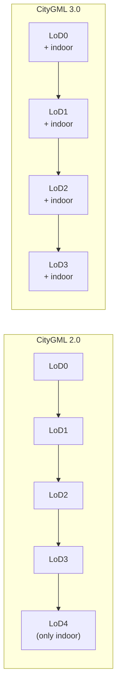
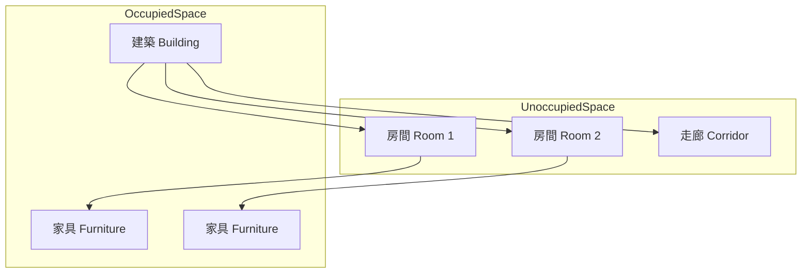
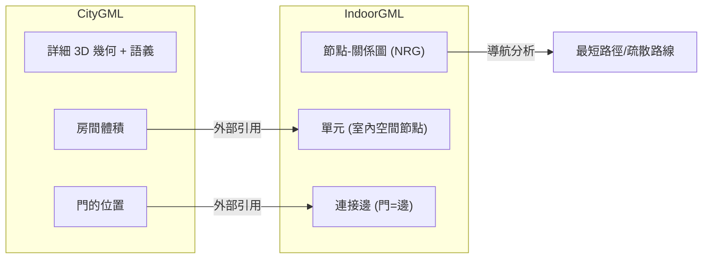

# CityGML 室內領域入門 — 必備 Domain / Model Knowledge 與概念整理

## 目錄

1. [什麼是 CityGML？](#1-什麼是-citygml)
2. [LoD（Level of Detail）系統與室內建模](#2-lodlevel-of-detail系統與室內建模)
3. [核心概念：語義、幾何、拓撲、外觀](#3-核心概念語義幾何拓撲外觀)
4. [空間模型（CityGML 3.0）：OccupiedSpace 與 UnoccupiedSpace](#4-空間模型citygml-30occupiedspace-與-unoccupiedspace)
5. [建築模組（Building Module）室內類別詳解](#5-建築模組building-module室內類別詳解)
6. [室內元素幾何表示方式](#6-室內元素幾何表示方式)
7. [CityGML vs IFC：室內建模差異](#7-citygml-vs-ifc室內建模差異)
8. [CityGML 與 IndoorGML 的關係](#8-citygml-與-indoorgml-的關係)
9. [ADE（Application Domain Extension）室內擴展機制](#9-adeapplication-domain-extension室內擴展機制)
10. [常見工具與資源](#10-常見工具與資源)

---

## 1. 什麼是 CityGML？

**CityGML**（City Geography Markup Language）是由**開放地理空間聯盟（OGC）**制定的開放國際標準，用於表示和交換虛擬 3D 城市與景觀模型。它不僅記錄建築物的幾何形狀，更賦予每個物件**語義標籤**——例如「這是一棟建築」、「這是牆面」、「這是房間」——使得模型能被電腦理解並用於分析模擬。[^ogc-citygml]

### 核心定位

- 從純圖形 3D 模型（只看起來像）升級為**富含語義的模型**（能被理解與分析）
- 支援**多尺度建模**：同一個建築可同時存在不同細節層級的表示
- 實現不同領域間資料的**互操作性**[^biljecki2015]

### 版本沿革

| 版本 | 日期 | 重點 |
|------|------|------|
| 1.0.0 | 2008-08 | 首個 OGC 官方標準 |
| 2.0.0 | 2012-04 | 廣泛採用；加入 Bridge、Tunnel 模組 |
| **3.0** | **2021** | **重大架構演進**；將 LoD4 移除並整合至 LoD0-3；引入正式空間概念 |

[^ogc-citygml]: OGC. (n.d.). CityGML. Retrieved 2026-09-26, from https://www.ogc.org/standards/citygml/
[^biljecki2015]: Biljecki, F., et al. (2015). Applications of 3D city models: State of the art review. *ISPRS Journal of Photogrammetry and Remote Sensing*, 109, 1-18.

---

## 2. LoD（Level of Detail）系統與室內建模

CityGML 定義了**五個連續的細節層級**（LoD0-LoD4），其中 LoD4 專門針對室內設計。然而在 CityGML 3.0 中，LoD4 已**被移除**，室內元素現在可在 LoD0-3 各層級中獨立存在。[^citygml30-guide]

### CityGML 2.0 的 LoD

| LoD | 名稱 | 描述 |
|-----|------|------|
| **LoD0** | 區域/景觀 | 2.5D 地形模型，含建築足跡 |
| **LoD1** | 城市/區域 | 塊狀建築（平頂擠出體） |
| **LoD2** | 城市街區 | 含屋頂形態；可含主題表面（牆面、屋頂、地面） |
| **LoD3** | 建築外觀 | 詳細外觀，含門窗、陽台等建築細部 |
| **LoD4** | 建築室內 | LoD3 + **室內結構**（房間、室內牆面、樓梯、家具、固定裝置） |

### CityGML 3.0 的重大變革

> *"LOD4 was dropped, because now all feature types can have outdoor and indoor elements in LODs 0-3"*
> —— OGC CityGML 3.0 Conceptual Model Users Guide §6.4.4

- **LoD4 已移除**：室內結構現在嵌入到 LoD0-3 各層級中
- **外部與內部可分開指定**：建築外殼用 LoD1，內部房間用 LoD2 — 可混用
- **LoD0 即可表達室內布局**：建築平面圖（floor plan）層級就能表示房間[^kutzner2020]



[^citygml30-guide]: OGC. (2021). CityGML 3.0 Conceptual Model Users Guide (20-066r0). Retrieved 2026-09-26, from https://docs.ogc.org/guides/20-066r0.html
[^kutzner2020]: Kutzner, T., Chaturvedi, K., & Kolbe, T. H. (2020). CityGML 3.0: New functions open up new applications. *PFG – Journal of Photogrammetry, Remote Sensing and Geoinformation Science*, 88, 43-61.

---

## 3. 核心概念：語義、幾何、拓撲、外觀

這四個面向是理解 CityGML 的基石：[^citygml-wiki]

### 語義（Semantics）

每個物件都有明確定義的**類別**和**屬性**，而非只是幾何圖形。例如：

```xml
<bldg:Building gml:id="bui_001">
    <bldg:function>住宅</bldg:function>
    <bldg:storeysAboveGround>5</bldg:storeysAboveGround>
</bldg:Building>
```

### 幾何（Geometry）

基於 GML（Geography Markup Language）的 3D 幾何，遵循 ISO 19107 標準。支援的幾何類型：

| 幾何類型 | 用途 |
|----------|------|
| `gml:Polygon` | 牆面、地板、天花板等平面 |
| `gml:MultiSurface` | 複雜表面（開窗的牆面） |
| `gml:Solid` | 建築體塊（LoD1-LoD2） |
| `gml:CompositeSurface` | 封閉的表面集合 |

### 拓撲（Topology）

物件之間的空間關係，例如：
- 哪些表面相鄰？
- 哪些房間之間有門連通？
- 可透過 XLink 機制表達

### 外觀（Appearance）

紋理（texture）和材質（material）資訊，貼附於幾何表面。

[^citygml-wiki: CityGML Wiki. (n.d.). Basic Information. Retrieved 2026-09-26, from https://www.citygmlwiki.org/index.php?title=Basic_Information

---

## 4. 空間模型（CityGML 3.0）：OccupiedSpace 與 UnoccupiedSpace

CityGML 3.0 最重大的概念創新是在核心模組中引入了**正式空間分類**：[^citygml30-standard]

### 空間類型架構

```
AbstractSpace（抽象空間）
 ├── AbstractPhysicalSpace（物理空間）
 │    ├── AbstractOccupiedSpace（佔用空間）
 │    └── AbstractUnoccupiedSpace（非佔用空間）
 └── AbstractLogicalSpace（邏輯空間）— 如公寓單元、樓層
```

### 佔用空間（OccupiedSpace）

- **定義**：被物質實質佔據的空間
- **例子**：建築物、橋樑、樹木、城市家具、水體
- **表面法線**：指向**外部**（遠離實體）

### 非佔用空間（UnoccupiedSpace）

- **定義**：未被物質佔據的自由空間
- **例子**：房間、交通空間
- **表面法線**：指向**內部**（朝房間中心）

### 空間交替嵌套模式

這是理解室內模型層次的關鍵：[^kutzner2020]



規律：**佔用空間 → 非佔用空間 → 佔用空間**，交替嵌套。

### 邏輯空間（LogicalSpace）

- **定義**：不一定有物理邊界，而是基於主題或法律定義的劃分
- **例子**：`BuildingUnit`（公寓單元）、`Storey`（樓層）
- 對 3D 地籍管理至關重要（區分產權範圍 vs 物理範圍）[^ho2023]

[^citygml30-standard]: OGC. (2021). CityGML 3.0 Conceptual Model Standard (20-010). Retrieved 2026-09-26, from https://docs.ogc.org/is/20-010/20-010.html
[^ho2023]: Ho, S.-Y., & Hong, J.-H. (2023). Integrating CityGML and LADM for 3D Building Management – Taking Taiwan as an Example. *TU Delft Repository*.

---

## 5. 建築模組（Building Module）室內類別詳解

### CityGML 3.0 室內相關類別一覽[^bldg-xsd]

| 類別 | 父類別 | 說明 |
|------|--------|------|
| `Building` | `AbstractOccupiedSpace` | 建築物本體 |
| `BuildingPart` | `AbstractOccupiedSpace` | 建築子部分 |
| **`BuildingRoom`** | **`AbstractUnoccupiedSpace`** | **房間（物理空間）** |
| `BuildingUnit` | `AbstractLogicalSpace` | 公寓/套房（邏輯空間） |
| `Storey` | `AbstractLogicalSpace` | 樓層（邏輯空間） |
| `BuildingFurniture` | `AbstractOccupiedSpace` | 室內家具 |
| `BuildingInstallation` | `AbstractOccupiedSpace` | 外部設施（陽台、煙囪） |
| `IntBuildingInstallation` | `AbstractOccupiedSpace` | 室內固定裝置（樓梯、管線） |
| `BuildingConstructiveElement` | `AbstractOccupiedSpace` | 構造元素（對映 IFC 牆、板） |

### 邊界表面（Boundary Surfaces）

室內空間由語義標記的邊界表面圍合：[^citygml30-guide]

| 類別 | 說明 |
|------|------|
| `InteriorWallSurface` | 室內隔牆 |
| `FloorSurface` | 地板/樓板 |
| `CeilingSurface` | 天花板 |
| `ClosureSurface` | 封閉開口（關門時的表面） |
| `GroundSurface` | 地面（建築底層） |

### 開口（Openings）

| 類別 | 說明 |
|------|------|
| `Door` | 門（子類別於 `_Opening`） |
| `Window` | 窗（子類別於 `_Opening`） |

### 家具與室內物件

在 CityGML 3.0 中，家具（`BuildingFurniture`）作為 `AbstractOccupiedSpace` 存在於房間（`UnoccupiedSpace`）內部。這在語義上表達了：「房間是自由空間，家具佔據了房間內的部分空間」。[^nasir2022]

[^bldg-xsd]: OGC. (n.d.). CityGML 3.0 Building Module XSD Documentation. Retrieved 2026-09-26, from https://opengeospatial.github.io/CityGML-3.0Encodings/xsd-doc/3.0/building/
[^nasir2022]: Nasir, N. A. M., et al. (2022). Managing indoor movable assets in 3D using CityGML for smart city applications. *ISPRS Archives*, XLVIII-4-W3-2022, 103-110.

---

## 6. 室內元素幾何表示方式

### 牆面（WallSurface）

```xml
<bldg:WallSurface gml:id="wall_001">
    <bldg:lod2MultiSurface>
        <gml:MultiSurface>
            <gml:surfaceMember>
                <gml:Polygon>
                    <!-- 外圈：牆面輪廓 -->
                    <gml:exterior>
                        <gml:LinearRing>...</gml:LinearRing>
                    </gml:exterior>
                    <!-- 內圈：預留給門/窗的洞口 -->
                    <gml:interior>
                        <gml:LinearRing>...</gml:LinearRing>
                    </gml:interior>
                </gml:Polygon>
            </gml:surfaceMember>
        </gml:MultiSurface>
    </bldg:lod2MultiSurface>
</bldg:WallSurface>
```

關鍵規則：牆面幾何必須有一個**洞口（hole）**，由門窗幾何填入。這透過 `gml:Polygon` 的 `exterior`（外圈）和 `interior`（內圈）實現。[^citygml-wiki-geo]

### 門（Door）

```xml
<bldg:Door gml:id="door_001">
    <bldg:lod3MultiSurface>
        <gml:MultiSurface>
            <!-- 門的幾何位於牆面的 hole 中 -->
        </gml:MultiSurface>
    </bldg:lod3MultiSurface>
</bldg:Door>
```

### 房間（BuildingRoom / Room）

在 CityGML 3.0 中，房間的幾何可以在不同 LoD 層級表示：

- **LoD0**：單點或多曲線（樓層平面圖）
- **LoD1**：Solid（體塊）
- **LoD2/LoD3**：Solid 或 MultiSurface（詳細幾何）

[^citygml-wiki-geo]: CityGML Wiki. (n.d.). Geometry of Window. Retrieved 2026-09-26, from https://github.com/citygml4j/citygml4j/issues/4

---

## 7. CityGML vs IFC：室內建模差異

| 面向 | CityGML | IFC（Industry Foundation Classes） |
|------|---------|-------------------------------------|
| **領域** | GIS / 城市建模 | BIM / 建築工程 |
| **視角** | 建築是**城市物件**（有地址的語義特徵） | 建築是**施工專案**（構件、材料、系統） |
| **幾何** | 邊界表示（BREP），真實大地座標系 | 實體建模（Extrusion、Boolean），局部工程座標（mm） |
| **細緻度** | LoD0-4 幾何抽象層級 | 專業模型層級（無 LoD 概念） |
| **室內建模** | 房間是體積，家具是物件，無構件細節 | 完整構件模型：每道牆為多層構造，管線路由 |
| **座標系統** | **原生支援**（文件層級聲明） | 可選（常缺漏） |
| **典型用途** | 全市分析、建築普查、都市規劃 | 建築設計、施工、設施管理 |

### 關鍵警示：LoD4 ≠ BIM

CityGML LoD4（或 CityGML 3.0 的室內元素）增加了室內**幾何**，但不包含**構件層次**、**材料**或**系統**。CityGML 中的房間是充滿空氣的體積空間，而 IFC 中的 `IfcSpace` 具有功能分區、防火等級和 HVAC 連線關係。[^ifc-vs-citygml]

轉換是**有損的**：
- IFC → CityGML：幾何三角化，按法線方向分類為牆/屋頂/地面，丟失構件資訊
- CityGML → IFC：生成無施工含義的表面殼體

[^ifc-vs-citygml]: 3D Geospatial. (n.d.). IFC vs CityGML for Building Twins. Retrieved 2026-09-26, from https://www.3d-geospatial.com/3d-geospatial-fundamentals-for-digital-twins/3d-format-standards-comparison/ifc-vs-citygml-for-building-twins/

---

## 8. CityGML 與 IndoorGML 的關係

**IndoorGML** 是 OGC 另一個獨立標準，專注於**室內空間的導航**。它與 CityGML 是**互補關係**：[^indoorgml]

### 核心差異

| 面向 | CityGML | IndoorGML |
|------|---------|-----------|
| **主要關注** | 3D 城市建模（幾何+語義+外觀） | 室內空間導航（空間劃分+連通性） |
| **核心概念** | 建築、房間、邊界表面 | Cell（單元）、Connectivity（連通性）、NRG（節點關係圖） |
| **拓撲** | 可選的 XLink 關係 | **顯式拓撲模型**（節點-邊圖，用於尋路） |
| **幾何** | 詳細 3D 幾何（BREP） | 不重視幾何（引用 CityGML 的幾何） |

### 如何協同工作



- IndoorGML 使用 **Poincaré 對偶性**，將 3D 體積空間（房間）轉換為節點，將連通關係（門）轉換為邊
- IndoorGML 的 Cell 透過**外部引用（external reference）**連結到 CityGML 物件（1:1 或 n:1 映射）
- CityGML 提供詳細幾何和語義，IndoorGML 提供導航所需的空間拓撲[^integrate-indoorgml]

### 多層次空間模型（Multi-Layered Space Model）

IndoorGML 支援將同一室內空間以不同語義層次解釋：
- 地形空間層（topographic space）
- Wi-Fi 訊號覆蓋層（sensor space）
- RFID 定位層

層與層之間透過**跨層連接（inter-layer connection）**實現交互。

[^indoorgml]: OGC. (n.d.). IndoorGML. Retrieved 2026-09-26, from https://www.ogc.org/standards/indoorgml/
[^integrate-indoorgml]: Nagel, C., et al. (2013). Integration of IndoorGML and CityGML. In *Lecture Notes in Geoinformation and Cartography*. Springer.

---

## 9. ADE（Application Domain Extension）室內擴展機制

**ADE** 是 CityGML 內建的擴展機制，允許在不破壞標準結構的前提下，加入新的特徵類別和屬性。[^ade-survey]

### 重要室內相關 ADE

#### 1. CityGML Indoor ADE (Kim et al., 2014)

專門為室內設施管理開發，包含兩個特徵模型：[^indoor-ade]

- **室內空間特徵模型**：擴展房間表示，含樓層資訊、空間用途等
- **室內設施特徵模型**：表示 HVAC、電氣設備、管線等設施

#### 2. OGC Public Safety ADE

由 NIST 資助，基於 NAPSG 符號系統定義室內公共安全特徵：[^publicsafety-ade]

- 擴展類別：`IntBuildingInstallation`、`Opening`、`Door`、`Room`
- 新增類別：`PublicSafetyIntBuildingInstallation`、`PublicSafetyAlarm`、`PublicSafetyRoom`、`Hatch` 等
- 安全關鍵屬性：`doorHandling`（左右開）、`fireDoor`（防火門）、`lockType`（鎖類型）
- 偵測器類型：Heat、Flame、Flow、Gas、Smoke、Beam 等

#### 3. Indoor Routing and Positioning ADE (Dutta et al., 2017)

擴展 CityGML 以支援：[^routing-ade]

- 室內可達性分析
- 定位感測器資訊
- 詳細的通道連線關係

[^ade-survey]: Biljecki, F., et al. (2018). CityGML Application Domain Extension (ADE): Overview of developments. *Open Geospatial Data, Software and Standards*, 3, Article 13.
[^indoor-ade]: Kim, Y., et al. (2014). Development of Indoor Spatial Data Model Using CityGML ADE. *ISPRS Archives*.
[^publicsafety-ade]: OGC. (2020). Indoor Mapping and Navigation Pilot: Public Safety Features CityGML ADE Engineering Report (19-032). Retrieved 2026-09-26, from https://docs.ogc.org/per/19-032.html
[^routing-ade]: Dutta, A., et al. (2017). Development of CityGML Application Domain Extension for Indoor Routing and Positioning. *Journal of the Indian Society of Remote Sensing*, 45, 1007-1019.

---

## 10. 常見工具與資源

### 開源工具[^citygml-tools]

| 工具 | 說明 | 連結 |
|------|------|------|
| **3D City Database (3DCityDB)** | PostgreSQL/PostGIS 上的開源地理資料庫，支援 CityGML 3.0 匯入匯出 | [github.com/3dcitydb](https://github.com/3dcitydb/3dcitydb) |
| **CityJSON** | CityGML 的 JSON 編碼，較輕量，便於 Web 使用。Python 函式庫 `cjio` | [cityjson.org](https://www.cityjson.org) |
| **Azul** | 臺夫特理工大學開發的免費 CityGML 檢視器 | [github.com/tudelft3d/azul](https://github.com/tudelft3d/azul) |
| **lod2plus** | 為 CityGML LoD2 建築自動生成簡化室內（各樓層體量） | [github.com/tudelft3d/lod2plus](https://github.com/tudelft3d/lod2plus) |
| **IFC2CityGML** | 將 IFC BIM 模型映射為 CityGML 建築模型 | [ifc2citygml.github.io](https://ifc2citygml.github.io/) |

### 商業工具

| 工具 | 說明 |
|------|------|
| **FME（Safe Software）** | ETL 平台，支援 CityGML 2.0 和 3.0 讀寫，有 IFC→LoD4 轉換工作空間 |
| **Virtual City Systems** | 商業 CityGML 建模與視覺化解決方案 |

### 資料資源

- **[Awesome CityGML](https://github.com/OloOcki/awesome-citygml)**：開放 3D 城市模型資料集清單
- **[TU Delft 開放 3D 資料](https://3d.bk.tudelft.nl/opendata/opencities/)**：全球城市開放資料集
- **[CityGML 3.0 範例資料集](https://github.com/opengeospatial/CityGML3.0-GML-Encoding/tree/main/resources/examples)**：教學與測試用

### 學習資源

| 資源 | 說明 |
|------|------|
| [CityGML Wiki](https://www.citygmlwiki.org/) | 非官方但完整的資訊中心 |
| [OGC CityGML 3.0 標準文件](https://docs.ogc.org/is/20-010/20-010.html) | 正式標準（概念模型） |
| [OGC CityGML 3.0 使用者指南](https://docs.ogc.org/guides/20-066.html) | 較易理解的指引文件 |
| [FME CityGML 教學](https://fme.safe.com/blog/2022/02/using-citygml-work-large-scale-3d-data/) | 實作導向的教學 |
| 3DCityDB 文件 | 資料庫操作與匯入匯出教學 |

[^citygml-tools]: CityGML Wiki. (n.d.). Open Source Tools. Retrieved 2026-09-26, from https://www.citygmlwiki.org/index.php/Open_Source

---

## 快速要點總結（給初學者）

1. **CityGML 不只是 3D 模型** — 每個物件都有語義標籤（這是建築、這是房間），讓電腦能理解並分析城市

2. **LoD4 在 CityGML 3.0 已消失** — 室內元素現在可以在任何 LoD 層級獨立存在，更靈活

3. **空間交替嵌套是關鍵** — 建築（佔用空間）→ 房間（非佔用空間）→ 家具（佔用空間）

4. **CityGML ≠ BIM** — LoD4 室內只有幾何，沒有建材、構件、系統細節；BIM 需要 IFC

5. **IndoorGML 是導航專用** — CityGML 管幾何語義，IndoorGML 管路徑拓撲，兩者互補

6. **ADE 可擴展室內功能** — 需要更多屬性（如公共安全、設施管理）就靠 ADE

7. **牆面幾何用洞口裝門窗** — `gml:Polygon` 的 `exterior` + `interior` ring

8. **實務上 CityGML + IFC 兩者並存** — 不同領域各有專長，成熟數位孿生會同時保留兩種格式