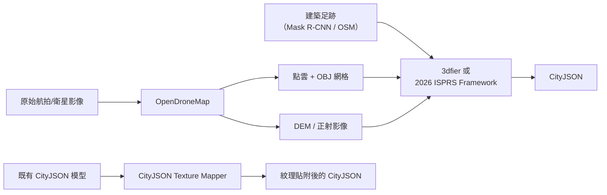

# FOSS「圖片轉 CityJSON」解決方案調查報告

## 摘要

本報告調查目前自由開源軟體（FOSS）生態系中，將圖片（衛星、航拍、街景等）轉換為 CityJSON 三維城市模型的解決方案。結論是：**目前不存在單一、端到端的 FOSS 工具能直接將原始圖片轉為 CityJSON**。現有可行途徑須透過多階段管線（photogrammetry → 幾何重建 → 格式轉換），各階段皆有對應的 FOSS 工具可供串接。

---

## 1. 背景：什麼是 CityJSON？

CityJSON 是一種基於 JSON 的輕量級格式，用於儲存三維城市模型，由 OGC CityGML 標準簡化而來，支援建築物、道路、地形、植被等城市物件的語義與幾何表示[^cityjson]。其生態系相當成熟，擁有 viewer、validator、converter 等配套工具[^cityjson-sw]。

---

## 2. 可直接產出 CityJSON 的工具（非從圖片，而是從 GIS/LiDAR 資料）

### 2.1 3dfier（最接近的候選）

- **倉儲**: [github.com/tudelft3d/3dfier](https://github.com/tudelft3d/3dfier) — 635★, GPL-3.0, C++[^3dfier]
- **功能**: 接收二維 GIS 多邊形（建築足跡）+ 分類後的 LiDAR 點雲（LAS/LAZ）→ 將多邊形拉升到正確高度 → **輸出 CityJSON、CityGML、OBJ**
- **支援物件**: 建築（LOD1）、道路、地形、水域、森林、橋樑
- **限制**: 需要二維向量足跡 + LiDAR 點雲，**無法直接從圖片輸入**
- **維護狀態**: 活躍維護，提供預編譯二進位檔

### 2.2 citygml-tools（格式轉換器）

- **倉儲**: [github.com/citygml4j/citygml-tools](https://github.com/citygml4j/citygml-tools) — Java CLI[^citygml-tools]
- **功能**: CityGML ↔ CityJSON 單鍵互轉
- **相關性**: 若從任何來源（包含 photogrammetry）產出 CityGML，可用此工具轉為 CityJSON

---

## 3. 從圖片產生三維模型的工具（非 CityJSON，但可串接）

### 3.1 Elevate3D（深度學習，衛星/航拍圖）

- **倉儲**: [github.com/krdgomer/Elevate3D](https://github.com/krdgomer/Elevate3D) — 9★, MIT, Python[^elevate3d]
- **管線**: RGB 衛星/航拍圖 → Mask R-CNN（建築分割）→ Pix2Pix（DSM/高程預測）→ Open3D（三維網格）→ **輸出 `.glb` 網格**
- **限制**: 輸出為 GLB 網格，非 CityJSON；需自行轉換或串接下游工具
- **維護狀態**: 早期實驗階段

### 3.2 Sat2Mesh（深度學習，衛星多視角圖）

- **倉儲**: [github.com/awhitewhale/sat2mesh](https://github.com/awhitewhale/sat2mesh) — 3★, MIT, Python[^sat2mesh]
- **功能**: 端到端 Transformer 框架，從稀疏多視角衛星影像直接產生三維三角網格
- **輸出**: 三角網格（GLB 格式）
- **限制**: 輸出為通用網格，尚無 CityJSON 匯出；訓練/測試程式碼待公開
- **維護狀態**: 研究階段，附帶 Sat2Mesh-7K 資料集

### 3.3 OpenDroneMap (ODM)

- **倉儲**: [github.com/OpenDroneMap/ODM](https://github.com/OpenDroneMap/ODM) — 成熟的大型 FOSS 專案[^odm]
- **功能**: 接收無人機/氣球/風箏航拍影像 → 產出**紋理三維網格 (OBJ)**、點雲、正射影像、DEM
- **輸出格式**: OBJ、LAS、GeoTIFF、3D Tiles
- **限制**: 無原生 CityJSON 輸出。若要從 ODM 產出 CityJSON，需透過：ODM → OBJ 網格 → 手動或程式轉換 → CityJSON。**目前不存在 OBJ → CityJSON 的直接轉換器**

---

## 4. CityJSON 紋理映射工具（將圖片貼到現有模型上）

- **論文**: ISPRS Annals 2024 — Buyukdemircioglu & Oude Elberink (University of Twente)[^texture-mapping]
- **功能**: 接收**既有的 CityJSON 三維城市模型** + 傾斜/垂直航拍影像 → 自動將真實紋理映射到建築表面（屋頂 + 外牆）
- **特性**: 遮擋感知的最優影像選擇、可自訂紋理 LOD、表面類型選擇
- **限制**: 需要**已存在的 CityJSON 模型**，不從圖片產生幾何，僅為既有模型上紋理
- **授權**: CC-BY 4.0，Python，有原始碼

---

## 5. City3D（LiDAR → 建築重建）

- **倉儲**: [github.com/tudelft3d/City3D](https://github.com/tudelft3d/City3D) — 360★, GPL-3.0, C++[^city3d]
- **功能**: 大規模 LoD2 建築重建，從空載 LiDAR 點雲使用假設-選擇方法
- **輸入**: 空載 LiDAR 點雲 + 可選建築足跡（GeoJSON/OBJ）
- **輸出**: OBJ 網格；論文附 20k 建築重建資料集
- **限制**: 使用 LiDAR 點雲（非圖片），輸出 OBJ 而非 CityJSON

---

## 6. 二維足跡 + DEM → CityJSON（2026 最新研究）

- **論文**: ISPRS Annals 2026 — "Automatic DEM-infused 2D to 3D LoD1 Urban Morphology Python Framework"[^dem-framework]
- **功能**: 開源 Python 框架，接收二維建築足跡 + DEM → 在 **CityJSON** 格式中產生 LoD1 三維城市模型
- **使用函式庫**: GDAL、Shapely、GeoPandas、PyVista、CityJSON 等
- **相關性**: 最接近「二維 → 三維 CityJSON」的管線。若能從圖片中分割出建築足跡（如 Mask R-CNN）並從 photogrammetry 取得 DEM，即可產生 CityJSON

---

## 7. 支援函式庫（用於自建管線）

| 工具 | 說明 | 連結 |
|------|------|------|
| **cjio** | Python CLI，處理/操控/驗證 CityJSON | [github.com/cityjson/cjio](https://github.com/cityjson/cjio)[^cjio] |
| **val3dity** | 依 ISO19107 驗證三維城市模型 | [github.com/tudelft3d/val3dity](https://github.com/tudelft3d/val3dity)[^val3dity] |
| **tyler** | CityJSON → 3D Tiles | [github.com/3DGI/tyler](https://github.com/3DGI/tyler)[^tyler] |
| **citygml4j** | Java API 讀寫 CityGML/CityJSON | [github.com/citygml4j](https://github.com/citygml4j)[^citygml4j] |
| **Up3date** | Blender CityJSON 外掛 | [github.com/cityjson/Blender-CityJSON-Plugin](https://github.com/cityjson/Blender-CityJSON-Plugin)[^up3date] |
| **cityjson2jsonfg** | CityJSON → JSON-FG 格式 | [github.com/3DGI/cityjson2jsonfg](https://github.com/3DGI/cityjson2jsonfg)[^cityjson2jsonfg] |
| **IFCCityJSON** | CityJSON ↔ IFC | [IfcOpenShell](https://github.com/IfcOpenShell/IfcOpenShell/tree/v0.6.0/src/ifccityjson)[^ifccityjson] |

---

## 8. 建議管線架構

根據以上調查，最可行的 FOSS 管線組合如下：

### 管線選項說明

1. **3dfier 路徑**（需 LiDAR + 二維足跡）：若已有 LiDAR 點雲和建築足跡，直接輸出 CityJSON
2. **ODM + 3dfier 路徑**（航拍圖 → CityJSON）：ODM 產出點雲 → 搭配外部足跡 → 3dfier 產出 CityJSON
3. **ODM + 2026 ISPRS Framework 路徑**（航拍圖 → CityJSON）：ODM 產出 DEM + 外部足跡 → ISPRS Python Framework → CityJSON
4. **Elevate3D / Sat2Mesh + 轉換路徑**（純深度學習）：從衛星影像產出 GLB → 需自行開發 GLB/OBJ → CityJSON 轉換器
5. **CityJSON Texture Mapper 路徑**（既有模型上紋理）：若已有 CityJSON 模型，可加上真實影像紋理

---

## 9. 關鍵缺口

調查發現最大的工具缺口是：**目前不存在 FOSS 的通用三維網格（OBJ/GLB/PLY）→ CityJSON 轉換器**。這使得 photogrammetry 工具與 CityJSON 生態系之間存在斷層。若有人開發此轉換器，將能大幅簡化「圖片 → CityJSON」的管線。

---

## 參考資料

[^cityjson]: CityJSON. (n.d.). CityJSON: A JSON-based encoding for 3D city models. Retrieved 2026-09-25, from https://www.cityjson.org/
[^cityjson-sw]: CityJSON. (n.d.). Software. Retrieved 2026-09-25, from https://www.cityjson.org/software/
[^3dfier]: tudelft3d. (n.d.). 3dfier: The open-source tool for creating 3D models. Retrieved 2026-09-25, from https://github.com/tudelft3d/3dfier
[^citygml-tools]: citygml4j. (n.d.). citygml-tools: CLI to convert CityJSON ↔ CityGML. Retrieved 2026-09-25, from https://github.com/citygml4j/citygml-tools
[^elevate3d]: Gomer, K. R. (n.d.). Elevate3D: Deep Learning-Powered 3D City Reconstruction from Satellite Imagery. Retrieved 2026-09-25, from https://github.com/krdgomer/Elevate3D
[^sat2mesh]: awhitewhale. (n.d.). Sat2Mesh: Satellite-to-Mesh Urban Modeling from Multi-view Satellite Images. Retrieved 2026-09-25, from https://github.com/awhitewhale/sat2mesh
[^odm]: OpenDroneMap. (n.d.). ODM: A command line toolkit to generate maps, point clouds, 3D models and DEMs from drone, balloon or kite images. Retrieved 2026-09-25, from https://github.com/OpenDroneMap/ODM
[^texture-mapping]: Buyukdemircioglu, M., & Oude Elberink, S. (2024). Automated texture mapping CityJSON 3D city models from oblique and nadir aerial imagery. ISPRS Annals of the Photogrammetry, Remote Sensing and Spatial Information Sciences, X-4-W5-2024, 87–94. Retrieved 2026-09-25, from https://isprs-annals.copernicus.org/articles/X-4-W5-2024/87/2024/
[^city3d]: tudelft3d. (n.d.). City3D: Large-scale LoD2 building reconstruction from airborne LiDAR point clouds. Retrieved 2026-09-25, from https://github.com/tudelft3d/City3D
[^dem-framework]: (2026). Automatic DEM-infused 2D to 3D LoD1 Urban Morphology Python Framework. ISPRS Annals of the Photogrammetry, Remote Sensing and Spatial Information Sciences, XI-M-1-2026, 71–78. Retrieved 2026-09-25, from https://isprs-annals.copernicus.org/articles/XI-M-1-2026/71/2026/
[^cjio]: cityjson. (n.d.). cjio: Python CLI to process and manipulate CityJSON files. Retrieved 2026-09-25, from https://github.com/cityjson/cjio
[^val3dity]: tudelft3d. (n.d.). val3dity: Validation of 3D city models according to ISO19107. Retrieved 2026-09-25, from https://github.com/tudelft3d/val3dity
[^tyler]: 3DGI. (n.d.). tyler: Creates 3D tiles from CityJSON. Retrieved 2026-09-25, from https://github.com/3DGI/tyler
[^citygml4j]: citygml4j. (n.d.). citygml4j: Open source Java class library and API for CityGML and CityJSON. Retrieved 2026-09-25, from https://github.com/citygml4j
[^up3date]: cityjson. (n.d.). Up3date: Blender CityJSON Plugin. Retrieved 2026-09-25, from https://github.com/cityjson/Blender-CityJSON-Plugin
[^cityjson2jsonfg]: 3DGI. (n.d.). cityjson2jsonfg: CLI tool to convert CityJSON to JSON-FG format. Retrieved 2026-09-25, from https://github.com/3DGI/cityjson2jsonfg
[^ifccityjson]: IfcOpenShell. (n.d.). IFCCityJSON: Convert CityJSON files to IFC. Retrieved 2026-09-25, from https://github.com/IfcOpenShell/IfcOpenShell/tree/v0.6.0/src/ifccityjson