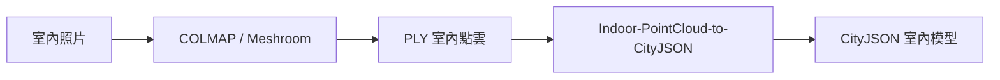
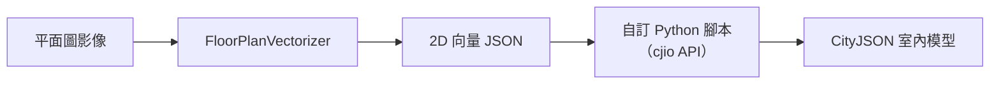
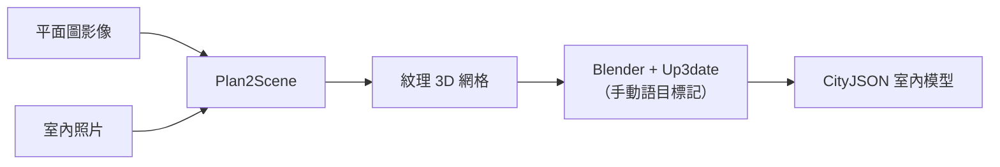
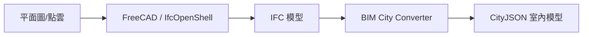

# FOSS「圖片轉室內 CityJSON」解決方案調查報告（室內專注版）

## 摘要

本報告專注調查自由開源軟體（FOSS）生態系中，將**室內空間圖片**（含點雲、平面圖、室內照片）轉換為 **CityJSON 室內三維模型**的解決方案。結論是：**目前不存在單一、端到端的 FOSS 工具能直接將原始室內圖片轉為含室內語意的 CityJSON**，但存在一條完整可行的 FOSS 管線：照片 → 攝影測量點雲 → 自動房間偵測 → CityJSON 輸出。此外，平面圖影像可經由深度學習向量化後，搭配自訂腳本產生 CityJSON。

---

## 1. 為何專注室內？

CityJSON 2.0 原生完整支援室內建模，定義了 `BuildingRoom`、`BuildingStorey`、`BuildingUnit`、`BuildingFurniture` 等室內專屬 City Object 類型，以及 `InteriorWallSurface`、`CeilingSurface`、`FloorSurface`、`InteriorFloorSurface` 等室內語意表面[^cityjson-spec]。這使得 CityJSON 成為描述室內空間的可行格式，但工具生態系尚未跟上格式的支援能力。

---

## 2. 唯一直接產出室內 CityJSON 的 FOSS 工具：Indoor-PointCloud-to-CityJSON

這是目前**唯一**已釋出原始碼、可從室內資料產生 CityJSON 的 FOSS 工具。

- **倉儲**: [github.com/Amsterdam-AI-Team/Indoor-PointCloud-to-CityJSON](https://github.com/Amsterdam-AI-Team/Indoor-PointCloud-to-CityJSON) — 15★, GPL-3.0, Python/C++[^ipcp]
- **作者**: Falke Boskaljon（阿姆斯特丹市政府 AI Team）
- **輸入**: 室內點雲（PLY 格式，範例使用 Redwood Indoor Lidar-RGBD Scan Dataset）
- **輸出**: CityJSON v1.0（以 `BuildingPart` 表示房間）或 CityJSON v1.1（以 `BuildingRoom` 表示房間），LOD 2 `Solid` 幾何，附帶各房間體積與面積統計

### 管線（5 階段）

| 階段 | 模組 | 說明 |
|------|------|------|
| 0. 前處理 | `SpatialSubsample` + `SOR` | 空間降取樣 + 統計離群值移除 |
| 1. 基元偵測 | `PrimitiveDetector`（CGAL RANSAC） | 偵測平面（地板、牆壁、天花板），忽略 < 0.5 m² 的表面 |
| 2. 樓層分割 | `FloorSplitter` | 將垂直間距 ≥ 1.8 m 的水平/傾斜面分層 |
| 3. 房間偵測 | `RoomDetector` | 建立鄰接圖，將基元標記為地板/牆壁/天花板，2D 投影後以 `skimage.measure.label` 標記連通區域 |
| 4. 房間重建 | `RoomReconstructor`（CGAL Polyfit） | 逐房間多邊形表面重建 |
| 5. CityJSON 匯出 | `cityjson_utils.py` | 匯出為 CityJSON，以 `MeshAnalyser` 計算體積與樓地板面積 |

### 限制（來自開發者部落格）

- 遮擋造成的牆/地板/天花板面積缺失會導致房間邊界錯誤
- 大型家具（衣櫃、床）的平整表面可能被誤認為牆壁
- 掃描時敞開的門會造成問題
- 不處理半層樓或樓高大變化
- 假設所有表面皆為平面

### 如何從照片起步

此工具**不直接接受照片**，但可透過 FOSS 攝影測量工具將照片轉為點雲：

```
照片 → COLMAP 或 Meshroom (AliceVision) → PLY 點雲 → Indoor-PointCloud-to-CityJSON → CityJSON
```

其中 [COLMAP](https://github.com/colmap/colmap)（BSD 授權）與 [Meshroom](https://github.com/alicevision/meshroom)（MPL-2.0）皆為成熟的 FOSS 攝影測量工具，可從多張室內照片產出稠密點雲[^colmap][^meshroom]。

---

## 3. 平面圖影像 → CityJSON：學術方法論（無公開程式碼）

### 3.1 Kippers (2021) — 深度學習 + 3D BAG 融合

- **論文**: ISPRS Archives, Volume XLVI-4/W4-2021, pp 49–54[^kippers]
- **碩士論文**: University of Twente, MSc Computer Science[^kippers-thesis]
- **管線**: 掃描平面圖 → 深度學習擷取牆壁、門窗、房間標籤 → 後處理 → 與 3D BAG（荷蘭國家三維建築資料集，CityJSON 格式）融合 → 產出含室內資訊的完整 CityJSON 建築模型
- **程式碼狀態**: **未公開**。作者 Richard Kippers 的 GitHub 僅有不相關的專案
- **重要性**: 論文作者宣稱「文獻回顧未發現任何將 CityGML/JSON 與平面圖影像自動整合的前人研究，本方法是此領域的首創」

### 3.2 與其他研究的關聯

後續研究如 [HouseCrafter](https://github.com/neu-vi/houseCrafter)（2025, ICCV Highlight, MIT）可從平面圖產生完整室內三維場景，但輸出為點雲/網格，非 CityJSON[^housecrafter]。這些工具若與轉換步驟搭配，可作為管線的前端。

---

## 4. 可串接的中間工具（影像 → 向量/網格）

這些工具不產出 CityJSON，但可作為管線元件：

### 4.1 Floor Plan Vectorizer（平面圖 → 2D 向量 JSON）

- **倉儲**: [github.com/pimenoffd/floor-plan-vectorizer](https://github.com/pimenoffd/floor-plan-vectorizer)[^fpv]
- **功能**: 深度學習分割（以 CubiCasa5k 資料集訓練）→ 多邊形座標提取 → 輸出結構化 JSON（牆壁、門、窗的多邊形座標）
- **限制**: 輸出為 2D 向量 JSON，非 3D CityJSON
- **串接潛力**: 可作為前端，輸出的 2D 向量經拉伸+語意標記後，可用 cjio Python API 轉為 CityJSON

### 4.2 Plan2Scene（平面圖 + 室內照片 → 紋理 3D 網格）

- **倉儲**: [github.com/3dlg-hcvc/plan2scene](https://github.com/3dlg-hcvc/plan2scene) — 612★, MIT[^plan2scene]
- **功能**: 平面圖影像（經 R2V 向量化）+ 室內照片 → 拉伸為 3D → GNN 紋理推論 → 輸出紋理 3D 網格（`.scene.json`）
- **論文**: CVPR 2021
- **限制**: 輸出為 SmartScenesToolkit 格式，非 CityJSON

### 4.3 FloorplanTransformation（平面圖光柵 → 向量 + 3D 彈出模型）

- **倉儲**: [github.com/art-programmer/FloorplanTransformation](https://github.com/art-programmer/FloorplanTransformation) — 681★, MIT[^fpt]
- **功能**: 光柵平面圖 → 向量圖形 + 3D 彈出模型
- **論文**: ICCV 2017

---

## 5. BIM → CityJSON 路徑（間接室內方案）

若室內資料以 BIM/IFC 格式存在（可從平面圖或點雲產出），以下 FOSS 工具可直接轉為 CityJSON：

### 5.1 BIM City Converter（IFC → CityJSON）

- **倉儲**: [github.com/OliverFoerster/bim-city-converter](https://github.com/OliverFoerster/bim-city-converter) — Apache-2.0[^bimcity]
- **功能**: IFC 建築幾何 → **CityJSON 2.0** + CityGML 3.0，含 EPSG 座標系統轉換
- **狀態**: v0.1.7 MVP，提供 GUI 與 CLI
- **相關性**: 若有工具能將室內照片/平面圖轉為 IFC（如 FreeCAD、IfcOpenShell），即可透過此工具產出 CityJSON

### 5.2 esri_geobim / ifc2citygml（IFC → CityJSON）

- **倉儲**: [github.com/tudelft3d/esri_geobim](https://github.com/tudelft3d/esri_geobim) — 13★[^esri_geobim]
- **功能**: IFC → CityJSON，含 Minkowski sum + Boolean 運算產生流形建築外殼
- **前身**: [ifc2citygml](https://github.com/tudelft3d/ifc2citygml)（74★，已封存）

### 5.3 IFCCityJSON（IfcOpenShell 模組）

- **倉儲**: IfcOpenShell v0.6.0 `src/ifccityjson`[^ifccityjson]
- **注意**: **僅支援 CityJSON → IFC（單向）**，不支援 IFC → CityJSON

---

## 6. 手動室內 CityJSON 編輯工具

### Up3date — Blender CityJSON 外掛

- **倉儲**: [github.com/cityjson/Up3date](https://github.com/cityjson/Up3date) — 81★, MIT[^up3date]
- **功能**: Blender 中匯入、檢視、編輯、匯出 CityJSON 2.0 模型
- **支援**: City Object 類型、LoD 0–3（含小數 LoD）、語意表面（WallSurface、RoofSurface 等）、幾何類型（MultiSurface、CompositeSurface、Solid）
- **室內應用**: 可手動在 Blender 建立室內幾何後，加上 `BuildingRoom`、`InteriorWallSurface` 等語意，匯出為 CityJSON

---

## 7. CityJSON 生態系支援工具

| 工具 | 功能 | 授權 | 連結 |
|------|------|------|------|
| **cjio** | Python CLI/API 處理 CityJSON（合併、篩選、匯出 glTF、驗證） | MIT | [github.com/cityjson/cjio](https://github.com/cityjson/cjio)[^cjio] |
| **citygml-tools** | CityGML ↔ CityJSON 雙向轉換 | Apache-2.0 | [github.com/citygml4j/citygml-tools](https://github.com/citygml4j/citygml-tools)[^citygml-tools] |
| **val3dity** | ISO19107 三維模型驗證 | GPL-3.0 | [github.com/tudelft3d/val3dity](https://github.com/tudelft3d/val3dity)[^val3dity] |
| **3DCityDB** | PostgreSQL/PostGIS 三維城市資料庫 | Apache-2.0 | [github.com/3dcitydb/3dcitydb](https://github.com/3dcitydb/3dcitydb)[^3dcitydb] |
| **tyler** | CityJSON → 3D Tiles | Apache-2.0 | [github.com/3DGI/tyler](https://github.com/3DGI/tyler)[^tyler] |

---

## 8. 建議管線架構

### 管線 A：室內照片 → 點雲 → CityJSON（立即可行）



- **優點**: 所有工具皆為 FOSS，管線完整可用
- **缺點**: 需拍攝大量室內照片進行攝影測量；點雲品質影響最終結果

### 管線 B：平面圖 → 向量 → 自訂轉換（需開發）



- **優點**: 單張平面圖即可
- **缺點**: 需自行開發 2D→3D 拉伸 + CityJSON 寫入邏輯

### 管線 C：平面圖 + 照片 → 3D 網格 → 手動標記



- **優點**: 自動產生紋理
- **缺點**: 需手動在 Blender 加入 CityJSON 語意

### 管線 D：平面圖 → IFC → CityJSON（間接）



- **優點**: BIM 轉換成熟度高
- **缺點**: 需先建立 IFC 模型

---

## 9. 關鍵缺口與未來方向

| 缺口 | 說明 | 影響程度 |
|------|------|----------|
| 無 FOSS 端到端「平面圖影像 → 室內 CityJSON」工具 | Kippers 2021 的方法論無公開程式碼 | 高 |
| 無通用 OBJ/GLB/PLY → CityJSON 轉換器 | 攝影測量產出的網格無法直接轉換 | 高 |
| Indoor-PointCloud-to-CityJSON 僅支援 CityJSON v1.0/v1.1 | 不支援 v2.0 的 `BuildingRoom` 原生類型（需適應） | 中 |
| 無 IndoorGML → CityJSON 轉換工具 | 室內導航圖無法轉換 | 中 |
| 室內語意標記缺乏自動化 | 牆面/地板/天花板類型需手動指定 | 高 |

---

## 10. 結論

目前在 FOSS 生態系中，**最直接的室內 CityJSON 產出路徑是透過 Indoor-PointCloud-to-CityJSON**，搭配 COLMAP 或 Meshroom 將照片轉為點雲。平面圖影像則需透過 FloorPlanVectorizer 等工具向量化後，再以自訂程式轉換。尚無任何 FOSS 工具能單步完成「圖片 → 室內 CityJSON」的轉換，但透過現有工具的組合，已可構建完整管線。

---

## 參考資料

[^cityjson-spec]: CityJSON. (n.d.). CityJSON Specification 2.0. Retrieved 2026-09-25, from https://www.cityjson.org/specs/

[^ipcp]: Amsterdam AI Team. (n.d.). Indoor-PointCloud-to-CityJSON. Retrieved 2026-09-25, from https://github.com/Amsterdam-AI-Team/Indoor-PointCloud-to-CityJSON

[^kippers]: Kippers, R. G., et al. (2021). Automatic 3D building model generation using deep learning methods based on CityJSON and 2D floor plans. ISPRS Archives, XLVI-4/W4-2021, 49–54. Retrieved 2026-09-25, from https://doi.org/10.5194/isprs-archives-XLVI-4-W4-2021-49-2021

[^kippers-thesis]: Kippers, R. G. (2021). Automatic 3D building model generation using deep learning methods based on CityJSON and 2D floor plans [Master's thesis]. Retrieved 2026-09-25, from https://essay.utwente.nl/essays/87724

[^colmap]: COLMAP. (n.d.). COLMAP: Structure-from-Motion and Multi-View Stereo. Retrieved 2026-09-25, from https://github.com/colmap/colmap

[^meshroom]: AliceVision. (n.d.). Meshroom: 3D Reconstruction Software. Retrieved 2026-09-25, from https://github.com/alicevision/meshroom

[^housecrafter]: NEU-VI. (n.d.). HouseCrafter: Lifting Floorplans to Complete 3D Indoor Scenes. Retrieved 2026-09-25, from https://github.com/neu-vi/houseCrafter

[^fpv]: pimenoffd. (n.d.). Floor Plan Vectorizer. Retrieved 2026-09-25, from https://github.com/pimenoffd/floor-plan-vectorizer

[^plan2scene]: 3dlg-hcvc. (n.d.). Plan2Scene: Converting Floorplans and Images to 3D Scenes. Retrieved 2026-09-25, from https://github.com/3dlg-hcvc/plan2scene

[^fpt]: Liu, C., et al. (2017). Raster-to-Vector: Revisiting Floorplan Transformation. Retrieved 2026-09-25, from https://github.com/art-programmer/FloorplanTransformation

[^bimcity]: Förster, O. (n.d.). BIM City Converter. Retrieved 2026-09-25, from https://github.com/OliverFoerster/bim-city-converter

[^esri_geobim]: TU Delft 3D Geoinformation. (n.d.). esri_geobim: IFC building models to CityJSON. Retrieved 2026-09-25, from https://github.com/tudelft3d/esri_geobim

[^ifccityjson]: IfcOpenShell. (n.d.). IFCCityJSON: Convert CityJSON files to IFC. Retrieved 2026-09-25, from https://github.com/IfcOpenShell/IfcOpenShell/tree/v0.6.0/src/ifccityjson

[^up3date]: CityJSON. (n.d.). Up3date: Blender CityJSON Plugin. Retrieved 2026-09-25, from https://github.com/cityjson/Up3date

[^cjio]: CityJSON. (n.d.). cjio: Python CLI to process and manipulate CityJSON files. Retrieved 2026-09-25, from https://github.com/cityjson/cjio

[^citygml-tools]: citygml4j. (n.d.). citygml-tools: CLI to convert CityJSON ↔ CityGML. Retrieved 2026-09-25, from https://github.com/citygml4j/citygml-tools

[^val3dity]: TU Delft 3D Geoinformation. (n.d.). val3dity: Validation of 3D city models according to ISO19107. Retrieved 2026-09-25, from https://github.com/tudelft3d/val3dity

[^3dcitydb]: 3DCityDB. (n.d.). 3D City Database for CityGML. Retrieved 2026-09-25, from https://github.com/3dcitydb/3dcitydb

[^tyler]: 3DGI. (n.d.). tyler: Creates 3D Tiles from CityJSON. Retrieved 2026-09-25, from https://github.com/3DGI/tyler