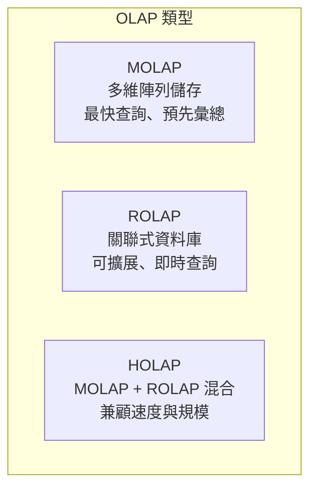

# OLAP (Online Analytical Processing) 介紹

## 什麼是 OLAP？

**OLAP (Online Analytical Processing，線上分析處理)** 是一種用於快速回答多維分析查詢的技術方法，屬於**商業智慧 (Business Intelligence, BI)** 的核心範疇之一[^wiki_olap]。OLAP 讓使用者能夠從多個維度以互動方式分析多維度資料，常見應用包括銷售分析、行銷報表、預算預測、財務報表等[^olap_history]。

「OLAP」一詞是相對於「OLTP (Online Transaction Processing，線上交易處理)」所創造的概念[^wiki_olap]。

## 歷史沿革

OLAP 的發展歷程橫跨數十年：

| 年份 | 里程碑 |
|------|--------|
| **1962** | Kenneth Iverson 發表 **APL** 程式語言，定義多維變數與處理運算子，為 OLAP 奠定概念基礎[^cube_blog] |
| **1970** | **Express** — 首個 OLAP 產品問世，由 Information Resources 發布（後被 Oracle 收購）[^olap_history] |
| **1982** | Comshare 推出 **System W**，為財務應用引入超立方體（hypercube）方法[^olap_history] |
| **1984** | **Metaphor** 問世，為首個 ROLAP 產品[^olap_history] |
| **1992** | Arbor Software 發布 **Essbase**（Extended Spreadsheet Database）[^wiki_olap] |
| **1993** | **Edgar F. Codd**（關聯式資料庫之父）發表白皮書《Providing OLAP to User-Analysts: An IT Mandate》，正式提出「OLAP」一詞及其 12 條規則[^wiki_olap][^origins] |
| **1997** | Microsoft 發表 **OLE DB for OLAP** 規格，引入 **MDX** 查詢語言[^olap_history] |
| **1998** | Microsoft 發布 **Analysis Services**（原名 OLAP Services），將 OLAP 推向主流[^olap_history] |
| **2001** | Microsoft 與 Hyperion 宣布 **XML for Analysis** 標準，MDX 成為 OLAP 查詢語言的業界標準[^olap_history] |
| **2010s+** | 現代欄位導向、分散式 OLAP 引擎崛起（ClickHouse、Apache Druid、Apache Pinot、DuckDB 等）[^awesome_olap] |

值得注意的是，Codd 的 12 條規則因被揭露由 Arbor Software 資助而引發爭議，*Computerworld* 最終撤回了相關報導[^wiki_olap]。

## 核心概念

### OLAP 立方體（Cube）

OLAP 系統的核心是 **OLAP 立方體**（又稱多維立方體或超立方體）：

- **量值 (Measures)** — 數值事實，如銷售金額、利潤、數量，是分析的主體對象[^wiki_olap]。
- **維度 (Dimensions)** — 描述量值的分類面向，如時間、地區、產品、客戶[^aws_olap]。
- **結構** — 量值位於維度所構成的超立方體交點上，每個儲存格代表一組維度組合下的量值[^wiki_olap]。

操作 OLAP 立方體的典型介面是**樞紐分析表 (pivot table)**[^wiki_olap]。

### 彙總（Aggregation）

OLAP 效能的關鍵：**預先計算**各層級粒度的彙總資料。對於複雜查詢，OLAP 立方體可在約 **0.1%** 的時間內產出結果，遠快於直接在 OLTP 關聯式資料庫上查詢[^wiki_olap]。彙總是沿著維度層級改變粒度，並使用 SUM、COUNT、AVG 等彙總函數來總結資料。

### 星狀綱要與雪花綱要

- **星狀綱要 (Star Schema)** — 一個事實表（fact table）連接多個維度表（dimension table），形狀如星[^wiki_olap]。
- **雪花綱要 (Snowflake Schema)** — 維度表進一步正規化為子維度表的延伸設計[^wiki_olap]。

## FASMI 特性

OLAP 系統以 **FASMI** 測試來評估：

| 特性 | 說明 |
|------|------|
| **Fast (快速)** | 查詢應在數秒內完成（通常 <5 秒，理想為次秒級）[^wiki_olap] |
| **Analysis (分析)** | 支援即席、複雜的分析運算、趨勢分析、預測等[^wiki_olap] |
| **Shared (共享)** | 多位使用者可同時存取分析同一份資料，具備適當的權限控管[^wiki_olap] |
| **Multidimensional (多維)** | 從任何維度組合檢視資料（時間、地區、產品等）[^wiki_olap] |
| **Information (資訊)** | 所有需要的資料都必須可存取，無論是儲存於立方體中或即時計算[^wiki_olap] |

## OLAP 五大操作

| 操作 | 說明 | 範例 |
|------|------|------|
| **Drill Down（向下鑽取）** | 從彙總層級導航到更詳細的資料 | 年 → 季 → 月 → 日[^olap_ops] |
| **Roll Up（向上彙總）** | 沿維度層級向上彙總資料（Drill Down 的反向） | 城市 → 國家，月 → 季[^olap_ops] |
| **Slice（切片）** | 選取單一維度值，產生二維子集 | 時間 = "2024 Q1"，檢視所有產品與地區的資料[^olap_ops] |
| **Dice（切塊）** | 選取多個維度的特定值，形成子立方體 | 地區 = "台北" 或 "高雄"，時間 = "Q1" 或 "Q2"，產品 = "A" 或 "B"[^olap_ops] |
| **Pivot（旋轉）** | 重新定向立方體，從不同視角檢視資料 | 交換時間軸與地區軸[^olap_ops] |

## OLAP 三大類型

### MOLAP（多維 OLAP）

以優化的**多維陣列儲存**（非關聯式），預先計算並儲存彙總於資料立方體中[^rolap_molap_holap]。

**優點**：查詢極快、壓縮率高、自動化彙總計算、自然索引。
**缺點**：資料載入時間長、高維度稀疏資料可能造成「資料爆炸」、有資料冗餘。
**代表產品**：Essbase、Microsoft Analysis Services、Oracle OLAP Option、TM1、Cognos PowerPlay[^wiki_olap]。

### ROLAP（關聯式 OLAP）

直接操作**關聯式資料庫**，不需預先計算立方體；每次切片/切塊操作轉譯為 SQL 的 WHERE 子句[^rolap_molap_holap]。

**優點**：擴展性佳、支援高基數維度、可使用標準 SQL 工具。
**缺點**：查詢較慢、彙總表需手動管理（ETL）、受限於 SQL 能力。
**代表產品**：MicroStrategy、Mondrian OLAP Server[^wiki_olap]。

### HOLAP（混合式 OLAP）

**結合 MOLAP 與 ROLAP**，由模型設計者決定資料存放位置[^rolap_molap_holap]。

常見策略：
- **垂直分割**：彙總資料放 MOLAP（快速），細節資料放 ROLAP（可擴展）
- **水平分割**：近期熱資料放 MOLAP，歷史冷資料放 ROLAP

**代表產品**：Microsoft Analysis Services、Oracle OLAP Option、SAP BI Accelerator[^wiki_olap]。

## OLAP vs. OLTP

| 面向 | OLAP | OLTP |
|------|------|------|
| **目的** | 商業智慧、分析、決策支援 | 交易處理（新增/修改/刪除）[^aws_oltp_olap] |
| **查詢類型** | 複雜、讀取重、大量彙總 | 簡單、頻繁讀寫、單筆或少筆記錄[^oltp_olap_gfg] |
| **資料模型** | 多維（星狀/雪花綱要） | 正規化關聯式（3NF）[^aws_oltp_olap] |
| **回應時間** | 數秒到數分鐘（複雜查詢） | 毫秒級[^aws_oltp_olap] |
| **資料規模** | 歷史資料，大量（TB～PB）[^aws_oltp_olap] | 當前資料，較小（經常清理） |
| **資料來源** | 多來源彙整的歷史資料（資料倉儲） | 單一來源的即時營運資料[^aws_oltp_olap] |
| **更新頻率** | 批次排程（日/週/月） | 持續即時更新 |
| **使用者** | 分析師、管理者、決策者[^aws_oltp_olap] | 第一線人員、顧客 |
| **備份** | 定期備份 | 頻繁連續備份 |

實際運作中，OLTP 系統產生的交易資料會餵入 OLAP 系統進行分析，而 OLAP 的分析結果則反饋改善 OLTP 的業務流程[^aws_oltp_olap]。

## 欄位導向儲存（Columnar Storage）

現代 OLAP 引擎的基石是**欄位導向（column-oriented）儲存**：

- **運作方式**：同一欄位的所有值連續儲存，而非傳統一行一行的方式[^clickhouse_paper]。
- **為何重要**：分析查詢通常存取大量資料列但僅少數欄位，欄位儲存**只讀取必要欄位**，大幅減少 I/O[^clickhouse_paper]。
- **壓縮優勢**：同欄位資料型別一致且熵值較低，可實現高效率壓縮（字典編碼、RUN-LENGTH 編碼等）[^duckdb_deepdive]。

## 現代 OLAP 引擎

### 開源 OLAP 資料庫

| 引擎 | 類型 | 特色 | 主要用途 |
|------|------|------|----------|
| **ClickHouse** | 欄位導向 OLAP DBMS（C++） | 向量化查詢執行、MergeTree 儲存引擎、即時資料寫入、次秒級聚合、PB 級規模[^clickhouse_paper] | Web 分析、可觀測性、即時儀表板 |
| **Apache Druid** | 分散式欄位導向資料儲存（Java） | 低延遲大規模事件資料查詢、按時間分割、即時 Kafka 寫入[^awesome_olap] | 即時分析、點擊流分析、監控 |
| **Apache Pinot** | 分散式 OLAP 儲存（Java） | LinkedIn 開發，即時與離線雙模式資料寫入，水平擴展[^awesome_olap] | 使用者面向即時分析 |
| **DuckDB** | 嵌入式 OLAP 引擎（C++11） | CWI 荷蘭數學電腦科學研究中心開發，欄位儲存+向量化執行+零相依、跨程序嵌入、無伺服器[^duckdb_deepdive] | 本地互動分析、ETL、嵌入式分析 |
| **StarRocks / Apache Doris** | MPP OLAP | MySQL 相容介面、向量化執行、高併發[^awesome_olap] | 即時分析、報表 |
| **Apache Kylin** | 分散式 OLAP 儲存 | eBay 開發，基於 Hadoop 預先計算立方體[^awesome_olap] | 大規模 OLAP 分析 |

### 雲端資料倉儲

- **Snowflake** — 儲存與運算分離、多雲支援[^awesome_olap]
- **Google BigQuery** — 無伺服器、隨用隨付[^awesome_olap]
- **AWS Redshift** — PB 級資料倉儲[^awesome_olap]
- **Azure Synapse Analytics** — 統一分析服務

### 開放格式與生態系

- **資料格式**：Apache Parquet、Apache ORC、Apache Arrow（記憶體式欄位格式）[^awesome_olap]
- **開放資料表格式**：Apache Iceberg、Delta Lake、Apache Hudi
- **查詢引擎**：Trino、PrestoDB、Dremio
- **串流處理**：Apache Flink、Apache Kafka Streams、RisingWave

### 查詢語言

- **MDX (Multidimensional Expressions)** — 傳統 OLAP 的業界標準查詢語言[^wiki_olap]
- **SQL** 搭配 OLAP 延伸（`CUBE`、`ROLLUP`、`GROUPING SETS`）
- **XML for Analysis** — 標準 API 規範

## 應用場景

| 領域 | 範例 |
|------|------|
| **商業報表** | 銷售績效儀表板、行銷活動分析[^wiki_olap] |
| **財務分析** | 預算編列、預測、獲利能力分析[^wiki_olap] |
| **零售業** | 庫存分析、客戶購買模式、定價優化 |
| **網路分析** | 使用者行為分析、點擊流資料 |
| **可觀測性** | 日誌分析、指標監控、效能除錯 |
| **即時分析** | 詐欺偵測、推薦引擎、IoT 感測器分析 |
| **嵌入式分析** | 應用程式內儀表板、瀏覽器端 SQL 分析（DuckDB WASM） |
| **農業** | 作物產量分析、病蟲害影響評估[^wiki_olap] |

## 總結

OLAP 從 1970 年代的 Express 產品開始，經歷 Edgar Codd 在 1993 年正式命名，到 1998 年 Microsoft 將其推向主流，再到 2010 年代以降的開源現代化浪潮，至今仍是商業智慧與資料分析的關鍵技術。其核心價值在於讓非技術使用者也能透過直觀的多維操作，快速從大量資料中提取洞察。

近年來，隨著欄位導向儲存與向量化執行技術的成熟，開源引擎如 ClickHouse、DuckDB 等大幅降低了 OLAP 的使用門檻，使其不僅適用於大型企業的資料倉儲場景，也開始深入嵌入式分析、即時儀表板、甚至瀏覽器端等多元場域。

---

[^wiki_olap]: Wikipedia. (n.d.). Online analytical processing. Retrieved 2026-09-25, from https://en.wikipedia.org/wiki/Online_analytical_processing
[^olap_history]: OLAP.com. (n.d.). OLAP and Business Intelligence History. Retrieved 2026-09-25, from http://olap.com/learn-bi-olap/olap-business-intelligence-history/
[^aws_olap]: Amazon Web Services. (n.d.). What is OLAP? Retrieved 2026-09-25, from https://aws.amazon.com/what-is/olap/
[^aws_oltp_olap]: Amazon Web Services. (n.d.). OLTP vs OLAP – Difference Between Data Processing Systems. Retrieved 2026-09-25, from https://aws.amazon.com/compare/the-difference-between-olap-and-oltp/
[^oltp_olap_gfg]: GeeksforGeeks. (2024). Difference Between OLAP and OLTP in Databases. Retrieved 2026-09-25, from https://www.geeksforgeeks.org/dbms/difference-between-olap-and-oltp-in-dbms/
[^rolap_molap_holap]: GeeksforGeeks. (2024). Difference between ROLAP, MOLAP and HOLAP. Retrieved 2026-09-25, from https://www.geeksforgeeks.org/dbms/difference-between-rolap-molap-and-holap/
[^olap_ops]: GeeksforGeeks. (2024). OLAP Operations in DBMS. Retrieved 2026-09-25, from https://www.geeksforgeeks.org/dbms/olap-operations-in-dbms/
[^origins]: The Geek Logbook. (2024). The Origins of OLTP and OLAP: A Brief History. Retrieved 2026-09-25, from https://blog.geeklogbook.com/posts/the-origins-of-oltp-and-olap-a-brief-history/
[^cube_blog]: Cube. (n.d.). The Evolution of OLAP. Retrieved 2026-09-25, from https://cube.dev/blog/the-evolution-of-olap
[^clickhouse_paper]: ClickHouse, Inc. (2024). ClickHouse Architecture Overview. Retrieved 2026-09-25, from https://clickhouse.com/docs/concepts/core-concepts/academic-overview
[^duckdb_deepdive]: ThinhDA. (n.d.). DuckDB Architectural Deep Dive. Retrieved 2026-09-25, from https://thinhdanggroup.github.io/duckdb/
[^awesome_olap]: Samber. (n.d.). Awesome OLAP. Retrieved 2026-09-25, from https://github.com/samber/awesome-olap