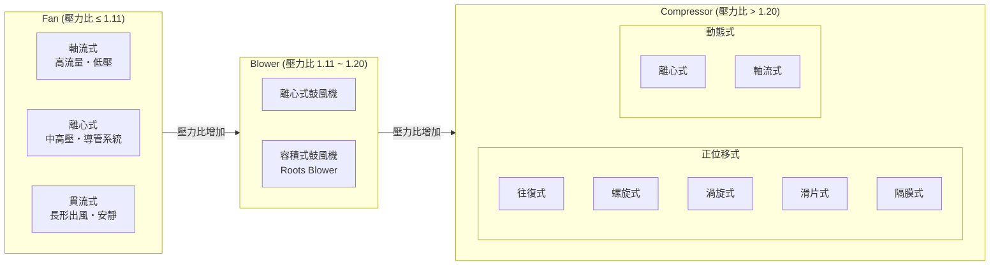

# Fan、Blower、Compressor 工程特性比較

## 前言

Fan（風扇）、Blower（鼓風機）、Compressor（壓縮機）三者皆屬於流體機械，透過葉輪或活塞等機構對氣體作功。三者最根本的區別在於**壓力比（Pressure Ratio）** 的範圍，這決定了各自的設計哲學、熱力學行為與應用場景。

---

## 1. 核心分類：壓力比

美國機械工程師學會（ASME）以壓力比（排放壓力 ÷ 吸入壓力，P₂/P₁）為界，定義三者邊界[^asme]：

| 設備 | 壓力比 (P₂/P₁) | 壓力升 (mm H₂O) | 壓力升 (Pa) |
|------|----------------|-----------------|-------------|
| **Fan** | ≤ **1.11** | ≤ 1,136 | ≤ ~11,140 |
| **Blower** | **1.11 ~ 1.20** | 1,136 ~ 2,066 | ~11,140 ~ 20,270 |
| **Compressor** | **> 1.20** | > 2,066 | > ~20,270 |

> Fan 的題升壓範圍通常在 0.013 ~ 0.2 atm 之間[^fan]。

[^asme]: ASME Performance Testing Code，轉引自《Centrifugal Fan》維基百科條目。Retrieved 2026-09-25, from https://en.wikipedia.org/wiki/Centrifugal_fan

[^fan]: Fan (machine). (n.d.). Retrieved 2026-09-25, from https://en.wikipedia.org/wiki/Fan_(machine)

---

## 2. 工作原理

### 2.1 Fan

Fan 屬於**定容設備（constant-volume device）**——轉速固定時，無論氣體密度如何變化，輸送的體積流量保持不變[^fan]。

依氣流方向分為三大類：

#### 軸流式 Fan（Axial Fan）

- 氣流平行於旋轉軸流入與流出
- 典型葉輪直徑範圍：300 ~ 400 mm（小型）或 1,800 ~ 2,000 mm（大型）[^fan]
- 最大壓力約 800 Pa
- 噪音與轉速的**五次方**成正比
- **適用場景**：低系統阻力、高流量需求（電腦散熱風扇、天花板風扇、電子設備散熱、冷凝器散熱）
- **限制**：導管長度 > 3 ~ 4 公尺時性能明顯衰減

#### 離心式 Fan（Centrifugal Fan / Squirrel Cage Fan）

- 氣流從軸向進入葉輪中心，經離心力作用轉 90° 徑向排出
- 比軸流式能克服更高系統阻力（導管、濾網、風門）
- 葉片類型決定特性[^centrifugal]：

| 葉片類型 | 壓力 | 效率 | 適用 |
|---------|------|------|------|
| 前彎式（Forward-curved） | 高 | 較低 | 空調箱、風機盤管（僅乾淨空氣） |
| 後彎式（Backward-curved） | 中高 | 最高 | 空調送風機 |
| 直徑向（Straight radial） | 高 | 低 | 含塵氣體（吸塵器、氣力輸送）；噪音最大 |

[^centrifugal]: Centrifugal fan. (n.d.). Retrieved 2026-09-25, from https://en.wikipedia.org/wiki/Centrifugal_fan

#### 貫流式 Fan（Cross-Flow / Tangential Fan）

- 氣流徑向穿過葉輪，產生寬而扁的排氣面
- 利用**偏心渦流**——僅部分葉輪葉片實際作功
- **優勢**：結構緊湊、安靜、可做成長條形、高壓力係數
- **應用**：分離式空調室內機、空氣簾、直立式風扇、影印機烘乾[^centrifugal]

### 2.2 Blower

Blower 在台灣常稱為**鼓風機**，處於 Fan 與 Compressor 的中間地帶。依結構分為：

#### 離心式鼓風機

工作原理與離心式 Fan 相同，但在更高的壓力比下運行。常見於 HVAC 空調箱、吹葉機、吹風機、氣墊床充氣[^centrifugal]。

#### 容積式鼓風機（Positive Displacement Blower）

最著名的是 **Roots Blower**（羅茨鼓風機）：
- 一對嚙合葉輪反向旋轉，將氣體從入口推移至出口
- 出口壓力由系統背壓決定，而非葉輪設計
- **應用**：汙水處理曝氣池、工業真空系統、氣力輸送

### 2.3 Compressor

Compressor 的核心特徵是**氣體密度發生顯著變化**，體積被壓縮、溫度大幅升高，常需級間冷卻（intercooling）。可分為兩大類[^compressor]：

[^compressor]: Compressor. (n.d.). Retrieved 2026-09-25, from https://en.wikipedia.org/wiki/Compressor

#### A. 正位移式（Positive Displacement）

| 類型 | 壓力範圍 | 流量 | 效率 | 關鍵應用 |
|------|---------|------|------|---------|
| 往復式（Piston） | 單級至多級，可達 **>124 MPa** | 低〜中 | 多級雙動設計效率最高 | 汽車維修、工業、潛水氣瓶、石油 |
| 螺旋式（Rotary Screw） | 最高 8.3 MPa（1,200 psi） | 中〜高 | 高（零件少、震動小） | 連續工業運轉、冷凍空調 |
| 滑片式（Rotary Vane） | 單級最高 1.3 MPa | 低〜中 | 機械效率 ~90% | 散裝物料輸送、真空泵 |
| 渦旋式（Scroll） | 低〜中壓 | 低 | 容積效率極高（零間隙容積） | 家用/商用空調、冷凍（平穩安靜） |
| 隔膜式（Diaphragm） | 高（如 41 MPa） | 極低（mL） | 氣體純度佳 | 氫氣、CNG、特殊氣體、實驗室 |

#### B. 動態式（Dynamic / Continuous Flow）

##### 離心式壓縮機（Centrifugal Compressor）

- 氣體軸向進入葉輪，被加速至接近音速後徑向排出，經擴散器（diffuser）將動能轉換為靜壓[^centrifugal_comp]
- 功率範圍：75 kW 至數萬 kW
- 多級可達 >6.9 MPa（1,000 psi）
- 部分負載效率高；可無油運轉（磁浮/空氣軸承）
- **優點**：同容量下比往復式輕 90%、小 50%，震動極小，可靠
- **缺點**：初始成本高、需精密 CNC 加工、小規模不經濟、有**喘振（surging）**風險（流量逆向造成軸承損壞）
- **應用**：煉油廠、石化、天然氣處理、大型冷凍、渦輪增壓器、造雪機

[^centrifugal_comp]: Centrifugal compressor. (n.d.). Retrieved 2026-09-25, from https://en.wikipedia.org/wiki/Centrifugal_compressor

##### 軸流式壓縮機（Axial Compressor）

- 交替排列的旋轉葉片（rotor）與靜止導葉（stator）逐級壓縮氣體；轉子加速流體，靜葉減速並導向下一級[^axial_comp]
- 每級壓力比：
  - 工業級（次音速）：1.05 ~ 1.28
  - 航太級（穿音速）：1.15 ~ 1.6
  - 研究級（超音速）：1.8 ~ 2.2
- 整體多變效率（polytropic efficiency）~90%
- 質量流量極高（相對於截面積）
- **不穩定現象**：旋轉失速（rotating stall）與喘振（surge）
- **應用**：噴射引擎、燃氣渦輪發電、天然氣管線增壓、高爐送風、大型空分設備

[^axial_comp]: Axial compressor. (n.d.). Retrieved 2026-09-25, from https://en.wikipedia.org/wiki/Axial_compressor

---

## 3. 離心式 vs 軸流式：直接對比

| 參數 | 離心式 | 軸流式 |
|------|--------|--------|
| 氣流路徑 | 徑向（90° 轉彎） | 軸向（直通） |
| 每級壓力升 | 較高（少級數即可達高壓比） | 較低（需多級才能達高壓比） |
| 流量（同截面） | 較低 | 較高 |
| 效率 | 良好；後彎葉片最佳 | 極高（工業級 ~90~92%） |
| 最佳場景 | 高壓、低流量、有導管系統 | 高流量、低壓、低阻力系統 |
| 結構複雜度 | 簡單、級數少 | 複雜、需多級 |
| Fan 典型應用 | HVAC 空調箱、吸塵器、工業排氣 | 冷卻水塔、電子散熱、室內循環 |
| Compressor 典型應用 | 渦輪增壓器、冷凍、天然氣處理 | 噴射引擎、燃氣渦輪、大型鼓風機 |

---

## 4. 關鍵工程區別總表

| 面向 | Fan | Blower | Compressor |
|------|-----|--------|------------|
| **主要功能** | 大流量、低壓送風 | 中壓送氣 | 高壓縮氣體（體積減小） |
| **密度變化** | 可忽略（常假設不可壓縮） | 小但不可忽略 | 顯著（體積大幅縮小） |
| **熱力學** | 單純動量傳遞，無明顯溫升 | 些微溫升 | 大幅溫升，需級間冷卻 |
| **壓力比** | < 1.11 | 1.11 ~ 1.20 | > 1.20 |
| **常見驅動** | 電動機直驅（蔽極、BLDC、感應） | 直驅或皮帶驅動 | 電動機、蒸汽渦輪、燃氣渦輪、內燃機 |
| **標準規範** | ASME PTC 11、AMCA 210 | ASME PTC | ASME PTC、API 標準 |
| **葉片負載** | 輕（薄片、塑料） | 中 | 重（翼型、高強度材料） |
| **喘振風險** | 無 | 低 | 高（離心式與軸流式皆有） |

---

## 5. 典型應用矩陣

### Fan

- HVAC 與個人降溫（天花板扇、桌扇、地扇）
- 電子散熱（電腦風扇、筆電散熱座）
- 汽車水箱散熱
- 家用通風（浴室/廚房排氣扇）
- 工業通風與冷卻水塔
- 煙霧排放、乾燥、風選

### Blower

- 離心式：HVAC 空調箱、吹葉機、吹風機、空氣床墊充氣、氣力輸送
- 容積式（Roots）：汙水曝氣、工業真空、氣力輸送

### Compressor

- 往復式：汽車保養廠、冷凍冷藏、氣體儲存（潛水氣瓶、CNG）
- 螺旋式：工業製造、大型冷凍、礦業
- 離心式：油氣、石化、渦輪增壓器、大型空調冰水機、造雪機
- 軸流式：噴射引擎、發電燃氣渦輪、高爐送風、大型空分
- 渦旋式：住家/商用空調、冷凍
- 隔膜式：特殊清淨氣體（氫氣、呼吸用空氣）

---

## 6. Mermaid 示意圖

---

## 7. 總結

Fan、Blower、Compressor 構成一條以壓力比為刻度的連續譜系：

1. **Fan** 著重於**大流量**搬運空氣，壓力極低，密度變化可忽略，結構最簡單、成本最低
2. **Blower** 承擔**中等壓力**的送氣任務，常作為 Fan 與 Compressor 之間的過渡選擇
3. **Compressor** 負責**將氣體壓縮至高壓**，須處理密度變化、溫度升高與喘振等複雜熱力學與穩定性問題

選擇順序為：先確認所需壓力比落在哪個區間，再根據流量需求與系統阻力特性決定採用離心式或軸流式架構，最後考慮葉片型式、驅動方式與級數配置。