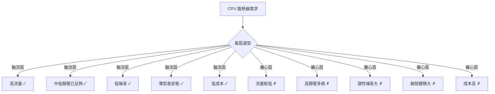

# CPU 散熱器為何採用軸流扇而非離心扇（Blower）？——工程取捨分析

## 問題背景

常見的疑問：「離心扇（Centrifugal Fan / Blower / 渦輪扇）在工程上不是具有更高的流量嗎？為什麼 CPU 散熱器不考慮使用？」這份報告從流體力學、聲學、機構設計、成本等面向，分析兩種風扇在 CPU 散熱場景下的工程取捨。

## 核心迷思澄清：離心扇的流量並非更高

首先要釐清一個常見誤解：**離心扇的「流量」實際上低於同尺寸的軸流扇**。離心扇真正的優勢是 **較高的靜壓（Static Pressure）**，而非較高的流量（CFM, Cubic Feet per Minute）。

> 離心扇能在較小的風扇封裝中提供相近的送風量，並克服比同尺寸軸流扇更高的流道阻力。[^wiki-centrifugal]

典型 120mm 軸流扇的流量約為 50–100+ CFM，而同尺寸離心扇僅約 10–30 CFM。離心扇的高靜壓能力來自其設計原理：空氣經由葉輪旋轉產生離心力，徑向加速後再經 90° 轉向排出，此過程在蝸殼（Volute Casing）內累積壓力。[^wiki-centrifugal]

## 各項工程因素的詳細比較

### 1. 流量（Airflow）——軸流扇勝

軸流扇天生擅長在低阻力環境下推動大量空氣。CPU 塔式散熱器的鰭片陣列相對開放、流阻不高，恰好是軸流扇的高效工作區間。軸流扇的葉片直接將空氣沿軸向推進，沒有彎折損失，流量表現遠優於離心扇。

### 2. 靜壓（Static Pressure）——離心扇勝

離心扇能產生遠高於同尺寸軸流扇的靜壓。這在極高密度的鰭片（High FPI, Fins Per Inch）或受限流道中至關重要。然而，多數 CPU 空冷散熱器的鰭片密度設計並非極端，普通軸流扇已足以克服其流阻。只有在高階水冷排（Radiator）這類高密度鰭片場景才需要高靜壓扇——而這些產品通常仍是特殊葉片設計的軸流扇（如「靜壓扇」系列），而非離心扇。

### 3. 噪音——軸流扇勝

離心扇在同等流量下噪音顯著更大，原因包括：

- **調性噪音（Tonal Noise）**：離心扇葉輪葉片經過蝸舌（Cutoff / Volute Tongue）時產生特定頻率的尖嘯聲，類似警笛效應。
- **較高轉速**：為達到相同流量，離心扇必須轉得更快。
- **湍流損失**：空氣在蝸殼內 90° 轉向造成額外湍流噪音。

軸流扇的噪音為寬頻白噪音，人耳感知上更為柔和。這也是靜音 PC 玩家偏好大型、低轉速軸流扇的主因。

### 4. 尺寸與機構——軸流扇勝

軸流扇本體扁平（標準 120mm 風扇厚度僅 25mm），可直接安裝在散熱器側面或上方，也支援雙扇推拉（Push/Pull）配置。

離心扇需要蝸殼（Scroll Casing）包覆，體積明顯更大且厚。這個蝸殼使其在 CPU 散熱器側面安裝極為困難，但其自身即為導風道，不需額外風管。[^engineering-toolbox]

### 5. 效率——視流阻而定

軸流扇在低阻抗場景下效率較高——恰好符合 CPU 散熱器的操作點。離心扇則在高阻抗場景下效率較高——這也是為何 GPU 採用離心扇將熱空氣直接排出機箱。[^alfa-fans]

### 6. 成本——軸流扇壓倒性勝出

軸流扇結構簡單（輪轂 + 葉片，無需外殼），可透過塑膠射出大量生產。一顆入門級 120mm 軸流扇成本約 NT$150–500。同等級的離心扇因複雜的蝸殼與較嚴格的公差，成本顯著更高。

## 離心扇在 PC 中的應用場景

離心扇並未完全缺席 PC 領域，而是在特定場景中扮演關鍵角色：

| 應用 | 使用離心扇的原因 |
|---|---|
| **GPU 鼓風扇（Blower Style）** | 將熱空氣直接導出機箱外；可在 2-slot 寬度內安裝；克服狹窄排氣路徑的高阻抗 |
| **筆記型電腦散熱** | 極度薄型化限制；離心扇從鍵盤/底面吸風後從側面排出 |
| **1U/2U 伺服器散熱器** | 高度極度受限；需克服密集伺服器佈局的高流阻 |
| **Mini-ITX 小機殼** | 空間極度有限，風扇本身同時作為導風道 |

## 總結

CPU 散熱器採用軸流扇是設計需求與風扇特性完美匹配的結果：開放鰭片陣列需要**高流量、中低靜壓、低噪音、低成本、薄型可側裝**的風扇，軸流扇在每一項都勝出。離心扇的流量實際上低於軸流扇——這正是最常見的認知落差所在——其高靜壓優勢在 CPU 散熱場景中並非必要，卻要付出噪音、體積與成本的代價。

---

[^wiki-centrifugal]: Wikipedia. (2026). Centrifugal fan. Retrieved 2026-09-25, from https://en.wikipedia.org/wiki/Centrifugal_fan

[^engineering-toolbox]: Engineering Toolbox. (n.d.). Fan Types — Axial and Centrifugal. Retrieved 2026-09-25, from https://www.engineeringtoolbox.com/fan-types-d_142.html

[^alfa-fans]: Alfa Fans. (n.d.). The Difference Between Centrifugal Fans vs Axial Fans. Retrieved 2026-09-25, from https://www.alfafans.com/the-difference-between-centrifugal-fans-vs-axial-fans