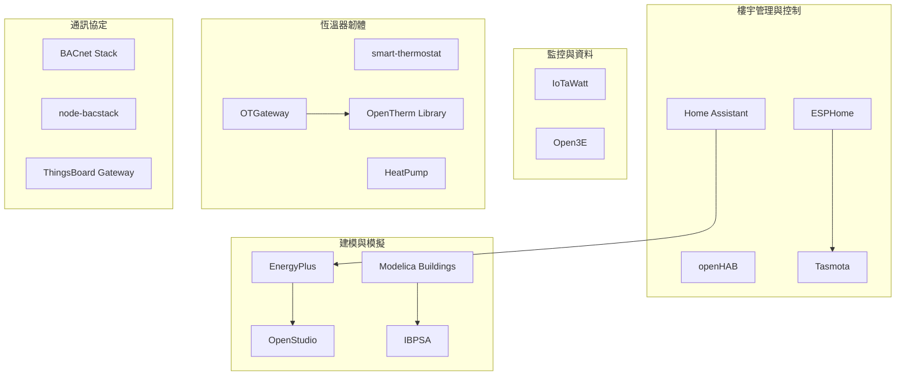

# 開源 HVAC/MVAC 專案綜合調查報告

## 概述

本報告系統性地調查了開源 HVAC（暖通空調）與 MVAC（機械通風與空調）領域的相關開源專案，涵蓋樓宇管理系統（BMS）、控制演算法、監控平台、恆溫器韌體、建模與模擬工具、BACnet 通訊協定實作以及硬體方案等類別。目標是提供一份全面的參考目錄，供選型與整合參考。

---

## 1. 樓宇管理系統（BMS）與 HVAC 控制平台

### 1.1 Home Assistant

- **描述**：領先的開源家庭自動化平台，擁有成熟的 HVAC/氣候控制生態系。內建 Climate 元件、通用恆溫器、MQTT HVAC 整合，並可透過第三方插件擴充（如 Better Thermostat、Versatile Thermostat、Midea Air Appliances LAN 等），足以作為功能完整的樓宇管理系統使用。[^ha-core]
- **語言**：Python（核心），YAML（設定）
- **授權**：Apache-2.0
- **倉庫**：https://github.com/home-assistant/core
- **星數**：91.2k ⭐
- **活躍度**：**非常活躍** — 超過 117,000 次提交，每日發布，大型社群（1.4k 關注者、38.8k 分支）

### 1.2 openHAB

- **描述**：成熟的開源家庭自動化平台，擁有豐富的 HVAC 綁定（Bindings）生態系。支援透過 Modbus、KNX、BACnet、MQTT、Z-Wave、Zigbee 等協定進行 HVAC 控制。[^oh-core] [^oh-addons]
- **語言**：Java（核心 + 綁定）
- **授權**：EPL-2.0
- **倉庫**：https://github.com/openhab/openhab-core / https://github.com/openhab/openhab-addons
- **星數**：核心 1.1k ⭐ / 插件 2.1k ⭐
- **活躍度**：**非常活躍**

### 1.3 ESPHome

- **描述**：可透過簡單 YAML 設定檔控制 ESP32/ESP8266 等微控制器的系統。內建 climate 元件，支援自訂恆溫器邏輯、HVAC 模式與 PID 控制器，廣泛用於 DIY HVAC/恆溫器專案。[^esphome]
- **語言**：Python（核心），C++（韌體）
- **授權**：GPL-3.0
- **倉庫**：https://github.com/esphome/esphome
- **星數**：11.7k ⭐
- **活躍度**：**非常活躍**

### 1.4 Tasmota

- **描述**：針對 ESP8266/ESP32 系列的高度功能豐富替代韌體。內建恆溫器驅動程式，支援 OpenTherm（鍋爐通訊協定）、三菱電機 HVAC 串列介面（`USE_MIEL_HVAC`）、Modbus 橋接與 KNX。[^tasmota]
- **語言**：C/C++
- **授權**：GPL-3.0
- **倉庫**：https://github.com/arendst/Tasmota
- **星數**：24.8k ⭐
- **活躍度**：**非常活躍**

---

## 2. HVAC 控制演算法

### 2.1 Home Climate Control (dz)

- **描述**：「開源多區域溫度與氣候控制系統」。使用 Java 與 MQTT，支援 Raspberry Pi，實現多區域 PID 控制邏輯。[^hcc-dz]
- **語言**：Java
- **倉庫**：https://github.com/home-climate-control/dz
- **星數**：66 ⭐
- **活躍度**：低活躍

### 2.2 energym (MPC for Building Climate)

- **描述**：基於 OpenAI Gym 風格的建築模擬函式庫（Python），專門用於測試氣候控制與能源管理策略，包含模型預測控制（MPC）的測試環境。[^energym]
- **語言**：Python
- **倉庫**：https://github.com/bsl546/energym
- **星數**：88 ⭐

---

## 3. HVAC 監控平台

### 3.1 IoTaWatt

- **描述**：開源 WiFi 電能監測器，可監測 HVAC 能耗。使用 ESP8266 + MCP3208 ADC，支援多種比流器，準確度通常在 1% 以內。可上傳資料至 InfluxDB、PVOutput 等。[^iotawatt]
- **語言**：C/C++
- **授權**：GPL-3.0
- **倉庫**：https://github.com/boblemaire/IoTaWatt
- **星數**：732 ⭐
- **活躍度**：中等活躍

### 3.2 Open3E

- **描述**：連接 Viessmann E3 裝置（Vitocal 熱泵、Vitodens 鍋爐等）的 CAN/DoIP 介面。讀取數百個資料點並透過 MQTT 發布，可與 Home Assistant 整合。[^open3e]
- **語言**：Python
- **授權**：Apache-2.0
- **倉庫**：https://github.com/open3e/open3e
- **星數**：211 ⭐
- **活躍度**：**非常活躍** — 最新 v0.7.7（2026-08-25）

---

## 4. 開源恆溫器韌體/軟體

### 4.1 smart-thermostat

- **描述**：完整的開源 ESP32 恆溫器專案，包含客製 PCB 設計。功能：MQTT/Home Assistant 整合、觸控螢幕（LVGL UI）、LD2410 微波存在感測、24VAC 電源、AHT20 溫濕度感測、Matter 協定（規劃中）。[^smart-thermo]
- **語言**：C（ESP-IDF/Arduino）
- **授權**：GPL-3.0
- **倉庫**：https://github.com/smeisner/smart-thermostat
- **星數**：127 ⭐

### 4.2 HeatPump (SwiCago)

- **描述**：用於控制三菱電機熱泵的 Arduino 函式庫（透過 cn105 連接器），支援廣泛使用的 MVAC 機組。[^heatpump]
- **語言**：C++
- **倉庫**：https://github.com/SwiCago/HeatPump
- **星數**：1k ⭐

### 4.3 OTGateway

- **描述**：用於控制 OpenTherm 相容鍋爐的開源解決方案（ESP32/ESP8266），將暖氣系統升級為智慧控制。[^otgateway]
- **語言**：C/C++
- **倉庫**：https://github.com/Laxilef/OTGateway
- **星數**：457 ⭐

### 4.4 OpenTherm Library

- **描述**：Arduino/ESP8266/ESP32 適用的 OpenTherm 函式庫，實現 HVAC 控制通訊協定。[^otlibrary]
- **語言**：C/C++
- **倉庫**：https://github.com/ihormelnyk/opentherm_library
- **星數**：287 ⭐

---

## 5. HVAC 模擬與建模工具

### 5.1 EnergyPlus

- **描述**：由美國能源部（NREL）開發的旗艦級開源建築能耗模擬引擎，對 HVAC 系統（含 MVAC）進行詳細建模，每年兩次正式發布。提供 C 與 Python API。[^energyplus]
- **語言**：C++，Python（API/腳本）
- **授權**：BSD-3-Clause
- **倉庫**：https://github.com/NREL/EnergyPlus
- **星數**：1.6k ⭐
- **活躍度**：**非常活躍**

### 5.2 OpenStudio

- **描述**：NREL 開發的跨平台工具套件，支援以 EnergyPlus 進行建築能耗建模，以 Radiance 進行採光分析。SDK 支援 C++、Ruby、Python 與 C#。[^openstudio]
- **語言**：C++，Ruby，Python，C#
- **授權**：BSD-3-Clause
- **倉庫**：https://github.com/NREL/OpenStudio
- **星數**：647 ⭐
- **活躍度**：活躍

### 5.3 Modelica Buildings Library (LBNL)

- **描述**：勞倫斯伯克利國家實驗室開發的開源 Modelica 函式庫，包含建築能耗與控制系統的動態模擬模型。涵蓋 HVAC 系統、儲能、控制（ASHRAE 標準 231P 參考實作）、外殼傳熱、多區氣流（含自然通風）以及與 EnergyPlus 的執行時耦合（Spawn of EnergyPlus）。[^modelica-buildings]
- **語言**：Modelica
- **授權**：BSD-3-Clause
- **倉庫**：https://github.com/lbl-srg/modelica-buildings
- **最新版本**：v13.0.0（2026-05-04）
- **活躍度**：**非常活躍**

### 5.4 Modelica IBPSA Library

- **描述**：由國際建築性能模擬協會（IBPSA）開發的基礎 Modelica 函式庫，作為 AixLib（亞琛工大）、Buildings（LBNL）、IDEAS（魯汶大學）等庫的核心基礎。[^ibpsa]
- **語言**：Modelica
- **授權**：BSD-3-Clause
- **倉庫**：https://github.com/ibpsa/modelica-ibpsa
- **星數**：175 ⭐
- **活躍度**：活躍

---

## 6. BACnet 開源實作

### 6.1 BACnet Stack

- **描述**：最廣泛使用的開源 BACnet 協定棧（C 函式庫），提供 BACnet 應用層、網路層與 MAC 層服務。最初由 Steve Karg 開發。[^bacnet-stack]
- **語言**：C
- **倉庫**：https://github.com/bacnet-stack/bacnet-stack
- **星數**：597 ⭐
- **活躍度**：**非常活躍**

### 6.2 node-bacstack

- **描述**：純 JavaScript 實作的 BACnet 協定棧，適用於 Node.js。[^node-bacstack]
- **語言**：JavaScript/TypeScript
- **倉庫**：https://github.com/fh1ch/node-bacstack
- **星數**：190 ⭐

### 6.3 ThingsBoard Gateway

- **描述**：IoT 閘道器，支援 BACnet、Modbus、CAN bus、OPC-UA 等協定，可用於大規模 HVAC 資料收集與控制。[^thingsboard]
- **語言**：Python
- **倉庫**：https://github.com/thingsboard/thingsboard-gateway
- **星數**：2.2k ⭐

---

## 7. 專用 HVAC 品牌整合方案

| 專案 | 目標品牌/協定 | 語言 | 星數 | 倉庫 |
|---|---|---|---|---|
| P1P2MQTT | Daikin/Rotex Altherma 熱泵 | Python | 493 ⭐ | [連結](https://github.com/Arnold-n/P1P2MQTT) |
| esphome-econet | Rheem HVAC/熱水器 | C++ | 357 ⭐ | [連結](https://github.com/esphome-econet/esphome-econet) |
| esphome-samsung-hvac-bus | Samsung HVAC | C++ | 310 ⭐ | [連結](https://github.com/omerfaruk-aran/esphome_samsung_hvac_bus) |
| esphome-aux-ac-component | AUX 空調 | C++ | 374 ⭐ | [連結](https://github.com/GrKoR/esphome_aux_ac_component) |
| gree-hvac-mqtt-bridge | Gree 智慧空調 | Python | 164 ⭐ | [連結](https://github.com/arthurkrupa/gree-hvac-mqtt-bridge) |
| BSB-LAN | Siemens 控制器 | C/C++ | 340 ⭐ | [連結](https://github.com/fredlcore/BSB-LAN) |
| HVAC-IR-Control | Mitsubishi/Panasonic（紅外線） | C++ | 270 ⭐ | [連結](https://github.com/r45635/HVAC-IR-Control) |

---

## 8. 分類匯總

---

## 9. 選型建議

| 使用場景 | 推薦專案 | 理由 |
|---|---|---|
| 居家/小型建築 HVAC 控制 | Home Assistant + ESPHome | 社群最大、整合最豐富、學習曲線較低 |
| 大型建築 BMS | openHAB + BACnet Stack | 支援 BACnet/KNX/Modbus 等工業協定 |
| DIY 恆溫器硬體 | smart-thermostat + ESPHome Climate | 完整 PCB 設計檔 + 彈性韌體框架 |
| 學術模擬與設計 | EnergyPlus + Modelica Buildings | DOE 標準工具、學術界廣泛採用 |
| 熱泵/VRF 控制 | SwiCago HeatPump + Open3E | 專門支援三菱、Viessmann 等高階設備 |
| BACnet 整合 | BACnet Stack + ThingsBoard Gateway | 最成熟的 C 函式庫 + 工業級 IoT 閘道器 |

---

## 10. 來源反思與限制

本次調查基於 GitHub 公開倉庫資料與網路搜尋結果，涵蓋範圍以英語開源社群為主。部分專案的實際成熟度需透過部署驗證，星數與提交次數僅供初步參考。部分亞洲常見 HVAC 品牌（如日立、大金部分型號、本土品牌）的開源方案較少，可能需要透過通用協定（Modbus、BACnet）整合。建議在選型前確認目標設備支援的通訊協定。

---

[^ha-core]: Home Assistant. (n.d.). Home Assistant Core. Retrieved 2026-09-25, from https://github.com/home-assistant/core
[^oh-core]: openHAB Foundation. (n.d.). openHAB Core. Retrieved 2026-09-25, from https://github.com/openhab/openhab-core
[^oh-addons]: openHAB Foundation. (n.d.). openHAB Add-ons. Retrieved 2026-09-25, from https://github.com/openhab/openhab-addons
[^esphome]: ESPHome. (n.d.). ESPHome. Retrieved 2026-09-25, from https://github.com/esphome/esphome
[^tasmota]: Arends, T. (n.d.). Tasmota. Retrieved 2026-09-25, from https://github.com/arendst/Tasmota
[^hcc-dz]: Home Climate Control. (n.d.). dz. Retrieved 2026-09-25, from https://github.com/home-climate-control/dz
[^energym]: bsl546. (n.d.). energym. Retrieved 2026-09-25, from https://github.com/bsl546/energym
[^iotawatt]: lemaire, B. (n.d.). IoTaWatt. Retrieved 2026-09-25, from https://github.com/boblemaire/IoTaWatt
[^open3e]: Open3E Contributors. (n.d.). Open3E. Retrieved 2026-09-25, from https://github.com/open3e/open3e
[^smart-thermo]: smeisner. (n.d.). smart-thermostat. Retrieved 2026-09-25, from https://github.com/smeisner/smart-thermostat
[^heatpump]: SwiCago. (n.d.). HeatPump. Retrieved 2026-09-25, from https://github.com/SwiCago/HeatPump
[^otgateway]: Laxilef. (n.d.). OTGateway. Retrieved 2026-09-25, from https://github.com/Laxilef/OTGateway
[^otlibrary]: melnyk, I. (n.d.). OpenTherm Library. Retrieved 2026-09-25, from https://github.com/ihormelnyk/opentherm_library
[^energyplus]: National Renewable Energy Laboratory. (n.d.). EnergyPlus. Retrieved 2026-09-25, from https://github.com/NREL/EnergyPlus
[^openstudio]: National Renewable Energy Laboratory. (n.d.). OpenStudio. Retrieved 2026-09-25, from https://github.com/NREL/OpenStudio
[^modelica-buildings]: Lawrence Berkeley National Laboratory. (n.d.). Modelica Buildings Library. Retrieved 2026-09-25, from https://github.com/lbl-srg/modelica-buildings
[^ibpsa]: IBPSA. (n.d.). Modelica IBPSA Library. Retrieved 2026-09-25, from https://github.com/ibpsa/modelica-ibpsa
[^bacnet-stack]: BACnet Stack Contributors. (n.d.). BACnet Stack. Retrieved 2026-09-25, from https://github.com/bacnet-stack/bacnet-stack
[^node-bacstack]: fh1ch. (n.d.). node-bacstack. Retrieved 2026-09-25, from https://github.com/fh1ch/node-bacstack
[^thingsboard]: ThingsBoard. (n.d.). ThingsBoard Gateway. Retrieved 2026-09-25, from https://github.com/thingsboard/thingsboard-gateway