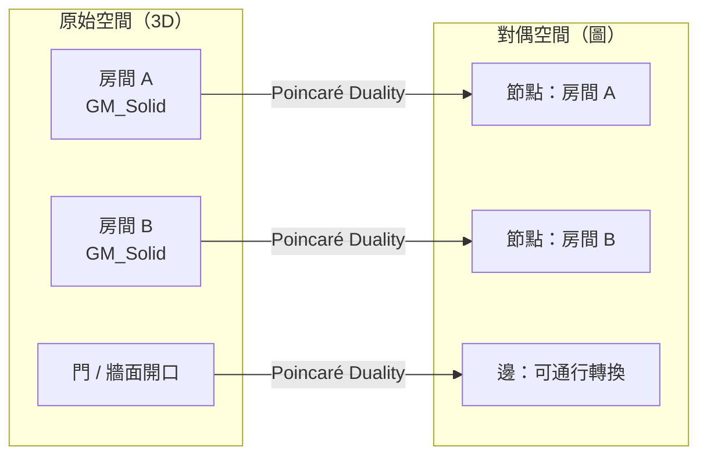

# IndoorGML 高度概念與四軸飛行器導航適用性分析

## 摘要

IndoorGML 是 OGC（Open Geospatial Consortium）制定的室內空間資料標準，專注於室內空間的拓撲關係與導航網絡。本文探討 IndoorGML 是否具備「高度」概念，以及該標準是否足夠支撐室內四軸飛行器（drone/UAV）的導航建模需求。研究發現 IndoorGML 確實**間接支援三維空間表達**（透過 ISO 19107 的 `GM_Solid` 幾何型別），但核心的導航模型——節點關係圖（Node-Relation Graph, NRG）——本質上將三維體積降維為二維的節點與邊，缺乏對自由立體空間及垂直維度路徑的完整描述。學術研究明確指出 IndoorGML 對室內飛行器導航存在根本性限制，需結合 BIM/IFC、CityGML 或立體網格（voxel/grid）方法補足。

---

## 1. IndoorGML 簡介

IndoorGML 是由 OGC 制定的室內空間資料交換標準，目前版本為 2.0[^ogc-standard]。不同於 CityGML 專注於建築的詳細三維幾何與外觀，IndoorGML 的**核心設計目標是室內空間的語意與拓撲關係**，尤其是導航應用所需的空間連通性。

其基礎概念是「細胞空間模型（Cellular Space Model）」：將室內空間分割為一組不重疊的**細胞（Cell）**，每個細胞代表一個語意上獨立的空間單元（如房間、走廊、樓梯間），細胞之間透過共享邊界建立相鄰與連通關係[^ogc-2.0-core]。

---

## 2. IndoorGML 對高度的支援機制

IndoorGML 雖然不是以三維幾何建模為主要目標，但透過以下四種機制間接或直接地處理高度／垂直維度。

### 2.1 可選的三維幾何（Option 1：內嵌幾何）

IndoorGML 允許在細胞（`CellSpace`）中內嵌幾何表示，且標準明確表示支援二維或三維歐幾里得空間[^ogc-2.0-geometry]：

> *"Cell geometry is defined in 2-dimensional or 3-dimensional Euclidean space... as defined in ISO 19107 this is a GM_Solid in 3D space and GM_Surface in 2D space."*

這表示若資料提供者選擇內嵌幾何，可以使用 `GM_Solid`（立體）完整表達包含 x、y、z 座標的三維體積，從而在該細胞內蘊含高度資訊。

### 2.2 外部參考（Option 2：External Reference）

若選擇不內嵌幾何，IndoorGML 可透過外部參考機制連結至 CityGML、IFC 等包含完整三維建築模型的資料集，間接繼承高度資訊[^ogc-2.0-external]。

### 2.3 多層空間模型（Multi-Layered Space Model, MLSM）

MLSM 允許同一建築物以不同主題切割為多個空間層（Space Layer），層與層之間透過 `InterLayerConnection` 連結。不同樓層可建模為不同 Space Layer，在概念上支援垂直維度的多層管理[^ogc-2.0-mlsm]。

### 2.4 樓層延伸（Storey Extension）

IndoorGML 1.0.3 提供非官方的 `indoorgmlstoreyextension.xsd`，為 `CellSpace` 增加 `storey` 屬性，使空間細胞可標記所屬樓層[^storey-extension]。IndoorGML 2.0 亦已將樓層資訊列為 `CellSpace` 的官方屬性[^indoorgml-net]。

### 2.5 垂直連接器（Vertical Connectors）

IndoorGML 規範明確指出室內空間具有多樓層特性，並將樓梯、電梯、手扶梯、坡道列為**垂直連接器（vertical connectors）**[^ogc-2.0-vertical]。這些連接器在節點關係圖中表現為 `Transition` 邊，允許路徑計算跨越不同樓層。

---

## 3. 核心限制：節點關係圖的二維抽象

IndoorGML 的導航能力建立在**龐加萊對偶（Poincaré Duality）**之上：

這個過程將三維立體體積（房間）映射為零維節點，將共享的平面邊界（門、牆）映射為一維邊。其結果——節點關係圖——本質上是一個**二維拓撲圖**，雖然能表達「房間 A 到房間 B 是否連通」，但**無法描述在一個開放空間內部的連續三維軌跡**。

---

## 4. 四軸飛行器導航適用性分析

IndoorGML 2.0 確實提及飛行作為一種移動模式（locomotion mode），Figure 7 展示了選擇適合飛行的 `CellSpace` 的情境[^ogc-2.0-flying]。但這僅是概念層級，並未提供足夠的資料模型來支撐實際飛行導航。

### 4.1 學術研究結論

針對 IndoorGML 應用於室內無人機導航的研究明確指出根本性缺陷[^book-vertical-lack]：

> *"it lacks the spatial description of the vertical dimension, which cannot meet the needs of the navigation application of an indoor drone."*

OGC IndoorGML: A Standard Approach for Indoor Maps 一書在探討導航應用時，明確指出了室內三維空間在垂直維度上的描述不足。

### 4.2 限制總表

| 面向 | IndoorGML 支援程度 | 對四軸飛行器的限制 |
|------|------------------|------------------|
| 三維立體幾何（GM_Solid） | ✅ 可選支援 | 細胞為房間尺度體積，無法描述內部自由立體空間 |
| 樓層間垂直連通 | ✅ 支援（樓梯、電梯） | 僅限樓層之間的離散轉換，非連續三維路徑 |
| 飛行移動模式識別 | ⚠️ 概念提及 | 無對應的資料模型或空間原語 |
| 導航圖（NRG） | ✅ 核心功能 | 將三維空間降維至節點與邊，遺失內部高度資訊 |
| 垂直維度空間描述 | ❌ 缺乏 | 學術研究明確指出為根本限制 |
| 障礙物表達 | ❌ 缺乏 | 無家具、管線、天花板等障礙物模型 |
| 連續三維軌跡規劃 | ❌ 缺乏 | 圖形結構不支援空間連續路徑 |
| 天花板高度／淨空 | ❌ 缺乏 | 非標準原生屬性 |
| 動態路徑規劃 | ❌ 缺乏 | 靜態空間表達，不支援即時避障 |

### 4.3 現有替代方案

針對室內四軸飛行器的導航，學術界與實務界傾向採用以下策略：

1. **BIM/IFC + 體素網格（Voxel Grid）**：以 IFC 模型為基礎，將三維空間離散化為規則網格，在其中進行路徑搜尋與避障規劃[^bim-drone]
2. **CityGML LOD4**：提供完整的三維建築內部幾何，可擴展支援飛行器導航
3. **三維網格優化演算法**：結合網格空間分割與最佳化搜尋演算法，專為 UAV 室內導航設計[^grid-uav]

---

## 5. 結論

IndoorGML **擁有高度概念**，但這是一項可選而非強制性的功能。其支援方式偏向間接（外部參考）、語意化（樓層標記）與拓撲化（垂直連接器），而非提供完整的三維幾何空間描述。

對於四軸飛行器的導航建模，IndoorGML **單獨使用並不充分**。其核心的節點關係圖將三維空間降維至二維拓撲圖，無法表達開放空間內部的連續三維自由路徑、障礙物淨空、天花板高度變化等關鍵資訊。若要實現室內飛行器導航，建議將 IndoorGML 與 BIM/IFC 或 CityGML 結合，並引入體素網格方法來補足三維空間的垂直維度。

---

## References

[^ogc-standard]: Open Geospatial Consortium. (n.d.). IndoorGML Standards. Retrieved 2026-09-25, from https://www.ogc.org/standards/indoorgml/
[^ogc-2.0-core]: Open Geospatial Consortium. (2023). OGC IndoorGML 2.0 Part 1 – Conceptual Model (22-045r5). Retrieved 2026-09-25, from https://docs.ogc.org/is/22-045r5/22-045r5.html
[^ogc-2.0-geometry]: Open Geospatial Consortium. (2023). OGC IndoorGML 2.0 Part 1 – §7.2.1 Geometry Model. Retrieved 2026-09-25, from https://docs.ogc.org/is/22-045r5/22-045r5.html
[^ogc-2.0-external]: Open Geospatial Consortium. (2023). OGC IndoorGML 2.0 Part 1 – §7.2.2 External Reference. Retrieved 2026-09-25, from https://docs.ogc.org/is/22-045r5/22-045r5.html
[^ogc-2.0-mlsm]: Open Geospatial Consortium. (2023). OGC IndoorGML 2.0 Part 1 – §6.2 Multi-Layered Space Model. Retrieved 2026-09-25, from https://docs.ogc.org/is/22-045r5/22-045r5.html
[^ogc-2.0-vertical]: Open Geospatial Consortium. (2023). OGC IndoorGML 2.0 Part 1 – §6.1. Retrieved 2026-09-25, from https://docs.ogc.org/is/22-045r5/22-045r5.html
[^ogc-2.0-flying]: Open Geospatial Consortium. (2023). OGC IndoorGML 2.0 Part 1 – Figure 7. Retrieved 2026-09-25, from https://docs.ogc.org/is/22-045r5/22-045r5.html
[^storey-extension]: IndoorGML. (n.d.). Storey Extension Schema (indoorgmlstoreyextension.xsd). Retrieved 2026-09-25, from https://www.indoorgml.net/extensions/indoorgmlstoreyextension.xsd
[^indoorgml-net]: IndoorGML. (n.d.). IndoorGML Official Website. Retrieved 2026-09-25, from https://www.indoorgml.net/
[^book-vertical-lack]: OGC IndoorGML: A Standard Approach for Indoor Maps. (2018). In *Indoor Wayfinding and Navigation* (pp. 187-207). CRC Press. Retrieved 2026-09-25, from https://www.sciencedirect.com/science/chapter/edited-volume/abs/pii/B9780128131893000101
[^grid-uav]: Chen, J., et al. (2022). Grid-optimized UAV indoor path planning algorithms. *International Journal of Applied Earth Observation and Geoinformation*, 108, 102759. Retrieved 2026-09-25, from https://www.sciencedirect.com/science/article/pii/S1569843222000590
[^bim-drone]: Li, X., et al. (2022). Pathfinding method for an indoor drone based on a BIM-semantic model. *Advanced Engineering Informatics*, 54, 101776. Retrieved 2026-09-25, from https://www.sciencedirect.com/science/article/pii/S147403462200146X