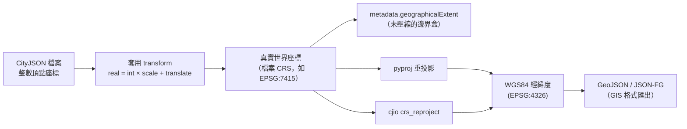

# CityJSON 座標系統與全球經緯度座標整合機制

## 概述

CityJSON 是一種基於 JSON 的 3D 城市模型資料格式，為 CityGML 的輕量化替代方案。其座標系統採用**雙層架構**：先以整數儲存頂點座標以壓縮檔案體積，再透過 `transform` 物件將整數還原為真實世界座標，並由 `metadata.referenceSystem` 宣告所使用的座標參考系統（CRS）。[^spec-10]

本文詳細說明 CityJSON 如何與全球座標系統（如 WGS84 經緯度）整合，包括座標儲存方式、CRS 宣告格式、座標轉換方法，以及與 CityGML 的差異比較。

---

## 1. 座標參考系統（CRS）支援

### 1.1 支援的 CRS 類型

CityJSON 可支援任何由**權威機構定義**的 CRS（通常為 EPSG 代碼），以 OGC URI 格式宣告在 `metadata.referenceSystem` 欄位中：[^spec-crs]

```
https://www.opengis.net/def/crs/{authority}/{version}/{code}
```

常見範例：[^spec-crs]

| CRS | URI |
|-----|-----|
| 荷蘭 RD New + NAP 高程 (EPSG:7415) | `https://www.opengis.net/def/crs/EPSG/0/7415` |
| WGS84 經緯度 2D (EPSG:4326) | `https://www.opengis.net/def/crs/EPSG/0/4326` |
| WGS84 3D (EPSG:4979) | `https://www.opengis.net/def/crs/EPSG/0/4979` |
| ECEF 地心地固 (EPSG:4978) | `https://www.opengis.net/def/crs/EPSG/0/4978` |

### 1.2 CRS 使用規則

- CRS 必須為**三維**：高程值必須相對於特定基準面[^spec-crs]
- authority 通常為 `EPSG` 或 `OGC`，目前 CityJSON **僅允許 EPSG 代碼**[^spec-crs]
- 可使用**複合 CRS** 組合水平與垂直基準，例如 `EPSG:25832+7837` 代表 ETRS89 水平基準 + DHHN2016 高程基準[^spec-crs]
- **單一 CityJSON 檔案內所有城市物件必須使用相同 CRS**，此點與 CityGML 不同[^citygml-comp]

---

## 2. `transform` 物件：座標壓縮與還原機制

### 2.1 結構

`transform` 物件是 **CityJSON 1.1 起強制必備**，其靈感來自 TopoJSON 的量化（quantization）機制，並延伸至三維空間。[^spec-transform]

```json
"transform": {
    "scale": [0.001, 0.001, 0.001],
    "translate": [442464.879, 5482614.692, 310.19]
}
```

包含兩個必備屬性，各為長度 3 的陣列：[^spec-transform]

- **`scale`**：三軸的比例因子，決定座標精度
- **`translate`**：三軸的平移偏移量，通常等於最小頂點值（邊界盒最小值）

### 2.2 轉換公式

整數座標轉換為真實世界座標的公式如下：[^spec-transform]

```
real_x = integer_x × scale[0] + translate[0]
real_y = integer_y × scale[1] + translate[1]
real_z = integer_z × scale[2] + translate[2]
```

### 2.3 壓縮效益

- 檔案體積顯著縮小：CityJSON 檔案約為 CityGML 的 **1/6 至 1/10**[^about]
- 整數運算避免浮點數精度問題
- 精確往返（round-trip）：整數 → 真實世界 → 整數可完全還原
- 實例：荷蘭 Den Haag 資料集的原始頂點範圍為 `[0, 0, 0]` 至 `[787364, 671848, 35018]`，經 transform 後轉為 `[78248.67, 457604.59, 2.46]` 至 `[79036.02, 458276.44, 37.48]`，正確定位於荷蘭國家網格之上[^tiny]

### 2.4 精確度考量

CRS 變更時需重新調整 `scale`：[^spec-tutorial]

- **公制 CRS**：`0.001` 提供公釐級精度
- **地理 CRS（度）**（如 EPSG:4326）：同樣的 `0.001` 會產生約 110 公尺的網格間距，應使用 `1e-9` 或更精細的刻度

---

## 3. 座標儲存方式

CityJSON 中的頂點以**三維整數陣列**儲存於根層級的 `vertices` 陣列：[^spec-vertices]

```json
"vertices": [
    [102, 103, 1],
    [11, 910, 43],
    [25, 744, 22]
]
```

- 每個頂點為**正好 3 個整數**（x, y, z）
- 透過 0 為基礎的位置索引被幾何 `boundaries` 陣列引用
- 這些整數代表**經過 transform 壓縮後**的座標值
- **僅根層級的 `vertices` 陣列**受 transform 影響；幾何模板與紋理的頂點**不**受影響[^spec-vertices]

---

## 4. 地理範圍（geographicalExtent）

`metadata.geographicalExtent` 以 6 個浮點數 `[minx, miny, minz, maxx, maxy, maxz]` 記錄資料集的邊界盒，**儲存於真實世界 CRS 座標**（未經 transform 壓縮），可作為座標正確性的驗證依據：[^spec-metadata]

```json
"metadata": {
    "geographicalExtent": [84710.1, 446846.0, -5.3, 84757.1, 446944.0, 40.9]
}
```

---

## 5. 與全球 WGS84 座標的轉換

### 5.1 步驟一：解壓縮（整數 → 真實世界座標）

使用 Python 與 NumPy：[^snippets]

```python
import numpy as np

V = (np.array(cj["vertices"], dtype=np.float64)
     * np.array(cj["transform"]["scale"])
     + np.array(cj["transform"]["translate"]))
```

### 5.2 步驟二：CRS 重投影至 WGS84（EPSG:4326）

使用 `pyproj`：[^3dgeo]

```python
from pyproj import Transformer

# 從 OGC URI 提取 EPSG 代碼
source_crs = cj["metadata"]["referenceSystem"]
epsg_code = source_crs.rstrip("/").split("/")[-1]

transformer = Transformer.from_crs(f"EPSG:{epsg_code}", "EPSG:4326", always_xy=True)
lons, lats, heights = transformer.transform(V[:, 0], V[:, 1], V[:, 2])
```

### 5.3 使用官方工具 cjio

`cjio` 是 CityJSON 的官方 Python CLI，支援 CRS 重投影：[^cjio]

```bash
cjio input.city.json crs_reproject 4326 save output.city.json
```

亦可先解壓縮再匯出為其他格式：[^cjio]

```bash
cjio input.city.json upgrade export output.gltf
```

### 5.4 逆向轉換（WGS84 → CityJSON 整數座標）

1. 將 WGS84 座標重投影至目標 CRS（使用 `pyproj`）
2. 計算逆向 transform：
   ```
   integer_x = round((real_x - translate[0]) / scale[0])
   integer_y = round((real_y - translate[1]) / scale[1])
   integer_z = round((real_z - translate[2]) / scale[2])
   ```
3. 選擇適當的 `scale`：公制 CRS 用 `0.001`，地理 CRS 用 `1e-9` 或更精細
4. 將 `translate` 設為頂點最小值以維持整數值較小

### 5.5 轉換至 GeoJSON / JSON-FG

`cityjson2jsonfg` 套件可將 CityJSON 轉換為 JSON-FG（OGC Features and Geometries JSON，為 GeoJSON 的 3D 延伸格式）：[^jsonfg]

```bash
cjio --suppress_msg input.city.json upgrade save stdout | cityjson2jsonfg - output.fg.json
```

---

## 6. 重要注意事項

### 6.1 垂直基準面（Vertical Datum）

若僅使用水平 CRS 進行重投影，高程值會被視為橢球高，可能產生 **47 公尺以上**的誤差（大地水準面差距）。應始終使用包含垂直基準面的複合 CRS：[^3dgeo]

```
EPSG:25832+7837   # 取代單純的 EPSG:25832
```

### 6.2 量化為有損壓縮

轉換為整數是 CityJSON 管線中**唯一的有損步驟**。應在最後階段一次性執行。[^spec-tutorial]

### 6.3 常見陷阱

- 在未套用 transform 的情況下直接將頂點視為 EPSG:4326 座標，可能導致模型定位於非洲幾內亞灣（原始 TopoJSON 約定位置）[^tiny]
- 同一 CityJSON 檔案內所有物件共享單一 CRS，導入前需確認來源資料的 CRS 一致性

---

## 7. CityJSON 與 CityGML 座標處理比較

| 特性 | CityJSON | CityGML |
|------|----------|---------|
| **檔案內多 CRS** | **不允許**——所有幾何使用同一 CRS | 允許——相鄰建築可使用不同 CRS[^citygml-comp] |
| **CRS 權威機構** | 僅 **EPSG 代碼**[^spec-crs] | 任何 CRS 權威機構 |
| **座標儲存** | 整數 + transform（量化壓縮） | GML 中的浮點數值 |
| **檔案體積** | 約 CityGML 的 **1/6–1/10**[^about] | 冗長的 XML |
| **低階幾何 ID** | 僅城市物件與語義表面[^citygml-comp] | 任何幾何元素可有 `gml:id` |
| **元資料** | 內建 ISO 19115 相容元資料[^spec-metadata] | 無結構化元資料 |
| **地形交線** | 不支援[^citygml-comp] | 支援（但少用） |

---

## 8. 整合示意圖



---

## 結論

CityJSON 與全球座標系統的整合採用**宣告式 CRS 元資料 + 量化壓縮轉換 + 標準重投影工具**三層架構。檔案內以整數儲存頂點以達成高壓縮比，透過 `transform.scale` 與 `transform.translate` 將整數還原至真實世界座標，再由 `metadata.referenceSystem` 宣告所屬 CRS。從 CityJSON 轉換至 WGS84 經緯度需要兩個步驟：（1）套用 transform 取得真實世界座標，（2）使用 PROJ/pyproj 進行 CRS 重投影。過程中需特別注意垂直基準面的正確設定，以及量化步驟的有損特性。

---

[^spec-10]: Open Geospatial Consortium. (2022). *OGC CityJSON Community Standard 20-072r5, Clause 10 — Transform Object*. Retrieved 2026-09-25, from https://docs.ogc.org/cs/20-072r5/20-072r5.html

[^spec-crs]: Open Geospatial Consortium. (2022). *OGC CityJSON Community Standard 20-072r5, Clause 11.5 — Coordinate Reference System*. Retrieved 2026-09-25, from https://docs.ogc.org/cs/20-072r5/20-072r5.html

[^spec-transform]: CityJSON. (n.d.). *CityJSON Specifications 2.0.2 — Transform Object*. Retrieved 2026-09-25, from https://www.cityjson.org/specs/2.0.2/#the-transform-object

[^spec-vertices]: CityJSON. (n.d.). *CityJSON Specifications 2.0.2 — Coordinate System and Vertices*. Retrieved 2026-09-25, from https://www.cityjson.org/specs/2.0.2/#coordinate-system-and-vertices

[^spec-metadata]: CityJSON. (n.d.). *CityJSON Specifications 2.0.2 — Metadata*. Retrieved 2026-09-25, from https://www.cityjson.org/specs/2.0.2/#metadata

[^spec-tutorial]: CityJSON. (n.d.). *CityJSON Tutorials — Getting Started*. Retrieved 2026-09-25, from https://www.cityjson.org/tutorials/getting-started/

[^about]: CityJSON. (n.d.). *About CityJSON*. Retrieved 2026-09-25, from https://www.cityjson.org/about/

[^citygml-comp]: CityJSON. (n.d.). *CityGML Compatibility with CityJSON*. Retrieved 2026-09-25, from https://www.cityjson.org/citygml/v20/

[^tiny]: Spatial Workflow. (n.d.). *CityJSON Coordinates Come Out Tiny or at the Origin*. Retrieved 2026-09-25, from https://www.spatialworkflow.io/cityjson-coordinates-look-tiny/

[^3dgeo]: 3D Geospatial. (n.d.). *CityGML and CityJSON Processing for Digital Twins — Reprojecting and Upgrading CityJSON Files*. Retrieved 2026-09-25, from https://www.3d-geospatial.com/3d-geospatial-fundamentals-for-digital-twins/citygml-and-cityjson-processing/

[^snippets]: Spatial Workflow. (n.d.). *CityJSON and CityGML Explained — Python Snippets*. Retrieved 2026-09-25, from https://www.spatialworkflow.io/cityjson-and-citygml-explained/

[^cjio]: CityJSON. (n.d.). *cjio — Python CLI for CityJSON*. Retrieved 2026-09-25, from https://github.com/cityjson/cjio

[^jsonfg]: PyPI. (n.d.). *cityjson2jsonfg — Convert CityJSON to JSON-FG / GeoJSON*. Retrieved 2026-09-25, from https://pypi.org/project/cityjson2jsonfg/