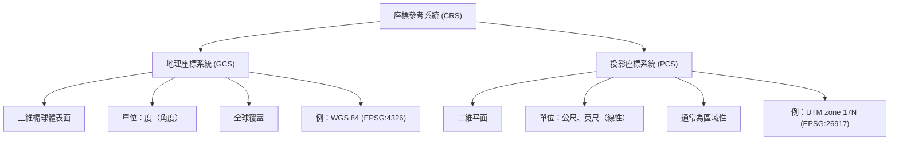

# 座標參考系統（Coordinate Reference System, CRS）全面解析

## 什麼是 CRS？

**座標參考系統（Coordinate Reference System, CRS）**，又稱空間參考系統（Spatial Reference System, SRS），是一套精確定義二維或三維座標如何對應到地球表面的框架。QGIS 官方文件指出：「CRS 定義了 GIS 中的二維投影地圖如何與地球上的真實位置產生關聯。」[^qgis]

若無 CRS，一組座標如 `(134.577°E, 24.006°S)` 便毫無意義——取決於使用哪種地球模型與基準，它可能代表完全不同位置。CRS 就是「位置的語言」，賦予地理座標實際意義。

## 兩大類型：GCS 與 PCS

CRS 主要分為兩大類，其核心差異在於**地球的表示方式**：

### 地理座標系統（Geographic Coordinate System, GCS）

GCS 使用**三維球面**來定義地球上的位置，以：

- **緯度（Latitude）**：赤道以北/南的角度距離（−90° 至 +90°）
- **經度（Longitude）**：本初子午線以東/西的角度距離（−180° 至 +180°）
- **海拔（Altitude，可選）**：參考面以上/下的高度

**主要特性**：
- 單位為**角度**（度、分、秒）
- 覆蓋**全球**
- 經緯線網格不均勻——經線在極點匯聚，緯線保持平行
- 底層地球模型為**參考橢球體（ellipsoid/spheroid）**，非完美球體

Esri 部落格說明：「GCS 是圓的，因此以角度單位（通常為度）記錄位置。」[^esri] GCS 告訴你的資料**在地球上的哪裡**。

### 投影座標系統（Projected Coordinate System, PCS）

PCS 是**經過地圖投影（map projection）壓平的 GCS**，使用笛卡爾（X, Y）座標網格在平面上表示彎曲的地球。

**主要特性**：
- 單位為**線性**（公尺、英尺、美國測量英尺）
- 通常**本地化**至特定區域以最小化變形
- 具有**原點**（常以假東移/假北移偏移避免負座標）
- 總是**保留某些屬性同時扭曲其他屬性**——沒有任何投影能同時保留面積、距離、角度和方向

**常見投影家族**：

| 家族 | 運作方式 | 範例 |
|---|---|---|
| **圓柱投影（Cylindrical）** | 將地球投影到圓柱上 | Mercator、橫麥卡托（UTM） |
| **圓錐投影（Conical）** | 將地球投影到圓錐上 | 蘭伯特正形圓錐、阿爾伯斯等面積 |
| **方位投影（Azimuthal/Planar）** | 將地球投影到平面上 | 方位等距、球極平面投影 |

## CRS 的組成要素

CRS 是一組「堆疊」的依賴規範[^wikipedia]：

| 組成要素 | 說明 | 範例 |
|---|---|---|
| **座標系統（Coordinate System）** | 抽象的數學框架 | 二維笛卡爾（X, Y）、橢球面座標 |
| **大地基準（Geodetic Datum）** | 將抽象系統繫結到真實地球；定義參考橢球體、原點、方向與比例 | WGS 84、NAD 83、GDA2020 |
| **橢球體（Ellipsoid/Spheroid）** | 地球形狀的數學模型（長半軸、扁率） | WGS 84 橢球體：a=6,378,137 m, 1/f=298.257223563 |
| **地圖投影（Map Projection）** | （僅 PCS）壓平曲面的演算法 | 橫麥卡托、蘭伯特正形圓錐 |
| **本初子午線（Prime Meridian）** | 0° 經度參考線 | 格林威治（最常見）、巴黎、馬德里 |
| **度量單位（Unit of Measure）** | 座標表示單位 | 度、公尺、美國測量英尺 |
| **投影參數（Projection Parameters）** | （僅 PCS）中央經線、標準緯線、假東移/假北移、比例因子等控制項 | UTM Zone 17N：中央經線 81°W，比例因子 0.9996 |

## 常見 CRS 標準

### WGS 84（World Geodetic System 1984）— EPSG:4326

WGS 84 是 GPS 使用的**全球標準座標系統**。GISGeography 指出：「全球定位系統使用 WGS 84 作為其參考座標系統，由參考橢球體、標準座標系統、海拔資料和大地水準面組成……測地學家認為誤差小於 2 公分。」[^gisgeography]

**技術細節**：
- **橢球體**：長半軸 = 6,378,137 m，反扁率 = 298.257223563
- **原點**：地球質心（地心系）
- **實現**：透過 GPS 衛星追蹤持續更新（當前：WGS 84(G2296)，與 ITRF2014 在約 2 公分水準一致）
- **EPSG 代碼**：4326（二維地理座標）
- **使用範圍**：全球

### Web Mercator — EPSG:3857

這是**網頁地圖的事實標準**（Google Maps、OpenStreetMap、Bing Maps 等）[^wikipedia]：
- 基於 WGS 84 使用麥卡托投影的投影 CRS
- 單位：公尺
- 偽圓柱投影——保留方向但嚴重扭曲面積（格陵蘭看起來比非洲大）
- 廣受製圖學家批評，但因網頁地圖瓦片慣例而無處不在

### 通用橫麥卡托（Universal Transverse Mercator, UTM）

UTM 是**由 60 個投影帶組成的全球系統**，每個帶寬 6° 經度[^wikipedia]：
- 使用橫麥卡托投影，中央經線比例因子 0.9996
- 帶號 1–60，從 180°W 向東編號
- 每個帶有自己的**假東移**（中央經線 500,000 m）和**假北移**（北半球 0 m，南半球 10,000,000 m）
- **北帶（N）** 用於赤道以上緯度，**南帶（S）** 用於以下
- 範例：EPSG:32644（UTM zone 44N, WGS 84）、EPSG:32756（UTM zone 56S, WGS 84）

### 其他重要 CRS 標準

| CRS | EPSG 代碼 | 地區 | 用途 |
|---|---|---|---|
| NAD 83 | EPSG:4269 | 北美洲 | 美國州級與地方地圖 |
| NAD 83 / UTM zone 17N | EPSG:26917 | 美國東部 | 測量、工程 |
| NAD 83 / 州平面（多種） | EPSG:6576（田納西 ftUS） | 美國各州 | 產權邊界、地方政府 |
| ETRS89 | EPSG:4258 | 歐洲 | 歐洲全域地圖 |
| OSGB36 / British National Grid | EPSG:27700 | 英國 | 英國陸測局地圖 |
| GDA2020 / MGA Zone 56 | EPSG:7856 | 澳洲 | 澳洲測量 |

### EPSG 註冊表

**EPSG 測地參數資料集**（由 IOGP 維護）是權威的公開 CRS 註冊表[^epsg]：
- 1985 年由歐洲石油測量小組（EPSG）創建，旨在標準化空間資料共享
- 每個 CRS 獲得唯一的 **EPSG 代碼**（介於 1024 到 32767 的整數）
- 每個代碼都有對應的 **Well-Known Text（WKT）** 表示法
- 幾乎所有 GIS 軟體（QGIS、ArcGIS、PostGIS、GDAL）都使用 EPSG 代碼來識別 CRS 和進行轉換
- 遵循 **ISO 19111:2019** 國際標準

## CRS 在 GIS 與地圖學中的重要性

### CRS 不匹配的後果

CRS 不匹配是 GIS 中最常見也最危險的錯誤來源之一。StatsPat 描述：「你是否曾在 GIS 軟體中開啟地圖，卻發現道路出現在海洋中央、建築物偏移了數百公里、或圖層拒絕正確疊合？……真正的問題其實更簡單：**座標參考系統（CRS）不匹配**。」[^stats]

Esri 提供了一個鮮明範例：同一組座標 `(134.577°E, 24.006°S)` 的兩個點在現實中相距 **200 公尺**，因為一個使用 WGS 1984，另一個使用 Australian Geodetic Datum 1984——差距相當於站在高原頂部與跌落懸崖的差別。[^esri]

### 實際應用場景

**1. GPS 與導航（WGS 84）**
全球每個 GPS 接收器內部都使用 WGS 84。當你使用 Google Maps 導航時，手機接收的衛星訊號以 WGS 84 計算，然後地圖瓦片（EPSG:3857）對齊顯示你的位置。CRS 不匹配可能導致船舶偏離航線數英哩，或誤導緊急應變人員。

**2. 測量與工程**
測量師需要釐米級精度。他們使用：
- **美國州平面座標系統（SPCS）**——為各州設計，變形最小
- **UTM** 用於區域性專案
- 比全球 WGS 84 更適合當地區域的本地基準（如澳洲 GDA2020、英國 OSGB36）

若建築專案使用錯誤基準，橋墩可能偏離預定位置數公尺。

**3. 都市計畫**
案例研究指出：「都市規劃部門使用 CRS 分析新交通系統對交通模式的影響。透過使用合適的 CRS，他們能準確模擬交通流量並識別壅塞區域。」[^birdi] 使用錯誤投影計算面積，可能使公園看起來比實際更大或更小。

**4. 環境監測**
- **氣候模型**需要準確表示面積關係的投影（等面積投影如 Albers 或 Mollweide）
- **洋流追蹤**需要大地線（大圓）距離計算，而非簡單歐幾里得距離
- **野火測繪**依賴衛星影像、地形資料和 GPS 追蹤消防隊之間的精確座標對齊

**5. 緊急應變**
災難發生時，來自多個機構（FEMA、USGS、地方政府、衛星供應商）的 GIS 圖層必須全部對齊。若一個圖層使用 NAD 83，另一個使用 WGS 84 而未經正確轉換，應變地圖將錯位——可能將救援隊伍導向錯誤座標。

**6. 無人機與航空測量（攝影測量學）**
現代無人機測繪輸出正射鑲嵌圖、DEM 和等高線圖，都必須經過地理空間參考。Birdi 解釋：「如果你曾見過正射鑲嵌圖漂浮在應有位置 50 公尺外——或 DEM 與你的測量資料對不上——很可能是管道某處有 CRS 不匹配。」[^birdi]

**7. 雲端 GIS 平台**
主要平台（Google Earth Engine、ArcGIS Online、Amazon Location Service）都依賴 CRS：
- Google Earth Engine 使用 WGS 84 和 Web Mercator
- ArcGIS Online 支援數百種 CRS，可即時重投影
- 這些平台透明地處理 CRS 轉換，但如果原始資料的 CRS 中繼資料不正確，錯誤仍會傳播

### 關鍵技術考量

| 關注點 | 重要性 |
|---|---|
| **基準轉換** | 在基準間轉換（如 NAD 83 → WGS 84）需要轉換參數（Molodensky、Helmert、網格法）；錯誤方法可能引入公尺級誤差 |
| **即時投影** | GIS 軟體可將圖層即時重投影到共同 CRS 顯示，但這不改變底層資料——進行分析需要**實際重投影**（不僅是顯示） |
| **投影變形** | 了解你的投影扭曲什麼：Mercator 保留角度（適合導航）但嚴重扭曲面積；Albers 等面積保留面積（適合密度測繪）但扭曲形狀和距離 |
| **資料庫中的 SRID** | 空間資料庫（PostGIS、SQL Server、Oracle Spatial）使用 SRID 確保空間運算僅在相同 CRS 的物件間進行——或執行自動轉換 |

## 總結對照：GCS vs PCS

| 特徵 | 地理座標系統（GCS） | 投影座標系統（PCS） |
|---|---|---|
| **地球表示** | 曲面（三維橢球體） | 平面（二維平面） |
| **座標** | 緯度、經度 | 東移、北移（X, Y） |
| **單位** | 度（角度） | 公尺、英尺（線性） |
| **全球覆蓋** | 是 | 通常為區域性（或如 UTM 的分帶） |
| **變形** | 橢球體上無變形 | 總是扭曲某些屬性 |
| **用途** | 儲存全球資料、GPS | 分析、測量、地圖顯示 |
| **範例** | WGS 84（EPSG:4326） | UTM zone 17N（EPSG:26917） |

## 參考文獻

[^qgis]: QGIS. (n.d.). Coordinate Reference Systems. *QGIS Documentation*. Retrieved 2026-09-25, from https://docs.qgis.org/latest/en/docs/gentle_gis_introduction/coordinate_reference_systems.html

[^esri]: Esri. (n.d.). GCS vs PCS — Geographic vs Projected Coordinate Systems. *Esri ArcGIS Blog*. Retrieved 2026-09-25, from https://www.esri.com/arcgis-blog/products/arcgis-pro/mapping/gcs_vs_pcs

[^wikipedia]: Wikimedia Foundation. (n.d.). Spatial Reference System. *Wikipedia*. Retrieved 2026-09-25, from https://en.wikipedia.org/wiki/Spatial_reference_system

[^gisgeography]: GISGeography. (n.d.). World Geodetic System (WGS84). Retrieved 2026-09-25, from https://gisgeography.com/wgs84-world-geodetic-system/

[^epsg]: European Petroleum Survey Group. (n.d.). EPSG Geodetic Parameter Dataset. *Wikipedia*. Retrieved 2026-09-25, from https://en.wikipedia.org/wiki/EPSG_Geodetic_Parameter_Dataset

[^stats]: StatsPat. (n.d.). What is Coordinate Reference System (CRS) in GIS? Retrieved 2026-09-25, from https://statspatial.com/what-is-coordinate-reference-system-crs-in-gis/

[^birdi]: Birdi. (n.d.). What is a Coordinate Reference System (CRS) and Why Does It Matter for Mapping? Retrieved 2026-09-25, from https://www.birdi.io/blog-post/what-is-a-coordinate-reference-system-crs-and-why-does-it-matter-for-mapping