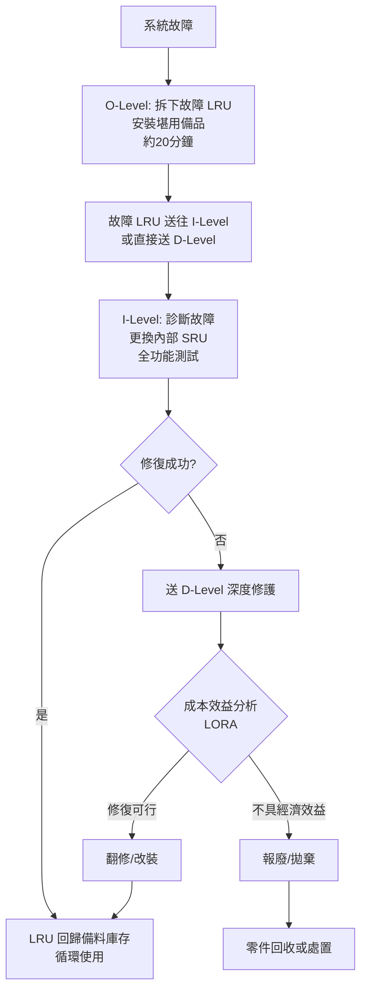

# LRU (Line-Replaceable Unit) 更換後的維修命運：修復還是拋棄？

## 摘要

Line-Replaceable Unit (LRU) 是航空、軍事、工業等領域中常見的模組化單元設計概念，允許在現場快速更換故障單元以恢復系統運作。本文探討 LRU 被更換下來後的處理方式——究竟是設計為可修復的資產，還是一次性拋棄的耗材。

## 核心結論：LRU 設計上以修復為預設，拋棄為例外

LRU 的維護哲學建立在**多層級「更換後修復」（repair-by-replacement）** 後勤模型之上。現場快速更換故障單元後，該故障單元會進入維修鏈的上游進行翻修、大修，最終回到備料庫存循環。LRU 在本質上被設計為**可修復資產**，而非耗材。[^wikipedia]

MIL-PRF-49506（美國軍用後勤管理資訊性能規範）對此有明確定義：

> 「LRU 是在野戰層級（field level）被拆卸更換以恢復終端裝備作戰整備狀態的關鍵支援項目。相反地，**非 LRU** 則是當 LRU 故障並從終端裝備拆下進行修復時，**用於修復 LRU/LLRU 的零件、元件或組件**。」[^milprf]

這段定義明確將 LRU 定位為**可修復的資產**——它們內部包含的元件（非 LRU）正是用來在其故障後對其進行修復的。

## 多層級維護體系

### 三級維護（Three-Level Maintenance）

軍事與航太領域採用分層維護結構，這是 LRU 能否被修復的制度基礎：[^lorawiki]

| 層級 | 代號 | 內容 |
|------|------|------|
| **作業層級** (Organizational) | O-Level | 一階、在裝備上的維護。技術人員執行 LRU 快速拆換（Remove & Replace, R&R）、基本檢查與調整。**不對 LRU 本身進行修復。** |
| **中繼層級** (Intermediate) | I-Level | 二階、離線維護，發生在基地的後勤工坊（backshop）。對拆下的 LRU 進行深入診斷、故障隔離至 SRU（Shop-Replaceable Unit）層級、更換 SRU、全功能測試。**此處是 LRU 被實際修復的主要場所。** |
| **基地層級** (Depot) | D-Level | 三階、高度專業化的大型修護設施（軍方基地修護廠或 OEM 原廠）。進行零組件級別修復、全面翻修（overhaul）、改裝升級。 |

Lockheed Martin 的品質要求文件 (Q17) 描述：

> 「作業層級的維護通常由拆卸更換（R&R）作業組成，將故障或不堪用的 Line-Replaceable Unit (LRU) 以庫存中的備品或堪用資產取代……**基地層級 (D-Level)** 則發生在高度專業化的修護廠或 OEM 設施。」[^lockheed]

### 二級維護（Two-Level Maintenance）

1990 年代起，美國空軍等單位為了降低成本與部署足跡，開始採用**二級維護**制度（O-Level + D-Level），刪除中繼層級。[^lorawiki] LRU 從現場直接送往基地修護廠。美國政府問責署（GAO）確認：「國防部的維護分為兩個層級：野戰層級與基地層級。」[^gao]

無論是二級或三級制度，LRU 被更換後**都是送往更高層級進行修復**，而非拋棄。

## 關鍵區別：LRU vs SRU

理解 LRU 的可修復性，必須引入 **Shop-Replaceable Unit (SRU)** 的概念：[^sruwiki]

| 單元 | 層級 | 處理方式 |
|------|------|----------|
| **LRU**（整機/整盒單元，如雷達模組、無線電、ECU） | O-Level 拆換 | **更換後送往 I/D-Level 修復**，絕不在現場拋棄 |
| **SRU**（LRU 內部的子元件，如電路板、電源模組） | I/D-Level 更換 | **可能修復也可能拋棄**，取決於成本效益分析 |
| **Non-LRU**（修復 LRU/SRU 用的零件） | D-Level | 通常為耗材 |

Rockwell Collins DLS 支援文件說明：

> 「每個設施將具備驗證 Line-Replaceable Unit (LRU) 故障、故障診斷至故障的 Shop-Replaceable Unit (SRU)、拆換故障 SRU、執行驗證測試，以及**將修復後的 LRU 歸還客戶**的能力。」[^rockwell]

## 何時會拋棄 LRU？

LRU 的修復/拋棄決策透過 **Level of Repair Analysis (LORA)**——一套正式的軍事/工業分析程序——來決定。LORA 明確對每個項目評估三種可能：**修復、更換或拋棄**。[^lorawiki]

以下情況下 LRU 可能被判定為拋棄而非修復：

| 因素 | 說明 |
|------|------|
| **成本門檻** | 如果修復成本高於更換成本，且差值超過設定的門檻，則拋棄。 |
| **過時淘汰 (Obsolescence)** | 修復所需的零件已停產，或 LRU 本身規格已過時。 |
| **機隊/系統退役** | 如 Basten 等人指出：機隊退役期間，「單元被拋棄而不進行維修是一項具成本效益的策略」——殘餘經濟壽命不足以支撐修復。[^basten] |
| **No Fault Found (NFF)** | 超過 50% 送往修復設施的 LRU 經檢測並未發現故障，這影響是否繼續修復的決策。[^duotech] |
| **非經濟性決策** | 低價值的消耗性單元（如某些感測器、濾波器）由設計決定不予修復。 |

## LRU 的完整生命週期流程

## 結論

**LRU 更換下來後，設計上絕大多數情況下是可以且應該被修復的**，而非直接拋棄。

- LRU 的核心理念是「快速更換以恢復戰備，更換下來的單元再慢慢修」。
- 修復發生在 I-Level（中繼工坊）或 D-Level（基地修護廠），透過更換內部 SRU 來完成。
- 拋棄是一個**經過正式分析（LORA）後的例外決策**，通常由過時淘汰、機隊退役、或成本效益不足所驅動，而非 LRU 身份的本質屬性。
- 現代趨勢（如 F-22/F-35 的 Line-Replaceable Module, LRM）甚至將可更換顆粒度推向更小的模組層級，進一步減少後勤足跡。[^vita]

因此，工程師在設計與使用 LRU 時，應將其視為**可循環修復的資產**，並建立對應的後勤維護體系。

## 參考資料

[^wikipedia]: Wikipedia. (2026). Line-replaceable unit. Retrieved 2026-09-25, from https://en.wikipedia.org/wiki/Line-replaceable_unit
[^milprf]: MIL-PRF-49506, Performance Specification: Logistics Management Information. https://en.wikipedia.org/wiki/Line-replaceable_unit
[^lorawiki]: Wikipedia. (2026). Level of Repair Analysis. Retrieved 2026-09-25, from https://en.wikipedia.org/wiki/Level_of_Repair_Analysis
[^lockheed]: Lockheed Martin. (n.d.). Quality Requirements Q17. Retrieved 2026-09-25, from https://www.lockheedmartin.com/content/dam/lockheed-martin/aero/documents/scm/Quality-Requirements/Clauses/Q17_Rev2.pdf
[^gao]: U.S. Government Accountability Office. (2014). GAO-14-777. Retrieved 2026-09-25, from https://www.gao.gov/assets/gao-14-777.pdf
[^sruwiki]: Wikipedia. (2026). Shop-replaceable unit. Retrieved 2026-09-25, from https://en.wikipedia.org/wiki/Shop-Replaceable_Unit
[^rockwell]: Rockwell Collins. (n.d.). DLS Support - Maintenance, Repair. Retrieved 2026-09-25, from https://www3.rockwellcollins.com/dls/support/maintenance-repair.asp
[^basten]: Basten, R. J. I., van Houtum, G. J. (2013). Practical extensions to LORA. Springer OPSEARCH. Retrieved 2026-09-25, from https://link.springer.com/article/10.1007/BF03398820
[^duotech]: Duotech Services. (n.d.). How to Extend the Life of Line Replaceable Units (LRUs) in Deployed Environments. Retrieved 2026-09-25, from https://duotechservices.com/news/how-to-extend-the-life-of-line-replaceable-units-lrus-in-deployed-environments
[^vita]: VITA / Military Embedded Systems. (n.d.). LINE Modules Drive New Standards. Retrieved 2026-09-25, from https://vita.militaryembedded.com/257-line-modules-drive-new-standards/