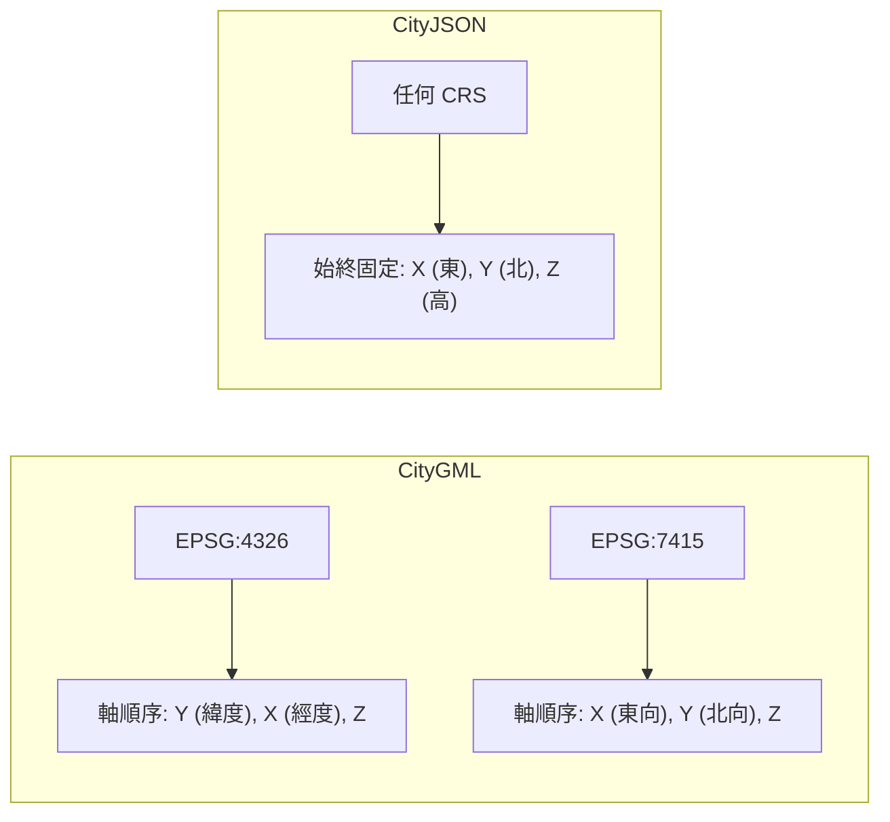

# CityJSON 座標系統分析

## 概述

CityJSON 是基於 CityGML 資料模型的輕量化 3D 都市模型格式。本文探討其座標系統的規格，包括座標軸方向、手性（handedness）、以及與 CityGML 的異同。

## 座標系統類型

CityJSON 使用**三維笛卡兒座標系（3D Cartesian coordinate system）**，所有頂點（vertices）以三個整數陣列 `[x, y, z]` 儲存，再透過強制性的 `transform` 物件轉換為真實世界座標[^spec]。

座標參考系統（CRS）透過 `metadata` 中的 `referenceSystem` 欄位指定，格式為 OGC URI[^spec]：

```json
"referenceSystem": "https://www.opengis.net/def/crs/EPSG/0/7415"
```

與 CityGML 不同，CityJSON **單一檔案內所有物件必須使用同一 CRS**[^spec]：

> Unlike in (City)GML where each object can have a different CRS [...] in CityJSON all the city objects need to be in the same CRS.

## 座標軸方向

CityJSON 的座標軸定義如下[^spec][^ogc]：

| 軸向 | 語義      | 方向 |
|------|-----------|------|
| X    | Easting   | 東向 |
| Y    | Northing  | 北向 |
| Z    | Height    | **向上** |

**Z 軸朝上**，這是明確且無歧義的。從 `transform` 公式可清楚看出[^spec]：

```
v[0] = (vi[0] × scale[0]) + translate[0]   → X（Easting）
v[1] = (vi[1] × scale[1]) + translate[1]   → Y（Northing）
v[2] = (vi[2] × scale[2]) + translate[2]   → Z（Height，向上）
```

`geographicalExtent`（邊界框）格式為 `[minx, miny, minz, maxx, maxy, maxz]`，其中第 3 與第 6 值即為 Z（高度）[^spec]。

## 手性（Handedness）

CityJSON 規格中**未明確指定手性**。然而，基於傳統地理空間慣例：

- X = Easting（東向）
- Y = Northing（北向）
- Z = Height（向上）

這構成一個**右手座標系（right-handed coordinate system）**。使用右手法則：

- 拇指（X）指向東方
- 食指（Y）指向北方
- 中指（Z）指向**上方**

需注意：此慣例不同於 3D 圖學中常見的右手系（X 右、Y 上、Z 朝向觀察者）。CityJSON 採用的是**地理空間右手慣例（GIS right-handed convention）**，即 X 右、Y 前、Z 上。

## 與 CityGML 的比較

CityJSON 實作 CityGML 3.0 資料模型的子集，座標語義相同，但有一項關鍵簡化[^about][^ogc]：

| 面向           | CityGML（GML 編碼）                      | CityJSON                              |
|----------------|------------------------------------------|---------------------------------------|
| 軸順序         | 跟隨 CRS 定義（如 EPSG:4326 → 緯/經 Y/X）| **固定** `[x, y, z]` 不因 CRS 改變   |
| 各物件 CRS    | 每個物件可有不同 CRS                     | 全檔案單一 CRS                        |
| 編碼格式       | GML/XML，冗長                            | JSON，簡潔                            |

在 GML 中，軸順序取決於 CRS（EPSG:4326 使用緯度/經度順序，投影 CRS 如 EPSG:7415 使用東向/北向），這是常見的錯誤來源。CityJSON 透過始終使用 `[x, y, z] = [Easting, Northing, Height]` 完全避免了此問題[^about]。



## 結論

| 問題                     | 答案                                   |
|--------------------------|----------------------------------------|
| 座標系統類型             | 3D 笛卡兒座標系，嵌入歐幾里得空間       |
| 手性                     | 右手系（地理空間慣例）                  |
| 朝上軸                   | **Z 軸朝上**                           |
| 軸順序                   | 固定 `[x, y, z]`，不因 CRS 改變        |
| 與 CityGML 的關係        | 語義相同但軸順序處理更簡潔              |

## 參考資料

[^spec]: CityJSON. (n.d.). *CityJSON Specifications 2.0.2*. Retrieved 2026-09-27, from https://www.cityjson.org/specs/2.0.2/

[^ogc]: Open Geospatial Consortium. (2024). *CityJSON Community Standard (OGC 20-072r5)*. Retrieved 2026-09-27, from https://docs.ogc.org/cs/20-072r5/20-072r5.html

[^about]: CityJSON. (n.d.). *About CityJSON*. Retrieved 2026-09-27, from https://www.cityjson.org/about/