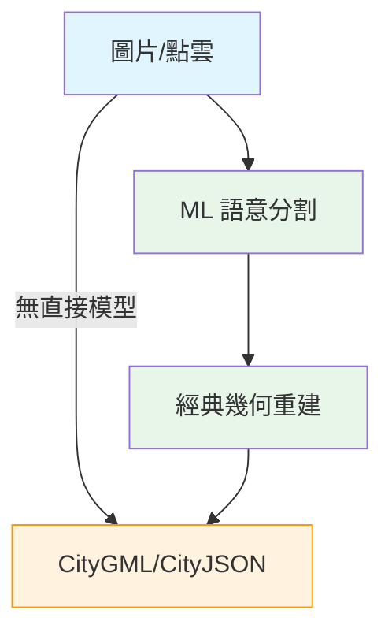

# 開源權重 ML 模型：圖片/點雲轉換為 CityGML/CityJSON（室內案例調查）

## 摘要

本報告調查是否存在**開源/開放權重**（open-weight）的機器學習模型，能夠將圖片（images）或點雲（point clouds）直接轉換為 **CityGML** 或 **CityJSON** 格式，並特別聚焦於室內（indoor / LoD4）場景。研究發現：**目前沒有任何端對端（end-to-end）的開源深度學習模型能直接產出 CityGML/CityJSON**。所有現有工具均仰賴經典幾何處理演算法（假設-選擇法、擠出法、多邊形擬合），而非可下載的神經網路權重。室內（LoD4）的 CityGML 自動生成更是明顯的研究缺口。本報告詳列最相關的工具、論文、開放權重模型（可用於前置處理）以及潛在的 pipeline 建議。

## 1. 核心發現：無端對端開放權重模型

### 1.1 關鍵結論

經過對 GitHub、HuggingFace、arXiv、Google Scholar、ISPRS 等來源的廣泛搜尋，**沒有任何一個深度學習模型（transformer、diffusion、NeRF、3D Gaussian Splatting 或其他架構）能以開放權重（open-weight checkpoint）形式，直接將圖片或點雲轉換為 CityGML/CityJSON 格式**[^gap1][^gap2][^gap3]。

### 1.2 為何存在此缺口

CityGML/CityJSON 是結構化的 **語意 3D 都市模型格式**（包含建築幾何、語義分類、層次關係、空間拓樸），與一般 3D 網格（mesh）或點雲不同。目前的 ML 方法擅長「連續幾何重建」（如 NeRF 產生密度場、diffusion 產生體素），但難以直接輸出「離散的語意結構」（如明確的牆面多邊形、窗戶開口、房間邊界）。因此，所有現有方案均為 **hybrid pipeline**：ML 組件（語意分割/物件偵測）+ 經典幾何演算法 + CityGML 編碼規則。

## 2. 室內（Indoor/LoD4）場景：最大缺口

### 2.1 完全無室內專用端對端模型

在所有調查中，**沒有任何模型或工具能自動將感測器資料（圖片、RGBD、點雲）轉換為室內 LoD4 CityGML**[^gap4][^gap5]。室內 CityGML 生成仍高度仰賴手動建模或半自動化的經典演算法。

### 2.2 最接近的學術研究

- **PinSout**（Kim et al., 2020）：使用深度學習從點雲自動產生室內 3D 建築特徵，基於 **OGC CityGML 2.0**。但**無開放程式碼**（no open-source code published）且權重未公開[^pinsout]。
- **Indoor reconstruction from floorplan images with deep learning**（Jang, Yu, Yang, 2020）：從 2D 平面圖使用深度學習產生室內空間資料，可對應到 CityGML 結構。但同樣**無開放程式碼**[^floorplan]。
- **Semantic Extraction and Spatial Data Modeling for 3D Building Knowledge Graphs in CityGML Representation**（Jang, 2025, SNU）：碩士論文描述將點雲和網格轉換為 CityGML LoD4 模型，但**無開放程式碼或權重**[^lod4thesis]。
- **Automated Generation and Enrichment of CityGML 3.0 Based Indoor Models from Point Clouds and CAD Floor Plans**（Yeltekin, 2026, TUM）：碩士論文，結合點雲 + 平面圖產生 CityGML 3.0 室內模型，**無開放程式碼**[^tumthesis]。

### 2.3 唯一開源的室內→CityJSON 專案

- **Amsterdam-AI-Team/Indoor-PointCloud-to-CityJSON**（⭐ 15）：GPL-3.0。5 階段 pipeline，使用 **CGAL 幾何方法**（非深度學習）從室內點雲偵測房間、牆面、地板，輸出房間邊界與表面重建。基於 Redwood Indoor Lidar-RGBD 資料集[^indoor2cityjson]。

## 3. 非 ML 經典工具：點雲 → CityGML/CityJSON

這些工具以經典幾何演算法（非神經網路）從點雲產生 CityGML/CityJSON，**無開放權重模型**但**有開源程式碼**：

| 專案 | Stars | 輸入 | 輸出 LoD | 方法 |
|------|-------|------|----------|------|
| **3dfier** | ⭐ 635 | 2D GIS 多邊形 + 點雲 | LoD1 CityGML/CityJSON | 規則式擠出法[^3dfier] |
| **City3D** | ⭐ 359 | 空載 LiDAR 點雲 | LoD2 OBJ（可轉換） | PolyFit 假設-選擇法 + 整數規劃[^city3d] |
| **roofer** | ⭐ 198 | 點雲 + 建築足跡 | LoD1.2-LoD2.2 CityJSON | 經典幾何重建 pipeline[^roofer] |
| **City4CFD** | ⭐ 188 | 點雲 + 建築足跡 | LoD1.2-LoD2.2 CityJSON | 基於 CGAL 幾何重建（使用 roofer）[^city4cfd] |
| **PolyFit** | ⭐ 832 | 點雲 | 多邊形表面 | 假設-選擇法 + 整數規劃[^polyfit] |
| **Random3Dcity** | ⭐ 239（已歸檔） | 無（合成生成器） | LoD1-LoD4 CityGML（含室內） | 程序化建模（非重建）[^random3dcity] |

## 4. Hybrid Pipeline：ML + 經典方法 → CityGML（外部 LoD3）

這些 pipeline 使用 ML 組件進行語意分割或物件偵測，再以經典方法整合進 CityGML 格式。

### 4.1 Scan2LoD3（CVPR 2023）
- **輸入**：MLS 點雲 + 2D 圖片 + LoD2 CityGML
- **輸出**：外牆 LoD3 CityGML（窗戶/門開口）
- **方法**：**Point Transformer**（點雲語意分割） + **Mask R-CNN**（2D 窗戶偵測） + Bayesian network融合
- **程式碼**：github.com/OloOcki/scan2lod3 ⭐ 25
- **無端對端權重**：使用各別元件的預訓練權重[^scan2lod3]

### 4.2 SVI2LoD3（2026）
- **輸入**：街景 RGB 圖片 + LoD2 CityGML
- **輸出**：LoD3 CityGML（窗戶/門開口）
- **方法**：**SAM3（Meta 開放權重 transformer）** 進行零樣本分割 + **GPT-5.1 API** 產生 CityGML 輸出
- **程式碼**：github.com/hcu-cml/citydb-SVI2LoD3-ai ⭐ 1
- **評估指標**：FFD（Facade Feature Distance）使用 vision transformer 特徵空間[^svi2lod3]

### 4.3 3D Building Reconstruction（Chrise96）
- **輸入**：街景全景圖片 + LoD2 CityGML
- **輸出**：LoD3 CityGML（外牆細節）
- **方法**：**Faster/Mask R-CNN** 在街景圖片上偵測立面開口
- **程式碼**：github.com/chrise96/3D_building_reconstruction ⭐ 71
- **註記**：使用標準 Faster R-CNN（COCO 預訓練）微調於阿姆斯特丹立面資料集[^3dbuildingrecon]

### 4.4 LoD1-to-LoD2 Roof Reconstruction（2026）
- **輸入**：LoD1.3 CityJSON 建築模型
- **輸出**：LoD2.2 CityJSON（屋頂類型 + 脊線參數）
- **方法**：**scikit-learn Random Forest / Gradient Boosted Trees**
- **程式碼**：github.com/venkata3204sai/LoD1-to-LoD2-roof-reconstruction ⭐ 0
- **註記**：唯一使用傳統 ML（非 DL）的 CityJSON 升級方案，訓練於 15,944 筆 3DBAG 資料[^lod1tolod2]

## 5. 可作為 Pipeline 前置的開放權重模型

這些 HuggingFace 上的開放權重模型 **不直接產出 CityGML**，但其輸出（語意 3D 場景、結構化室內佈局）可透過後處理轉換為 CityGML：

### 5.1 SpatialLM（NeurIPS 2025）— 最相關
| 模型 | 基礎模型 | 參數 | HuggingFace 連結 |
|------|---------|------|-----------------|
| SpatialLM1.1-Qwen-0.5B | Qwen2.5-0.5B | 0.6B | manycore-research/SpatialLM1.1-Qwen-0.5B |
| SpatialLM1.1-Llama-1B | Llama-3.2-1B | ~1B | manycore-research/SpatialLM1.1-Llama-1B |

- **輸入**：點雲（可由單眼影片、RGBD、LiDAR 產生）
- **輸出**：結構化文字/佈局格式，偵測牆面、門、窗、59 種家具類別
- **室內佈局評估**：Structured3D 資料集上達到 **94.3% F1@.25 IoU**
- **資料集**：12,328 室內場景
- **License**：MIT（Llama 版本使用 Llama 授權）[^spatiallm]

### 5.2 NVPanoptix-3D（NVIDIA）
- **架構**：**VGGT Transformer** + Sparse 3D CNN（1.4B 參數）
- **輸入**：單張 RGB 圖片
- **輸出**：3D 幾何（TSDF）+ 3D 語意標籤 + 3D 實例標籤 + 深度
- **資料集**：3D-FRONT + Matterport3D
- **License**：NVIDIA 非商業授權
- **HuggingFace**：nvidia/nvpanoptix-3d（含 3D-FRONT 及 Matterport3D 微調變體）[^nvpanoptix]

### 5.3 SDFUSION（Diffusion Model）
- **架構**：**DiT-style transformer**（49M 參數）於 vecset 潛空間
- **輸入**：建築足跡（64×64 mask）+ 高度參數
- **輸出**：3D 建築量體（透過 frozen Dora-VAE decoder）
- **資料集**：34,909 筆 LoD2 建築網格（3DBAG、NRW、PLATEAU）
- **狀態**：研究階段，待處理建築約 40% 失敗率
- **HuggingFace**：danvisimhadri/SDFUSION[^sdfusion]

### 5.4 其他相關開放權重模型

| 模型 | 架構 | 輸入→輸出 | 連結 |
|------|------|-----------|------|
| **PixARMesh** (CVPR 2026) | Autoregressive Transformer (0.6B) | 單張圖片 → 物體網格 | zx1239856/PixARMesh-BPT[^pixarmesh] |
| **DVLT** | Looping Transformer (117M) | 多視角圖片 → 3D 點雲/深度 | nvidia/dvlt[^dvlt] |
| **HY-World 2.0** | Transformer + Diffusion | 圖片/文字 → 3DGS/網格/點雲 | tencent/HY-World-2.0[^hyworld] |
| **MeshCoder** | LLM (Llama 3.2-1B) + LoRA | 點雲 → Blender Python 腳本 | InternRobotics/MeshCoder[^meshcoder] |
| **Duino-Lidar** | DPT + PaLiGemma | 影片 → 語意點雲 | Duino/Duino-Lidar[^duino] |

## 6. 重要資料集

### 6.1 tum2twin — TUM 校區 LoD3 CityGML
- 完整的 CityGML LoD3 模型 + 點雲 + 圖像
- 用於 LoD3 重建研究的參考資料集
- github.com/tum-gis/tum2twin ⭐ 46[^tum2twin]

### 6.2 TUM-FAÇADE — MLS 點雲立面基準
- 33 個標註立面（窗戶/門/陽台），連結 CityGML LoD2 ID
- github.com/OloOcki/tum-facade ⭐ 40[^tumfacade]

### 6.3 BIO Dataset — 室內外 LoD3 點雲語意分割
- 100 個建築模型，11 個語意類別（依循 CityGML/IFC 標準）
- 測試 4 種深度學習演算法
- 論文：Cao & Scaioni, ISPRS Archives 2023[^bio]

### 6.4 AWESOME CityGML
- 22 個國家、超過 2.15 億棟建築的開源 CityGML 資料
- github.com/OloOcki/awesome-citygml ⭐ 426[^awesome]

## 7. 缺口分析與建議

### 7.1 現有缺口

- **無開放權重端對端模型**：沒有任何 transformer/diffusion/NeRF 模型可以直接輸出 CityGML[^gap1][^gap2][^gap3]
- **室內 LoD4 完全空白**：沒有工具或模型能自動從感測器資料產生室內 CityGML[^gap4][^gap5]
- **所有現有方案皆為 hybrid pipeline**：ML 僅處理語意分割/物件偵測，幾何重建與格式編碼仰賴經典方法
- **HuggingFace 上無 CityGML 相關模型**：搜尋 "CityGML" / "CityJSON" 零結果[^gap1]

### 7.2 建議建構方向

1. **使用 SpatialLM** 從點雲取得結構化室內佈局（牆/門/窗），再寫轉換器輸出 CityJSON
2. **使用 NVPanoptix-3D** 從單張 RGB 取得完整語意 3D 場景，再轉換為 CityGML
3. **使用 Random3Dcity** 合成大量 LoD4 CityGML 訓練資料，訓練端對端生成模型
4. **使用 SDFUSION** 從建築足跡產生 3D 量體，轉換為 CityGML LoD1-LoD2
5. 資料集方面：**BIO dataset** 提供語意標註點雲，**tum2twin** 提供完整的 LoD3 reference

## 參考資料

[^gap1]: HuggingFace Model Search. (2026). Search for "CityGML". Retrieved 2026-09-27, from https://huggingface.co/models?search=CityGML

[^gap2]: GitHub Code Search. (2026). Search for "CityGML deep learning indoor". Retrieved 2026-09-27, from https://github.com/search?q=indoor+CityGML+deep+learning&type=repositories

[^gap3]: arXiv Search. (2026). Search for "CityGML deep learning". Retrieved 2026-09-27, from https://arxiv.org/search/?query=CityGML+deep+learning+indoor&searchtype=all

[^gap4]: Amsterdam-AI-Team. (2026). Indoor-PointCloud-to-CityJSON. GitHub repository. Retrieved 2026-09-27, from https://github.com/Amsterdam-AI-Team/Indoor-PointCloud-to-CityJSON

[^gap5]: Nys, G.-A. (2023). From Consistency to Flexibility: Shifting the Structure. PhD thesis, Université de Liège. Retrieved 2026-09-27, from https://orbi.uliege.be/bitstream/2268/305813/1/thesis.pdf

[^pinsout]: Kim, S., et al. (2020). PinSout: Automatic 3D indoor space construction from point clouds with deep learning. ACM SIGSPATIAL 2020. Retrieved 2026-09-27, from https://dl.acm.org/doi/10.1145/3397536.3422343

[^floorplan]: Jang, J., Yu, K., & Yang, J. (2020). Indoor reconstruction from floorplan images with a deep learning approach. ISPRS International Journal of Geo-Information, 9(2), 65. Retrieved 2026-09-27, from https://www.mdpi.com/2220-9964/9/2/65

[^lod4thesis]: Jang, J. (2025). Semantic Extraction and Spatial Data Modeling for 3D Building Knowledge Graphs in CityGML Representation. Seoul National University. Retrieved 2026-09-27, from https://s-space.snu.ac.kr/handle/10371/221349

[^tumthesis]: Yeltekin. (2026). Automated Generation and Enrichment of CityGML 3.0 Based Indoor Models from Point Clouds and CAD Floor Plans. TUM. Retrieved 2026-09-27, from https://mediatum.ub.tum.de/1861125

[^3dfier]: Ledoux, H., et al. (2021). 3dfier: automatic reconstruction of 3D city models. Journal of Open Source Software, 6(57), 2866. Retrieved 2026-09-27, from https://github.com/tudelft3d/3dfier

[^city3d]: Huang, J., Stoter, J., Peters, R., & Nan, L. (2022). City3D: Large-scale Building Reconstruction from Airborne LiDAR Point Clouds. Remote Sensing, 14(9), 2254. Retrieved 2026-09-27, from https://github.com/tudelft3d/City3D

[^roofer]: 3DBAG. (2024). roofer: Automatic LoD2.2 building reconstruction. GitHub repository. Retrieved 2026-09-27, from https://github.com/3DBAG/roofer

[^city4cfd]: Pađen, I., et al. (2022). City4CFD. Frontiers in Built Environment. Retrieved 2026-09-27, from https://github.com/tudelft3d/City4CFD

[^polyfit]: Nan, L., & Wonka, P. (2017). PolyFit: Polygonal Surface Reconstruction from Point Clouds. ICCV 2017. Retrieved 2026-09-27, from https://github.com/LiangliangNan/PolyFit

[^random3dcity]: Biljecki, F., et al. (2016). Random3Dcity. ISPRS Annals, IV-4/W1, 51–59. Retrieved 2026-09-27, from https://github.com/tudelft3d/Random3Dcity

[^scan2lod3]: Wysocki, O., et al. (2023). Scan2LoD3: Reconstructing semantic 3D building models at LoD3 using point clouds and images. CVPRW 2023. Retrieved 2026-09-27, from https://arxiv.org/abs/2305.06314

[^svi2lod3]: Kanna, R., Arzoumanidis, A., Nguyen, V., & Dehbi, Y. (2026). SVI2LoD3: Agent-Driven Reconstruction of LoD3 Facade Openings. ISPRS Annals. Retrieved 2026-09-27, from https://arxiv.org/abs/2608.29992

[^3dbuildingrecon]: Chrise96. (2020). 3D_building_reconstruction. GitHub repository. Retrieved 2026-09-27, from https://github.com/chrise96/3D_building_reconstruction

[^lod1tolod2]: Chandra, M., & Sarika, M. (2026). LoD1-to-LoD2 Roof Reconstruction. BTH. Retrieved 2026-09-27, from https://github.com/venkata3204sai/LoD1-to-LoD2-roof-reconstruction

[^spatiallm]: Manycore Research. (2025). SpatialLM: Structured 3D Understanding from Point Clouds. NeurIPS 2025. Retrieved 2026-09-27, from https://huggingface.co/manycore-research/SpatialLM1.1-Qwen-0.5B

[^nvpanoptix]: NVIDIA. (2026). NVPanoptix-3D: Panoptic 3D Scene Reconstruction. Retrieved 2026-09-27, from https://huggingface.co/nvidia/nvpanoptix-3d

[^sdfusion]: Simhadri, D. V. (2026). SDFUSION: Footprint-Conditioned Building Massing via Diffusion. Retrieved 2026-09-27, from https://huggingface.co/danvisimhadri/SDFUSION

[^pixarmesh]: zx1239856. (2026). PixARMesh-BPT. CVPR 2026. Retrieved 2026-09-27, from https://huggingface.co/zx1239856/PixARMesh-BPT

[^dvlt]: NVIDIA. (2026). DVLT: Déjà View Looping Transformer. Retrieved 2026-09-27, from https://huggingface.co/nvidia/dvlt

[^hyworld]: Tencent. (2026). HY-World 2.0. Retrieved 2026-09-27, from https://huggingface.co/tencent/HY-World-2.0

[^meshcoder]: InternRobotics. (2026). MeshCoder. Retrieved 2026-09-27, from https://huggingface.co/InternRobotics/MeshCoder

[^duino]: Duino. (2026). Duino-Lidar. Retrieved 2026-09-27, from https://huggingface.co/Duino/Duino-Lidar

[^tum2twin]: TUM GIST. (2025). tum2twin. GitHub repository. Retrieved 2026-09-27, from https://github.com/tum-gis/tum2twin

[^tumfacade]: OloOcki. (2022). tum-facade. GitHub repository. Retrieved 2026-09-27, from https://github.com/OloOcki/tum-facade

[^bio]: Cao, Y., & Scaioni, M. (2023). A 3D Indoor-Outdoor Benchmark Dataset for LoD3 Building Point Cloud Semantic Segmentation. ISPRS Archives, XLVIII-1-W3-2023, 31–37. Retrieved 2026-09-27, from https://isprs-archives.copernicus.org/articles/XLVIII-1-W3-2023/31/2023/

[^awesome]: OloOcki. (2026). awesome-citygml. GitHub repository. Retrieved 2026-09-27, from https://github.com/OloOcki/awesome-citygml