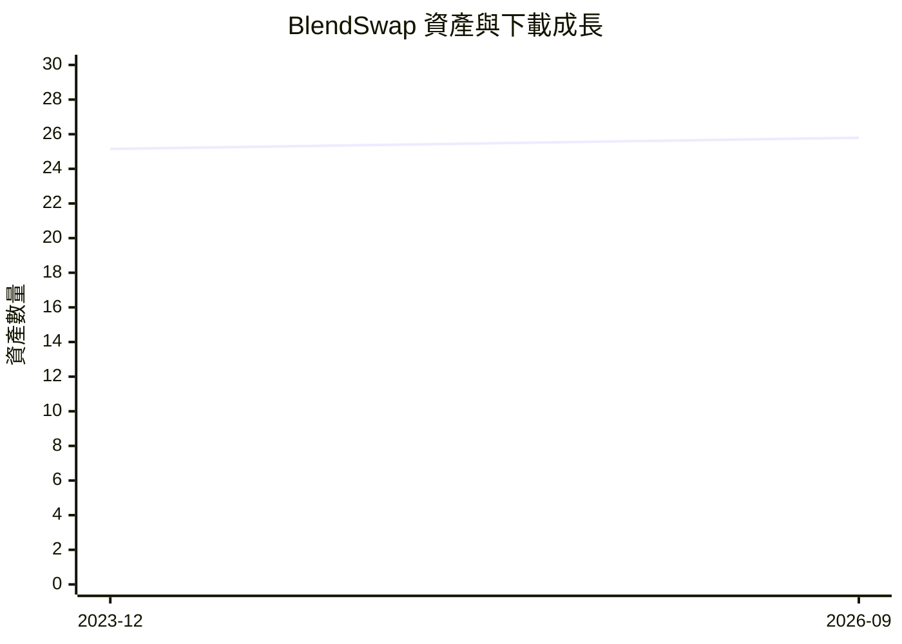
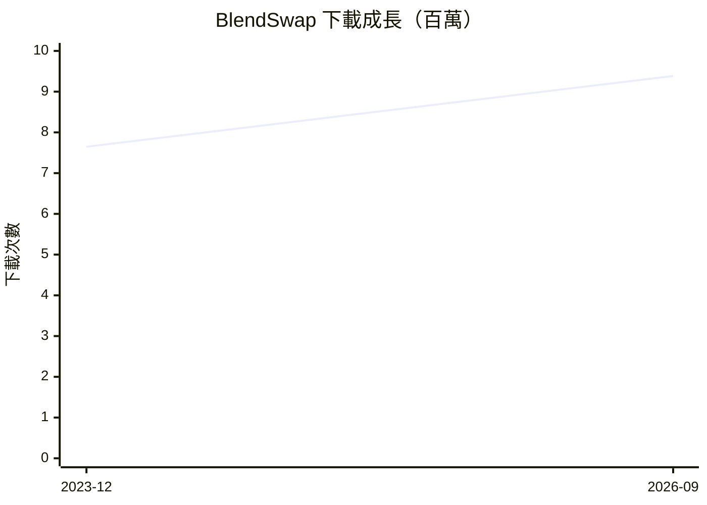
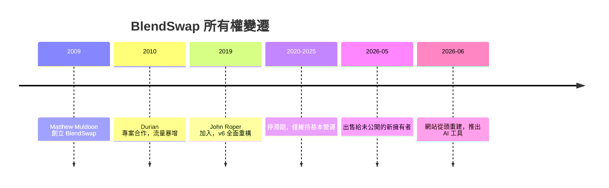

# BlendSwap 網站背景調查報告

## 概述

BlendSwap（blendswap.com）成立於 2009 年，是全球最大的 Blender 3D 模型免費社群平台，提供 Creative Commons 授權的 `.blend` 檔案供使用者下載與分享。截至 2026 年 9 月，網站擁有 **25,795 個資產**、**9,385,460 次下載**、**2,208,484 名註冊藝術家**，以及約 **500,000 名月訪客**[^homepage]。

## 創辦人與歷史

### 創立與早期發展

BlendSwap 由 **Matthew Muldoon**（網站化名 mofx）於 2009 年創立。他是一名來自美國南達科他州蘇瀑市（Sioux Falls）的动态图形設計師，同時也為 Superhive（前身為 Blender Market）擔任產品評論員與創作者營運專員[^muldoon-bio][^bn2010]。

### 關鍵轉折：Durian 專案（2010 年）

2010 年，Blender Foundation 的開源電影專案 **Durian Project** 選擇 BlendSwap 作為其建模衝刺營（Modeling Sprint）的託管平台。Muldoon 形容這猶如「把汽油倒在納帕姆火上」——網站流量從每天 95 次頁面瀏覽暴增至 50,000 次，資產數量也從 20–30 個一舉躍升到 370 個以上，正式奠定了 BlendSwap 的地位[^bn2010]。

### 技術重構（2019 年）

2019 年，**John Roper** 加入團隊擔任開發者，將整個網站從頭重建（v6 版本）。Roper 時任職於 Theory Studios，曾參與《高堡奇人》（The Man In The High Castle）和《芝麻街》（Sesame Street）等專案。這次重構導入了全新的使用者介面與 `.blend` 檔案完整性檢查機制，匯入了超過 1200 萬筆資料庫記錄[^bn2019a][^bn2019b]。

### 停滯期（2020–2025 年）

2020 年至 2025 年間，網站幾乎無重大開發，僅維持關鍵錯誤修復。Muldoon 形容當時的狀態是「靠膠帶和咖啡因硬撐」（held together by duct tape and caffeine）[^revival-tour]。

## 2026 年出售與新篇章

### 出售細節

2026 年 5 月，Muldoon 宣佈將 BlendSwap 出售給一位**未公開身份的新擁有者**。他在個人部落格文章中寫道：

> 「經過 16 年經營 Blend Swap，我決定離開這個專案……新擁有者似乎真心渴望讓網站復興並注入新生命。」[^sale-announce]

BlendSwap 官方新聞亦確認：「2026 年 5 月，BlendSwap 在新的管理下開啟了新篇章。」[^new-chapter]

### 新團隊與地點

出售後的新聞稿改以「BlendSwap Staff」署名，不再公開任何團隊成員姓名。網站服務條款顯示營運地點位於 **羅馬尼亞**，但具體營運公司名稱未揭露[^terms]。

## 資金與商業模式

### 歷史模式（2009–2026 年 5 月）

BlendSwap 從未接受創投或外部投資，完全由 Muldoon 自籌資金（bootstrapped），仰賴社群捐款與訂閱維持營運[^3dsourced]。舊有模式包括：

- **Friend（一次性捐款）** — 最低 5 美元，獲得徽章與額外下載次數
- **Supporter（月費訂閱）** — 每月 10 美元，無限下載、無廣告、私人收藏功能
- **廣告收入** — Google AdSense[^old-about]

### 當前模式（2026 年 6 月起）

新團隊接手後導入多層次商業模式：

| 項目 | 說明 |
|------|------|
| **免費層** | 每日 5 次下載，含廣告 |
| **Friend（月費）** | $9/月，30 AI 點數 |
| **Artist（月費）** | $19/月，200 AI 點數 |
| **Studio（月費）** | $79/月，900 AI 點數 |
| **AI Studio** | 瀏覽器內 .blend 轉檔（OBJ/STL/GLB）、Retopology（QuadriFlow + QuadWild）、材質生成，以點數計費 |
| **付費市集** | 2026 年 8 月宣佈，預計推出 Blender 附加元件、工具、節點組合等付費內容；首年創作者可獲得 **90% 分潤** |
| **貢獻者等級** | 2026 年 7 月上線：Contributor（1+ 資產、90 天內 100 次下載）→ 無限下載；Legend（1+ 資產、90 天內 1,000 次下載）→ 更多福利 |
| **MCP API** | 2026 年 9 月上線，允許 AI 模型搜尋與下載 BlendSwap 目錄 |

來源：[^sell][^contributor][^mcpp]

## 與 Blender Foundation 的關係

**BlendSwap 與 Blender Foundation（blender.org）無任何正式隸屬關係。** 它是一個完全獨立運作的社群平台。2010 年 Durian 建模衝刺營的合作雖是一項重要背书，但並非正式合作夥伴關係。網站服務條款、關於頁面均未提及 Blender Foundation[^about][^terms]。

## 社群規模與成長

- 2023 年 12 月：25,146 個模型、7,647,757 次下載、1,877,330 名會員[^archive-dec2023]
- 2026 年 9 月：25,795 個資產（增長 2.6%）、9,385,460 次下載（增長 22.7%）、2,208,484 名會員（增長 17.6%）

## 所有權結構摘要

## 結論

BlendSwap 是一個由個人創立、社群驅動、從未接受創投的 Blender 模型平台。歷經 16 年由 Matthew Muldoon 獨立經營後，已於 2026 年 5 月轉手給身份不明的買家，目前營運據點位於羅馬尼亞。新團隊接手後迅速導入 AI 工具、貢獻者分級與付費市集，朝商業化方向轉型，但仍保留大規模的免費 CC 授權資產庫。網站與 Blender Foundation 無正式關係，但其 500,000 月訪客與超過 220 萬會員的社群規模，使其在 Blender 生態系中佔有獨特地位。

---

[^homepage]: BlendSwap. (n.d.). BlendSwap — Homepage. Retrieved 2026-09-26, from https://www.blendswap.com/
[^muldoon-bio]: Matthew Muldoon. (n.d.). About Matthew Muldoon. Retrieved 2026-09-26, from https://www.matthewmuldoon.com/about.html
[^bn2010]: BlenderNation. (2010-03-03). Interview: Matthew Muldoon of Blend Swap. Retrieved 2026-09-26, from https://www.blendernation.com/2010/03/03/interview-matthew-muldoon-blend-swap/
[^bn2012]: BlenderNation. (2012-12-19). Interview: Matthew Muldoon from Blend Swap. Retrieved 2026-09-26, from https://www.blendernation.com/2012/12/19/interview-matthew-muldoon-from-blend-swap/
[^bn2019a]: BlenderNation. (2019-02-16). Blend Swap Development Updates. Retrieved 2026-09-26, from https://www.blendernation.com/2019/02/16/blend-swap-development-updates/
[^bn2019b]: BlenderNation. (2019-07-23). Blend Swap v6 Adds All New UI, .blend File Checking and More. Retrieved 2026-09-26, from https://www.blendernation.com/2019/07/23/blend-swap-v6-adds-all-new-ui-blend-file-checking-and-more/
[^revival-tour]: Muldoon, M. (2026). BlendSwap Revival Tour. DesignPlusEdit. Retrieved 2026-09-26, from https://blog.designplusedit.com/blendswap-revival-tour/
[^sale-announce]: Muldoon, M. (2026-05). Blend Swap Sale and Revival. DesignPlusEdit. Retrieved 2026-09-26, from https://blog.designplusedit.com/blend-swap-sale-and-revival/
[^new-chapter]: BlendSwap Staff. (2026-06). A New Chapter for BlendSwap in 2026. Retrieved 2026-09-26, from https://www.blendswap.com/news/98
[^terms]: BlendSwap. (n.d.). Terms of Service. Retrieved 2026-09-26, from https://www.blendswap.com/terms
[^about]: BlendSwap. (n.d.). About BlendSwap. Retrieved 2026-09-26, from https://www.blendswap.com/about
[^old-about]: BlendSwap. (2024-01-03). About BlendSwap (archived). Retrieved 2026-09-26, from https://web.archive.org/web/20240103160039/https://blendswap.com/about
[^archive-dec2023]: BlendSwap. (2023-12). Homepage (archived). Retrieved 2026-09-26, from https://web.archive.org/web/20231231213318/https://www.blendswap.com/
[^sell]: BlendSwap. (n.d.). Sell on BlendSwap. Retrieved 2026-09-26, from https://www.blendswap.com/sell
[^contributor]: BlendSwap Staff. (2026-07-13). Earn Unlimited Downloads... with Contributor Levels. Retrieved 2026-09-26, from https://www.blendswap.com/news/101
[^mcpp]: BlendSwap Staff. (2026-09-04). MCP API Announcement. Retrieved 2026-09-26, from https://www.blendswap.com/news (related to MCP launch)
[^3dsourced]: 3DSourced. (n.d.). Sites for Free Blender Models. Retrieved 2026-09-26, from https://www.3dsourced.com/guides/sitesfree-blender-models/
[^facebook]: BlendSwap. (n.d.). Facebook Page. Retrieved 2026-09-26, from https://www.facebook.com/blendswap/