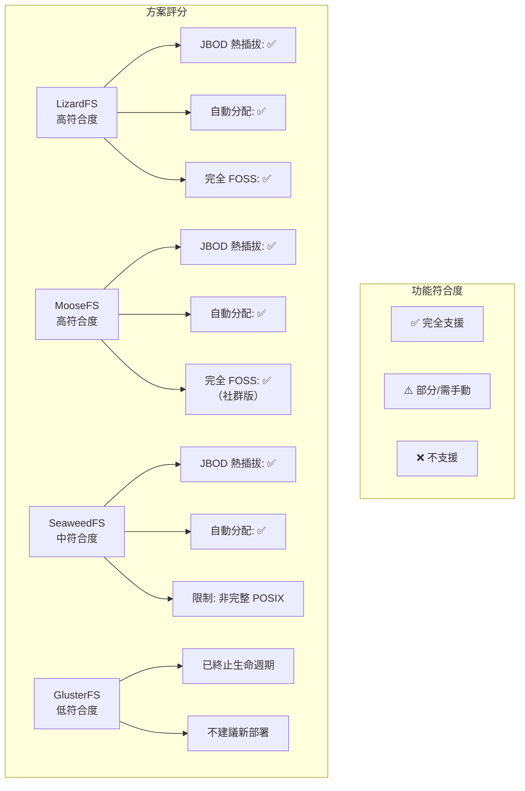

# Ceph FOSS 替代方案：JBOD 熱插拔與自動磁碟資源分配

## 摘要

本報告針對 Ceph 的開放原始碼替代儲存方案進行調查，重點評估兩項關鍵功能：(1) **JBOD 熱插拔** — 在不中斷服務的情況下動態新增/移除磁碟；(2) **自動磁碟資源分配** — 新磁碟加入後自動分配儲存資源。經比較 LizardFS、MooseFS、GlusterFS、SeaweedFS、MinIO 及 BeeGFS 六套系統後，**LizardFS** 因明確將即時磁碟/伺服器加入設計為核心功能，且支援無需手動干預的自動資源分配，為最佳匹配方案；**MooseFS** 因開發活躍度較高為次要推薦。

## 研究動機

Ceph 是廣泛部署的分散式儲存系統，支援區塊、物件與檔案三種儲存類型，並提供 OSD（Object Storage Daemon）層級的新增／移除與自動重新平衡功能。然而 Ceph 的部署與維運複雜度較高，對於特定場景（如 JBOD 直連儲存、輕量部署）可能過於笨重。因此尋找在 JBOD 熱插拔與自動資源分配兩項核心能力上可匹敵或超越 Ceph 的輕量化替代方案，具有實務價值。

## 評估標準

1. **JBOD 熱插拔**：在 JBOD（Just a Bunch Of Disks）配置下，能否在不重啟服務或卸載檔案系統的前提下動態新增或移除磁碟。
2. **自動資源分配**：當新儲存節點或磁碟加入叢集後，系統是否自動將其納入可用資源池，並自動搬遷／分配資料以平衡負載。
3. **授權條款**：必須為完全開放原始碼（OSI 認證授權條款）。
4. **維護狀態**：專案是否仍積極開發與維護。

## 候選方案評估

### 1. LizardFS（GPLv3）— **最佳推薦**

**架構**：Metadata 伺服器（主從式 + shadow 高可用） + chunkserver + FUSE/NFS 客戶端。將中繼資料與資料分離，chunkserver 官方建議採用 JBOD 或 RAID 配置。

**JBOD 熱插拔**：✅ **明確支援。** 該專案的 Wikipedia 條目指出，LizardFS 的設計允許「在不需重新啟動或關閉伺服器的情況下，即時新增更多磁碟與伺服器」[^lfs]。此為其在 JBOD 熱插拔場景中最突出的優勢。

**自動資源分配**：✅ **支援。** 新 chunkserver 加入叢集後，系統會自動將其儲存容量納入可用池。檔案被分割為最多 64 MB 的區塊（chunks），根據設定的複製或 erasure coding「目標」（goal）自動分配到所有可用 chunkserver。新儲存資源會自動觸發重新平衡（rebalance）[^lfs_arch]。

**維護狀態**：⚠️ 最後穩定版本為 3.12.0（2017 年），目前處於低維護模式。

### 2. MooseFS（GPLv2 社群版）— **強力競爭者**

**架構**：與 LizardFS 相似（LizardFS 即為 MooseFS 1.6.x 的分支），採用 metadata 伺服器 + 日誌伺服器 + chunkserver + FUSE 客戶端架構。

**JBOD 熱插拔**：✅ **支援。** 與 LizardFS 同源設計，可在不中斷服務的情況下新增 chunkserver。底層儲存由本機檔案系統管理，磁碟熱插拔對上層透明[^mfs]。

**自動資源分配**：✅ **支援。** 新 chunkserver 加入後自動被偵測並納入儲存池。MooseFS 支援儲存類別（storage classes / data tiering），可為不同標籤的伺服器定義資料放置規則，並透過負載平衡演算法自動分配 chunks 至可用空間[^mfs_goals]。

**維護狀態**：✅ **積極維護中**（最新 v4.59.2，2026 年 5 月）。社群版缺少 erasure coding（僅專業版提供）。

### 3. GlusterFS（GPLv3）— **已退役，不建議新部署**

**架構**：無中心 metadata 伺服器，採用可疊加的使用者空間轉譯層（translators）與分散式雜湊表（DHT, Distributed Hash Table）進行資料放置。

**JBOD 熱插拔**：⚠️ **部分支援。** 可動態對執行中的 volume 新增/刪除 brick（儲存單元），Wikipedia 指出「使用者可以動態新增、刪除或遷移 volume」[^gluster]。然而此操作需透過明確 CLI 指令（`gluster volume add-brick` / `remove-brick` / `rebalance`）手動觸發。

**自動資源分配**：⚠️ **需手動重新平衡。** 新增 brick 後僅新寫入的檔案會自動透過 DHT 分配到新 brick；既有檔案必須手動執行 `gluster volume rebalance` 才會搬遷。

**維護狀態**：❌ **生命週期終止。** Red Hat Gluster Storage 已於 2024 年 12 月 31 日終止支援，不建議用於新部署[^gluster_eol]。

### 4. SeaweedFS（Apache 2.0）— **現代化替代**

**架構**：物件儲存 + FUSE 支援。Master 伺服器管理 volume 分配，volume 伺服器儲存實際資料。原始設計專注於小檔案儲存（如圖片）。

**JBOD 熱插拔**：✅ **支援。** Volume 伺服器可動態新增/移除，master 會自動追蹤可用 volume 並重新指派[^seaweed]。

**自動資源分配**：✅ **支援。** 新 volume 伺服器加入後自動被 master 偵測並分配 volume，系統會自動平衡各 volume 伺服器的負載。

**維護狀態**：✅ **積極維護中。**

**限制**：本質上為物件儲存系統 + FUSE 存取層，非完整 POSIX 分散式檔案系統。

### 5. MinIO（AGPLv3）— **不適用此場景**

**架構**：以 Go 撰寫的 S3 相容物件儲存，使用 erasure coding，原生的 Kubernetes 部署導向。

**JBOD 熱插拔**：❌ **非設計目標。** 磁碟管理通常在作業系統或容器編排層（Kubernetes）處理，MinIO 本身不支援動態磁碟熱插拔。

**自動資源分配**：❌ **不支援。** 儲存透過靜態磁碟路徑或 Kubernetes 永續性磁碟區（PV）配置，無自動磁碟資源分配機制。

**維護狀態**：❌ **已停止開發。** 截至 2026 年 2 月，開發已終止[^minio_unmaintained]。

### 6. BeeGFS（伺服器專屬授權 / 客戶端 GPLv2）— **非完全 FOSS**

**架構**：高效能運算（HPC）領域的並行檔案系統，分散式 metadata，高吞吐量設計。

**JBOD 熱插拔**：⚠️ 需透過管理指令線上新增儲存目標（storage target），但伺服器端非完全開放原始碼（EULA 授權）[^beegfs]。

**自動資源分配**：✅ 支援儲存池（storage pools）與條帶化（striping）配置，新儲存目標可加入既有池。

**授權限制**：❌ 伺服器端為專屬軟體，不符合完全 FOSS 要求。

## 比較總結

| 功能 | Ceph | LizardFS | MooseFS | GlusterFS | SeaweedFS |
|---|---|---|---|---|---|
| **授權** | LGPLv2.1 | GPLv3 | GPLv2 | GPLv3 | Apache 2.0 |
| **維護中** | ✅ 是 | ⚠️ 低度 | ✅ 是 | ❌ 已終止 | ✅ 是 |
| **JBOD 熱插拔** | ✅ OSD 層級 | ✅ 明確支援即時新增 | ✅ 支援 | ⚠️ 需手動 CLI | ✅ 支援 |
| **自動分配** | ✅ 自動平衡 | ✅ 自動 | ✅ 自動配合目標規則 | ⚠️ 需手動 rebalance | ✅ 自動 |
| **POSIX** | ✅ CephFS | ✅ FUSE | ✅ FUSE | ✅ FUSE/NFS | ⚠️ 有限 FUSE |
| **完整度** | 區塊+物件+檔案 | 檔案 | 檔案 | 檔案 | 物件+檔案 |

## 結論與建議

**LizardFS** 為本次調查中最符合 JBOD 熱插拔與自動資源分配兩項需求的 Ceph 替代方案。其架構明確將即時磁碟與伺服器新增設計為核心功能，並在 chunkserver 層級自動處理新資源的納入與資料重新平衡。然而由於 LizardFS 自 2017 年後未發布新版本，維護狀態存在不確定性。

**MooseFS**（LizardFS 的上游專案）因持續開發至 2026 年（v4.59.2），且繼承相同的即時擴展能力，為次要推薦。但其社群版缺乏 erasure coding，需注意。

**SeaweedFS** 若無嚴格的 POSIX 相容性需求，為現代化且活躍開發的替代選擇。

**不建議** GlusterFS（已終止）、MinIO（已停止開發）及 BeeGFS（非完全 FOSS）。

[^lfs]: Wikipedia. (n.d.). *LizardFS*. Retrieved 2026-09-26, from https://en.wikipedia.org/wiki/LizardFS
[^lfs_arch]: LizardFS. (n.d.). *Architecture overview*. Retrieved 2026-09-26, from https://docs.lizardfs.com/architecture
[^mfs]: Wikipedia. (n.d.). *Moose File System*. Retrieved 2026-09-26, from https://en.wikipedia.org/wiki/Moose_File_System
[^mfs_goals]: MooseFS. (n.d.). *Goals and classes configuration*. Retrieved 2026-09-26, from https://moosefs.com/documentation/goals.html
[^gluster]: Wikipedia. (n.d.). *GlusterFS*. Retrieved 2026-09-26, from https://en.wikipedia.org/wiki/GlusterFS
[^gluster_eol]: Red Hat. (2024). *Red Hat Gluster Storage lifecycle*. Retrieved 2026-09-26, from https://access.redhat.com/support/policy/updates/gluster
[^seaweed]: SeaweedFS. (n.d.). *SeaweedFS Wiki: Adding/Removing volume servers*. Retrieved 2026-09-26, from https://github.com/seaweedfs/seaweedfs/wiki
[^minio_unmaintained]: Wikipedia. (n.d.). *MinIO*. Retrieved 2026-09-26, from https://en.wikipedia.org/wiki/MinIO
[^beegfs]: Wikipedia. (n.d.). *BeeGFS*. Retrieved 2026-09-26, from https://en.wikipedia.org/wiki/BeeGFS