# Breeze-TTS-2.cpp 專案背景調查報告

## 摘要

本報告調查 GitHub 專案 [HoppouAI/Breeze-TTS-2.cpp](https://github.com/HoppouAI/Breeze-TTS-2.cpp) 的完整背景，涵蓋背後的組織 HoppouAI、上游模型團隊 BreezeBlue、團隊成員、資金狀況、社群規模及相關生態系。Breeze-TTS-2.cpp 是一個以 C++/GGUF 重新實作 BreezeBlue 之 Breeze-TTS-2 模型的推論引擎，支援語音設計、語音複製、語音導向及實驗性的語音轉換。

---

## 1. 組織概覽：HoppouAI

HoppouAI 自稱是「一個小型的創意工作室，打造有趣、略為過度設計的軟體」，定位為「半工作室、半社群」[^hoppou-web]。其核心專注領域為 **VRChat 生態系**，最初以 **Project Gabriel** 聞名——一個開源的 VRChat AI 伴侶，具備語音對話、電腦視覺追蹤及在地化推論能力。

HoppouAI 在 GitHub 上共有 **9 個公開倉庫**[^hoppou-github]，其中最受歡迎的是 **OctoBrowser**（185 星），其次為 **Breeze-TTS-2.cpp**（23 星）。

### 1.1 團隊成員

所有成員僅以 Discord 使用者名稱識別，無公開真實姓名或 LinkedIn 資料[^hoppou-team]：

| 名稱 | 角色 |
|---|---|
| **kpwv** | 共同創辦人 |
| **BarricadeBandit** | 共同創辦人 |
| Deja_Fu001 | 管理員 |
| Sketch494 | 版主 |
| Gabriel | 版主（以旗艦 VRChat AI 專案命名） |

GitHub 組織頁面未公開任何成員（即使用者在 GitHub 上不可見）。

### 1.2 社群規模

| 平台 | 指標 | 數據 |
|---|---|---|
| GitHub | Breeze-TTS-2.cpp 星數 | 23 ★ |
| GitHub | Breeze-TTS-2.cpp Fork 數 | 9 |
| GitHub | Breeze-TTS-2.cpp 提交數 | 62 |
| Hugging Face | 模型下載數 | 13,800+ |
| YouTube | 訂閱數 | 419 |
| X/Twitter | 貼文數 | 0（帳號存在但從未使用） |

[^hoppou-web]: HoppouAI. (n.d.). *Hoppou.ai*. Retrieved 2026-09-27, from https://hoppou.ai/
[^hoppou-team]: HoppouAI. (n.d.). *The Team*. Retrieved 2026-09-27, from https://hoppou.ai/team/
[^hoppou-github]: HoppouAI. (n.d.). *GitHub Organization*. Retrieved 2026-09-27, from https://github.com/HoppouAI

---

## 2. 資金狀況

### 2.1 HoppouAI：無創投資金

**未發現任何創投、天使投資人或機構資金注入 HoppouAI** 的證據。該組織的規模（五人、Discord 社群、無公司登記）與其「小型創意工作室」的描述一致。無 Crunchbase、PitchBook 或 LinkedIn 公司頁面存在。

### 2.2 上游團隊 BreezeBlue：已獲 $6M 種子輪

BreezeBlue（上海微風藍科技有限公司）是 Breeze-TTS-2 模型的原始創作者，與 HoppouAI 為不同實體：

| 項目 | 內容 |
|---|---|
| **募資金額** | 600 萬美元（種子輪） |
| **公告時間** | 2026 年 8–9 月 |
| **領投機構** | **紅點中國**（Redpoint China）與 **元璟資本**（Vision Plus Capital） |
| **公司名稱** | 上海微風藍科技有限公司 |
| **創立年份** | 2025 年 |
| **創辦人／CEO** | **Bin Yang**（楊彬），駐多倫多，曾任職於 MiniMax |
| **地點** | 中國上海 |
| **員工人數** | 11–50 人（LinkedIn） |

資料來源包括 BreezeBlue 官方 LinkedIn 貼文及多家創投數據平台[^breeze-linkedin][^breeze-x][^dealroom][^preqin]。

[^breeze-linkedin]: Breeze Blue. (n.d.). *LinkedIn Company Page*. Retrieved 2026-09-27, from https://www.linkedin.com/company/breeze-blue
[^breeze-x]: BreezeBlue. (2026, August). *$6M seed round announcement* [Tweet]. Retrieved 2026-09-27, from https://x.com/BreezeBlueX/status/2096647849488556345
[^dealroom]: Dealroom. (2026). *BreezeBlue Raises $6M Seed Funding*. Retrieved 2026-09-27, from https://app.dealroom.co/news/feed/breezeblue-raises-6m-seed-funding-for-real-time-voice-interaction-ai-model
[^preqin]: Preqin. (2026). *BreezeBlue Profile*. Retrieved 2026-09-27, from https://www.preqin.com/data/profile/asset/breezeblue/815851

---

## 3. 專案歷史與技術背景

### 3.1 BreezeBlue 與 Breeze-TTS-2 原始模型

| 時間 | 事件 |
|---|---|
| 2025 年 | Bin Yang 在上海創立 BreezeBlue |
| 2026-08-07 | 發布語音設計／語音導向／延遲等評測基準 |
| 2026-08-25 | **Breeze-TTS-2** 模型權重與 PyTorch 推論程式碼正式釋出 |
| 2026-08／09 | 在 Artificial Analysis 開放權重 TTS 排行榜上名列第一（1215 Elo），超越 Fish Audio S2 Pro 達 90 分 |
| 2026-09 | 宣布 $6M 種子輪募資 |

Breeze-TTS-2 特性：
- **3B 參數**模型
- 雙語（英語 + 普通話），24 kHz 輸出
- 使用阿里巴巴 Qwen 團隊的 Qwen3-TTS 音訊分詞器
- BreezeBlue 付費平台支援 50+ 語言

關於模型研究來源，部分資料（voxtral-tts.org、百度百科）提及 Breeze TTS 2 由「百度 breeze-tts 團隊」釋出[^voxtral][^baike]，但 BreezeBlue 目前以獨立公司型態運作，兩者之間的隸屬關係尚不明確。

### 3.2 Breeze-TTS-2.cpp（HoppouAI 實作）

HoppouAI 的 Breeze-TTS-2.cpp 是上游 PyTorch 模型的 **C++/GGUF 重新實作**[^repo]：

- 底層引擎：**ggml** 推論框架
- GPU 後端：**Vulkan**（支援 NVIDIA、AMD、Intel GPU），亦可退回到 CPU
- 效能：RTX 3060 上 Q8_0 量化約為 **1.2 倍即時**
- 功能模式：語音設計（文字描述生成聲音）、語音複製（參考音檔+逐字稿）、語音導向（參考音檔+指令調整）、語音轉換（保留原表演僅換音色，實驗性功能）
- 輸出格式：24 kHz 串流 PCM
- 授權條款：原始碼 Apache 2.0，模型權重適用 BreezeBlue 研究與非商業授權
- 支援介面：CLI、串流 HTTP/WebSocket 伺服器、Web UI、C 語言共享函式庫（可作為 FFI 綁定）

[^voxtral]: Voxtral TTS. (n.d.). *Breeze TTS 2*. Retrieved 2026-09-27, from https://voxtral-tts.org/en/breeze-tts-2
[^baike]: 百度百科. (n.d.). *Breeze TTS 2*. Retrieved 2026-09-27, from https://baike.baidu.com/item/Breeze%20TTS%202/68742894
[^repo]: HoppouAI. (2026). *Breeze-TTS-2.cpp* [GitHub repository]. Retrieved 2026-09-27, from https://github.com/HoppouAI/Breeze-TTS-2.cpp

---

## 4. 相關組織關係圖

```mermaid
graph TB
    subgraph "HoppouAI 生態"
        H[HoppouAI 工作室<br>小型 VRChat 創意團隊<br>無創投資金]
        HL[HoppouAI Labs<br>Hugging Face 組織]
        H --> HL
    end

    subgraph "上游模型"
        BB[BreezeBlue<br>上海微風藍科技有限公司<br>創辦人: Bin Yang<br>$6M 種子輪]
        Q[阿里巴巴 Qwen 團隊<br>Qwen3-TTS 分詞器]
        BD[百度<br>研究出處可能關聯]
    end

    subgraph "底層框架"
        GG[ggml-org<br>ggml 推論框架]
    end

    H -- "C++/GGUF 實作" --> BB
    H -- "依賴" --> GG
    BB -- "使用" --> Q
    BB -. "可能關聯" .-> BD
```

---

## 5. 關鍵發現摘要

1. **HoppouAI 為小型非商業創意工作室**，非創投支持的新創公司。團隊五人，以 VRChat 生態系為主要舞台。
2. **Breeze-TTS-2.cpp 是上游 BreezeBlue 模型的重實作**，並非原創模型。HoppouAI 與 BreezeBlue 在法律與財務上為完全獨立的實體。
3. **BreezeBlue 則為正規新創公司**（上海微風藍科技有限公司），由前 MiniMax 員工 Bin Yang 創立，已獲紅點中國與元璟資本合計 $6M 種子輪資金。
4. **社群規模不大**：GitHub 星數僅 23 星，但 Hugging Face 模型下載數超過 13,800 次，顯示有實際使用需求。
5. **授權限制**：模型權重採用 BreezeBlue 研究與非商業授權，商用需另行取得 BreezeBlue 授權。

---

## 參考資料

BreezeBlue. (2026, August). *$6M seed round announcement* [Tweet]. Retrieved 2026-09-27, from https://x.com/BreezeBlueX/status/2096647849488556345

Breeze Blue. (n.d.). *LinkedIn Company Page*. Retrieved 2026-09-27, from https://www.linkedin.com/company/breeze-blue

Dealroom. (2026). *BreezeBlue Raises $6M Seed Funding for Real-Time Voice Interaction AI Model*. Retrieved 2026-09-27, from https://app.dealroom.co/news/feed/breezeblue-raises-6m-seed-funding-for-real-time-voice-interaction-ai-model

HoppouAI. (2026). *Breeze-TTS-2.cpp* [GitHub repository]. Retrieved 2026-09-27, from https://github.com/HoppouAI/Breeze-TTS-2.cpp

HoppouAI. (n.d.). *GitHub Organization*. Retrieved 2026-09-27, from https://github.com/HoppouAI

HoppouAI. (n.d.). *HoppouAI on Hugging Face*. Retrieved 2026-09-27, from https://huggingface.co/HoppouAI

HoppouAI. (n.d.). *Hoppou.ai*. Retrieved 2026-09-27, from https://hoppou.ai/

HoppouAI. (n.d.). *The Team*. Retrieved 2026-09-27, from https://hoppou.ai/team/

Preqin. (2026). *BreezeBlue Profile*. Retrieved 2026-09-27, from https://www.preqin.com/data/profile/asset/breezeblue/815851

Voxtral TTS. (n.d.). *Breeze TTS 2*. Retrieved 2026-09-27, from https://voxtral-tts.org/en/breeze-tts-2

百度百科. (n.d.). *Breeze TTS 2*. Retrieved 2026-09-27, from https://baike.baidu.com/item/Breeze%20TTS%202/68742894