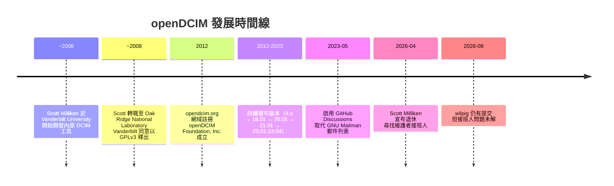

# openDCIM 專案背景調查

## 專案概述

openDCIM 是一套開源的資料中心基礎設施管理（DCIM, Data Center Infrastructure Management）軟體，最初由 Scott Milliken 於 **Vanderbilt University Information Technology Services** 內部開發，用以管理該校的資料中心資產。後來 Scott 轉職至 **Oak Ridge National Laboratory (ORNL)**，Vanderbilt 同意將該程式碼以 **GNU General Public License v3 (GPLv3)** 釋出為開源專案[^github-readme]。

該專案以 PHP 撰寫，搭配 MySQL/MariaDB 資料庫與 Apache 網頁伺服器（LAMP 架構），提供機櫃可視化、資產追蹤、電力與網路連線管理、纜線管理、PDU 與 UPS 管理等核心功能[^features]。

截至調查時，GitHub 上擁有 **367 顆星**、**221 個 fork**、**68 個 watcher**，累積 **3,802 次提交**[^github-repo]。

---

## 組織與法律實體

**openDCIM Foundation, Inc.** 是為管理該專案而設立的非營利法人，總部位於美國田納西州諾克斯維爾（Knoxville, Tennessee），負責處理網域註冊、託管、開發工具與宣傳等相關費用[^participation][^dnb]。

值得注意的是，該基金會並非一間有員工的公司實體，而是一個 **薄層架構（shell entity）**，主要功能是接受捐款並維持專案運作，無任何專職受薪人員[^faq][^dcim-background]。

---

## 創投與資金

**開放原始碼的 openDCIM 完全沒有任何創投（VC）或機構投資。** 該專案從成立至今從未接受外部資金，Crunchbase 與 Craft.co 上也無任何投資紀錄[^crunchbase][^craftco]。

資金來源僅有兩條：

1. **捐款** — 透過 PayPal 接受小額捐款，網站上寫道：「這套軟體是免費提供的，但網域註冊、託管、開發工具和啤酒都需要花錢。」[^participation]
2. **付費支援合約** — Scott Milliken 個人提供遠端支援、教育訓練、客製開發甚至現場工作坊，按小時計費，需直接透過電子郵件洽談[^faq]。

---

## 創始團隊與關鍵貢獻者

openDCIM 的開發團隊規模極小，從官方開發者頁面與 GitHub 提交紀錄來看，核心成員約 1-3 人[^developers]：

| 姓名 | GitHub | 角色 / 所屬機構 |
|---|---|---|
| **Scott Milliken**（也拼作 Miliken） | [samilliken](https://github.com/samilliken) | 創始人、主要維護者（近 20 年）；Oak Ridge National Laboratory 電腦設施經理 |
| **Wilbur Longwisch** | [wilpig](https://github.com/wilpig) | 長期核心貢獻者，截至 2026 年 8 月仍有提交 |
| **Jose Miguel Gomez** | [jomigom](https://github.com/jomigom) | 關鍵貢獻者 |

此外，約有十餘位開發者曾間歇貢獻過程式碼，包括 FunPat（安全性修復）、alex001x、popoff1998、Tarot67、simmon-nplob、ArumBlack、spezialist1 等人[^github-commits]。

---

## 治理模式

專案的治理非常 **非正式**，本質上是 **BDFL（Benevolent Dictator for Life）** 模式，由 Scott Milliken 擔任唯一的決策者。沒有正式的指導委員會、技術委員會或其他治理結構文件化。

Scott 於 **2026 年 4 月 28 日** 在 README 中公告：

> 「在 openDCIM 上工作了將近 20 年之後，我覺得我已經貢獻得夠多了，正在考慮退休和更輕鬆的嗜好。如果有任何貢獻者想要接手這個專案，請聯繫我，我將設法在 GitHub 上轉移組織的所有權，前提是程式碼保持開源。我將在未來幾週內打包最終版本——26.01——並在網域註冊到期後 retire opendcim.org。」[^github-readme]

截至 2026 年 8 月，Wilbur Longwisch (wilpig) 仍持續提交程式碼（包括安全性修補與 UI 修正），但組織接班人問題尚未解決[^github-commits]。

---

## 社群與溝通管道

openDCIM 的社群規模不大但穩定，主要溝通管道包括[^support]：

- **GitHub Discussions**（2023 年 5 月起啟用）— 取代舊的 GNU Mailman 郵件列表
- **IRC**：Libera.chat 上的 `#opendcim` 頻道
- **POEditor**：用於社群翻譯協作
- **GitHub Wiki**：註明「維護不善」的文件頁面
- **公告郵件列表**：透過 list.opendcim.org 提供新版本發布通知

值得注意的是，專案明確要求使用者 **不要直接寫信給開發者**，也不要將問題開成 GitHub Issue——Issue 僅用於追蹤實際程式碼問題。

專案另有 **YouTube 頻道「openDCIM」**，提供多部操作教學影片[^faq]。

---

## 已知使用者

從參與頁面（Participation page）列出的公開使用者來看，openDCIM 被部署於全球數百個資料中心，包括政府機構、學術單位與企業[^participation]：

- **Oak Ridge National Laboratory**（美國田納西州）— 創始人的雇主
- **NASA Langley Air Traffic Control Research Facility**（美國維吉尼亞州）
- **AT&T R&D Center**（以色列特拉維夫）
- **Red Hat**（亞太區）
- **National Human Genome Research Institute**（美國馬里蘭州）
- **Vanderbilt University**（美國田納西州）
- **University of Hawaii**（美國夏威夷州）
- **University of Missouri**（美國密蘇里州）
- **Israel Institute of Technology**（以色列海法）
- **DirecTV Latin America**（阿根廷布宜諾斯艾利斯與哥倫比亞波哥大）
- **Tractor Supply Company**（美國田納西州）
- **Adam Data Centers**（西班牙馬德里）
- **Miniclip**（英國倫敦）

---

## 商業生態系

**沒有任何商業公司直接參與 openDCIM 的開發或治理。** 與 NetBox（由 NetBox Labs 支援）或其他有商業後盾的開源 DCIM 工具不同，openDCIM 完全沒有企業版本、付費 tier 或商業贊助商。其商業生態系僅止於 Scott Milliken 個人提供的付費支援合約。

這也意味著該專案面臨典型的 **開源永續性挑戰**：當唯一的長期維護者退休時，若無接手者，專案可能逐步停滯[^github-readme]。

---

## 關鍵時間線

---

## 技術架構

- **語言**：PHP 8.x
- **資料庫**：MySQL / MariaDB
- **伺服器**：Apache 2.x+（LAMP 堆疊）
- **相依套件**（Composer）：Slim Framework（API）、PHPMailer、PHPSpreadsheet、mPDF、php-saml（OneLogin）、OpenID Connect PHP、ProxmoxVE API client[^github-deps]
- **GitHub 組織倉庫**（4 個）：主應用程式、docker-build、helm-chart、repo（硬體模板與圖片倉庫）[^github-org]

---

## 總結

openDCIM 是一個由單一個人驅動近 20 年的草根開源專案，無任何公司或創投支持，靠捐款與少量顧問合約維生。其治理模式為非正式的 BDFL，社群規模雖小但忠誠度高，擁有多個知名機構使用者（含 NASA、Red Hat、AT&T）。目前專案處於 **接班人危機**，若無新的維護者接手，在 Scott Milliken 退休與網域到期後可能會逐步停滯。

---

[^github-readme]: openDCIM. (n.d.). openDCIM README. Retrieved 2026-09-27, from https://github.com/opendcim/openDCIM

[^features]: openDCIM. (n.d.). openDCIM Features. Retrieved 2026-09-27, from https://opendcim.org/features.html

[^participation]: openDCIM. (n.d.). openDCIM Participation. Retrieved 2026-09-27, from https://opendcim.org/participation.html

[^faq]: openDCIM. (n.d.). openDCIM FAQ. Retrieved 2026-09-27, from https://opendcim.org/faq.html

[^support]: openDCIM. (n.d.). openDCIM Support. Retrieved 2026-09-27, from https://opendcim.org/support.html

[^developers]: openDCIM. (n.d.). openDCIM Developers. Retrieved 2026-09-27, from https://opendcim.org/developers.html

[^github-repo]: openDCIM. (n.d.). openDCIM GitHub Repository. Retrieved 2026-09-27, from https://github.com/opendcim/openDCIM

[^github-commits]: openDCIM. (n.d.). openDCIM Commit History. Retrieved 2026-09-27, from https://github.com/opendcim/openDCIM/commits/master

[^github-org]: openDCIM. (n.d.). openDCIM GitHub Organization. Retrieved 2026-09-27, from https://github.com/orgs/opendcim/repositories

[^github-deps]: openDCIM. (n.d.). openDCIM Dependencies. Retrieved 2026-09-27, from https://github.com/opendcim/openDCIM/network/dependencies

[^crunchbase]: Crunchbase. (n.d.). openDCIM Foundation, Inc. Retrieved 2026-09-27, from https://www.crunchbase.com/organization/opendcim

[^craftco]: Craft.co. (n.d.). openDCIM. Retrieved 2026-09-27, from https://craft.co/opendcim

[^dnb]: Dun & Bradstreet. (n.d.). openDCIM Foundation, Inc. Company Profile. Retrieved 2026-09-27, from https://www.dnb.com/business-directory/company-profiles.opendcim_foundation_inc.e5e72e0efc7e3a4ccf0a0e55f60a447e.html

[^dcim-background]: Data Center Knowledge / Informa TechTarget. (2023). Open Source DCIM Software Project Combats Spreadsheet-Based Data Center Management. Retrieved 2026-09-27, from https://www.datacenterknowledge.com/open-source-software/open-source-dcim-software-project-combats-spreadsheet-based-data-center-management

[^linuxlinks]: LinuxLinks. (n.d.). openDCIM. Retrieved 2026-09-27, from https://www.linuxlinks.com/opendcim/