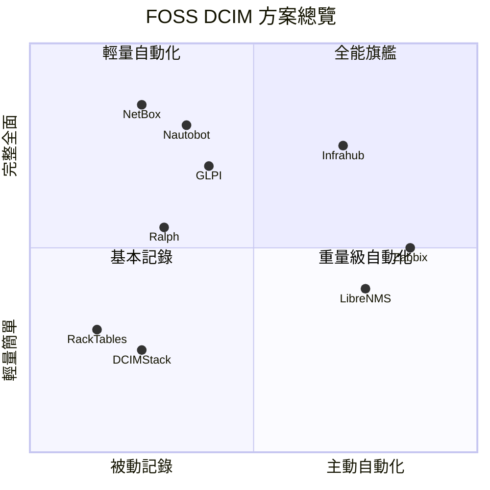

# openDCIM FOSS 替代方案調查

[openDCIM](https://github.com/opendcim/openDCIM) 是一套以 GPL v3 授權的開源資料中心基礎設施管理 (DCIM) 系統，使用 PHP/MySQL 技術棧，已有近 20 年的歷史[^opendcim]。然而其維護者正在尋找接手人，開發動能趨緩。本報告調查目前市面上一系列可替代 openDCIM 的自由開源軟體 (FOSS) 方案，涵蓋純 DCIM 工具以及具備部分 DCIM 能力的輔助系統。

---

## 核心 DCIM 方案

### 1. NetBox — 社群標準首選

NetBox 最初由 DigitalOcean 網路工程團隊開發，是目前最受歡迎的開源 DCIM + IPAM 工具，被視為網路基礎設施的「單一真相來源」(Source of Truth)。使用 Python/Django 技術棧，Apache 2.0 授權，GitHub 星數超過 23,000[^netbox]。

**關鍵能力：**
- 機櫃與設備可視化（含立面圖）
- IP 位址管理 (IPAM)，支援 VRF 與 VLAN
- 佈線管理與網路連接追蹤
- 設備類型與模板系統
- 電路與服務供應商管理
- 機密資訊加密儲存
- RESTful API + GraphQL
- 豐富的外掛生態系
- 電力與冷卻容量追蹤
- 自訂欄位、標籤、關聯
- 變更記錄與稽核軌跡

**優勢：** 社群最大、功能最全面、文件完善、定期發版。
**劣勢：** 學習曲線較陡（Django 架構），自訂腳本需 Python 知識。

### 2. Nautobot — 自動化優先的 DCIM 平台

Nautobot 是 Network to Code 公司在 2021 年從 NetBox v2.10.4 fork 出來的專案，定位為「網路自動化平台」而非單純的文件管理工具。同樣使用 Python/Django，Apache 2.0 授權[^nautobot]。

**關鍵能力：**
- 完整的 DCIM 功能（機櫃、設備、佈線、站點、區域）
- 完整的 IPAM 功能（IP 位址、VRF、VLAN）
- Jobs 框架（可排程、權限控管的 Python 任務）
- 一級外掛/應用生態系（透過 Python packaging）
- 原生 Git 整合（載入 YAML 資料檔）
- 內建 GraphQL + REST API
- 資料驗證與命名規範檢查
- 變更記錄、Webhook 與 SSO
- 工作流程引擎

**優勢：** 自動化設計思維、外掛系統優於 NetBox、Network to Code 商業支援。
**劣勢：** 社群小於 NetBox、營運複雜度較高、部分 NetBox 外掛不相容。

### 3. RackTables — 輕量成熟經典

RackTables 是一套成熟穩定的開源資料中心資產管理解決方案，自 2006 年起持續發展。使用 PHP/MySQL，GPL v2 授權，GitHub 星數約 850[^racktables]。最新穩定版為 0.22.0。

**關鍵能力：**
- 機櫃與設備可視化
- 伺服器、交換器、PDU 等資產追蹤
- IP 位址與網路管理
- VLAN 管理與標記
- 佈線與連接追蹤
- 檔案附件
- 使用者與群組權限
- 自訂標籤與屬性
- LDAP/AD 整合
- 內建報表與搜尋

**優勢：** 部署簡單（PHP/MySQL）、成熟穩定、適合中小型部署。
**劣勢：** 介面較老舊、自動化與 IPAM 功能有限、開發動能較低。

### 4. Ralph — 資產生命週期管理

Ralph 由波蘭電商平台 Allegro 開發，是一套涵蓋資產管理、DCIM 與 CMDB 的開源系統。使用 Python/Django，Apache 2.0 授權，GitHub 星數約 2,300[^ralph]。

**關鍵能力：**
- 完整資產生命週期管理（採購到報廢）
- 資料中心與機櫃可視化
- IP 位址管理
- 多資料中心支援
- 靈活的資產流程系統
- RESTful API
- 自訂欄位

**⚠️ 重要提醒：** Allegro 已於 2024 年 1 月 1 日停止對 Ralph 的主動開發。現有程式碼仍可供社群使用，但缺乏官方維護[^ralph-eol]。

### 5. DCIMStack — 極簡 Docker 部署

DCIMStack 是一套輕量級、基於 Docker 的 DCIM 解決方案，著重機櫃管理與資產追蹤。使用 Python/Flask，MIT 授權[^dcimstack]。

**關鍵能力：**
- 機櫃管理與可視化
- 資產追蹤
- 即時監控
- 容量管理
- 事件管理與報表
- 一行指令 Docker 部署

**優勢：** 部署極簡、輕量專注。
**劣勢：** 社群極小、功能有限、成熟度低。

### 6. Infrahub — 次世代圖形化 SoT

Infrahub 由 OpsMill 開發，是基於圖形資料庫 (Neo4j) 的新一代網路與基礎設施資料管理平台。結合了圖形資料庫、Git 版本控制和 Python 自動化，成為單一真相來源。Apache 2.0 授權，GitHub 星數約 2,500[^infrahub]。

**關鍵能力：**
- 基於 Neo4j 的圖形化資料模型
- 原生 Git 版本控制
- 可擴展的 Schema 語言
- REST API + GraphQL
- CI/CD 整合（變更前驗證）
- Python 自動化框架 (Prefect)
- DCIM/IPAM 資料模型
- 基礎設施變更的 Git diff 視圖

**優勢：** 創新的圖形化方法、版本控制資料、現代架構。
**劣勢：** 較新（社群較小）、技術棧較複雜（Neo4j）、對簡單需求來說過重。

---

## 複合型方案（DCIM 為子功能）

### 7. GLPI — ITSM + DCIM 整合

GLPI 是一套完整的 IT 資產管理、ITIL 合規服務台與 CMDB 平台，內含 DCIM 模組。使用 PHP/MySQL，GPL v3 授權，GitHub 星數約 3,500[^glpi]。

**關鍵能力（DCIM 相關）：**
- 資料中心基礎設施管理模組（機櫃、PDU、冷卻等）
- 機櫃可視化
- IT 資產與配置管理
- ITIL 合規服務台（事件、問題、變更管理）
- 合約與財務管理
- 軟體授權稽核
- 知識庫
- 強大的外掛系統

**優勢：** DCIM + ITSM 一站式方案、社群活躍、專案成熟。
**劣勢：** 僅需要 DCIM 時顯得過重、PHP 技術棧、設定複雜。

### 8. i-doit — CMDB 為核心

i-doit 是一套開源的 CMDB 與 IT 文件平台，支援 DCIM 風格的機櫃管理與資產追蹤。GPL v3 授權[^idoit]。

**關鍵能力：**
- 配置管理資料庫 (CMDB)
- IT 文件管理
- 機櫃與資產管理
- 整合多種資料來源
- 客製化儀表板與報表

---

## 監控類方案（DCIM 輔助角色）

### 9. LibreNMS

主要為網路監控工具，具備自動發現 (SNMP)、設備庫存、連接埠追蹤、環境感測器監控與 IPAM 外掛。GPL v3 授權[^librenms]。

### 10. Zabbix

企業級開源監控解決方案，提供電力、溫度、冷卻即時監控與設備自動發現。GPL v2 授權[^zabbix]。

### 11. OpenNMS

全面的網路管理平台，具備內建 DCIM 能力，包含自動發現、效能測量、事件關聯與拓撲圖。AGPL v3 授權[^opennms]。

---

## 純 IPAM 工具（可搭配 DCIM 使用）

### 12. phpIPAM

純 IP 位址管理工具，管理 IPv4/IPv6 子網路、VLAN、VRF 與 DNS。GPL v3 授權，不具備機櫃與設備管理能力，適合與 NetBox 或 RackTables 搭配使用[^phpipam]。

---

## 其他基礎設施管理工具

### 13. Foreman

裸機佈建與生命週期管理工具，支援 PXE、Kickstart、Preseed 自動安裝，以及與 Puppet、Ansible、Salt 整合。GPL v3 授權[^foreman]。

### 14. Triton DataCenter

Joyent 開發的開源雲端管理平台，基於 SmartOS 容器虛擬化，可跨多資料中心管理基礎設施。Apache 2.0 / MPL 授權[^triton]。

---

## 比較總覽

---

## 選用建議

| 使用情境 | 推薦方案 | 理由 |
|----------|----------|------|
| 純 DCIM，最大社群支援 | **NetBox** | 功能最全面、社群最大、文件最完善 |
| DCIM + 自動化工作流程 | **Nautobot** | Jobs 框架、Git 整合、外掛生態 |
| 輕量機櫃資產記錄 | **RackTables** | 部署簡單、成熟穩定、夠用就好 |
| ITSM + DCIM 合一 | **GLPI** | 服務台與 DCIM 一包搞定 |
| 追求最新架構 | **Infrahub** | 圖形資料庫、Git 版本控制、自動化原生 |
| 監控為主、庫存為輔 | **LibreNMS** + NetBox | 各自專精，搭配使用 |
| 資產生命週期管理 | ~~Ralph~~ | ⚠️ 已停止開發，不建議新導入 |

---

## 參考資料

[^opendcim]: OpenDCIM. (n.d.). *openDCIM — Open Source Data Center Infrastructure Management*. Retrieved 2026-09-27, from https://github.com/opendcim/openDCIM

[^netbox]: NetBox Community. (n.d.). *NetBox — The Source of Truth for Networking*. Retrieved 2026-09-27, from https://github.com/netbox-community/netbox

[^nautobot]: Network to Code. (n.d.). *Nautobot — Network Automation Platform*. Retrieved 2026-09-27, from https://github.com/nautobot/nautobot

[^racktables]: RackTables Community. (n.d.). *RackTables — Datacenter and server room asset management*. Retrieved 2026-09-27, from https://github.com/RackTables/racktables

[^ralph]: Allegro. (n.d.). *Ralph — Asset Management, DCIM and CMDB system*. Retrieved 2026-09-27, from https://github.com/allegro/ralph

[^ralph-eol]: Allegro. (2024). *Ralph is being archived — update from the team*. Retrieved 2026-09-27, from https://github.com/allegro/ralph/issues/3893

[^dcimstack]: Arjitc. (n.d.). *DCIMStack — Open Source Datacenter Infrastructure Management*. Retrieved 2026-09-27, from https://github.com/arjitc/DCIMStack

[^infrahub]: OpsMill. (n.d.). *Infrahub — Graph-based data management for infrastructure*. Retrieved 2026-09-27, from https://github.com/opsmill/infrahub

[^glpi]: GLPI Project. (n.d.). *GLPI — IT Asset Management, ITIL Service Desk, CMDB*. Retrieved 2026-09-27, from https://github.com/glpi-project/glpi

[^idoit]: i-doit. (n.d.). *i-doit — Open Source IT Documentation and CMDB*. Retrieved 2026-09-27, from https://www.i-doit.org/

[^librenms]: LibreNMS Community. (n.d.). *LibreNMS — Auto-discovering network monitoring*. Retrieved 2026-09-27, from https://github.com/librenms/librenms

[^zabbix]: Zabbix LLC. (n.d.). *Zabbix — Enterprise-class open source monitoring*. Retrieved 2026-09-27, from https://github.com/zabbix/zabbix

[^opennms]: OpenNMS Community. (n.d.). *OpenNMS — Network Management Platform*. Retrieved 2026-09-27, from https://github.com/OpenNMS/opennms

[^phpipam]: phpIPAM Community. (n.d.). *phpIPAM — Open Source IP Address Management*. Retrieved 2026-09-27, from https://github.com/phpipam/phpipam

[^foreman]: The Foreman Community. (n.d.). *Foreman — Server provisioning and lifecycle management*. Retrieved 2026-09-27, from https://github.com/theforeman/foreman

[^triton]: Triton DataCenter. (n.d.). *Triton — Open source cloud management platform*. Retrieved 2026-09-27, from https://github.com/TritonDataCenter/triton

[^netbox-labs]: NetBox Labs. (2023-09). *8 Open-Source DCIM Tools*. Retrieved 2026-09-27, from https://netboxlabs.com/blog/open-source-dcim-tools/

[^pistack]: PiStack. (2026-04-28). *RackTables vs Nautobot vs openDCIM: Self-Hosted DCIM Guide 2026*. Retrieved 2026-09-27, from https://www.pistack.xyz/posts/2026-04-28-racktables-vs-nautobot-vs-opendcim-self-hosted-dcim-guide-2026/

[^medevel]: Medevel. (2024). *8 Free Open-Source Data Center Management Solutions*. Retrieved 2026-09-27, from https://medevel.com/data-center-management-1800/

[^dcknowledge]: Data Center Knowledge. (2023-08). *7 Open Source Tools to Consider for Your Data Center*. Retrieved 2026-09-27, from https://www.datacenterknowledge.com/open-source-software/7-open-source-tools-to-consider-for-your-data-center

[^saashub]: SaaSHub. (n.d.). *openDCIM Alternatives*. Retrieved 2026-09-27, from https://www.saashub.com/opendcim-alternatives

[^dcim-list]: little-brother. (n.d.). *dcim-list — Master list of DCIM products*. Retrieved 2026-09-27, from https://github.com/little-brother/dcim-list