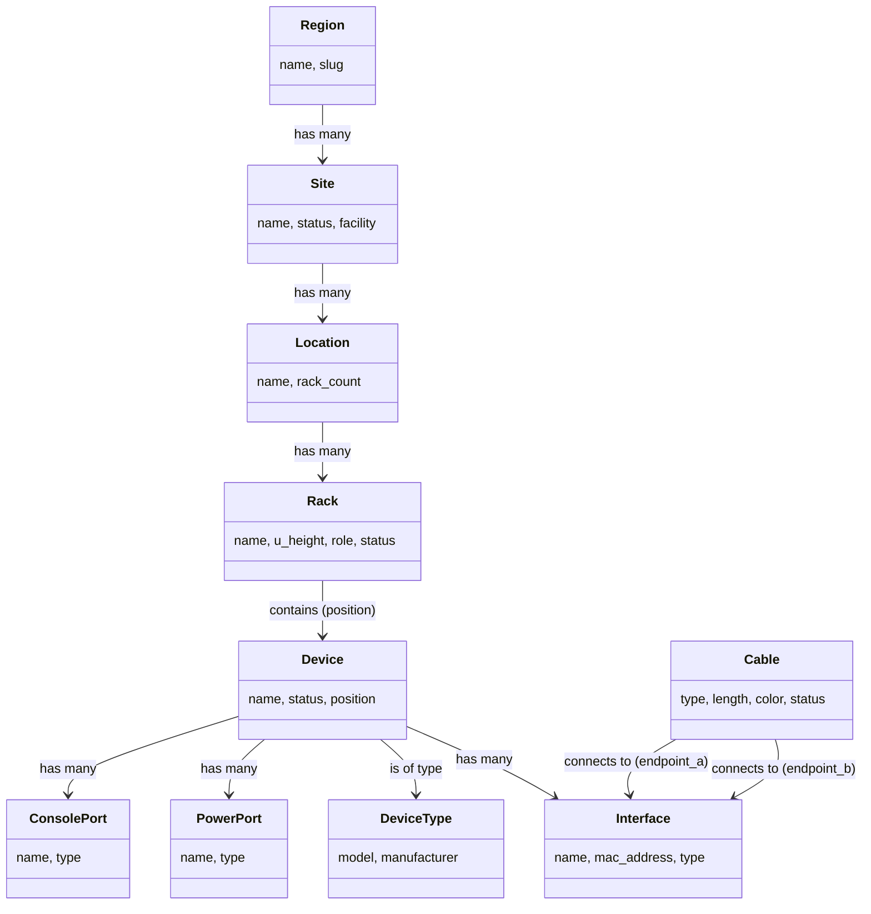

# IT 基礎設施拓撲資料標準與格式調查

## 摘要

本文探討 IT 基礎設施領域中，等同於 CityJSON 對 3D 城市物件意義的結構化資料格式——即能夠標準化描述裝置間乙太網路拓撲、實體位置、纜線連接、網路拓撲與硬體佈建的資料模型與格式。調查範圍涵蓋 IETF YANG 資料模型、DCIM 工具的資料模型、DMTF 標準、Redfish、BIM 領域的 IFC，以及圖形資料庫方案。

## 1. 背景：為何需要 IT 基礎設施拓撲格式

CityJSON/GeoJSON 為都市環境裡的建築、地形、基礎設施提供了標準化的幾何與語義描述。對應到 IT 領域，數據中心與網路設施同樣需要一種格式來記錄：

- 機櫃 (rack) 的實體配置與位置
- 裝置（伺服器、交換器、路由器）在機櫃中的安裝
- 裝置間的實體纜線（乙太網路、光纖）連接
- 電源與冷卻拓撲
- 硬體庫存與生命週期管理
- 邏輯網路拓撲與實體拓撲的對應

這類資料傳統上散落在 Excel 試算表、Visio 圖紙、CMDB 與 DCIM 工具中，缺乏統一、可交換的開放格式[^problem]。

[^problem]: 基礎設施拓撲資料管理的現狀問題。傳統上依賴人工維護的文檔與多種工具間的資料孤島，導致實體環境變更難以同步。IETF IVY 工作組的成立即為了解決此問題。

## 2. IETF YANG 資料模型堆疊（最接近 CityJSON 的標準化方案）

IETF 的 YANG 模型堆疊是目前最主流的、由標準組織制定的 IT 基礎設施拓撲資料格式，相當於 CityJSON 在都市領域的地位。

### 2.1 RFC 8345 —— 網路拓撲基礎模型

定義了抽象的網路拓撲概念：`network`（網路）、`node`（節點）、`link`（鏈路）、`termination-point`（終端點），作為後續技術特定模型的基礎[^rfc8345]。

[^rfc8345]: IETF. (2018). A YANG Data Model for Network Topologies (RFC 8345). Retrieved 2026-09-27, from https://www.rfc-editor.org/info/rfc8345

### 2.2 IVY 網路庫存模型（draft-ietf-ivy-network-inventory-yang）

IETF IVY（Network Inventory YANG）工作組制定的基礎庫存資料模型，定義了跨裝置、跨廠商的網路庫存架構：

- **Network Element (NE)** —— 網路元素，以 UUID 識別，包含型號、製造商、序號、版本號
- **Components** —— NE 內部的階層式元件（機箱、插槽、子插槽、板卡、埠、電源供應器、風扇、CPU、儲存裝置、感測器等）
- 使用 `iana-hardware` YANG 模組定義硬體類別
- 技術中立、網路層級範圍（有別於 RFC 8348 的單裝置範圍）[^ivy-inventory]

[^ivy-inventory]: IETF IVY Working Group. (2026). A YANG Data Model for Network Inventory (draft-ietf-ivy-network-inventory-yang). Retrieved 2026-09-27, from https://ietf-ivy-wg.github.io/network-inventory-yang/draft-ietf-ivy-network-inventory-yang.html

### 2.3 IVY 網路庫存拓撲（draft-ietf-ivy-network-inventory-topology）

將 RFC 8345 的拓撲模型與庫存資料連結的核心擴充，2026 年 9 月仍為草案階段：

- `ne-ref` —— 將拓撲節點對應到實體 Network Element
- `port-ref` —— 將終端點對應到實體埠元件
- `inventory-topology` 網路類型 —— 標記此為實體底層網路
- `link-type` —— 分類實體傳輸媒介：`copper`（銅纜）、`fiber`（光纖）、`coax`（同軸）、`microwave`（微波）、`wlan`（無線區域網路）
- `port-breakout` —— 模型化分線埠（如 400G DR4 拆分為 4×100G）[^ivy-topology]

[^ivy-topology]: IETF IVY Working Group. (2026). Network Inventory Topology YANG Module (draft-ietf-ivy-network-inventory-topology). Retrieved 2026-09-27, from https://ietf-ivy-wg.github.io/network-inventory-topology/draft-ietf-ivy-network-inventory-topology.html

### 2.4 被動網路庫存模型（draft-ygb-ivy-passive-network-inventory）

針對非供電基礎設施：光纖纜線、光纖連接器、跳線面板 (patch panel)、熔接盒、耦合器、被動站點[^passive]。

[^passive]: IETF. (2025). A YANG Data Model for Passive Network Inventory (draft-ygb-ivy-passive-network-inventory). Retrieved 2026-09-27, from https://www.ietf.org/archive/id/draft-ygb-ivy-passive-network-inventory-02.html

### 2.5 技術特定拓撲擴充

RFC 8345 基礎模型可被各技術領域擴充，涵蓋不同層級的拓撲：

- RFC 8944 —— 第二層 (L2) 網路拓撲
- RFC 8346 —— 第三層 (L3) 網路拓撲
- RFC 8795 —— TE (流量工程) 拓撲
- RFC 9656 —— 微波拓撲[^tech-specific]

[^tech-specific]: 多項 RFC 分別定義了不同網路層級的 YANG 拓撲模型，見 RFC 8944、RFC 8346、RFC 8795、RFC 9656。

## 3. DCIM 工具的資料模型（事實上業界標準）

DCIM (Data Center Infrastructure Management) 工具的資料模型是實務上最廣泛使用、最完整的 IT 基礎設施描述方式。

### 3.1 NetBox 資料模型

NetBox 由 NetBox Labs 維護，是開源 DCIM 的領導者，其 Django ORM 定義的模型相當於一個完整的架構[^netbox]：

主要模型包括：

- **Site / Region / Location** —— 地理與建築階層
- **Rack / RackGroup** —— 實體機櫃，含 U 高度、角色、狀態
- **Device / DeviceType / DeviceRole** —— 裝置庫存，含製造商、平台、機櫃位置（U 定位）
- **Cable / CableBundle** —— 實體連接，支援纜線類型（光纖/銅纜/同軸）、長度、顏色、標籤與分線纜線模型
- **Interface / ConsolePort / PowerPort / FrontPort / RearPort** —— 元件層級的終端點
- **Module / ModuleType / ModuleBay** —— 模組化機箱模型（如線卡）
- **PowerPanel / PowerFeed / PowerOutlet** —— 電源分配拓撲
- **Cable tracing** —— 跨 pass-through 埠的端到端路徑計算
- **InventoryItem** —— 子元件追蹤（如 SFP 光模組）
- **Circuit / CircuitTermination** —— 電信商/服務供應商連接[^netbox-models]

NetBox 透過 REST API (JSON) 與 GraphQL 暴露資料，可匯出完整或部分資料作為交換格式。**其資料模型是目前最完整的開放參考模型**[^netbox-api]。

[^netbox]: NetBox Labs. (n.d.). NetBox Documentation — Models — DCIM. Retrieved 2026-09-27, from https://docs.netbox.dev/en/stable/models/dcim/
[^netbox-models]: NetBox Labs. (n.d.). NetBox Documentation — DCIM Cable Model. Retrieved 2026-09-27, from https://docs.netbox.dev/en/stable/models/dcim/cable/
[^netbox-api]: NetBox Labs. (n.d.). NetBox REST API Documentation. Retrieved 2026-09-27, from https://demo.netbox.dev/api/docs/

### 3.2 Nautobot

NetBox 的分支與演進版，由 Network to Code 維護：

- 保留 NetBox 完整 DCIM 模型
- Location 模型取代了 Region/Site 階層
- 透過插件 (plugins) 與應用 (apps) 擴展
- 支援 YAML 格式的引導式資料匯入[^nautobot]

[^nautobot]: Network to Code. (n.d.). Nautobot Documentation — DCIM Location Model. Retrieved 2026-09-27, from https://docs.nautobot.com/projects/core/en/stable/user-guide/core-data-model/dcim/location/

### 3.3 RacksDB

一個基於 **YAML** 的 DCIM 資料庫格式——人類可讀、Git 友善：

- 房間、機櫃、設備以純 YAML 檔案定義
- 基於標籤 (tag) 的可擴展架構
- 可生成機櫃圖與 3D 視圖[^racksdb]

[^racksdb]: RacksDB. (n.d.). RacksDB — YAML-based Data Center Documentation. Retrieved 2026-09-27, from https://github.com/rackslab/racksdb

### 3.4 openDCIM

開源 DCIM，使用 MySQL 架構記錄：

- DataCenter → Zone → CabinetRow → Cabinet 的基礎設施階層
- Device / DeviceTemplate —— 裝置庫存與範本
- Ports / PowerPorts / PowerConnection —— 連線管理
- PowerPanel / PowerDistribution —— 電力基礎設施
- MediaTypes —— 纜線/媒介類型設定[^opendcim]

[^opendcim]: openDCIM. (n.d.). openDCIM Database Schema Documentation. Retrieved 2026-09-27, from https://www.opendcim.org/

### 3.5 Device42

商業 DCIM/CMDB 平台的資料模型（透過 REST API 暴露）：

- Device —— 伺服器、交換器、PDU、VM、刀鋒
- Rack —— 含 U 位置追蹤
- Cable —— 結構化佈線，含纜線類型規格
- PatchPanel —— 埠映射
- Building / Room / Row —— 物理階層
- Service —— 應用相依性對應

## 4. DMTF 標準

### 4.1 CIM（Common Information Model，通用資訊模型）

DMTF 管理的成熟物件導向資訊模型，版本 2.56.0（2026 年 1 月釋出）。以下為 IT 基礎設施相關類別[^cim]：

- **CIM_PhysicalElement** —— 基礎類別，衍生出機箱、機櫃、板卡、模組
- **CIM_PhysicalFrame** —— 機櫃、機箱、外殼
- **CIM_PhysicalConnector** —— RJ11、RJ45、DB9、光纖 SC/ST、PCIe、USB、BNC 等，含性別、接腳數、佈局
- **CIM_Slot** —— 擴充插槽
- **CIM_Cable** —— 纜線總成
- **CIM_PhysicalComponent** —— CPU、風扇、電源供應器、感測器
- **CIM_ComputerSystem** / **CIM_NetworkAdapter** / **CIM_SwitchService** —— 系統/裝置層面
- **CIM_NetworkPort** / **CIM_NetworkConnectivity** —— 網路邏輯拓撲

CIM 可儲存於 MOF（Managed Object Format）或表示為 XML，透過 WBEM/WS-Management 協定交換。

[^cim]: DMTF. (2026). Common Information Model (CIM) Schema Version 2.56.0. Retrieved 2026-09-27, from https://www.dmtf.org/standards/cim/cim_schema_v2560

### 4.2 Redfish（RESTful 硬體管理架構）

Redfish 同時是 REST 協定與資料模型規格（DSP0268），使用 JSON Schema 定義硬體管理資料[^redfish]：

- **Chassis** —— 機櫃、機箱、刀鋒或獨立機殼
- **RackGroup** / **PowerDistribution** / **Thermal**
- **ComputerSystem** —— 伺服器，含記憶體、處理器、儲存
- **NetworkAdapter** / **NetworkPort** / **NetworkDeviceFunction** / **Switch** / **Fabric**
- **Storage** / **StorageController** / **Drive**
- **Manager** —— BMC 管理控制器
- **SoftwareInventory** / **FirmwareInventory**
- **Cable** / **CableCollection** —— 近期新增的 DCIM 功能

Redfish 已獲 Dell iDRAC、HPE iLO、Lenovo XCC、Supermicro、Cisco IMC、OpenBMC 廣泛採用，且正積極發展交換器管理與 DCIM 領域[^redfish-wiki]。

[^redfish]: DMTF. (n.d.). Redfish Specification (DSP0268). Retrieved 2026-09-27, from https://www.dmtf.org/standards/redfish
[^redfish-wiki]: Wikipedia. (2026). Redfish (specification). Retrieved 2026-09-27, from https://en.wikipedia.org/wiki/Redfish_(specification)

## 5. IFC（Industry Foundation Classes）—— BIM 視角的 IT 基礎設施

IFC（ISO 16739）是建築資訊模型 (BIM) 的開放標準，也可用於數據中心設計：

- **IfcRack**（透過 IfcFurnishingElement 或 IfcElementAssembly）—— 伺服器機櫃
- **IfcCableSegment** —— 纜線（光纖/銅纜）
- **IfcCableCarrierFitting** / **IfcCableCarrierSegment** —— 線槽、纜線架
- **IfcDistributionSystem** —— 將纜線分組為邏輯系統
- **IfcDistributionPort** —— 分配元件的連接點
- **IfcCommunicationsAppliance** —— 數據機櫃、伺服器、交換器、路由器
- **IfcBuilding** / **IfcSpace** —— 數據中心機房
- **IfcZone** —— 安全區域、冷熱通道[^ifc]

IFC 的主要限制在於 IT 設備被視為通用家具或組裝元件，而非第一類物件，且模型偏向建築設計施工生命週期，而非營運管理。

[^ifc]: buildingSMART International. (2024). IFC 4.3 Documentation — IfcElectricalDomain. Retrieved 2026-09-27, from https://standards.buildingsmart.org/IFC/DEV/IFC4_3/HTML/

## 6. 圖形資料庫模型

### 6.1 GraphML

XML 格式的通用圖形描述語言，可將裝置表示為節點、纜線表示為邊，搭配任意鍵值屬性：

- 被 OpenNMS 用於網路拓撲視覺化
- 被 Internet Topology Zoo 用於研究網路拓撲
- 被 NetworkX（Python 圖形函式庫）支援讀寫

GraphML 本身非領域特定，需自行定義裝置類型、纜線類型、機櫃位置等屬性架構[^graphml]。

[^graphml]: GraphML Working Group. (n.d.). The GraphML File Format. Retrieved 2026-09-27, from http://graphml.graphdrawing.org/

### 6.2 Infrahub

Network to Code 開發的新一代開源基礎設施資料平台（2025 年進入 GA），結合圖形資料庫（Neo4j/ArangoDB）與版本控制的資料模型，將基礎設施資料視為「版本化圖形」來管理。支援 NetBox 資料匯入與 Schema 定義[^infrahub]。

[^infrahub]: Network to Code. (2025). Infrahub Documentation. Retrieved 2026-09-27, from https://docs.infrahub.app/

### 6.3 自訂 Neo4j 模型

許多組織自行在 Neo4j 中建立基礎設施圖形模型，節點與邊的典型設計：

- 節點類型：`Server`、`Switch`、`Rack`、`DataCenter`、`VLAN`、`Subnet`
- 邊的類型：`CONNECTS_TO`（纜線）、`MOUNTED_IN`（機櫃位置）、`DEPENDS_ON`、`RUNS_ON`
- 屬性與標籤編碼類型資訊

## 7. TOSCA（OASIS）

TOSCA (Topology and Orchestration Specification for Cloud Applications) 是 OASIS 標準，用於描述雲端應用服務拓撲：

- Service template 包含 node templates（伺服器、網路、儲存）與 relationships（connectsTo、dependsOn、hostedOn）
- CSAR 封裝格式
- 較適合應用佈建層級，**不適合實體基礎設施庫存**[^tosca]

[^tosca]: OASIS. (n.d.). TOSCA Version 1.0. Retrieved 2026-09-27, from https://docs.oasis-open.org/tosca/TOSCA/v1.0/TOSCA-v1.0.html

## 8. 設計標準

以下為設計標準而非資料格式，但其定義的拓撲概念被 DCIM 工具引用：

- **ANSI/TIA-942** —— 數據中心電信基礎設施標準，定義 MDA/HDA/EDA/ZDA 階層與星狀佈線拓撲[^tia942]
- **ISO/IEC 22237 (EN 50600)** —— 數據中心設施與基礎設施國際標準系列[^iso22237]

[^tia942]: Telecommunications Industry Association. (n.d.). ANSI/TIA-942 — Telecommunications Infrastructure Standard for Data Centers. Retrieved 2026-09-27, from https://tiaonline.org/standard/tia-942/
[^iso22237]: ISO. (n.d.). ISO/IEC 22237 — Data Centre Facilities and Infrastructures. Retrieved 2026-09-27, from https://www.iso.org/standard/78550.html

## 9. 總結對照表

| 需求 | 最適合的格式/標準 |
|------|------------------|
| **裝置間乙太網路拓撲** | IETF YANG RFC 8345 + RFC 8944（L2 拓撲）；IVY Inventory Topology 提供實體對應 |
| **裝置實體位置** | NetBox 資料模型（Site→Location→Rack→Position）；IVY Network Inventory YANG |
| **纜線/線路連接** | NetBox Cable 模型；IVY Passive Network Inventory YANG；IFC 4.3 IfcCableSegment |
| **完整網路拓撲** | RFC 8345 YANG Network Topology；GraphML（圖形格式）；NetBox Interface↔Cable 關聯 |
| **硬體佈建** | IVY Network Inventory YANG；NetBox DeviceType 範本；RFC 8348 Hardware Management |
| **伺服器機櫃配置** | NetBox Rack 模型（rack unit、elevation）；RacksDB YAML；IFC 4.3（BIM 途徑） |
| **數據中心物理基礎設施** | NetBox/Nautobot 資料模型（最完整開放方案）；IETF IVY 庫存模型；IFC 4.3（BIM 整合） |
| **通用圖形格式** | GraphML + 自訂領域語義 |
| **標準化供應商中立格式** | IETF IVY YANG 模型堆疊（Inventory + Inventory Topology + Passive Inventory） |

## 10. 結論

**沒有任何單一格式在 IT 基礎設施領域擁有 CityJSON 對 3D 城市物件那樣的標準地位。** 但最接近的組合為：

1. **IETF IVY YANG 模型堆疊**（base inventory + inventory topology + passive inventory）是目前由標準組織制定、專為基礎設施拓撲設計的開放資料格式，正處於 RFC 標準化過程中。相當於「IT 基礎設施領域的 CityJSON」。
2. **NetBox 資料模型**是實務上最完整且被廣泛採用的開放參考模型，透過 REST API 可作為資料交換格式使用。
3. **Redfish JSON 架構**在硬體層級的資料描述上已獲廣泛供應商支援。
4. **DMTF CIM** 提供了最全面的概念性物件模型，涵蓋從實體連接器到系統層級的所有面向。

若需一個完整的 IT 基礎設施拓撲描述方案，建議採用 **NetBox 資料模型為核心**記錄機櫃、裝置與纜線，搭配 **IETF YANG 模型**定義標準化的交換介面，並以 **Redfish** 作為自動化硬體資訊收集的通道。