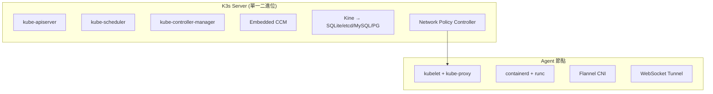
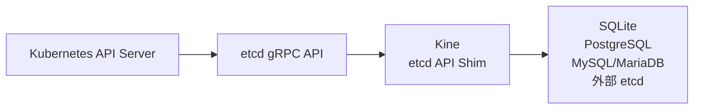

# K3s 內建元件 vs 標準 Kubernetes 比較報告

K3s 是一個輕量級 Kubernetes 發行版，由 Rancher Labs（現為 SUSE 旗下）開發，目標是在資源受限的邊緣環境中運行完整的 Kubernetes 叢集。與標準 Kubernetes（kubeadm 建置）最大的不同在於：**K3s 採用「電池包含」(batteries-included) 策略**，預先整合了許多原本需要使用者手動安裝的元件。本報告詳細比較兩者在預設狀態下提供的服務與元件。

## 1. K3s 的整體架構：單一二進位檔

K3s 最高層級的架構差異是，它將所有控制平面元件打包進**單一個二進位檔案**（約 70-100MB），而不是像標準 Kubernetes 那樣各自獨立的靜態 Pod/二進位檔。[^k3s-arch]

標準 K8s 所需的元件（各自獨立進程）：
- `kube-apiserver`
- `kube-controller-manager`
- `kube-scheduler`
- `kubelet`
- `kube-proxy`
- `etcd`

在 K3s 中，上述所有元件（除 kubelet 外）都運行在**同一個 OS 進程**中。`k3s server` 指令同時啟動 API Server、Scheduler、Controller Manager 以及嵌入的 Cloud Controller Manager。這種設計大幅減少了每個元件各自需要 TLS 憑證、認證層與資源開銷的記憶體浪費。[^k3s-faq]

K3s 在 Agent 節點上同樣使用同一個二進位檔（`k3s agent`），內含 kubelet、kube-proxy、containerd、runc、Flannel 以及 WebSocket Tunnel。[^k3s-arch]

## 2. 預設資料儲存層：SQLite/Kine 取代 etcd

標準 Kubernetes 強制使用 **etcd** 作為資料儲存層。K3s 預設使用 **SQLite**（透過 **Kine** 中間層），大幅降低了資源需求。[^k3s-datastore]

**Kine** (Kine Is Not etcd) 是一個 etcd API 轉譯層，它實作了 Kubernetes 所需的 etcd v3 gRPC 操作（range、txn、put、delete、watch），並將其轉換為 SQL 語句。[^kine]

資料儲存選項比較：

| 模式 | 記憶體需求 | 適用場景 | 設定方式 |
|------|-----------|----------|---------|
| SQLite（預設） | ~50MB RAM | 單節點 | 無需額外設定 |
| 嵌入式 etcd | ~500MB RAM | HA（3+ 控制節點） | `--cluster-init` |
| 外部 PostgreSQL | 依 DB 而定 | 整合現有 SQL | `--datastore-endpoint=postgres://...` |
| 外部 MySQL/MariaDB | 依 DB 而定 | 整合現有 SQL | `--datastore-endpoint=mysql://...` |
| 外部 etcd | ~500MB RAM | 帶自己的 etcd | `--datastore-endpoint=https://...` |

**限制**：SQLite 不能用於多控制節點模式（無 HA 支援），且僅支援從 SQLite 往嵌入式 etcd 的單向遷移。[^k3s-datastore]

## 3. K3s 預設內建的完整元件清單

### 3.1 部署為 AddOn 清單（Manifest）的元件

K3s 在啟動時會自動將 `/var/lib/rancher/k3s/server/manifests/` 目錄下的 YAML 清單套用到叢集中，這些清單來自 K3s 原始碼中的 `manifests/` 目錄。[^k3s-manifests]

| 元件 | 部署方式 | 可停用參數 | 說明 |
|------|---------|-----------|------|
| **CoreDNS** | 靜態 Kubernetes 清單 | `--disable=coredns` | 叢集 DNS 服務，Service IP 為 10.43.0.10 |
| **Traefik v3** | HelmChart CRD | `--disable=traefik` | 預設 Ingress Controller，佔用 port 80/443 |
| **local-path-provisioner** | 靜態 Kubernetes 清單 | `--disable=local-storage` | 預設 StorageClass (`local-path`)，使用節點本機儲存 |
| **Metrics Server** | 靜態 Kubernetes 清單 | `--disable=metrics-server` | 提供 `kubectl top` 命令的資源指標 API |
| **Gateway API CRDs** | 靜態 Kubernetes 清單 | 自動偵測 | 可選，供 Traefik 的 Gateway API 支援 |
| **Runtime Classes** | 靜態 Kubernetes 清單 | — | crun、nvidia、wasm 等替代執行環境定義 |
| **CCM RBAC** | 靜態 Kubernetes 清單 | — | Cloud Controller Manager 的權限綁定 |

### 3.2 嵌入二進位檔內的元件（非清單部署）

這些元件直接編譯在 `k3s` 二進位檔中，沒有獨立的 YAML 清單。[^k3s-arch]

| 元件 | 可停用參數 | 說明 |
|------|-----------|------|
| **ServiceLB (Klipper LB)** | `--disable=servicelb` | 內建 LoadBalancer 控制器，為每個 LoadBalancer Service 建立 hostPort DaemonSet |
| **Helm Controller** | 無（核心功能） | 監聽 `HelmChart` CRD，自動執行 Helm chart 安裝 |
| **網路政策控制器（kube-router netpol）** | `--disable-network-policy` | 僅使用 kube-router 的 netpol 函式庫，以 iptables 強制執行 NetworkPolicy |
| **Cloud Controller Manager** | `--disable-cloud-controller` | 管理 ServiceLB、清除 `uninitialized` taint、設定節點位址 |
| **Kine (etcd shim)** | — | 將 etcd API 轉譯為 SQL 操作 |

### 3.3 內建但非 Kubernetes 元件的工具

| 元件 | 說明 |
|------|------|
| **containerd + runc** | 完整內建的 CRI 相容容器運行時 |
| **Flannel (CNI)** | 預設 VXLAN 模式；支援 wireguard、host-gw、IPSec 等後端 |
| **Spegel** | 分散式容器映像檔鏡像（選用，透過 `--embedded-registry` 啟用） |
| **主機工具** | iptables/nftables、ebtables、ethtool、socat — 直接包含在二進位檔中，不依賴 OS 套件 |

### 3.4 預設 Kubernetes 命名空間內的元件

K3s 啟動後，`kube-system` 命名空間中預設會運行：[^k3s-manifests]

- `coredns-*` — Deployment（1 pod）, priority: `system-cluster-critical`
- `local-path-provisioner-*` — Deployment（1 pod）, priority: `system-node-critical`
- `metrics-server-*` — Deployment（1 pod）, priority: `system-node-critical`
- `traefik-*` — Deployment（1 pod）, priority: `system-cluster-critical`
- `svclb-traefik-*` — DaemonSet（每節點 1 pod）
- `helm-install-traefik-*` - Job（安裝完成即結束，非持續運行）
- 以及非 Pod 資源：`AddOn` CR、節點密碼 Secret、`local-path-config` ConfigMap、`coredns` ConfigMap

叢集層級的資源還包括 `StorageClass: local-path`（預設 StorageClass）與多個 ClusterRole/ClusterRoleBinding。

## 4. 標準 Kubernetes（kubeadm）需要手動安裝的元件

透過 `kubeadm init` 建立叢集後，kubeadm 僅會安裝以下元件作為靜態 Pod：[^kubeadm-init]

| 元件 | 狀態 |
|------|------|
| kube-apiserver | ✅ 靜態 Pod |
| kube-controller-manager | ✅ 靜態 Pod |
| kube-scheduler | ✅ 靜態 Pod |
| etcd | ✅ 靜態 Pod（單節點本地） |
| CoreDNS | ✅ kubeadm-addon |
| kube-proxy | ✅ kubeadm-addon DaemonSet |

**以下元件是標準 Kubernetes 要求但 kubeadm 不會替您安裝的**：[^k8s-addons]

| 元件 | 說明 |
|------|------|
| **CNI / Pod 網路** | ❌ 必須手動安裝（Calico、Cilium、Flannel 等），官方文件明確寫道：「You must deploy a CNI based Pod network add-on so that your Pods can communicate with each other.」 |
| **Ingress Controller** | ❌ 必須手動安裝（nginx-ingress、Traefik、HAProxy 等） |
| **Storage Provisioner** | ❌ 無預設 StorageClass（需安裝 CSI driver，如 Longhorn、Rook/Ceph） |
| **Load Balancer** | ❌ LoadBalancer 類型的 Service 將永遠停留在 `<pending>` 狀態 |
| **Network Policy Controller** | ❌ 依賴 CNI 選擇 |
| **Metrics Server** | ❌ 需手動安裝才能使用 `kubectl top` |
| **Container Runtime** | ⚠️ 必須在執行 kubeadm **之前**安裝好 containerd（或 CRI-O） |

## 5. 完整對照表

| 功能 | K3s | 標準 K8s (kubeadm) |
|------|-----|-------------------|
| 二進位檔大小 | 單一 ~70-100MB | 多個二進位檔合計 300MB+ |
| 控制平面 | 單一 `k3s server` 進程 | 3 個靜態 Pod + kubelet |
| 預設資料儲存 | SQLite (~50MB RAM) | etcd (~500MB RAM) |
| 資料儲存選項 | SQLite、etcd、PostgreSQL、MySQL | etcd 唯一 |
| Container Runtime | ✅ 內建 containerd + runc | ❌ 自行安裝 |
| CNI / Pod 網路 | ✅ Flannel 預設（VXLAN） | ❌ 自行安裝 |
| CoreDNS | ✅ 預設 | ✅ kubeadm 附加元件 |
| Ingress Controller | ✅ Traefik v3 預設 | ❌ 自行安裝 |
| LoadBalancer | ✅ ServiceLB（klipper-lb）內建 | ❌ 自行安裝（MetalLB 等） |
| Storage Provisioner | ✅ local-path-provisioner（預設 StorageClass） | ❌ 自行安裝 CSI |
| Network Policy | ✅ 內建 kube-router netpol | ❌ 需 CNI 支援 |
| Metrics Server | ✅ 預設 | ❌ 自行安裝 |
| Helm 支援 | ✅ Helm Controller CRD 內建 | ❌ 自行安裝 Helm CLI |
| 映像檔鏡像 | ✅ Spegel（選用） | ❌ 未提供 |
| 節點通訊 | WebSocket Tunnel（無需 inbound port） | 直接 kubelet-apiserver 通訊 |
| Agent 端 Load Balancer | ✅ 內建客戶端 LB（動態伺服器清單） | ❌ 需外部方案（如 kube-vip） |
| ARM 支援 | ✅ （Raspberry Pi 等） | ✅ 但設定較複雜 |
| 最小記憶體需求 | ~512MB（單節點） | ~2GB+ |
| 安裝方式 | `curl -sfL https://get.k3s.io \| sh -` | 需先安裝 containerd + kubelet + kubeadm，再執行 `kubeadm init` |

## 6. K3s 已移除的 upstream 元件

為了減少二進位檔大小，K3s 移除了以下兩種 upstream Kubernetes 的內建功能：[^k3s-faq]

1. **In-tree 儲存驅動程式** — 改用 out-of-tree CSI driver 模式
2. **In-tree 雲端供應商整合** — 改用 out-of-tree Cloud Controller Manager (CCM) 模式

這些移除對多數邊緣/裸機場景沒有影響，但在需要特定雲端整合時需額外安裝對應的 CCM。

## 總結

K3s 的「電池包含」策略大幅降低了建立 Kubernetes 叢集的門檻。它內建了標準 K8s 中需要手動整合的 CNI（Flannel）、Ingress Controller（Traefik）、Storage Provisioner（local-path-provisioner）、LoadBalancer（ServiceLB）、Network Policy（kube-router）與 Metrics Server，並以 SQLite 替代 etcd 將記憶體需求從 ~2GB 降到 ~512MB。這使得 K3s 非常適合邊緣運算、IoT、Raspberry Pi 以及開發/測試環境。

相對地，標準 Kubernetes（kubeadm）提供的是最大靈活度，讓叢集管理員根據需求選擇每一個網路、儲存、負載平衡與入口方案，但代價是更高的初始安裝複雜度。

[^k3s-arch]: Rancher. (n.d.). K3s Architecture. Retrieved 2026-09-27, from https://docs.k3s.io/architecture

[^k3s-faq]: Rancher. (n.d.). K3s Frequently Asked Questions. Retrieved 2026-09-27, from https://docs.k3s.io/faq

[^k3s-datastore]: Rancher. (n.d.). K3s Datastore. Retrieved 2026-09-27, from https://docs.k3s.io/datastore

[^kine]: Rancher. (n.d.). Kine — Kine Is Not etcd. Retrieved 2026-09-27, from https://github.com/k3s-io/kine

[^k3s-manifests]: Rancher. (n.d.). K3s Packaged Components. Retrieved 2026-09-27, from https://docs.k3s.io/installation/packaged-components

[^kubeadm-init]: Kubernetes Authors. (n.d.). kubeadm init — Kubernetes. Retrieved 2026-09-27, from https://kubernetes.io/docs/reference/setup-tools/kubeadm/kubeadm-init/

[^k8s-addons]: Kubernetes Authors. (n.d.). Installing Addons — Kubernetes. Retrieved 2026-09-27, from https://kubernetes.io/docs/concepts/cluster-administration/addons/