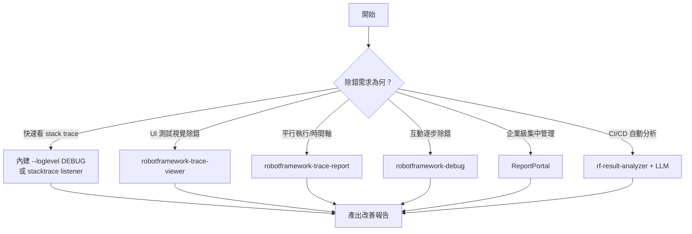

# Robot Framework 報告錯誤追蹤性改善方案

Robot Framework 是廣受使用的開源測試自動化框架，其預設產生之 `report.html` 與 `log.html` 在錯誤發生時，往往無法提供足夠的除錯資訊，導致排查耗時。本報告系統性整理其問題根源，並提出多層次改善方案。

## 既有問題

**1. Python 堆疊追蹤（stack trace）預設隱藏**

錯誤發生時，Robot Framework 僅顯示例外訊息（如 `IndexError: list index out of range`），而不顯示 Python 層級的行號與呼叫鏈[^ug-debug]。使用者只能知道「哪個 keyword 失敗」，卻難以定位底層函式庫的錯誤位置。

**2. 錯誤訊息本身不足以定位問題**

如官方手冊所述：「有時錯誤訊息足以定位問題，但更多時候需要日誌檔案的協助」。對於複雜的關鍵字鏈，單一錯誤字串往往無法提供足夠脈絡[^ug-loglevels]。

**3. 平行執行（pabot）缺乏視覺化時間軸**

使用 pabot 平行執行測試時，標準報告會將結果扁平合併，無法直觀看到各 worker 的執行順序與時間重疊，難以排查並發造成的競爭問題。

**4. 日誌檔案過大且難以導覽**

大量測試案例與關鍵字的 `log.html` 極易變得龐大，雖有 `--splitlog` 參數，但深入層層關鍵字樹尋找根本原因仍相當不便[^ug-removekeywords]。

**5. 整合外部可觀測性工具之門檻高**

內建報告為獨立 HTML 檔案，難以與集中式儀表板、分析平台或告警系統整合。

## 改善方案

### 層級一：內建功能調校（無需安裝額外套件）

**使用較低日誌層級以揭露堆疊追蹤**

Robot Framework 預設以 INFO 層級執行，但當 keyword 失敗時，完整的 Python traceback 會以 DEBUG 層級自動記錄。將 `--loglevel` 設為 DEBUG 或 TRACE 即可讓這些資訊出現在 log.html 中[^ug-loglevels]：

```bash
robot --loglevel DEBUG tests.robot
robot --loglevel TRACE tests.robot   # 更詳細，含變數值
```

可混合設定顯示層級，避免檢視時被大量 TRACE 訊息淹沒：

```bash
robot --loglevel DEBUG:INFO tests.robot
# 執行時使用 DEBUG，但 log.html 預設只顯示 INFO+ 層級
```

**啟用系統日誌（syslog）**

系統日誌為純文字檔案，記錄 imported libraries、執行的 suites/tests、以及建立的 artifacts，對排查 library import 失敗或框架層級問題特別有用[^ug-syslog]：

```bash
export ROBOT_SYSLOG_FILE=/tmp/syslog.txt
export ROBOT_SYSLOG_LEVEL=DEBUG
robot tests.robot
```

**使用 debug file**

```bash
robot --debugfile debug.txt tests.robot
```

產生的純文字檔案記錄所有 library 訊息及 suites/tests/keywords 的開始與結束事件[^ug-debug]。

**善用 `--removekeywords` 與 `--flattenkeywords` 減少雜訊**

```bash
robot --removekeywords passed tests.robot   # 只保留失敗案例關鍵字細節
robot --flattenkeywords FOR tests.robot      # 扁平化 FOR 迴圈結構
```

前者讓失敗案例的除錯資訊不再埋沒於大量通過案例中，後者讓迴圈迭代不再逐一展開[^ug-removekeywords]。

**使用 `--expandkeywords` 自動展開重要關鍵字**

若有傳遞關鍵除錯資訊（如螢幕截圖）的關鍵字，可自動展開：

```bash
robot --expandkeywords name:SeleniumLibrary.CapturePageScreenshot tests.robot
```

### 層級二：自訂 Listener 取得詳細錯誤資訊

**方案 A：使用 `get_error_details()` 自訂 Listener**

透過 `robot.utils.error.get_error_details(full_traceback=True)` 可取得完整 traceback，在不更動全域日誌層級的情況下將詳細錯誤資訊寫入 log.html[^custom-traceback]：

```python
from robot.api import logger as robot_logger
from robot.utils.error import get_error_details

class ExceptionTracebackListener:
    ROBOT_LISTENER_API_VERSION = 3

    def end_keyword(self, data, result):
        if result.status == "FAIL":
            msg, tb = get_error_details(full_traceback=True)
            robot_logger.info(f"keyword failed: {msg}\n{tb}")
```

啟用方式：

```bash
robot --listener path/to/ExceptionTracebackListener tests.robot
```

**方案 B：使用 `robotframework-stacktrace`**

社群套件，直接列印完整 Python 風格堆疊追蹤至 console，並顯示已解析的變數值[^stacktrace]：

```bash
pip install robotframework-stacktrace
robot --listener RobotStackTracer tests.robot
```

範例輸出：

```
Traceback (most recent call last):
    File  tests/my_test.robot:23
    T:  Configure Car with Pass
    File  tests/my_test.robot:28
      Select aMinigolf as model
    File  resources/keywords.resource:14
      Select Options By    ${select_CarBaseModel}    text    ${basemodel}
      |  ${select_CarBaseModel} = "Basismodell"
      |  ${basemodel} = aMinigolf (str)
```

### 層級三：視覺化 Trace 工具

**`robotframework-trace-viewer`：每步視覺狀態捕捉**

一個 listener 插件，可在每次關鍵字執行時捕捉螢幕截圖、DOM 快照、網路請求與變數值，並產生互動式 HTML 報告[^trace-viewer]：

```bash
pip install robotframework-trace-viewer
robot --listener "trace_viewer.TraceListener:capture_mode=on_failure" tests/
```

主要功能：

- **逐關鍵字螢幕截圖**（viewport 或全頁）— 看到每一步的瀏覽器狀態
- **DOM 快照** — 可在關鍵字邊界檢查 HTML 結構
- **網路請求記錄** — 經 CDP 或 Playwright 捕捉 HTTP 請求/回應
- **Console log 捕捉** — 每一步的瀏覽器主控台輸出
- **變數追蹤** — Robot Framework 變數快照，支援敏感資料遮罩
- **On-failure 模式** — Ring buffer 僅在記憶體保留最近 N 步，只有失敗時才寫入磁碟，通過測試零 I/O
- **Trace 比較** — 像素級視覺差異比對
- **GIF 重播** — 從截圖產生動畫 GIF
- **Pabot 支援** — 合併平行 trace 至統一時間軸

**`robotframework-trace`：命令列即時回饋**

提供命令列的即時進度顯示，無須開啟 HTML 檔案即可除錯[^cli-trace]：

```bash
pip install robotframework-trace
trace run tests/
```

**`robotframework-trace-report`：時間軸視覺化報告**

基於 OpenTelemetry 的報告產生器，支援從 `output.xml` 或 OTLP traces 產生互動式 HTML，具備時間軸/Gantt 視覺化，特別適合平行執行場景[^trace-report]：

```bash
pip install robotframework-trace-report
rf-trace-report output.xml -o report.html   # 從 output.xml 產生
rf-trace-report traces.json --live           # 即時自動重新整理
rf-trace-report compare output1.xml output2.xml  # 比較不同執行
```

特色：

| 功能 | 標準 report.html | rf-trace-report |
|------|-----------------|-----------------|
| 從 output.xml 產生 | ✅ | ✅ |
| 即時更新 | ❌ | ✅ |
| 時間軸 / Gantt 視覺化 | ❌ | ✅ |
| 平行執行檢視 | ❌（扁平合併） | ✅（worker 獨立跑道） |
| 失敗分類與錯誤麵包屑 | ❌ | ✅ |
| Deep links 至精確狀態 | ❌ | ✅ |
| 暗色模式 | ❌ | ✅ |
| MCP AI 分析 | ❌ | ✅ |

### 層級四：OpenTelemetry 企業級可觀測性

**`robotframework-tracer`：分散式追蹤**

建立完整的 suite → test → keyword 層級作為 OpenTelemetry spans，匯出至 Jaeger、SigNoz、Grafana Tempo 等後端[^tracer]：

```bash
pip install robotframework-tracer
robot --listener robotframework_tracer.TracingListener tests/
```

功能包含完整測試層級 span（含 timing、arguments、status）、經 OTLP Logs API 的日誌捕捉與 trace 關聯、以及向外傳播 trace context（透過 `${TRACE_HEADERS}` 變數傳遞至被測系統）。

**ReportPortal：AI 驅動測試儀表板**

整合 Robot Framework 至 ReportPortal，提供集中式測試結果聚合、趨勢分析與 AI 缺陷建議[^reportportal]：

```bash
pip install robotframework-reportportal
robot --listener robotframework_reportportal.listener \
      --variable RP_ENDPOINT:"your_reportportal_url" \
      --variable RP_LAUNCH:"launch_name" \
      --variable RP_PROJECT:"reportportal_project_name" \
      --variable RP_API_KEY:"your_user_api_key"
```

**`robotframework-reportlens`：輕量現代報告**

將 `output.xml` 轉換為現代化互動式 HTML，僅需 Python 3.10+ 標準函式庫[^reportlens]：

```bash
pip install robotframework-reportlens
reportlens output.xml -o report.html
```

### 層級五：互動式除錯

**`robotframework-debug`：中斷點除錯器**

提供三種使用模式[^debug]：

- **REPL 模式**：`irobot` 互動式 shell，可嘗試關鍵字與檢查變數
- **Library 模式**：在測試中插入 `Debug` 關鍵字作為中斷點

```robotframework
*** Settings ***
Library    RobotDebug

*** Test Cases ***
My Test
    Debug     # 在此暫停，開啟互動式 shell
```

- **Listener 模式**：`robot --listener RobotDebug.Listener tests/` — 測試失敗時自動中斷並開啟互動式 shell

支援 `F7`（跳入）、`F8`（跳過）、`F9`（跳出）、`F10`（繼續）的逐步除錯。

### 層級六：AI 輔助失敗分析

**`rf-result-analyzer`：LLM 驅動分析**

Listener 產生人類可讀的摘要檔案（`.txt`），可送至 LLM（透過 Ollama/AnythingLLM）進行自動化失敗分析與改善建議[^analyzer]：

```bash
pip install rf-result-analyzer
robot --listener RobotFrameworkResultAnalyzer tests/
# 接著送 LLM：invoke demo -a
```

## 建議採用策略



## 結論

改善 Robot Framework 錯誤追蹤性無需單一方案，而是依情境組合使用。日常開發可從 `--loglevel DEBUG` 與 `--removekeywords passed` 開始；UI 測試強烈建議導入 `robotframework-trace-viewer` 以捕捉視覺狀態；團隊協作則可採用 `robotframework-trace-report` 或 ReportPortal 建立集中式儀表板。最深層的除錯需求可由 `robotframework-debug` 的互動式 shell 滿足。

---

[^ug-debug]: Robot Framework. (n.d.). Robot Framework User Guide — Debugging problems. Retrieved 2026-09-27, from https://robotframework.org/robotframework/latest/RobotFrameworkUserGuide.html

[^ug-loglevels]: Robot Framework. (n.d.). Robot Framework User Guide — Different log levels. Retrieved 2026-09-27, from https://robotframework.org/robotframework/latest/RobotFrameworkUserGuide.html

[^ug-removekeywords]: Robot Framework. (n.d.). Robot Framework User Guide — Removing and flattening keywords. Retrieved 2026-09-27, from https://robotframework.org/robotframework/latest/RobotFrameworkUserGuide.html

[^ug-syslog]: Robot Framework. (n.d.). Robot Framework User Guide — System log. Retrieved 2026-09-27, from https://robotframework.org/robotframework/latest/RobotFrameworkUserGuide.html

[^ug-debug]: Robot Framework. (n.d.). Robot Framework User Guide — Debug file. Retrieved 2026-09-27, from https://robotframework.org/robotframework/latest/RobotFrameworkUserGuide.html

[^custom-traceback]: Julius. (n.d.). Robot Framework Logging Full Traceback of Errors and Exceptions. Retrieved 2026-09-27, from https://www.juliusunscripted.com/posts/robotframework-logging-full-traceback-of-errors-and-exceptions/

[^stacktrace]: MarketSquare. (n.d.). robotframework-stacktrace. Retrieved 2026-09-27, from https://github.com/MarketSquare/robotframework-stacktrace

[^trace-viewer]: thearchit3ct. (n.d.). robotframework-trace-viewer. Retrieved 2026-09-27, from https://github.com/thearchit3ct/robotframework-trace-viewer

[^cli-trace]: jonsim. (n.d.). robot-trace — Robot Framework CLI Frontend. Retrieved 2026-09-27, from https://pypi.org/project/robotframework-trace/

[^trace-report]: xtergo. (n.d.). robotframework-trace-report. Retrieved 2026-09-27, from https://github.com/xtergo/robotframework-trace-report

[^tracer]: tridentsx. (n.d.). robotframework-tracer. Retrieved 2026-09-27, from https://pypi.org/project/robotframework-tracer/

[^reportportal]: ReportPortal. (n.d.). Robot Framework Integration — ReportPortal. Retrieved 2026-09-27, from https://reportportal.io/docs/log-data-in-reportportal/test-framework-integration/Python/RobotFramework/

[^reportlens]: robotframework-reportlens. (n.d.). Retrieved 2026-09-27, from https://pypi.org/project/robotframework-reportlens/

[^debug]: imbus. (n.d.). robotframework-debug. Retrieved 2026-09-27, from https://github.com/imbus/robotframework-debug/

[^analyzer]: Atihinen. (n.d.). rf-result-analyzer. Retrieved 2026-09-27, from https://github.com/Atihinen/rf-result-analyzer