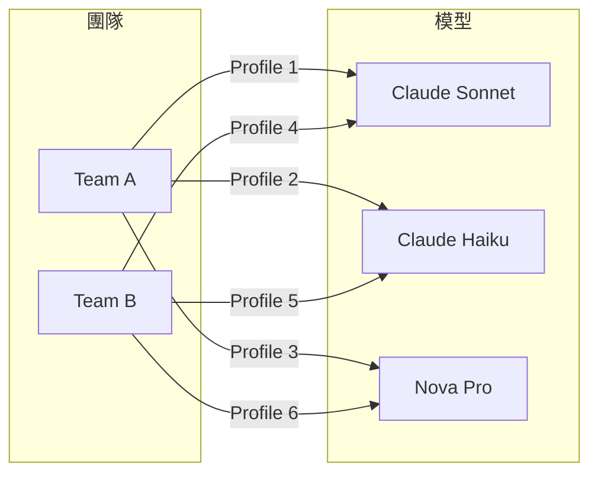

# AWS Bedrock：Application Inference Profile 的 Profile 擴散問題與 Projects 替代方案

## 問題背景

AWS Bedrock 提供 **Application Inference Profile（應用程式推論設定檔）** 作為成本追蹤與用量監控的機制。每個 Profile 與特定的模型繫結，並可搭配 AWS 標籤（Tag）來歸屬成本至團隊或專案[^aip]。

然而這種設計在組織擴張時會產生一個結構性問題：

> **每個 Application Inference Profile 都與特定模型繫結。** 這表示您需要針對模型、團隊和標籤集的每個唯一組合建立個別的設定檔。隨著組織的成長，設定檔計數可能會快速增加，尤其是當新的模型版本需要新的設定檔時。[^aip-zh-tw]

## Profile 擴散的組合爆炸

當一個組織中有多個團隊（Team A、Team B）使用多個模型（Claude Sonnet、Claude Haiku、Nova Pro）時，Profile 數量會呈現**組合性增長**：

若有 5 個團隊 × 10 個模型版本 = **50 個 Profiles**。每當新模型版本推出，數量再線性成長。

## 官方建議：使用 Projects

AWS 官方文件明確建議：

> **若要減少設定檔擴散：建議：使用專案（Projects）可在成本追蹤時靈活且輕鬆。**[^aip-zh-tw]

此建議出現在 `bedrock-runtime` 端點的 Inference Profile 文件中，指引使用者轉向 `bedrock-mantle` 端點的 Projects 功能。

## Projects 的彈性從何而來

Projects 與 Inference Profiles 的本質差異在於**繫結對象不同**：

| 面向 | Application Inference Profile | Project |
|---|---|---|
| **繫結對象** | 特定模型（綁死） | 團隊 / 應用 / 環境（邏輯邊界） |
| **Endpoint** | `bedrock-runtime` | `bedrock-mantle` |
| **API 風格** | 原生 Bedrock API（Converse、InvokeModel） | OpenAI 相容 API（Responses、Chat Completions）[^projects] |
| **成本歸屬** | 依賴 Profile 上的 Tag | 每次請求強制關聯 Project，自動歸屬 |
| **存取控制** | IAM policy 綁定 Profile ARN | IAM policy 綁定 Project ARN，可精細到每個團隊 |
| **數量上限** | 無明確上限但有組合爆炸問題 | 每個帳號最多 1,000 個 Projects[^projects] |

Projects 的「靈活」體現在三個層面：

### 1. 模型與團隊解耦

Projects 不綁特定模型，一個 Project 可以涵蓋該團隊使用的所有模型。以同樣的 5 團隊 × 10 模型情境：

- **Inference Profiles**：50 個 Profiles（組合數）
- **Projects**：5 個 Projects（線性數）

新模型版本的推出不需要建立新的 Projects，既有的 Project 直接適用。

### 2. 存取隔離與環境分離

Projects 是 IAM 中的一等資源（first-class resource），可以針對每個 Project 設定精細的存取政策。例如 Team A 的成員無法透過 Team B 的 Project 呼叫模型[^projects]。

同時可自然建立 Prod / Staging / Dev 等環境層級的 Projects，而不需為每個環境重複建立 Profile 組合[^projects]。

### 3. 成本歸屬自動化

Inference Profile 的成本歸屬依賴開發者正確設定 Tag，容易出現遺漏或誤標。Projects 則將每次請求**強制**與特定 Project 關聯，成本自動歸屬至正確的團隊或應用[^projects]。

## 限制與注意事項

Projects 並非萬能，使用前需考量以下限制：

| 限制 | 說明 |
|---|---|
| **僅支援 bedrock-mantle 端點** | 無法與原生 Bedrock API（InvokeModel、Converse）直接整合[^projects] |
| **無內建跨區域推論** | Inference Profile 支援跨區域路由，Projects 則需自行指定區域端點[^aip] |
| **無 Knowledge Base / Flows 整合** | 這些功能依附於 bedrock-runtime 端點的 Inference Profile[^aip] |
| **需使用 OpenAI 相容 SDK** | 若應用已使用原生 Bedrock SDK，遷移需要額外工作[^projects] |

## 結論

AWS 官方建議「使用 Projects 替代 Inference Profiles 以獲得更大彈性」的核心含義是：

**Inference Profile 綁定特定模型，導致數量隨團隊與模型組合線性成長；Project 則以團隊/應用為邏輯邊界，模型選擇是其中的參數而非資源定義，從根本上消除 Profile 擴散問題。**

選擇策略：

- 若使用 **bedrock-runtime**（原生 Bedrock API）且場景單純 → 可繼續使用 Inference Profile + Tag
- 若使用 **bedrock-mantle**（OpenAI 相容 API）或有多團隊/多環境需求 → 建議採用 Projects
- 若需要**跨區域推論**或與 **Knowledge Base / Flows** 整合 → 必須使用 Inference Profile[^compare]

---

[^aip]: AWS. (n.d.). Application inference profiles. Retrieved 2026-09-26, from https://docs.aws.amazon.com/bedrock/latest/userguide/cost-mgmt-application-inference-profiles.html

[^aip-zh-tw]: AWS. (n.d.). 應用程式推論設定檔. Retrieved 2026-09-26, from https://docs.aws.amazon.com/zh_tw/bedrock/latest/userguide/cost-mgmt-application-inference-profiles.html

[^projects]: AWS. (n.d.). 專案 (OpenAI-compatible). Retrieved 2026-09-26, from https://docs.aws.amazon.com/zh_tw/bedrock/latest/userguide/projects.html

[^compare]: AWS. (n.d.). Projects vs. inference profiles. Retrieved 2026-09-26, from https://docs.aws.amazon.com/bedrock/latest/userguide/projects.html