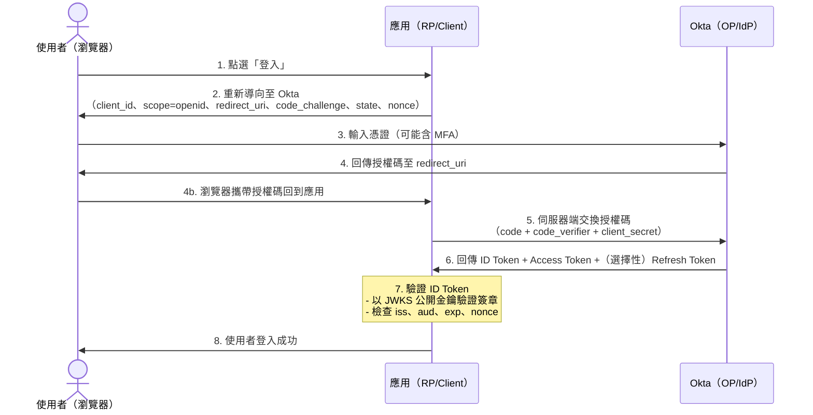

# Okta OIDC（OpenID Connect）調查報告

## 概述

本報告說明 Okta 與 OpenID Connect（OIDC）的關係，以及 Okta 如何作為 OpenID Provider 實現 OIDC 認證協定。目標讀者為需要了解 Okta OIDC 基本概念、流程與使用場景的開發者或技術決策者。

---

## 1. Okta 是什麼

Okta, Inc. 是一家成立於 2009 年的美國**身分與存取管理（IAM）** 雲端軟體公司，Nasdaq 代號 OKTA。其核心功能是協助企業集中管理使用者認證與授權，包括[^wiki]：

- **單一登入（SSO）** — 一次登入即可存取多個 SaaS 應用（Gmail、Slack、Salesforce 等）
- **多因子認證（MFA）**
- **API 認證服務**
- **使用者生命週期管理**（入職佈建／離職撤銷）

Okta 於 2021 年以 65 億美元收購 Auth0，截至 2026 年約有 6,300 名員工、年收入約 29 億美元。

---

## 2. OpenID Connect（OIDC）是什麼

OpenID Connect 是建構在 **OAuth 2.0** 授權框架之上的**認證協定**。OpenID Foundation 將其定位為[^oidc]：

> 「OpenID Connect 透過簡易整合與支援、安全且保護隱私的設定、互通性、廣泛的客戶端與裝置支援，以及允許任何實體成為 OpenID Provider，來實現身分生態系統。」

### OAuth 2.0 vs OIDC 的關鍵差異

| 協定 | 回答的問題 | 核心產出 |
|---|---|---|
| **OAuth 2.0** | 「這個應用可以存取什麼？」（授權） | Access Token（API 權限） |
| **OIDC** | 「這個使用者是誰？」（認證） | ID Token（已驗證身分） |

OIDC 重用 OAuth 2.0 的 redirect flow 與 token 機制，並在其上增加一個**標準化的身分層**。最重要的新增元件是 **ID Token**——一個經簽署的 JSON Web Token（JWT），包含使用者身分的已驗證宣告（姓名、email、認證時間等）[^okta-oidc]。

### OIDC 核心元件

| 元件 | 角色 |
|---|---|
| **End User** | 被認證的使用者 |
| **Relying Party (RP) / Client** | 發起認證請求的應用 |
| **OpenID Provider (OP) / Identity Provider (IdP)** | 認證使用者並簽發 token 的伺服器（如 Okta、Google） |
| **ID Token** | 已簽署的 JWT，包含身分宣告（sub、iss、aud、exp、name、email 等） |
| **Access Token** | 用於呼叫 UserInfo 端點取得額外個人資料 |
| **UserInfo Endpoint** | 以有效 Access Token 查詢後回傳使用者宣告的 API |

### 標準 OIDC 權限範圍（Scopes）

- `openid`（必要）
- `profile`（姓名、大稱、姓氏、大頭貼等）
- `email`（email、email_verified）
- `address`（郵寄地址）
- `phone`（電話號碼）
- `offline_access`（允許 Refresh Token）

---

## 3. Okta 如何實現 OIDC

Okta 是**認證的 OpenID Connect Provider**。其開發文件指出[^okta-dev]：

> 「Okta 是符合標準的 OAuth 2.0 Authorization Server，也是認證的 OpenID Connect Provider。」

### 授權伺服器（Authorization Server）

Okta 透過**授權伺服器**提供 OIDC 端點。每組授權伺服器有唯一的 issuer URI 與專屬簽署金鑰，分為兩類：

| 類型 | Token 時效（可設定與否） |
|---|---|
| **Org Authorization Server** | ID Token：60 分鐘、Access Token：60 分鐘、Refresh Token：90 天（固定） |
| **Custom Authorization Server** | Access Token：5 分鐘～24 小時、Refresh Token：最長 5 年（可自訂） |

### Okta 的 OIDC 端點

- `/authorize` — 使用者認證 & 授權碼簽發
- `/token` — 用授權碼交換 token
- `/userinfo` — 取得使用者宣告
- `/.well-known/openid-configuration` — 自動探索文件
- `/keys`（JWKS）— token 簽章驗證用的公開金鑰

### Okta 支援的 OIDC Flow

| Flow | 建議用途 | 回傳 Token |
|---|---|---|
| **Authorization Code + PKCE** | Web app、SPA、行動 app（最安全，推薦） | ID + Access +（選擇性）Refresh |
| **Interaction Code** | Identity Engine 組織、嵌入式登入 | ID + Access |
| **Implicit（舊版）** | 無法支援 PKCE 的舊瀏覽器應用 | ID +（選擇性）Access |
| **Client Credentials** | M2M（機器對機器，無使用者） | Access 唯獨（無 ID Token） |

Okta 持有的 OpenID Connect 認證涵蓋：Basic OP、Implicit OP、Hybrid OP、Config OP、Form Post OP 等多個 conformance profile[^okta-oidc]。

---

## 4. 常見使用場景

1. **企業 SSO** — 員工登入 Okta 一次即可存取數十個 SaaS 應用，無需重複輸入憑證。
2. **客戶身分（Login with Okta）** — 企業將 Okta 作為客戶面向應用的身分層，類似「Sign in with Google」但以 Okta 為 IdP。
3. **API 安全** — 應用使用 Okta 核發的 OAuth 2.0 Access Token 保護 API，OIDC 讓 API 知道「是誰」在呼叫。
4. **工作者身分管理** — IT 管理員從 Okta 儀表板集中佈建新使用者、強制 MFA、撤銷離職者存取。
5. **聯合身分** — Okta 作為樞紐，連接多種身分來源（AD、Google Workspace、外部 SAML IdP）與多個應用，並在協定間轉譯。
6. **機器對機器認證** — 服務使用 Client Credentials flow 彼此認證，需要身分脈絡時使用 OIDC。
7. **現代應用開發** — 開發者使用 OIDC 函式庫（Node、Python、Java 等）快速為應用加入認證功能。

---

## 5. 高層級認證流程（Authorization Code + PKCE）

下圖展示 Okta OIDC 最常見的認證流程：

### 逐步說明

1. **使用者發起登入** — 點選應用上的「登入」按鈕。
2. **應用重新導向至 Okta** — 應用建構一個指向 Okta `/authorize` 端點的 URL，包含 `client_id`、`response_type=code`、`scope=openid`、`redirect_uri`、`code_challenge`（PKCE 防護）與 `state`（CSRF 防護）及 `nonce`（重播攻擊防護）[^okta-dev]。
3. **使用者在 Okta 認證** — Okta 呈現登入頁面，使用者輸入密碼（可能加上 MFA 或生物辨識）。**應用從未接觸使用者憑證**。
4. **Okta 回傳授權碼** — 認證成功後，Okta 將使用者瀏覽器重新導向回應用的 `redirect_uri`，並附上一組短期有效的授權碼。
5. **應用交換授權碼** — 應用伺服器將授權碼 + `code_verifier` 發送至 Okta 的 `/token` 端點。此為**伺服器對伺服器**呼叫，瀏覽器不介入，防止攔截。
6. **Okta 簽發 Token** — 驗證 code 與 verifier 後回傳：
   - **ID Token**（JWT）— 包含身分宣告，以 RS256 簽署
   - **Access Token**（JWT）— 用於呼叫 API 與 `/userinfo`
   - **Refresh Token**（不透明）— 用於取得新的 Access Token
7. **應用驗證 ID Token** — 從 Okta 的 JWKS 端點取得公開金鑰，驗證簽章，檢查 `iss`（issuer）、`aud`（audience，須等於 client ID）、`exp`（有效期）、`nonce`。
8. **使用者登入完成** — 應用建立 session，使用者獲得存取權限。應用信任使用者身分，因為 Okta 的密碼簽署已驗證其身分。

---

## 6. 安全性重點

- **應用永不處理密碼**，僅接收 Okta 簽署的 token
- **PKCE** 防止授權碼攔截攻擊
- **state** 防止 CSRF
- **nonce** 防止 ID Token 重播攻擊
- 所有 token 傳輸僅透過 HTTPS（TLS）

---

## 參考文獻

[^wiki]: Wikipedia. (n.d.). *Okta (company)*. Retrieved 2026-10-01, from https://en.wikipedia.org/wiki/Okta,_Inc.
[^oidc]: OpenID Foundation. (n.d.). *How OpenID Connect Works*. Retrieved 2026-10-01, from https://openid.net/developers/how-connect-works/
[^okta-oidc]: Okta, Inc. (n.d.). *OpenID Connect*. Retrieved 2026-10-01, from https://www.okta.com/openid-connect/
[^okta-dev]: Okta, Inc. (n.d.). *OAuth 2.0 & OpenID Connect for developers*. Retrieved 2026-10-01, from https://developer.okta.com/docs/concepts/oauth-openid/
[^okta-api]: Okta, Inc. (n.d.). *OAuth 2.0 Overview*. Retrieved 2026-10-01, from https://developer.okta.com/docs/api/openapi/okta-oauth/guides/overview
[^duo]: Duo Security. (n.d.). *What is OIDC?*. Retrieved 2026-10-01, from https://duo.com/learn/what-is-oidc