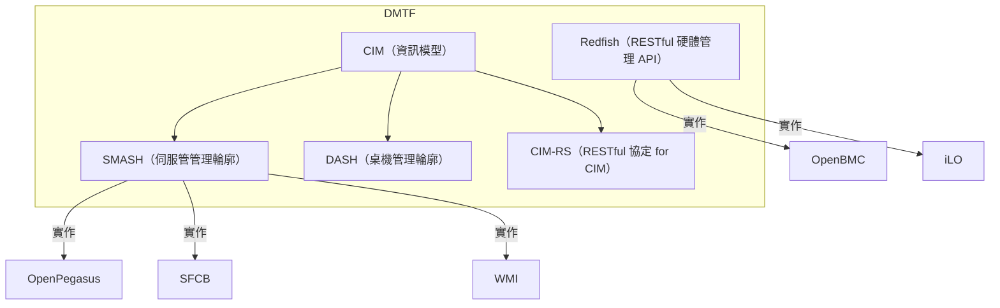

# DMTF CIM（Common Information Model）とは何か、以及其實用方式 — 與 Redfish 的比較

## 概要

DMTF（Distributed Management Task Force）所制定的 CIM（Common Information Model）是一種以 UML 為基礎的物件導向資訊模型標準，旨在為 IT 管理對象提供統一且中立的表達方式。本報告說明 CIM 的基本概念、實作型態、實際應用案例，並與同屬 DMTF 家族的 Redfish 進行比較。

## 1. CIM 的基本概念與目的

CIM 是 DMTF 於 1999 年開始制定的開放標準，採用 UML（Unified Modeling Language）為基礎的物件導向模型[^dmtf-cim]。其核心目標是：管理軟體只需編寫一次，即可在不同供應商與平台的實作上運作，無需複雜且昂貴的轉換作業[^wiki-cim]。CIM 被比喻為 IT 管理領域的「共通語言」，橫跨系統、網路、應用程式與服務。

CIM 是 **Web-Based Enterprise Management（WBEM）** 倡議的資料模型部分，WBEM 由三層構成：「CIM（資料模型）＋ CIM-XML（編碼方式）＋ HTTP（傳輸協定）」[^dmtf-wbem-faq]。

## 2. CIM 的構成要素

### Infrastructure Specification（基礎規格）

定義整體架構與語言。管理對象以 UML 為基礎，透過以下元素表達[^dmtf-cim]：

- **類別（Class）** — 管理對象的種類
- **屬性（Property）** — 屬性值
- **方法（Method）** — 操作
- **關聯（Association）** — 類別間的關係
- **指示（Indication）** — 事件通知

### Schema（結構定義）

分層的模型定義，包含三層[^wiki-cim]：

| 層級 | 說明 | 類別範例 |
|---|---|---|
| **Core Model** | 所有抽象基礎類別 | `ManagedSystemElement`, `LogicalElement`, `System`, `Service` |
| **Common Model** | 各技術領域基本類別 | Systems, Devices, Applications, Networks, Physical 各模型 |
| **Extension Schemas** | 供應商擴展用 | 各供應商特有的子類別 |

具體類別（來自 SBLIM/Linux 實作）[^sblim-providers]：

- `CIM_ComputerSystem` — 電腦系統整體
- `CIM_OperatingSystem` — 作業系統
- `CIM_Process` / `CIM_UnixProcess` — 行程（程序）
- `CIM_DataFile` — 檔案
- `Linux_Ext4FileSystem` — Ext4 檔案系統（Linux 擴展）
- `Linux_Service` — 系統服務（`CIM_Service` 的衍伸）
- `CIM_ResourcePool` — 資源池

### Management Profile（管理輪廓）

為特定管理領域定義必要類別、屬性與方法的集合[^dmtf-smash]：

- **SMASH 輪廓** — 伺服器管理用（電源狀態、CPU、風扇、記憶體、感測器等）
- **DASH 輪廓** — 桌機/行動裝置管理用

### 通訊協定

CIM 資料可透過三種協定存取[^dmtf-cim]：

| 協定 | 方式 | 特徵 |
|---|---|---|
| **CIM-XML** | HTTP + XML RPC | WBEM 基本協定 |
| **WS-Management** | SOAP/HTTP | Web 服務基礎，防火牆友善 |
| **CIM-RS** | RESTful（JSON） | 對所有符合 CIM Metamodel 的實作提供 REST 存取 |

## 3. CIM 與 Redfish 的關係

CIM 與 Redfish 同屬 DMTF 家族，但 **彼此獨立**。Redfish **並非**基於 CIM Schema，而是獨立設計的標準[^hpe-redfish-diff]。

| 項目 | CIM | Redfish |
|---|---|---|
| **開始年份** | 1999 年 | 2014 年（v1.0: 2015 年） |
| **目的** | IT 環境整體的統一管理資訊模型 | 伺服器/儲存/網路硬體的 RESTful 管理 API |
| **資料模型** | UML 基礎的 CIM Schema（類別/屬性/關聯） | CSDL（XML）/ JSON Schema 自訂定義（DSP0268） |
| **協定** | CIM-XML（RPC）、WS-Management（SOAP）、CIM-RS（REST） | RESTful（HTTPS + JSON + OData v4） |
| **編碼** | XML 為主 | JSON 為主 |
| **主要對象** | 系統/網路/應用/服務管理（泛用） | BMC 頻外硬體管理（特化） |
| **實作範例** | WMI（Windows）、SBLIM/SFCB（Linux）、OpenPegasus | OpenBMC、iLO（HPE）、iDRAC（Dell）、XCC（Lenovo） |

根據 HPE 的說明，DMTF 擁有多個與伺服器管理相關的標準，CIM 實作為 Linux 上的 OpenPegasus 與 Windows 上的 WMI，而 Redfish 則是以現代 REST + JSON + 自我描述的方式從零開始設計[^hpe-redfish-diff]。

值得一提的是，DMTF 後來也制定了 **CIM-RS**（CIM Operations Over RESTful Services）[^dmtf-cimrs]，這是一個「對所有符合 CIM Metamodel 的實作提供 RESTful 存取」的協定，概念上與 Redfish 相似，但它是基於 CIM 之上，與 Redfish 是獨立發展的。

## 4. 實際供應商實作範例

### Microsoft Windows — WMI（Windows Management Instrumentation）

自 Windows 2000 起標準配備。Microsoft 將 WMI 定位為「WBEM 與 CIM 標準的 Microsoft 實作」[^ms-wmi]。可透過 PowerShell 存取 CIM 類別。

### Linux — SBLIM（Standards Based Linux Instrumentation for Manageability）

SBLIM 專案提供輕量級 CIM 伺服器 **SFCB（Small Footprint CIM Broker）**，標準配備於 SUSE Linux Enterprise Server（SLES）[^suse-wbem]。組成如下：

- **SFCB** — 輕量 CIM 伺服器（連接埠 5989/HTTPS, 5988/HTTP）
- **CMPI Providers** — 與硬體直接互動的提供者群
- **Provider 範例** — `Linux_ComputerSystem`, `Linux_OperatingSystem`, `Linux_UnixProcess`, `Linux_BaseBoard`, `Linux_Ext4FileSystem`, `Linux_Service` 等[^sblim-providers]

### OpenPegasus（開放原始碼）

IBM 主導的 C++ 實作，完整的 CIM/WBEM 伺服器。提供 CIM 儲存庫、提供者介面（CMPI）、事件通知等功能[^ibm-cim]。

### SNIA SMI-S（儲存管理）

Storage Networking Industry Association（SNIA）制定的儲存管理標準。以 CIM/WBEM 為基礎，超過 500 項產品實作，並獲 ISO 國際標準認可[^snia-smi-s]。

### Oracle ILOM 與 VMware OMC

Oracle ILOM 透過 WS-Management 提供 SMASH 輪廓與 CIM 類別的支援[^oracle-ilom]。VMware 提供 OMC（Open Management with CIM）作為 SMASH 標準的開放原始碼實作[^vmware-omc]。

## 5. 主要使用案例

### 企業伺服器管理（SMASH）

以統一模型進行伺服器電源狀態管理、CPU/記憶體/風扇/感測器監控。Cisco UCS、Oracle ILOM、VMware 皆實作 SMASH + CIM[^dmtf-smash][^oracle-ilom]。

### 桌機/行動裝置管理（DASH）

做為 SMASH 的兄弟規格，提供桌機 PC 與筆記型電腦的遠端管理[^dmtf-cim]。

### 儲存管理（SMI-S）

針對 SAN（Storage Area Network）的異質混合管理，超過 500 項儲存產品支援[^snia-smi-s]。

### 整合系統管理（WBEM）

SUSE Linux Enterprise Server 的 SFCB 提供整合管理，包含庫存管理、效能監控、事件通知[^suse-wbem]。

### Windows 管理（WMI）

透過 PowerShell 指令對 Windows 伺服器/用戶端進行統一管理，可遠端處理行程管理、檔案系統監控、硬體庫存等[^ms-wmi]。

## 總結

CIM 的核心在於「如何表達管理對象」—— 也就是資訊模型本身的標準化，涵蓋 OS、應用程式、網路、儲存等領域，以統一的類別模型進行管理。Redfish 的核心則在於「如何透過 REST API 操作硬體」—— 是 BMC 特化的平台管理 API，不與 CIM 共用資料模型。兩者雖同屬 DMTF 家族，但採取不同的途徑與目標領域。CIM 也擁有 CIM-RS 這類 RESTful 介面，但那是在 CIM 模型之上的協定，與 Redfish 各為獨立標準。

[^dmtf-cim]: DMTF. (n.d.). DMTF CIM Standards. Retrieved 2026-01-10, from https://www.dmtf.org/standards/cim
[^wiki-cim]: Wikipedia. (n.d.). Common Information Model (computing). Retrieved 2026-01-10, from https://en.wikipedia.org/wiki/Common_Information_Model_(computing)
[^dmtf-wbem-faq]: DMTF. (n.d.). WBEM FAQ. Retrieved 2026-01-10, from https://www.dmtf.org/about/faq/wbem_faq
[^dmtf-smash]: DMTF. (n.d.). DMTF SMASH Standards. Retrieved 2026-01-10, from https://www.dmtf.org/standards/smash
[^dmtf-cimrs]: DMTF. (n.d.). DMTF CIM-RS Working Group. Retrieved 2026-01-10, from https://www.dmtf.org/standards/cimrs
[^hpe-redfish-diff]: HPE. (n.d.). Why is Redfish different? Part 1. Retrieved 2026-01-10, from https://servermanagementportal.ext.hpe.com/docs/references_and_material/blogposts/why_is_redfish_different/why_is_redfish_different_part1
[^ms-wmi]: Microsoft. (n.d.). Common Information Model — Windows Management Instrumentation SDK. Retrieved 2026-01-10, from https://learn.microsoft.com/en-us/windows/win32/wmisdk/common-information-model
[^suse-wbem]: SUSE. (n.d.). WBEM/SFCB Management — SLES Administration Guide. Retrieved 2026-01-10, from https://documentation.suse.com/sles/15-SP7/html/SLES-all/cha-wbem.html
[^sblim-providers]: SBLIM. (n.d.). SBLIM Provider Releases. Retrieved 2026-01-10, from https://sourceforge.net/projects/sblim/files/providers/
[^ibm-cim]: IBM. (n.d.). CIM introduction — z/OS Concepts. Retrieved 2026-01-10, from https://www.ibm.com/docs/en/zos/2.2.0?topic=concepts-introduction
[^snia-smi-s]: SNIA. (n.d.). Storage Management Initiative Specification. Retrieved 2026-01-10, from https://www.snia.org/storage-management-initative-specification-releases
[^oracle-ilom]: Oracle. (n.d.). Integrated Lights Out Manager — SMASH Profile and CIM Classes. Retrieved 2026-01-10, from https://docs.oracle.com/cd/E24707_01/html/E24528/z40003481394725.html
[^vmware-omc]: VMware. (n.d.). Introduction to the CIM SMASH Server Management API. Retrieved 2026-01-10, from https://techdocs.broadcom.com/us/en/vmware-cis/vsphere/vsphere-sdks-tools/7-0/cim-smash-server-management-api-programming-guide/introduction-to-the-cim-smash-server-management-api.html