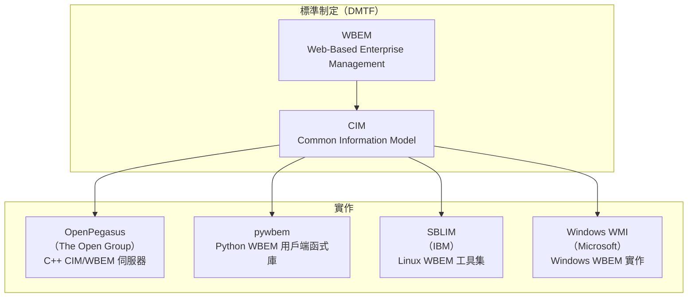
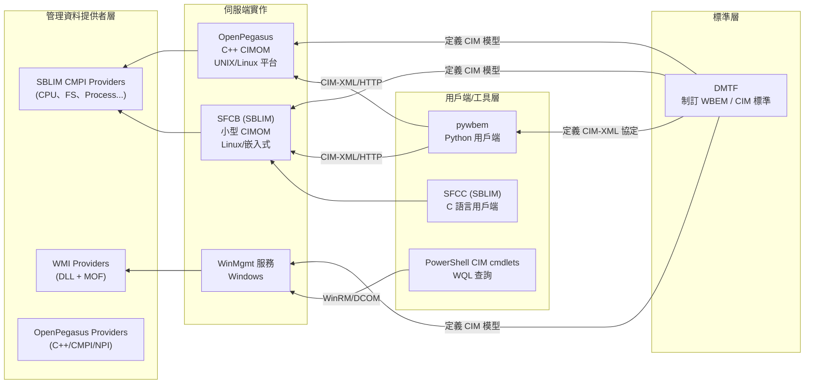

# pywbem、OpenPegasus、SBLIM、Microsoft Windows WMI 簡介

本報告說明四個與 WBEM (Web-Based Enterprise Management) 標準相關的專案或實作：**pywbem**（Python 用戶端函式庫）、**OpenPegasus**（開放原始碼 C++ CIM/WBEM 仲介伺服器）、**SBLIM**（IBM 發起的 Linux WBEM 工具集）、以及 **Microsoft Windows WMI**（微軟在 Windows 上的 WBEM 實作）。文中解釋各者的定位、用途、彼此關係及現狀。

## 背景：WBEM 與 DMTF 標準

**WBEM (Web-Based Enterprise Management)** 是由 **DMTF (Distributed Management Task Force)** 制訂的一套管理標準，旨在透過標準化的資料模型與通訊協定，統一異質環境中的系統管理[^dmtf-wbem]。WBEM 包含三個核心組成：

- **CIM (Common Information Model)** — 以物件導向方式描述管理資源（如 CPU、磁碟、程序、服務）的資料模型[^dmtf-cim]
- **CIM-XML** — 以 XML 編碼管理資料的格式規範
- **CIM Operations over HTTP** — 用戶端與伺服端之間通訊的傳輸協定

WBEM 最初由 BMC Software、Cisco、Compaq、Intel 與 Microsoft 於 1996 年共同發起[^wiki-wbem]，目的是為了解決當時各家管理系統（SNMP、DMI、CMIP 等）無法互通的问题。

以下四個專案/實作均屬於 WBEM 生態系：

## pywbem

**pywbem** 是 WBEM 用戶端 API 的 **Python 實作**，其名稱來自 "py"（Python）+ "WBEM"[^pywbem-intro]。它提供一套純 Python 的用戶端工具，讓開發者能夠透過 CIM-XML 協定與遠端 WBEM 伺服器（如 OpenPegasus、SFCB）通訊，執行管理操作與接收事件通知[^pywbem-docs]。

### 主要功能

| 功能 | 說明 |
|------|------|
| **用戶端函式庫** | 支援 EnumerateInstances、GetInstance、CreateInstance、ModifyInstance、DeleteInstance、InvokeMethod 等標準 WBEM 操作 |
| **Pull / Iter 操作** | 支援大量資料的分頁拉取（pull pattern）與 Python 生成器（generator）自動協商 |
| **Indication 監聽器** | 接收來自 WBEM 伺服器的非同步事件通知（indications） |
| **訂閱管理** | 建立、管理 indication 的訂閱、過濾器與監聽端點 |
| **MOF 編譯器** | 將 MOF (Managed Object Format) 檔案編譯至 CIM 儲存庫 |
| **Mock 伺服器** | 無需真實 WBEM 伺服器即可測試與原型開發 |
| **跨平台** | 支援 Linux、macOS、Windows，Python 3.9+（至 3.14） |

### 歷史與維護狀態

pywbem 始於 2000 年代中期，原為 OpenWBEM 生態系的一部分[^pywbem-changes]。1.0.0 為重要里程碑（2020 年），捨棄了對 OpenPegasus/OpenWBEM 本地認證的依賴。截至 2026 年，專案**仍在活躍維護**，最新穩定版為 1.9.1（2026-08-31）[^pywbem-releases]，原始碼托管於 GitHub（pywbem/pywbem）[^pywbem-gh]，採用 LGPL v2.1+ 授權。

## OpenPegasus

**OpenPegasus**（套件名常稱為 `tog-pegasus`，即 The Open Group Pegasus）是 **DMTF CIM/WBEM 標準的 C++ 開放原始碼實作**，由 **The Open Group** 贊助[^pegasus-gh]。它扮演 **CIM 仲介伺服器 (CIMOM)** 的角色，是整個 WBEM 管理架構的核心中樞。

### 主要功能

| 類別 | 功能 |
|------|------|
| **伺服器** | CIM/WBEM 伺服器（CIM Object Manager）、CIM 儲存庫、執行期設定 (`cimconfig`) |
| **通訊協定** | CIM-XML (HTTP/1.1)、WS-Management (SOAP)、原生二進位協定、HTTPS/SSL |
| **Provider 介面** | C++ 原生 API、CMPI (Common Manageability Programming Interface)、NPI、Perl 介面 (NPI/SWIG) |
| **指令工具** | `cimcli`（WBEM 用戶端）、`cimconfig`（設定）、`cimtrust`/`cimcrl`（SSL 管理）、`cimsub`（訂閱） |
| **非同步事件** | 生命週期與警示 indications，支援監聽器 |
| **認證** | PAM、HTTP Digest、本機檔案認證、SSL 用戶端憑證 |
| **可攜性** | Linux、HP-UX、AIX、OpenVMS、Windows、macOS、Novell Netware |
| **服務探索** | 整合 SLP (Service Location Protocol) / OpenSLP |
| **CIM 查詢** | WQL (WBEM Query Language) Level 2 |

### 歷史與維護狀態

OpenPegasus 的發展始於 2000 年代初期，廣泛出貨於各 UNIX/Linux 平台（包括 IBM z/OS、HP-UX、AIX）[^dmtf-preso]。重大里程碑包括 IBM、HP、BMC、EMC、Novell 等多家公司的貢獻[^pegasus-gh]。最後一個正式發行版 **2.14.1** 於 2015 年 3 月釋出。官方聲明指出「OpenPegasus 專案已進入休眠狀態」[^pegasus-gh]。GitHub 上的鏡映（mirror）僅進行最小維護，確保能編譯於當前工具鏈。

總結：**進入維護模式，無新功能開發**，但仍可作為既有部署使用。

## SBLIM

**SBLIM (Standards Based Linux Instrumentation for Manageability)** 是由 **IBM** 發起的開放原始碼專案，目的是為 Linux 提供一套完整的 WBEM/CIM 管理工具[^sblim-sf]。這是 IBM **首次**主動發起的開放原始碼專案[^sblim-announce]（IBM 在此之前已參與 Mozilla、PHP、Apache 等 40+ 專案）。

### 主要元件

| 元件 | 說明 |
|------|------|
| **SFCB (Small Footprint CIM Broker)** | 核心 CIM 伺服器（`sfcbd`），輕量級設計，適用於資源受限與嵌入式環境 |
| **SFCC (Small Footprint CIM Client Library)** | C 語言 CIM 用戶端函式庫 (`libcimcclient`)，體積小 |
| **CMPI Providers** | 收集 Linux 系統管理資料的提供者模組（CPU、程序、檔案系統、RPM、DHCP 等） |
| **wbemcli** | 命令列 WBEM CIM 用戶端 |
| **pywbem (子套件)** | 早期版本曾包含 Python WBEM 支援 |

SBLIM 的 Provider 均依 **CMPI (Common Manageability Programming Interface)** 標準撰寫，透過 SFCB 提供管理資料[^suse-wbem]。

### 歷史與維護狀態

IBM 於 **2010 年後停止對原始 SourceForge 專案的支援**[^ibm-sblim-doc]。原始 SourceForge 專案已無活躍開發。然而，**各大 Linux 發行版仍持續維護 SBLIM 套件**：

- **Fedora**：`sblim-sfcb` 1.4.9 仍包裝於 Fedora Rawhide 至 45
- **SUSE Linux Enterprise Server (SLES)**：SLES 15 SP7 管理指南仍詳述 WBEM/SBLIM 設定[^suse-wbem]
- **Oracle Linux / Rocky Linux / AlmaLinux**：均提供 `sblim-sfcc` 套件
- **Micro Focus Open Enterprise Server**：2023/2024 版仍以 SFCB 為預設 CIMOM

總結：**原始專案停滯，但各大發行版仍持續包裝維護**，在企業 Linux 環境中仍有實際部署。

## Microsoft Windows WMI

**WMI (Windows Management Instrumentation)** 是 **Microsoft 對 WBEM 的實作**，也是 Windows 中管理資料與操作的基礎架構[^ms-wmi-about]。Microsoft 官方明確說明：「WMI 是 Microsoft 對 WBEM 的實作」[^ms-wmi-about]。

### 用途

WMI 提供程式化介面（透過 PowerShell、C/C++、.NET、COM）來存取 Windows 系統的各項管理資料：

- 系統監控（CPU、記憶體、磁碟、網路、程序、服務）
- 遠端管理（透過 DCOM 或 WinRM/WinRS）
- 自動化腳本（PowerShell、VBScript）
- 硬體/軟體盤點
- 安全稽核與合規回報
- 企業管理系統整合（Microsoft SCOM、HP OpenView、BMC Software 等）
- 事件通知（程序啟動、服務變更等即時警示）

查詢方式使用 **WQL (WMI Query Language)**，語法類似 SQL，例如 `SELECT * FROM Win32_OperatingSystem`[^wiki-wmi]。

### 與 WBEM 的差異

| 面向 | WBEM（標準） | WMI（微軟實作） |
|------|-------------|----------------|
| 平台 | 跨平台標準 | 僅 Windows |
| 治理 | DMTF 開放標準 | Microsoft 專有 |
| 協定 | CIM-XML/HTTP、WS-Management | DCOM（舊）、WinRM/WS-Management（新）、COM API |
| 查詢語言 | CQL / FQL | WQL（Microsoft 特有，SQL-like） |
| API | CMPI / JSR-48 | COM / .NET `System.Management` / PowerShell CIM cmdlets |
| Provider 模型 | CMPI 標準介面 | WMI Provider (DLL+MOF) + WMI Driver Extensions |

### 版本歷史

- **1996** — WBEM 倡議啟動（Microsoft 為共同發起人）
- **1998–1999** — WMI 以獨立下載形式提供於 Windows NT 4.0，含 15 個 Provider
- **2000** — Windows 2000 首次內建 WMI（29 個 Provider）
- **2003** — Windows Server 2003 約 80 個 Provider，引入 WS-Management 支援
- **2005** — Windows XP SP2 透過 WMI 取得防毒/防火牆狀態
- **2006** — Windows Vista 新增 13 個 Provider（總計約 100 個）
- **2012** — PowerShell 3.0 引入 CIM cmdlets（`Get-CimInstance` 等）
- **2015** — Windows 10 新增 47 個 MDM Provider
- **2021** — WMIC 指令列工具被標記為棄用
- **2024–2026** — Windows 11 24H2/25H2 移除 WMIC

### 當前狀態

WMI 基礎架構**仍受 Microsoft 完全支援**，但存取方式正在轉型[^ms-wmi-cim]：

- **WMIC.exe** 已被移除
- **舊 PowerShell cmdlets**（`Get-WmiObject` 等）在 PowerShell 6+ 不再可用
- **現代方式**：使用 CIM cmdlets（`Get-CimInstance`、`Invoke-CimMethod`、`New-CimSession`）透過 WinRM/WS-Management 通訊

Microsoft 曾提及下一代 **Windows Management Infrastructure (MI)**，但公開文件極少[^ms-wmi-about]。

## 四者關係總結

**關鍵結論**：

1. **WBEM/CIM 是共同的標準基礎**，四個專案均以此為核心
2. **pywbem** 是目前最活躍的 WBEM 用戶端函式庫，作為 Python 生態中存取 WBEM 伺服器的主要方式
3. **OpenPegasus** 是歷史最悠久、功能最完整的開放原始碼 CIMOM，但已進入休眠維護狀態
4. **SBLIM** 提供 Linux 端的系統管理資料（Providers），原始專案雖停滯，但各大企業 Linux 發行版仍持續包裝使用
5. **Windows WMI** 是微軟對 WBEM 的專屬實作，至今仍受完整支援，但存取介面正從 WMIC/DCOM 轉向 PowerShell CIM cmdlets/WinRM

## 參考資料

[^dmtf-wbem]: DMTF. (n.d.). Web-Based Enterprise Management (WBEM) Standards. Retrieved 2026-10-01, from https://www.dmtf.org/standards/wbem
[^dmtf-cim]: DMTF. (n.d.). Common Information Model (CIM) Standards. Retrieved 2026-10-01, from https://www.dmtf.org/standards/cim
[^wiki-wbem]: Wikipedia. (2026). Web-Based Enterprise Management. Retrieved 2026-10-01, from https://en.wikipedia.org/wiki/Web-Based_Enterprise_Management
[^wiki-wmi]: Wikipedia. (2026). Windows Management Instrumentation. Retrieved 2026-10-01, from https://en.wikipedia.org/wiki/Windows_Management_Instrumentation
[^pywbem-intro]: pywbem. (n.d.). pywbem Introduction. Retrieved 2026-10-01, from https://pywbem.readthedocs.io/en/latest/intro.html
[^pywbem-docs]: pywbem. (n.d.). pywbem Documentation. Retrieved 2026-10-01, from https://pywbem.readthedocs.io/en/latest/
[^pywbem-changes]: pywbem. (n.d.). pywbem Change Log. Retrieved 2026-10-01, from https://pywbem.readthedocs.io/en/latest/changes.html
[^pywbem-releases]: pywbem. (2026). pywbem Releases. Retrieved 2026-10-01, from https://github.com/pywbem/pywbem/releases
[^pywbem-gh]: pywbem. (n.d.). pywbem GitHub Repository. Retrieved 2026-10-01, from https://github.com/pywbem/pywbem
[^pegasus-gh]: OpenPegasus. (n.d.). OpenPegasus GitHub Repository. Retrieved 2026-10-01, from https://github.com/OpenPegasus/OpenPegasus
[^dmtf-preso]: DMTF. (n.d.). The Open Group APTS Presentation. Retrieved 2026-10-01, from https://www.dmtf.org/sites/default/files/The_Open_Group_APTS_0.pdf
[^sblim-sf]: SBLIM. (n.d.). SBLIM Project on SourceForge. Retrieved 2026-10-01, from https://sourceforge.net/projects/sblim/
[^sblim-announce]: Linux.com. (n.d.). IBM Initiates Open Source Project, Seeks Developers. Retrieved 2026-10-01, from https://www.linux.com/news/ibm-initiates-open-source-project-seeks-developers/
[^suse-wbem]: SUSE. (2024). SLES 15 SP7 Administration Guide — WBEM. Retrieved 2026-10-01, from https://documentation.suse.com/sles/15-SP7/html/SLES-all/cha-wbem.html
[^ibm-sblim-doc]: IBM. (n.d.). z/OS SBLIM CIM Client for Java. Retrieved 2026-10-01, from https://www.ibm.com/docs/en/zos/2.2.0
[^ms-wmi-about]: Microsoft. (n.d.). About Windows Management Instrumentation. Retrieved 2026-10-01, from https://learn.microsoft.com/en-us/windows/win32/wmisdk/about-wmi
[^ms-wmi-cim]: Microsoft. (n.d.). PowerShell Working with WMI. Retrieved 2026-10-01, from https://learn.microsoft.com/en-us/powershell/scripting/learn/ps101/07-working-with-wmi