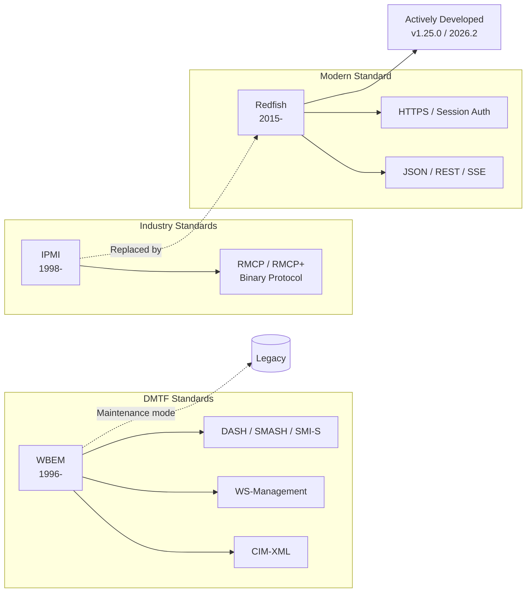

# WBEM 與 Redfish 之差異

## 概述

本報告比較 **WBEM (Web-Based Enterprise Management)** 與 **Redfish** 兩種企業管理標準，涵蓋其歷史背景、架構設計、協定、安全性、產業支援及適用場景。

---

## 1. 什麼是 WBEM？

**WBEM** 是一套企業級系統管理標準，由 **DMTF (Distributed Management Task Force)** 於 1996 年創立，最初由 BMC Software、Cisco、Compaq、Intel 與 Microsoft 共同贊助[^wbem_wiki]。

WBEM 涵蓋下列標準：

- **CIM (Common Information Model)** — 以 UML 為基礎的物件導向資訊模型，定義管理元素（類別、關聯、繼承）[^cim_wiki]
- **CIM-XML** — 以 XML 編碼 CIM 操作，透過 HTTP 傳輸
- **WS-Management** — 以 SOAP 為基礎的管理 Web 服務協定[^wsman_wiki]
- **CIM-RS** — CIM 的 RESTful 操作擴充
- **CIM Query Language (CQL)** / **Filter Query Language (FQL)** — 查詢語言
- **SLP 發現協定** — 基於服務位置的協定式自動發現

WBEM 的適用範圍橫跨桌面管理 (DASH)、網路管理 (NetMan)、儲存管理 (SMI-S)、伺服器管理 (SMASH) 及虛擬化管理 (VMAN)[^dmtf_wbem]。

---

## 2. 什麼是 Redfish？

**Redfish** 是一套基於 RESTful API 的資料中心硬體管理標準，由 DMTF 旗下的 Redfish Forum 於 2014 年起制定，v1.0 於 2015 年 8 月發布[^redfish_wiki][^theregister_2015]。

參與的廠商包括 Dell、Fujitsu、HPE、Intel、Lenovo、Microsoft、Oracle、VMware、Broadcom、Supermicro、AMI、Huawei 等[^dmtf_redfish]。

Redfish 目前仍持續活躍開發，最新版本為 2026.2（Spec v1.25.0），2026 年 9 月發布[^dmtf_redfish_spec]。

---

## 3. 關鍵差異

### 3.1 架構：CIM vs Schema

| 面向 | WBEM | Redfish |
|---|---|---|
| **資訊模型** | CIM — 物件導向、UML 為基礎，以類別、關聯、繼承描述管理元素 | CSDL (XML) + JSON Schema，三類主要資源：Systems、Managers、Chassis |
| **擴充性** | 透過廠商自訂子類別擴充 CIM Schema | 透過 Schema Index 與 OData 資源模型擴充 |
| **設計哲學** | 通用 IT 管理本體論：「管理元素是具屬性與關係的物件」 | 資料中心硬體管理 API：「資源是可透過 REST 存取的 JSON 端點」 |

### 3.2 協定：XML/HTTP vs JSON/REST

| 面向 | WBEM | Redfish |
|---|---|---|
| **主要協定** | CIM-XML (XML over HTTP)，輔以 WS-Management (SOAP/HTTP) | RESTful API — GET/POST/PUT/PATCH/DELETE，酬載為 JSON |
| **訊息格式** | 冗長的 XML / SOAP 封裝 | 輕量的 JSON |
| **API 風格** | RPC 導向（操作訊息、匯出訊息） | 資源導向 CRUD + Actions（如 `POST /Actions/ComputerSystem.Reset`） |
| **可讀性** | XML 可讀但冗長 | JSON 簡潔，易與現代工具鏈整合 |

### 3.3 傳輸：HTTP vs HTTPS with SSE

| 面向 | WBEM | Redfish |
|---|---|---|
| **預設傳輸** | HTTP（可選 HTTPS） | **必須使用 HTTPS**，不允許 HTTP |
| **事件串流** | 「匯出訊息」推送模式，無標準化串流機制 | **Server-Sent Events (SSE)** 用於遙測與事件串流 |
| **連接埠** | 無固定連接埠（WinRM 使用 5985/5986） | 標準 HTTPS 連接埠 (443) |

### 3.4 安全性

| 面向 | WBEM | Redfish |
|---|---|---|
| **認證** | WBEM 伺服層級處理；WS-Management 增加 SOAP 層安全 | **Session 式認證**，支援多因素認證 |
| **加密** | HTTPS 為選項，HTTP 常見 | **HTTPS 強制** |
| **憑證管理** | 未標準化 | 專屬 **Certificate Management 白皮書** (DSP2059) |
| **角色存取控制** | WBEM 伺服層級實作 | 內建於規格（AccountService、Privilege mapping） |
| **現代安全標準** | 有限 | 支援 **IEC 62443**，TCG-DMTF 合作 |
| **整體定位** | 安全為次要考量（源於 1990 年代末） | **安全為首要設計目標** — 「簡單且安全的管理」 |

### 3.5 產業支援與採納

| 面向 | WBEM | Redfish |
|---|---|---|
| **作業系統** | Microsoft (WMI/WinRM)、Apple (Mac OS X)、HP (HP-UX)、IBM (z/OS)、Red Hat (RHEL)、Oracle (Solaris)、Ubuntu | 無直接 OS 端實作；**Redfish 執行於 BMC** 之上 |
| **伺服器廠商** | 透過 SMASH 間接使用 | **所有主要伺服器 OEM**: Dell (iDRAC)、HPE (iLO)、Lenovo (XCC)、Supermicro、Cisco、Fujitsu、IBM |
| **BMC 韌體** | N/A | OpenBMC、AMI MegaRAC、Insyde Supervyse、Vertiv Avocent |
| **工具生態** | OpenPegasus、OpenLMI、Pywbem、SBLIM（多數已停止維護） | **現代工具鏈**: Ansible、OpenStack Ironic、ManageIQ、Python/Go/Perl 用戶端程式庫 |
| **開發狀態** | **維護模式**，無新開發 | **活躍開發中** — 2026.2 版新增 CXL、液態冷卻模型、遙測串流 |
| **開源工具** | 多數已封存/捨棄 | DMTF 主導：Service Validator、Protocol Validator、Emulator、Mockup Server、多語言用戶端 |

### 3.6 適用場景

| 面向 | WBEM | Redfish |
|---|---|---|
| **主要領域** | **通用企業 IT 管理** — 桌面、伺服器、網路、儲存、虛擬化 | **資料中心伺服器/儲存管理** — 尤其是 BMC 帶外管理 |
| **管理類型** | 帶內 + 帶外管理（透過 CIM providers） | **主要為帶外管理**（獨立於主機 OS） |
| **目標規模** | 企業資料中心與異質 IT 環境 | **雲端規模 / 超大規模資料中心**，亦適用單一伺服器 |
| **延伸模型** | SMI-S (儲存)、DASH (桌面)、SMASH (伺服器)、VMAN (虛擬化) | Swordfish (儲存)、CXL 映射、液態冷卻、乙太網路交換、SmartNIC |

---

## 4. 歷史脈絡：Redfish 取代了誰？

**關鍵結論：Redfish 取代的是 IPMI，而非 WBEM。**

### 實際發展歷程

1. **IPMI (Intelligent Platform Management Interface)** 自 1998 年起成為伺服器帶外管理的主流協定。但到了 2010 年代，IPMI 的安全缺陷（cipher-zero 攻擊、預設密碼、未加密傳輸）與二進位有線協定 (RMCP/RMCP+) 使其難以勝任雲端規模管理[^ipmi_wiki]。

2. **WBEM (1996)** 是一個涵蓋 CIM、桌面管理、網路管理、儲存管理等更廣泛的企業管理框架，並非專為 BMC 帶外管理而設計。

3. **Redfish 的設計目標是取代 IPMI**。The Register 在 2015 年報導：「新標準旨在取代 Intelligent Platform Management Interface (IPMI)，Redfish 的支持者認為 IPMI 無法勝任雲端規模的通用伺服器管理任務。」[^theregister_2015]

4. 然而，Redfish 代表了 **DMTF 對整個舊有框架 (CIM/XML/SOAP/WBEM) 的哲學性轉向**，轉向現代 Web 原生方法 (JSON/REST/SSE/HTTPS)。

5. **今日兩者同為 DMTF 標準**，但：
   - WBEM 處於 **維護模式**，規格已發布但無新開發
   - Redfish 處於 **活躍開發** 狀態，每半年發布新版，擁有廣泛的開發生態及所有主要伺服器 OEM 支援

### 為何 Redfish 取代了 IPMI（而非 WBEM）

| 因素 | 說明 |
|---|---|
| **IPMI 安全缺陷** | 未加密傳輸、cipher-zero 繞過、寫死憑證 — Redfish 從第一天起強制 HTTPS 與 Session 認證 |
| **雲端規模需求** | IPMI 的二進位協定與單一伺服器管理模式無法擴展；Redfish 的 RESTful API 支援聚合、自動化與工具鏈整合 |
| **現代 Web 標準** | 業界已轉向 JSON/REST；IPMI 的 RMCP 與 WBEM 的 XML/SOAP 日益脫離 DevOps/SRE 團隊的實際需求 |
| **廠商共識** | 所有主要伺服器廠商一致同意需要現代化的 IPMI 替代方案，並在 DMTF 下凝聚於 Redfish |

---

## 5. 總結對照表

| 比較維度 | WBEM | Redfish |
|---|---|---|
| 創立年份 | 1996 | 2015 (v1.0) |
| 主導組織 | DMTF | DMTF (Redfish Forum) |
| 資訊模型 | CIM (UML) | CSDL + JSON Schema |
| 協定 | XML/SOAP/HTTP | JSON/REST/HTTPS |
| 安全 | 選項性 HTTPS | 強制 HTTPS + Session 認證 |
| 事件 | 無標準串流 | SSE 串流 |
| 管理範疇 | 通用企業 IT（帶內+帶外） | 資料中心硬體帶外管理 |
| 開發狀態 | 維護模式 | 活躍開發 |
| 繼承關係 | — | 取代 IPMI |

---

## 參考資料

[^wbem_wiki]: Wikipedia. (n.d.). Web-Based Enterprise Management. Retrieved 2026-10-01, from https://en.wikipedia.org/wiki/Web-Based_Enterprise_Management

[^cim_wiki]: Wikipedia. (n.d.). Common Information Model (computing). Retrieved 2026-10-01, from https://en.wikipedia.org/wiki/Common_Information_Model_(computing)

[^wsman_wiki]: Wikipedia. (n.d.). WS-Management. Retrieved 2026-10-01, from https://en.wikipedia.org/wiki/WS-Management

[^dmtf_wbem]: DMTF. (n.d.). WBEM Standards. Retrieved 2026-10-01, from https://www.dmtf.org/standards/wbem

[^redfish_wiki]: Wikipedia. (n.d.). Redfish (specification). Retrieved 2026-10-01, from https://en.wikipedia.org/wiki/Redfish_(specification)

[^dmtf_redfish]: DMTF. (n.d.). Redfish Standards. Retrieved 2026-10-01, from https://www.dmtf.org/standards/redfish

[^dmtf_redfish_spec]: DMTF. (2026). Redfish Specification v1.25.0. Retrieved 2026-10-01, from https://www.dmtf.org/sites/default/files/standards/documents/DSP0266_1.25.0.html

[^theregister_2015]: The Register. (2015-08-05). DMTF signs off Redfish server management spec v1.0. Retrieved 2026-10-01, from https://www.theregister.com/on-prem/2015/08/05/dmtf-signs-off-redfish-server-management-spec-v-10/

[^ipmi_wiki]: Wikipedia. (n.d.). Intelligent Platform Management Interface. Retrieved 2026-10-01, from https://en.wikipedia.org/wiki/Intelligent_Platform_Management_Interface

[^infoq_2015]: InfoQ. (2015-08). Redfish: A New API for Managing Servers. Retrieved 2026-10-01, from https://www.infoq.com/news/2015/08/redfish/