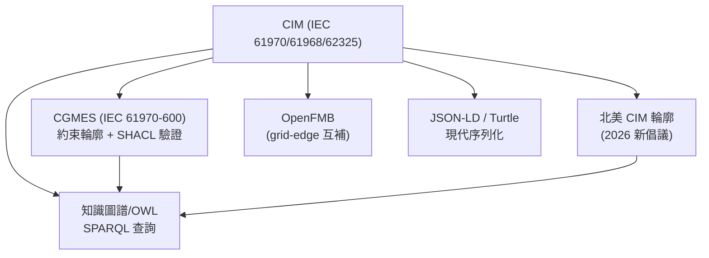

# CIM (Common Information Model) 的現代後繼者調查

## 摘要

CIM（Common Information Model，共同資訊模型）是電力產業中 IEC 61970/61968/62325 系列的國際標準，以 UML 為基礎定義電力系統本體。本報告調查 CIM 是否有現代後繼者，結論是：**不存在單一的「CIM 2.0」取代方案**，取而代之的是多層次的現代化演化——包含約束輪廓（CGMES）、現代 W3C 語意網技術（SHACL、JSON-LD、OWL、知識圖譜）、以及自動化驗證工具的興起。

## 1. 什麼是 CIM？

Common Information Model（共同資訊模型）是電力公用事業領域的**抽象 UML 本體**，定義電力系統中各類物件（變壓器、線路、斷路器、匯流排、發電機等）的類別、屬性與關係。CIM 涵蓋三大 IEC 標準系列[^iec-cim]：

- **IEC 61970** — 傳輸系統、EMS、SCADA、拓撲、線路
- **IEC 61968** — 配電管理、資產、GIS、計量、工單管理
- **IEC 62325** — 能源市場通訊（歐洲與北美市場輪廓）

CIM 最初由 EPRI（Electric Power Research Institute）在 1990 年代末期開發，後交由 IEC TC 57 標準化[^wiki-cim]。

## 2. CIM 的限制

CIM 雖然是電力產業的基石，但存在以下主要限制[^cim-limitations]：

| 限制 | 說明 |
|------|------|
| **極度龐大複雜** | 完整的 CIM UML 模型極其龐大，實作負擔沉重 |
| **CIM/XML (RDF/XML) 冗長** | IEC 61970-552 定義的主序列化格式產生極大且難以解析的檔案 |
| **實作分歧** | 不同系統皆號稱支援 CIM，但實際版本、輪廓解讀、序列化變體各異 |
| **人工轉換負擔** | 公用事業仍需耗費大量人力進行資料轉換與對應 |
| **驗證不足** | 基礎 CIM 缺乏機器可執行的驗證規則 |
| **版本碎片化** | 多個活躍版本（CIM 14/15/16/17、CGMES 2.4/3.0）造成相容性問題 |

## 3. 現代後繼者與演化路徑

### 3.1 CGMES（Common Grid Model Exchange Standard）— IEC 61970-600 系列

**CGMES 是 CIM 目前最重要的實務後繼者**，由 ENTSO-E 開發，是針對歐洲 TSO 資料交換的約束性 CIM 輪廓[^cgmes]。

- **最新版本：** CGMES 3.0（IEC TS 61970-600-1:2021 / IEC TS 61970-600-2:2021）
- **新增內容：** 定義了 EQ（設備）、SSH（穩態假設）、TP（拓撲）、DY（動態）等輪廓、嚴格的遵循規則、SHACL 驗證形狀、以及遵循性評鑑方案（CAS, Conformity Assessment Scheme）
- **演化路徑：** CGMES 2.4.15（2017）→ CGMES 3.0（2021）→ CGMES 3.1（規劃中，新增邊界與參考資料規格）
- **現狀：** 歐洲所有 TSO 依法規必須使用 CGMES

### 3.2 SHACL（Shapes Constraint Language）— 現代驗證機制

CIM 輪廓正逐步以 **SHACL 形狀**（W3C 標準）發布，取代或補充傳統的 RDFS 架構。SHACL 使驗證規則可機器執行，實現自動化資料品質檢測。CGMES 3.0 已隨附 SHACL 形狀[^shacl-cim]。

### 3.3 現代 RDF 序列化：JSON-LD 與 Turtle

業界正積極推動從 **CIM/XML**（IEC 61970-552）遷移至[^serialization]：
- **JSON-LD** — 更符合 Web 生態、易於開發者使用、支援現代 API
- **Turtle** — 較 RDF/XML 更易讀、更精簡

專案如 **Inst4CIM-KG** 已展示以 JSON-LD、Turtle 和 RDF/XML 示範 CIM 資料的互通性[^inst4cim]。

### 3.4 北美 CIM 輪廓（2026 年全新倡議）

CIM Users Group 於 **2026 年 7 月**正式啟動北美 CIM 輪廓（North American CIM Profile），旨在建立一套**簡化、共享的 CIM 輪廓**，用於北美傳輸規劃與營運。目標是減少人工轉換與不一致的解讀，互通性測試暫訂於 2027 年秋季[^na-cim-profile]。

### 3.5 知識圖譜與語意骨幹

現代方法將 CIM 視為**本體（OWL/RDFS）**，並將 CIM 資料儲存在**知識圖譜**（如 GraphDB 平台）中，而非交換平面 CIM/XML 檔案。結合 SPARQL 查詢與 GraphRAG，可實現對電網資料的自然語言查詢（如 Statnett + Graphwise 的「Talk2PowerSystem」專案）[^graphwise]。

### 3.6 OpenFMB（Open Field Message Bus）

OpenFMB 是**互補性標準**，針對電網邊緣/分散式智慧應用（DER 管理、電路級營運）。它重用 CIM 與 IEC 61850 資料模型，但針對即時、分散式通訊而非批量模型交換[^openfmb]。

## 4. CIM 與其後繼者的主要差異

| 面向 | 傳統 CIM | 現代演化 |
|------|----------|----------|
| **範圍** | 完整、無約束的 UML 模型 | 針對特定使用案例的約束輪廓（CGMES、NA CIM Profile） |
| **驗證** | 臨時/人工檢查 | 機器可執行的 SHACL 規則、自動驗證 |
| **序列化** | CIM/XML（RDF/XML 變體） | JSON-LD、Turtle、標準 RDF/XML |
| **查詢能力** | 僅檔案交換 | SPARQL 查詢、知識圖譜、GraphRAG |
| **治理** | IEC（付費存取） + CIMug（開放 UML 模型） | ENTSO-E（CGMES）、CIMug 任務小組、開源工具 |
| **法規強制** | 自願採用 | 歐盟強制（CGMES）；其他地區逐漸跟進 |
| **工具生態** | 專有對應工具 | 開源驗證器（OpenCGMES、pycgmes、CimPal）、知識圖譜平台 |

## 5. 參與的標準組織

| 組織 | 角色 |
|------|------|
| **IEC TC 57** | 發布官方 CIM 標準（IEC 61970、61968、62325、CGMES 61970-600 系列） |
| **CIM Users Group (CIMug) / UCAIUG** | 維護開源 UML 模型；提供教育與最佳實踐；推動北美 CIM 輪廓 |
| **ENTSO-E** | 開發 CGMES；推動歐洲 TSO 強制採用；發布機器可讀成品（RDFS、SHACL 形狀） |
| **EPRI** | 1990 年代末期原始開發 CIM |
| **W3C** | 提供基礎語意網標準：RDF、RDFS、OWL、SHACL、SPARQL、JSON-LD、Turtle |
| **IEC TC 57 WG14** | 配電管理介面（IEC 61968 各部份） |
| **IEC TC 57 WG16** | 能源市場通訊（IEC 62325） |
| **IEC TC 57 WG19** | CIM 與 IEC 61850（SCL）和諧化 |

## 6. 產業採用現狀

| 地區 | 狀態 |
|------|------|
| **🇪🇺 歐洲** | **最先進。** 所有 TSO 自 2015 年起依法規以 CGMES 格式交換電網模型。CGMES 3.0 為現行版本。遵循性評鑑方案（CAS）已運作，定期舉辦互通性測試。 |
| **🇺🇸 北美** | **自願採用，但正在加速。** 無聯邦法規強制。2026 年 7 月啟動的北美 CIM 輪廓正在建立利害關係人共識。 |
| **🇨🇳 中國** | 中國國家電網在傳輸與配電網路模型交換中廣泛採用 CIM。 |
| **🇮🇳 印度** | POSOCO 已探討 CIM 用於控制中心整合（IEEE 發表研究）。 |
| **🌍 其他地區** | 日本、澳洲、巴西等國逐步採用。CIMug 有 40+ 國家的成員。 |

## 7. 結論

**CIM 沒有被單一後繼者取代**，而是經歷多層次的現代化演化：

1. **約束輪廓**（CGMES、北美 CIM 輪廓）— 針對特定使用案例限縮範圍
2. **現代語意網標準**（SHACL、JSON-LD、OWL、SPARQL、知識圖譜）
3. **自動化驗證與品質保證**— 取代人工檢查
4. **知識圖譜數位雙生**— 取代平面檔案交換

CIM 作為電力系統資料交換的核心標準仍然活躍且持續現代化——不是被取代，而是被**包裹在現代語意網技術棧中**。

## 參考文獻

[^iec-cim]: IEC. (2020). IEC 61970-301:2020 — Energy management system application program interface (EMS-API) — Part 301: Common Information Model (CIM) base. Retrieved 2026-10-01, from https://webstore.iec.ch/en/publication/62698

[^wiki-cim]: Wikipedia. (n.d.). Common Information Model (electricity). Retrieved 2026-10-01, from https://en.wikipedia.org/wiki/Common_Information_Model_(electricity)

[^cim-limitations]: Simple Thread. (n.d.). Exploring the CIM Through the Organizations That Make It Happen. Retrieved 2026-10-01, from https://www.simplethread.com/exploring-the-cim-through-the-organizations-that-make-it-happen/

[^cgmes]: ENTSO-E. (n.d.). CIM for Grid Models Exchange (CGMES). Retrieved 2026-10-01, from https://www.entsoe.eu/data/cim/cim-for-grid-models-exchange/

[^shacl-cim]: CIM Users Group. (n.d.). SHACL and OWL. Retrieved 2026-10-01, from https://spi.cimug.org/shacl-and-owl.html

[^serialization]: Enervance. (n.d.). CIM for Grid Operators. Retrieved 2026-10-01, from https://www.enervance.com/en/blog/cim-for-grid-operators

[^inst4cim]: Sveino. (n.d.). Inst4CIM-KG — CIM examples in JSON-LD, Turtle, and RDF/XML. Retrieved 2026-10-01, from https://github.com/Sveino/Inst4CIM-KG

[^na-cim-profile]: CIM Users Group. (2026). North American CIM Profile. Retrieved 2026-10-01, from https://cimug.org/cimdocs/north-american-cim-profile/

[^graphwise]: Graphwise. (n.d.). Navigating the Grid's Digital Transition: Mastering CIM/CGMES 3.0. Retrieved 2026-10-01, from https://graphwise.ai/blog/navigating-the-grids-digital-transition-mastering-cim-cgmes-3-0-and-maximizing-roi-with-graphwise/

[^openfmb]: OpenFMB. (n.d.). Open Field Message Bus. Retrieved 2026-10-01, from https://openfmb.org/