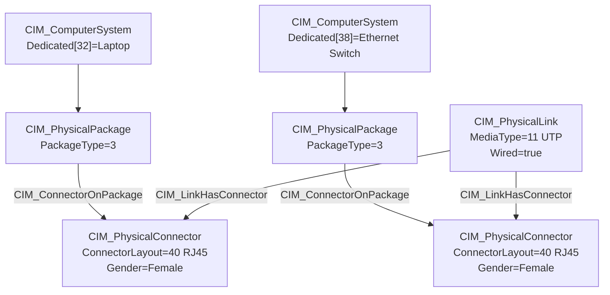
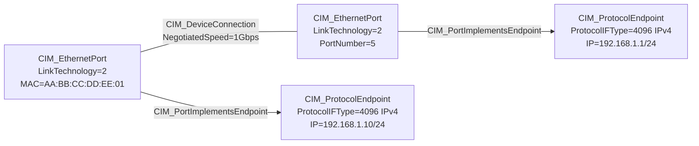
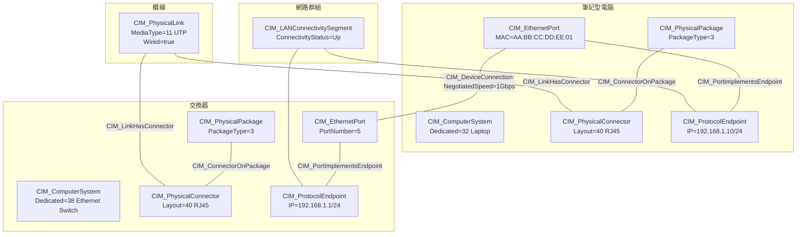

# DMTF CIM 描述「筆記型電腦透過乙太網路連接交換器」之模型探討

## 概述

DMTF（Distributed Management Task Force）所制定的 **CIM（Common Information Model，通用資訊模型）** 是一套以 UML 為基礎的物件導向管理模型，用於對 IT 環境中被管理的元素進行統一、廠商中立的描述。本文探討如何使用 CIM 來描述「一台筆記型電腦透過乙太網路連接到一台交換器」這個常見的網路連線場景。

CIM 將此場景從**實體層（Physical Layer）**和**邏輯層（Logical Layer）**兩個層面分別建模，再透過關聯（Association）將兩者連結，形成完整的拓撲模型。[^dmtf-cim]

## 1. 實體層模型（Physical Layer）

在實體層，CIM 用以下類別描述實際的硬體設備、機殼、連接埠與纜線：

| CIM 類別 | 角色 | 關鍵屬性/關聯 |
|---|---|---|
| **CIM_ComputerSystem** | 筆記型電腦本體 | `Dedicated` 陣列 → 值 32 = "Laptop" |
| **CIM_ComputerSystem** | 乙太網路交換器本體 | `Dedicated` 陣列 → 值 38 = "Ethernet Switch" |
| **CIM_PhysicalPackage** | 筆記型電腦/交換器的機殼 | `PackageType` = 3（Chassis/Frame） |
| **CIM_PhysicalConnector** | RJ45 乙太網路接孔 | `ConnectorLayout` = 40（RJ45）；`ConnectorGender` = 3（Female） |
| **CIM_PhysicalLink** | 乙太網路纜線 | `MediaType` = 11（UTP）；`Wired` = true；`Length` = 纜線長度 |

實體層透過兩個關鍵關聯將纜線與連接器、連接器與機殼連結起來：[^physical-link][^connector-package]



- **`CIM_ConnectorOnPackage`**：將 `PhysicalConnector` 關聯到其所屬的 `PhysicalPackage`，表示「此連接位於該機殼上」。[^connector-package]
- **`CIM_LinkHasConnector`**：將 `PhysicalLink`（纜線）關聯到兩端的 `PhysicalConnector`，表示「此纜線終止於該連接器」。[^link-connector]

## 2. 邏輯層模型（Logical Layer）

在邏輯層，CIM 用以下類別描述網路介面、協定端點與連線：

| CIM 類別 | 角色 | 繼承鏈 |
|---|---|---|
| **CIM_EthernetPort**（繼承自 CIM_NetworkPort → CIM_LogicalPort → CIM_LogicalDevice） | 筆記型電腦的乙太網路卡與交換器的連接埠 | `LinkTechnology` = 2（Ethernet）；`PermanentAddress` = MAC 位址 |
| **CIM_ProtocolEndpoint**（繼承自 CIM_ServiceAccessPoint） | 雙方 IP 層的通訊端點 | `ProtocolIFType` = 6（Ethernet CSMA/CD）或 4096（IPv4）或 225（IPv6） |

邏輯層透過 `CIM_PortImplementsEndpoint` 將連接埠關聯至其上運行的協定端點，再透過 `CIM_DeviceConnection` 串接兩個邏輯設備：[^port-endpoint][^device-connection]



- **`CIM_PortImplementsEndpoint`**：將 `LogicalPort` 關聯到其上實作的一個或多個 `ProtocolEndpoint`。[^port-endpoint]
- **`CIM_DeviceConnection`**：表示兩個或多個邏輯設備之間存在實際連線，可承載 `NegotiatedSpeed`、`NegotiatedDataWidth` 等屬性。[^device-connection]

## 3. 高層連接模型

CIM 還提供以下類別來描述更高層次的連線關係與網路群組：[^active-connection][^connectivity-collection]

| CIM 類別 | 用途 |
|---|---|
| **CIM_ActiveConnection** | 表示兩個 `ServiceAccessPoint` 之間已建立且正在通訊的連線；具有 `Antecedent`（前項）與 `Dependent`（依賴項）雙向參考 |
| **CIM_ConnectivityCollection** | 將相同類型、可互相通訊的 `ProtocolEndpoint` 群組在一起；`ConnectivityStatus` 可追蹤 Up/Down/Partitioned 狀態 |
| **CIM_LANConnectivitySegment** | 繼承自 `ConnectivityCollection`，代表同一 LAN 網段中可彼此通訊的端點集合 |
| **CIM_IPConnectivitySubnet** | 繼承自 `ConnectivityCollection`，代表同一 IP 子網路中可彼此通訊的端點集合 |

## 4. 完整模型圖

以下是結合實體層與邏輯層的完整 CIM 模型：[^dmtf-profiles]



## 5. CIM-XML 序列化實例

CIM 的真實序列化格式為 **CIM-XML**（DSP0201 標準），採用元模式（metaschema）映射：使用固定的 XML 元素集（`<CLASS>`、`<INSTANCE>`、`<PROPERTY>`、`<VALUE>`、`<ASSOCIATION.INSTANCE>`），CIM 類別名稱則以 `CLASSNAME`、`NAME` 等屬性值承載。[^cim-xml-mapping]

以下是用 CIM-XML 描述筆記型電腦連接交換器的完整實例：

### 5.1 實例宣告（Instance Declaration）

```xml
<?xml version="1.0"?>
<CIM CIMVERSION="2.3" DTDVERSION="2.2">
  <DECLARATION>
    <DECLGROUP>

      <!-- ===== 筆記型電腦 ===== -->
      <INSTANCE CLASSNAME="CIM_ComputerSystem">
        <PROPERTY NAME="ElementName" TYPE="string">
          <VALUE>My Laptop</VALUE>
        </PROPERTY>
        <PROPERTY NAME="Name" TYPE="string">
          <VALUE>laptop-001</VALUE>
        </PROPERTY>
        <PROPERTY.ARRAY NAME="Dedicated" TYPE="uint16">
          <VALUE.ARRAY>
            <VALUE>32</VALUE>   <!-- 32 = Laptop -->
          </VALUE.ARRAY>
        </PROPERTY.ARRAY>
        <PROPERTY NAME="EnabledState" TYPE="uint16">
          <VALUE>2</VALUE>     <!-- 2 = Enabled -->
        </PROPERTY>
      </INSTANCE>

      <!-- ===== 交換器 ===== -->
      <INSTANCE CLASSNAME="CIM_ComputerSystem">
        <PROPERTY NAME="ElementName" TYPE="string">
          <VALUE>Office Switch</VALUE>
        </PROPERTY>
        <PROPERTY NAME="Name" TYPE="string">
          <VALUE>switch-001</VALUE>
        </PROPERTY>
        <PROPERTY.ARRAY NAME="Dedicated" TYPE="uint16">
          <VALUE.ARRAY>
            <VALUE>38</VALUE>   <!-- 38 = Ethernet Switch -->
          </VALUE.ARRAY>
        </PROPERTY.ARRAY>
        <PROPERTY NAME="EnabledState" TYPE="uint16">
          <VALUE>2</VALUE>
        </PROPERTY>
      </INSTANCE>

      <!-- ===== 筆記型電腦乙太網路卡 ===== -->
      <INSTANCE CLASSNAME="CIM_EthernetPort">
        <PROPERTY NAME="Name" TYPE="string">
          <VALUE>eth0</VALUE>
        </PROPERTY>
        <PROPERTY NAME="LinkTechnology" TYPE="uint16">
          <VALUE>2</VALUE>     <!-- 2 = Ethernet -->
        </PROPERTY>
        <PROPERTY NAME="PermanentAddress" TYPE="string">
          <VALUE>AA:BB:CC:DD:EE:01</VALUE>
        </PROPERTY>
        <PROPERTY NAME="Speed" TYPE="uint64">
          <VALUE>1000000000</VALUE>  <!-- 1 Gbps -->
        </PROPERTY>
        <PROPERTY NAME="PortNumber" TYPE="uint16">
          <VALUE>1</VALUE>
        </PROPERTY>
        <PROPERTY NAME="EnabledState" TYPE="uint16">
          <VALUE>2</VALUE>
        </PROPERTY>
      </INSTANCE>

      <!-- ===== 交換器連接埠 ===== -->
      <INSTANCE CLASSNAME="CIM_EthernetPort">
        <PROPERTY NAME="Name" TYPE="string">
          <VALUE>port-5</VALUE>
        </PROPERTY>
        <PROPERTY NAME="LinkTechnology" TYPE="uint16">
          <VALUE>2</VALUE>
        </PROPERTY>
        <PROPERTY NAME="PermanentAddress" TYPE="string">
          <VALUE>AA:BB:CC:DD:EE:F5</VALUE>
        </PROPERTY>
        <PROPERTY NAME="Speed" TYPE="uint64">
          <VALUE>1000000000</VALUE>
        </PROPERTY>
        <PROPERTY NAME="PortNumber" TYPE="uint16">
          <VALUE>5</VALUE>
        </PROPERTY>
        <PROPERTY NAME="EnabledState" TYPE="uint16">
          <VALUE>2</VALUE>
        </PROPERTY>
      </INSTANCE>

      <!-- ===== 筆記型電腦 IP 端點 ===== -->
      <INSTANCE CLASSNAME="CIM_ProtocolEndpoint">
        <PROPERTY NAME="Name" TYPE="string">
          <VALUE>192.168.1.10</VALUE>
        </PROPERTY>
        <PROPERTY NAME="ProtocolIFType" TYPE="uint16">
          <VALUE>4096</VALUE>  <!-- 4096 = IPv4 -->
        </PROPERTY>
        <PROPERTY NAME="IPv4Address" TYPE="string">
          <VALUE>192.168.1.10</VALUE>
        </PROPERTY>
        <PROPERTY NAME="SubnetMask" TYPE="string">
          <VALUE>255.255.255.0</VALUE>
        </PROPERTY>
        <PROPERTY NAME="EnabledState" TYPE="uint16">
          <VALUE>2</VALUE>
        </PROPERTY>
      </INSTANCE>

      <!-- ===== 交換器 IP 端點 ===== -->
      <INSTANCE CLASSNAME="CIM_ProtocolEndpoint">
        <PROPERTY NAME="Name" TYPE="string">
          <VALUE>192.168.1.1</VALUE>
        </PROPERTY>
        <PROPERTY NAME="ProtocolIFType" TYPE="uint16">
          <VALUE>4096</VALUE>
        </PROPERTY>
        <PROPERTY NAME="IPv4Address" TYPE="string">
          <VALUE>192.168.1.1</VALUE>
        </PROPERTY>
        <PROPERTY NAME="SubnetMask" TYPE="string">
          <VALUE>255.255.255.0</VALUE>
        </PROPERTY>
        <PROPERTY NAME="EnabledState" TYPE="uint16">
          <VALUE>2</VALUE>
        </PROPERTY>
      </INSTANCE>

      <!-- ===== 實體纜線 ===== -->
      <INSTANCE CLASSNAME="CIM_PhysicalLink">
        <PROPERTY NAME="Tag" TYPE="string">
          <VALUE>cable-cat6-001</VALUE>
        </PROPERTY>
        <PROPERTY NAME="MediaType" TYPE="uint16">
          <VALUE>11</VALUE>    <!-- 11 = UTP -->
        </PROPERTY>
        <PROPERTY NAME="Length" TYPE="real32">
          <VALUE>6.0</VALUE>  <!-- 6 feet -->
        </PROPERTY>
      </INSTANCE>

      <!-- ===== 實體連接器（筆電端 RJ45） ===== -->
      <INSTANCE CLASSNAME="CIM_PhysicalConnector">
        <PROPERTY NAME="Tag" TYPE="string">
          <VALUE>rj45-laptop-001</VALUE>
        </PROPERTY>
        <PROPERTY NAME="ConnectorLayout" TYPE="uint16">
          <VALUE>40</VALUE>    <!-- 40 = RJ45 -->
        </PROPERTY>
        <PROPERTY NAME="ConnectorGender" TYPE="uint16">
          <VALUE>3</VALUE>     <!-- 3 = Female -->
        </PROPERTY>
      </INSTANCE>

      <!-- ===== 實體連接器（交換器端 RJ45） ===== -->
      <INSTANCE CLASSNAME="CIM_PhysicalConnector">
        <PROPERTY NAME="Tag" TYPE="string">
          <VALUE>rj45-switch-port5</VALUE>
        </PROPERTY>
        <PROPERTY NAME="ConnectorLayout" TYPE="uint16">
          <VALUE>40</VALUE>
        </PROPERTY>
        <PROPERTY NAME="ConnectorGender" TYPE="uint16">
          <VALUE>3</VALUE>
        </PROPERTY>
      </INSTANCE>

    </DECLGROUP>
  </DECLARATION>
</CIM>
```

### 5.2 關聯實例（Association Instances）

以下 XML 片段透過關聯類別將上述實例連結起來：[^cim-xml-assoc]

```xml
<?xml version="1.0"?>
<CIM CIMVERSION="2.3" DTDVERSION="2.2">
  <DECLARATION>
    <DECLGROUP>

      <!-- PortImplementsEndpoint：筆電乙太埠 → IP 端點 -->
      <ASSOCIATION.INSTANCE CLASSNAME="CIM_PortImplementsEndpoint">
        <PROPERTY.REFERENCE NAME="Antecedent"
                            REFERENCECLASS="CIM_LogicalPort">
          <VALUE.REFERENCE>
            <INSTANCENAME CLASSNAME="CIM_EthernetPort">
              <KEYBINDING NAME="Name">
                <KEYVALUE VALUETYPE="string">eth0</KEYVALUE>
              </KEYBINDING>
            </INSTANCENAME>
          </VALUE.REFERENCE>
        </PROPERTY.REFERENCE>
        <PROPERTY.REFERENCE NAME="Dependent"
                            REFERENCECLASS="CIM_ProtocolEndpoint">
          <VALUE.REFERENCE>
            <INSTANCENAME CLASSNAME="CIM_ProtocolEndpoint">
              <KEYBINDING NAME="Name">
                <KEYVALUE VALUETYPE="string">192.168.1.10</KEYVALUE>
              </KEYBINDING>
            </INSTANCENAME>
          </VALUE.REFERENCE>
        </PROPERTY.REFERENCE>
      </ASSOCIATION.INSTANCE>

      <!-- PortImplementsEndpoint：交換器埠→ IP 端點 -->
      <ASSOCIATION.INSTANCE CLASSNAME="CIM_PortImplementsEndpoint">
        <PROPERTY.REFERENCE NAME="Antecedent"
                            REFERENCECLASS="CIM_LogicalPort">
          <VALUE.REFERENCE>
            <INSTANCENAME CLASSNAME="CIM_EthernetPort">
              <KEYBINDING NAME="Name">
                <KEYVALUE VALUETYPE="string">port-5</KEYVALUE>
              </KEYBINDING>
            </INSTANCENAME>
          </VALUE.REFERENCE>
        </PROPERTY.REFERENCE>
        <PROPERTY.REFERENCE NAME="Dependent"
                            REFERENCECLASS="CIM_ProtocolEndpoint">
          <VALUE.REFERENCE>
            <INSTANCENAME CLASSNAME="CIM_ProtocolEndpoint">
              <KEYBINDING NAME="Name">
                <KEYVALUE VALUETYPE="string">192.168.1.1</KEYVALUE>
              </KEYBINDING>
            </INSTANCENAME>
          </VALUE.REFERENCE>
        </PROPERTY.REFERENCE>
      </ASSOCIATION.INSTANCE>

      <!-- DeviceConnection：筆電埠 ↔ 交換器埠 -->
      <ASSOCIATION.INSTANCE CLASSNAME="CIM_DeviceConnection">
        <PROPERTY.REFERENCE NAME="Antecedent"
                            REFERENCECLASS="CIM_LogicalDevice">
          <VALUE.REFERENCE>
            <INSTANCENAME CLASSNAME="CIM_EthernetPort">
              <KEYBINDING NAME="Name">
                <KEYVALUE VALUETYPE="string">eth0</KEYVALUE>
              </KEYBINDING>
            </INSTANCENAME>
          </VALUE.REFERENCE>
        </PROPERTY.REFERENCE>
        <PROPERTY.REFERENCE NAME="Dependent"
                            REFERENCECLASS="CIM_LogicalDevice">
          <VALUE.REFERENCE>
            <INSTANCENAME CLASSNAME="CIM_EthernetPort">
              <KEYBINDING NAME="Name">
                <KEYVALUE VALUETYPE="string">port-5</KEYVALUE>
              </KEYBINDING>
            </INSTANCENAME>
          </VALUE.REFERENCE>
        </PROPERTY.REFERENCE>
        <PROPERTY NAME="NegotiatedSpeed" TYPE="uint64">
          <VALUE>1000000000</VALUE>
        </PROPERTY>
      </ASSOCIATION.INSTANCE>

      <!-- ConnectorOnPackage：RJ45 接孔 → 筆電機殼 -->
      <ASSOCIATION.INSTANCE CLASSNAME="CIM_ConnectorOnPackage">
        <PROPERTY.REFERENCE NAME="GroupComponent"
                            REFERENCECLASS="CIM_PhysicalPackage">
          <VALUE.REFERENCE>
            <INSTANCENAME CLASSNAME="CIM_PhysicalPackage">
              <KEYBINDING NAME="Tag">
                <KEYVALUE VALUETYPE="string">chassis-laptop-001</KEYVALUE>
              </KEYBINDING>
            </INSTANCENAME>
          </VALUE.REFERENCE>
        </PROPERTY.REFERENCE>
        <PROPERTY.REFERENCE NAME="PartComponent"
                            REFERENCECLASS="CIM_PhysicalConnector">
          <VALUE.REFERENCE>
            <INSTANCENAME CLASSNAME="CIM_PhysicalConnector">
              <KEYBINDING NAME="Tag">
                <KEYVALUE VALUETYPE="string">rj45-laptop-001</KEYVALUE>
              </KEYBINDING>
            </INSTANCENAME>
          </VALUE.REFERENCE>
        </PROPERTY.REFERENCE>
      </ASSOCIATION.INSTANCE>

      <!-- ConnectorOnPackage：RJ45 接孔 → 交換器機殼 -->
      <ASSOCIATION.INSTANCE CLASSNAME="CIM_ConnectorOnPackage">
        <PROPERTY.REFERENCE NAME="GroupComponent"
                            REFERENCECLASS="CIM_PhysicalPackage">
          <VALUE.REFERENCE>
            <INSTANCENAME CLASSNAME="CIM_PhysicalPackage">
              <KEYBINDING NAME="Tag">
                <KEYVALUE VALUETYPE="string">chassis-switch-001</KEYVALUE>
              </KEYBINDING>
            </INSTANCENAME>
          </VALUE.REFERENCE>
        </PROPERTY.REFERENCE>
        <PROPERTY.REFERENCE NAME="PartComponent"
                            REFERENCECLASS="CIM_PhysicalConnector">
          <VALUE.REFERENCE>
            <INSTANCENAME CLASSNAME="CIM_PhysicalConnector">
              <KEYBINDING NAME="Tag">
                <KEYVALUE VALUETYPE="string">rj45-switch-port5</KEYVALUE>
              </KEYBINDING>
            </INSTANCENAME>
          </VALUE.REFERENCE>
        </PROPERTY.REFERENCE>
      </ASSOCIATION.INSTANCE>

      <!-- LinkHasConnector：纜線 → 筆電端 RJ45 -->
      <ASSOCIATION.INSTANCE CLASSNAME="CIM_LinkHasConnector">
        <PROPERTY.REFERENCE NAME="GroupComponent"
                            REFERENCECLASS="CIM_PhysicalLink">
          <VALUE.REFERENCE>
            <INSTANCENAME CLASSNAME="CIM_PhysicalLink">
              <KEYBINDING NAME="Tag">
                <KEYVALUE VALUETYPE="string">cable-cat6-001</KEYVALUE>
              </KEYBINDING>
            </INSTANCENAME>
          </VALUE.REFERENCE>
        </PROPERTY.REFERENCE>
        <PROPERTY.REFERENCE NAME="PartComponent"
                            REFERENCECLASS="CIM_PhysicalConnector">
          <VALUE.REFERENCE>
            <INSTANCENAME CLASSNAME="CIM_PhysicalConnector">
              <KEYBINDING NAME="Tag">
                <KEYVALUE VALUETYPE="string">rj45-laptop-001</KEYVALUE>
              </KEYBINDING>
            </INSTANCENAME>
          </VALUE.REFERENCE>
        </PROPERTY.REFERENCE>
      </ASSOCIATION.INSTANCE>

      <!-- LinkHasConnector：纜線 → 交換器端 RJ45 -->
      <ASSOCIATION.INSTANCE CLASSNAME="CIM_LinkHasConnector">
        <PROPERTY.REFERENCE NAME="GroupComponent"
                            REFERENCECLASS="CIM_PhysicalLink">
          <VALUE.REFERENCE>
            <INSTANCENAME CLASSNAME="CIM_PhysicalLink">
              <KEYBINDING NAME="Tag">
                <KEYVALUE VALUETYPE="string">cable-cat6-001</KEYVALUE>
              </KEYBINDING>
            </INSTANCENAME>
          </VALUE.REFERENCE>
        </PROPERTY.REFERENCE>
        <PROPERTY.REFERENCE NAME="PartComponent"
                            REFERENCECLASS="CIM_PhysicalConnector">
          <VALUE.REFERENCE>
            <INSTANCENAME CLASSNAME="CIM_PhysicalConnector">
              <KEYBINDING NAME="Tag">
                <KEYVALUE VALUETYPE="string">rj45-switch-port5</KEYVALUE>
              </KEYBINDING>
            </INSTANCENAME>
          </VALUE.REFERENCE>
        </PROPERTY.REFERENCE>
      </ASSOCIATION.INSTANCE>

    </DECLGROUP>
  </DECLARATION>
</CIM>
```

### 5.3 說明

CIM-XML 的序列化規則如下：[^cim-xml-mapping][^dsp8044]

- **`<INSTANCE CLASSNAME="...">`**：宣告一個 CIM 類別的具體實例。每個實例必須有 `Name` 或 `Tag`（依繼承鏈而定）作為 key 屬性，用於後續的關聯引用。
- **`<ASSOCIATION.INSTANCE CLASSNAME="...">`**：宣告兩個或多個實例之間的關聯。每個關聯至少包含兩個 `<PROPERTY.REFERENCE>` 元素，分別指向關聯的兩端（`Antecedent`/`Dependent` 或 `GroupComponent`/`PartComponent`，視繼承關係而定）。
- **`<INSTANCENAME>` + `<KEYBINDING>` + `<KEYVALUE>`**：用於在關聯中引用目標實例，藉由其 key 屬性（`Name` 或 `Tag`）進行定位。
- **`<VALUE>` / `<VALUE.ARRAY>` / `<VALUE.REFERENCE>`**：分別對應純量屬性、陣列屬性、關聯引用屬性的數值。

## 6. 總結

DMTF CIM 透過**雙層模型**來描述「筆記型電腦透過乙太網路連接交換器」：

1. **實體層**：使用 `CIM_ComputerSystem` 描述設備本體、`CIM_PhysicalPackage` 描述機殼、`CIM_PhysicalConnector`（RJ45）描述連接埠、`CIM_PhysicalLink` 描述乙太網路纜線，並以 `CIM_ConnectorOnPackage` 和 `CIM_LinkHasConnector` 建立從機殼到纜線的完整鏈條。

2. **邏輯層**：使用 `CIM_EthernetPort` 描述網路介面卡/連接埠、`CIM_ProtocolEndpoint` 描述 IP 端點，並以 `CIM_PortImplementsEndpoint` 建立連接埠到協定的關聯、`CIM_DeviceConnection` 描述兩個設備間的連線關係。

3. **高層群組**：可利用 `CIM_ConnectivityCollection` / `CIM_LANConnectivitySegment` 將同一廣播域中的端點群組化。

這種分層建模方式使 CIM 既能描述**實體拓撲**（哪條纜線接哪個連接埠），也能描述**邏輯連通性**（哪些設備在同一子網路中可互相通訊），並可透過 CIM 的通訊協定（CIM-XML、WS-Management、CIM-RS）在不同的管理系統之間交換，達成跨廠商的統一管理。[^dmtf-cim][^wbem]

---

## 參考文獻

[^dmtf-cim]: DMTF. (n.d.). Common Information Model (CIM) Standard. Retrieved 2026-10-01, from https://www.dmtf.org/standards/cim

[^physical-link]: DMTF. (n.d.). CIM_PhysicalLink (Schema 2.42.0+). Retrieved 2026-10-01, from https://schemas.dmtf.org/wbem/cim-html/2.42.0+/CIM_PhysicalLink.html

[^connector-package]: DMTF. (n.d.). CIM_ConnectorOnPackage. Retrieved 2026-10-01, from https://learn.microsoft.com/en-us/windows/win32/cimwin32prov/cim-connectoronpackage

[^link-connector]: DMTF. (n.d.). CIM_LinkHasConnector. Retrieved 2026-10-01, from https://learn.microsoft.com/en-us/windows/win32/cimwin32prov/cim-linkhasconnector

[^port-endpoint]: Broadcom. (n.d.). CIM_PortImplementsEndpoint. Retrieved 2026-10-01, from https://dp-downloads-pstg.broadcom.com/api-content/apis/API_CSSMA_001/6.5/html/class_CIM_PortImplementsEndpoint.html

[^device-connection]: DMTF. (n.d.). CIM_DeviceConnection. Retrieved 2026-10-01, from https://learn.microsoft.com/en-us/windows/win32/cimwin32prov/cim-deviceconnection

[^active-connection]: DMTF. (n.d.). CIM_ActiveConnection (Schema 2.34.0). Retrieved 2026-10-01, from https://schemas.dmtf.org/wbem/cim-html/2.34.0/CIM_ActiveConnection.html

[^connectivity-collection]: DMTF. (n.d.). CIM_ConnectivityCollection (Schema 2.34.0). Retrieved 2026-10-01, from https://schemas.dmtf.org/wbem/cim-html/2.34.0/CIM_ConnectivityCollection.html

[^dmtf-profiles]: DMTF. (n.d.). DMTF Profiles. Retrieved 2026-10-01, from https://www.dmtf.org/standards/profiles

[^wbem]: DMTF. (n.d.). CIM FAQ. Retrieved 2026-10-01, from https://www.dmtf.org/about/faq/cim_faq

[^cim-xml-mapping]: DMTF. (n.d.). CIM XML Mapping (DSP0201). Retrieved 2026-10-01, from https://www.dmtf.org/sites/default/files/standards/documents/CIM_XML_Mapping20.html

[^cim-xml-assoc]: DMTF. (n.d.). CIM_DeviceConnection (XML). Retrieved 2026-10-01, from https://schemas.dmtf.org/wbem/cim-xml/2.2.0/cim-schema/2.29.0/CIM_DeviceConnection.xml

[^dsp8044]: DMTF. (n.d.). DSP8044 — CIM XML Schema (XSD). Retrieved 2026-10-01, from https://schemas.dmtf.org/wbem/cim-xml/2/dsp8044_2.4.0.xsd