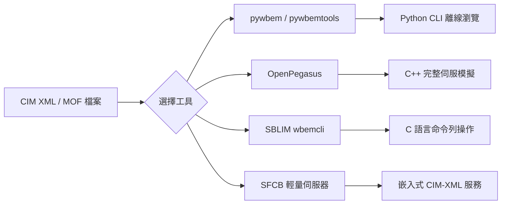

# DMTF CIM（Common Information Model）XML 檔案之 FOSS 讀取工具與函式庫調查

## 背景

CIM（Common Information Model）是 DMTF（Distributed Management Task Force）制定的系統管理資料模型標準，定義了 IT 基礎設施中各類管理資源的抽象表示[^dmtf-cim]。CIM 模型以多種格式發佈，包括 MOF（Managed Object Format）、XML 及 XSD[^dmtf-schema]。本報告調查能讀取、剖析、瀏覽 CIM XML/MOF 檔案的開放源碼工具與函式庫，以滿足離線分析 CIM 資料之需求。

## 工具清單

### 1. pywbem — Python WBEM 用戶端函式庫

- **語言**：Python 3
- **CIM XML 處理能力**：
  - 包含 `pywbem.cim_xml` 模組，可建構、剖析、產生 CIM-XML 元素（CIM 物件、實體名稱、方法呼叫等），每個 CIM-XML 類別均支援 `toxml()` 與 `toprettyxml()` 序列化。
  - **MOF 編譯器**（`mof_compiler`）：可讀取 MOF 檔（DMTF DSP0221），將其編譯為 WBEM 伺服器上的 CIM 儲存庫；亦支援不依賴伺服器的離線測試編譯。支援類別定義、實體定義與限定子型別。
  - 輸出格式支援 MOF、CIM-XML、表格及樹狀結構。
- **狀態**：活躍開發中，文件完整。
- **取得方式**：
  - GitHub: https://github.com/pywbem/pywbem
  - PyPI: `pip install pywbem`
  - 文件: https://pywbem.readthedocs.io/en/stable/

[^dmtf-cim]: DMTF. (n.d.). CIM — Common Information Model. Retrieved 2026-10-01, from https://www.dmtf.org/standards/cim

[^dmtf-schema]: DMTF. (2026). CIM Schema v2.56.0. Retrieved 2026-10-01, from https://www.dmtf.org/standards/cim/cim_schema_v2560

### 2. pywbemtools — Python WBEM 命令列工具

- **語言**：Python 3
- **CIM XML 處理能力**：
  - `pywbemcli`：提供 CLI 及 REPL 互動模式，可列舉、取得、格式化 CIM 類別與實體；支援 MOF、CIM-XML、表格、樹狀等輸出格式；可從 MOF 檔載入模擬 WBEM 伺服器進行離線瀏覽。
  - `pywbemlistener`：管理 WBEM 非同步指示監聽器。
- **狀態**：活躍開發中，與 pywbem 搭配使用。
- **取得方式**：
  - GitHub: https://github.com/pywbem/pywbemtools
  - PyPI: `pip install pywbemtools`

### 3. OpenPegasus — 完整 C++ CIM/WBEM 伺服器

- **語言**：C++（附 CMPI 供應者介面）
- **CIM XML 處理能力**：
  - **MOF 編譯器**：編譯 MOF 檔至 CIM 儲存庫。
  - `cimcli`：命令列 WBEM 用戶端，可列舉、瀏覽 CIM 類別、實體、關聯及執行方法。
  - 支援 CIM-XML over HTTP 及 WS-Management 協定。
  - 原始碼內含 DMTF CIM Schema 實例檔。
  - 附有 Web 管理介面。
- **狀態**：GitHub 上持續維護，pywbem 專案以其為測試載體。
- **取得方式**：
  - GitHub: https://github.com/OpenPegasus/OpenPegasus
  - Docker: https://github.com/OpenPegasus/OpenPegasusDocker
  - 授權：MIT 風格（OpenPegasus 授權）
- 資料來源[^openpeg]

[^openpeg]: The Open Group. (n.d.). OpenPegasus — WBEM Implementation. Retrieved 2026-10-01, from https://collaboration.opengroup.org/pegasus/

### 4. SBLIM — 標準型 Linux 管理工具集

IBM 發起的開放源碼專案，包含多個子專案：

| 子專案 | 語言 | CIM XML 處理能力 | 狀態 |
|--------|------|------------------|------|
| **SFCB**（Small Footprint CIM Broker） | C | 輕量級 CIM 伺服器，支援 CIM-XML over HTTP，適合嵌入式環境 | 穩定 |
| **SFCC**（Small Footprint CIM Client） | C | C 語言用戶端函式庫，可收發 CIM 命令 | 穩定 |
| **wbemcli** | C | 命令列 CIM 用戶端，支援 `gc`/`gi`/`ci`/`mi`/`di`/`ei`/`ec`/`ai`/`ri` 等操作，可從任何 WBEM 伺服器擷取 CIM 類別與實體 | 穩定（收錄於 Debian） |

- **取得方式**：
  - SFCB: https://github.com/zaneb/sblim-sfcb
  - wbemcli: `apt install sblim-wbemcli`
  - SourceForge: https://sourceforge.net/projects/sblim/

### 5. OpenWBEM — 企業級 C++ WBEM 實作

- **語言**：C++
- **CIM XML 處理能力**：
  - **MOF 編譯器**：將 MOF 文字轉換為 C++ CIM 類別/實體，可填入 CIM 儲存庫。
  - **MOF API & Library**：可獨立使用，直接在記憶體中將 MOF 文字轉換為 C++ CIM 物件，不需 WBEM 伺服器。
  - **WQL 命令列工具**：以 WBEM Query Language 查詢 CIM 資料。
  - 支援 CIM 2.2（含嵌入式實體）、CIM-XML over HTTP 1.1 及 HTTPS。
- **狀態**：休眠專案，最後版本為 2006 年[^openwbem]。
- **取得方式**：
  - SourceForge: https://sourceforge.net/projects/openwbem/
  - 網站: http://www.openwbem.org/

[^openwbem]: OpenWBEM. (2006). OpenWBEM — Enterprise-Grade Open Source WBEM. Retrieved 2026-10-01, from http://www.openwbem.org/

### 6. 其他歷史專案

以下專案亦曾提供 CIM XML 讀取能力，但已處於休眠狀態：

- **WBEM Services**（Java）：Java 實作之 CIMOM（CIM Object Manager），支援 CIM-XML over HTTP。SourceForge: https://wbemservices.sourceforge.net/
- **OpenLMI**（C/Python）：基於 CIM/WBEM 之 Linux 系統管理基礎建設。網站: http://www.openlmi.org/
- **OpenDRIM**（C/C++？）：分散式資源資訊管理。SourceForge: https://sourceforge.net/projects/opendrim/
- **OMI**：Open Management Infrastructure，支援 CIM/WBEM 及 WS-Management。網站: http://www.opengroup.org/software/omi
- **CIMPLE**（C/C++）：CIM/WBEM 供應者開發環境，已移入 OpenPegasus 組織。GitHub: https://github.com/OpenPegasus/CIMPLE

## 重點摘要

- **最推薦**：`pywbem` + `pywbemtools` — Python 生態系、活躍維護、文件齊全、支援離線 MOF 檔案讀取與瀏覽，且可透過模擬伺服器測試 CIM 操作。
- **最成熟**：`OpenPegasus` — 功能最完整的 C++ 實作，持續維護，內含 schema 樣本。
- **最輕量**：`SBLIM wbemcli` — 單一 C 語言執行檔，收錄於 Debian 套件庫，適合腳本化使用。

## 參考資料

DMTF. (n.d.). CIM Overview. Retrieved 2026-10-01, from https://www.dmtf.org/standards/cim

DMTF. (2026). CIM Schema v2.56.0. Retrieved 2026-10-01, from https://www.dmtf.org/standards/cim/cim_schema_v2560

pywbem. (n.d.). pywbem — Python WBEM Client Library. Retrieved 2026-10-01, from https://github.com/pywbem/pywbem

pywbem. (n.d.). pywbemtools — Python CLI Tools for WBEM. Retrieved 2026-10-01, from https://github.com/pywbem/pywbemtools

The Open Group. (n.d.). OpenPegasus WBEM Implementation. Retrieved 2026-10-01, from https://github.com/OpenPegasus/OpenPegasus

SBLIM. (n.d.). SBLIM on SourceForge. Retrieved 2026-10-01, from https://sourceforge.net/projects/sblim/

zaneb. (n.d.). SFCB — Small Footprint CIM Broker. Retrieved 2026-10-01, from https://github.com/zaneb/sblim-sfcb

OpenWBEM. (2006). OpenWBEM on SourceForge. Retrieved 2026-10-01, from https://sourceforge.net/projects/openwbem/