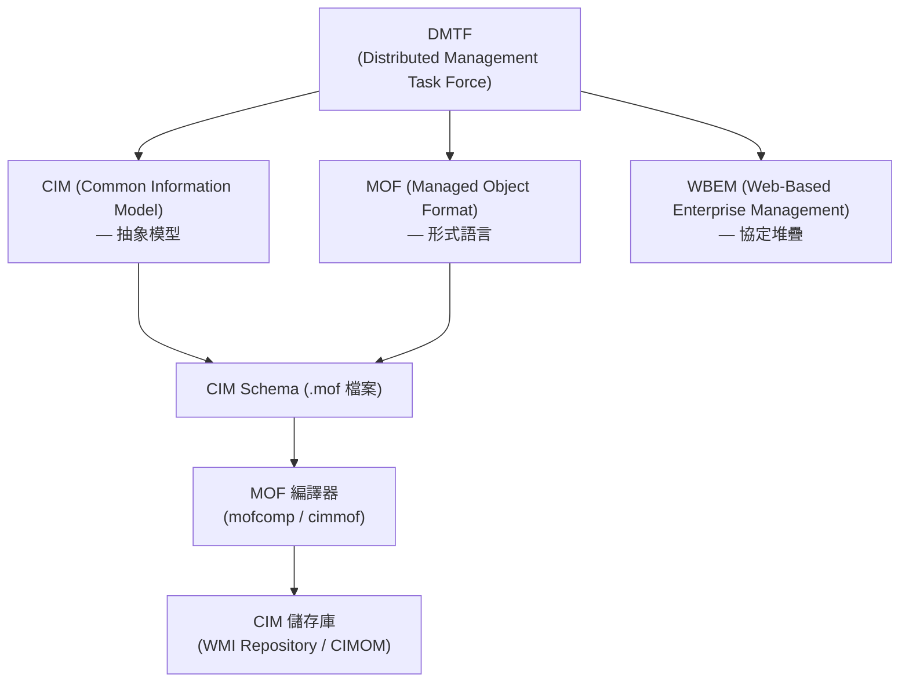
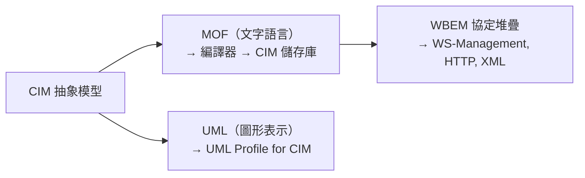

# MOF（Managed Object Format）— 受管物件格式

## 概述

**MOF（Managed Object Format，受管物件格式）** 是由 **DMTF（Distributed Management Task Force）** 所開發的一種基於 IDL（介面定義語言）的綱要描述語言（schema description language）。它用於定義 IT 系統中受管資源（包括儲存、網路、運算及軟體元件）的結構與行為[^dmtf-cim]。

MOF 的核心定位是一門**可編譯的文字語言**——它既可被人類閱讀與撰寫，亦可由 MOF 編譯器（如 Windows 上的 `mofcomp`、Linux/Solaris 上的 `cimmof`）解析並編譯為 **CIM 儲存庫（CIM Repository，又稱 WMI 儲存庫或 CIM Object Manager Repository）**[^ms-mof][^oracle-mofcomp]。

> ⚠️ **注意**：DMTF 的 **Managed Object Format (MOF)** 與 OMG（Object Management Group）的 **Meta Object Facility (MOF)** 是完全不同的兩個標準。前者是系統管理的綱要語言，後者是軟體建模的金元模組化框架。本文件僅探討 DMTF 的 MOF。

## 與 CIM 及 DMTF 的關係

### DMTF（Distributed Management Task Force）

DMTF 是制定與維護 CIM、MOF 及 WBEM 標準的產業聯盟。其相關標準包括：

- **CIM（Common Information Model）** — 定義系統、網路、應用程式與服務的標準化管理資訊
- **MOF 語言** — 用於表達 CIM 綱要的形式語言
- **WBEM（Web-Based Enterprise Management）** — 用於存取與操作 CIM 模型化資源的規格堆疊

MOF 的正式 DMTF 標準文件編號為 **DSP0221**（Managed Object Format Specification）[^dmtf-cim]。

### CIM（Common Information Model，共同資訊模型）

CIM 是描述複雜電腦系統管理資訊的抽象概念模型，而 MOF 則是其具體的實作語言：

- **CIM 提供「什麼」** — 定義受管 IT 資源的抽象模型、類別、屬性與關係
- **MOF 提供「如何」** — 用於撰寫與編碼 CIM 定義的具體語言與語法[^dmtf-mof-tutorial]

CIM 標準包含三個部分：

1. **CIM 元模型（CIM Metamodel，DSP0004）** — 定義建構新相容模型的語意
2. **CIM 綱要（CIM Schema）** — 實際的模型描述（類別、屬性、關聯），分層組織為核心模型、共通模型與擴充綱要
3. **CIM 規格（CIM Specification）** — 整合細節與合法語法規則[^dmtf-cim]



## 在系統管理中的應用

MOF 是多個系統管理實作的基礎定義語言：

### a) Windows 管理基礎架構（WMI）— Microsoft

在 Windows 上，MOF 檔案經由 **Mofcomp.exe** 編譯至 **WMI 儲存庫**。一個典型的 WMI provider 包含：

1. **MOF 檔案** — 定義 provider 所提供的類別與資料
2. **DLL 檔案** — 包含提供資料的實作程式碼

用戶端腳本或應用程式可查詢這些 provider MOF 類別的實例，或訂閱事件通知[^ms-mof]。

### b) Solaris WBEM Services — Oracle / Sun

MOF 檔案（包含 **CIM Schema** 與 **Solaris Schema**）置於 `/usr/sadm/mof` 目錄下，在 CIM Object Manager 啟動時自動編譯。`mofcomp` 亦可從 MOF 定義中產生 JavaBeans 元件，使 Java 管理應用程式得以使用[^oracle-mofcomp][^oracle-java]。

### c) 開源實作

多個開源專案實作了 DMTF CIM/WBEM 標準：

- **OpenPegasus**（The Open Group）— 可攜式、模組化的 CIM/WBEM 實作
- **OpenLMI（Open Linux Management Infrastructure）** — Linux 系統管理工具
- **Java WBEM Services / Java CIMOM** — 開源 Java 實作
- **OpenDRIM** — 分散式資源資訊管理[^dmtf-wbem]

### d) 企業硬體供應商

HPE（GreenLake Block Storage）、Cisco（MDS 9000 SAN 交換器）等硬體供應商提供自行延伸標準 CIM 綱要的 MOF 檔案，用於定義供應商特定的受管資源[^hpe-mof][^cisco-mof]。

## 與 WBEM 及 UML 的關係

### MOF ↔ WBEM

**WBEM** 是定義**如何**在網路上探索、存取與操作 CIM 模型化資源的整體框架。MOF 在其中的角色如下：

> 「Managed Object Format (MOF) 是由 DMTF 開發的一種編譯語言。MOF 語言定義了 CIM 與 WBEM 的靜態及動態類別與實例。」[^oracle-mofcomp]

WBEM 規格包含：

- **WS-Management（DSP0226）** — 用於管理的 Web Services
- **CIM Operations over HTTP（DSP0200）**
- **Representation of CIM in XML（DSP0201）**
- **WBEM URI Mapping（DSP0207）**[^dmtf-wbem]

MOF 是**輸入語言**，WBEM 是執行時期管理操作的**協定/規格堆疊**。

### MOF ↔ UML

DMTF 發布了 **UML Profile for CIM（DSP0219）**，定義了 CIM/MOF 概念與 UML 之間的對映：

> 「CIM Infrastructure Specification (DSP0004) 中定義的 CIM 元模型與 UML 元模型非常相似。」[^dmtf-uml-profile]

因此，**MOF 是文字化、可編譯的形式**，而 **UML 是同一 CIM 定義的替代圖形化表示**。UML Profile for CIM 定義了 CIM 類別與關係如何對映至 UML 立體型（stereotype）與記號法。



## MOF 語法與結構

### 文法概覽

MOF 文法以 **ABNF（Augmented Backus-Naur Form）** 規範，設計為具有 **LL(1)** 可解析性，適合低開銷的編譯器實作[^opengroup-grammar]。

**關鍵規則：**

- 所有關鍵字**不區分大小寫**
- 註解使用 `//`（單行）與 `/* */`（區塊）
- MOF 檔案可使用 **Unicode** 或 **UTF-8** 編碼
- 綱要名稱中的類別識別碼使用底線，如 `CIM_Process`
- 空的屬性串列等同於 `*`

### 頂層結構

一份 MOF 規格由一系列**產生式（productions）** 組成：

| 產生式類型 | 說明 |
|-----------|------|
| **編譯器指示（Compiler Directives）** | `#pragma` 指令 |
| **類別宣告（Class Declarations）** | 定義受管物件型別 |
| **關聯宣告（Association Declarations）** | 定義類別間的關係 |
| **限定子宣告（Qualifier Declarations）** | 定義 metadata 標籤 |
| **實例宣告（Instance Declarations）** | 定義預填入的物件實例 |

### 核心語法元素

#### 1. 類別宣告

```mof
[限定子串列]
CLASS 類別名稱 [: 父類別]
{
    *類別特性   // 屬性（properties）與方法（methods）
};
```

**取自 Microsoft 官方範例的真實 MOF 檔案**[^ms-sample-mof]：

```mof
[ClassVersion("1.0.0")]
class MSFT_WindowsProcess : CIM_Process
{
    string CommandLine;

    [Description("This instance method demonstrates modifying the "
                 "priority of a given process."
                 "The method returns an integer value of 0 if the "
                 "operation was successfully completed,"
                 "and any other number to indicate a win32 error code.")]
    uint32 SetPriority([In] uint32 Priority);

    [static,
     Description("This static method demonstrates creating a process "
                 "by supplying commandline to start a new process."
                 "It will output the reference to the newly created process."
                 "The method returns an integer value of 0 if the process "
                 "was successfully created, and any other number to "
                 "indicate a win32 error code.")]
    uint32 Create([In] string CommandLine, [Out] CIM_Process ref Process);
};
```

#### 2. 屬性（Property）宣告

```mof
[限定子串列] 資料型別 屬性名稱 [陣列] [= 預設值];
```

**支援的資料型別**：

| 類別 | 型別 |
|------|------|
| 整數 | `uint8`, `sint8`, `uint16`, `sint16`, `uint32`, `sint32`, `uint64`, `sint64` |
| 浮點 | `real32`, `real64` |
| 字元/字串 | `char16`, `string` |
| 布林 | `boolean` |
| 日期時間 | `datetime` |
| 物件參照 | `ClassName ref`（指向另一個受管物件的參照） |
| 陣列 | 在屬性名稱後以 `[size]` 表示 |

#### 3. 方法（Method）宣告

```mof
[限定子串列] 回傳型別 方法名稱 ( [參數串列] );
```

參數使用 `[In]`、`[Out]` 或 `[In, Out]` 限定子標示方向。

#### 4. 關聯（Association）宣告

```mof
[Association [: 風味]]
CLASS 類別名稱 [: 父類別]
{
    ClassA ref 路徑至A;
    ClassB ref 路徑至B;
};
```

關聯透過 `ref`（參照）屬性定義兩個類別之間的關係[^ms-association]。

#### 5. 實例（Instance）宣告

```mof
[限定子串列] INSTANCE OF 類別名稱
{
    屬性名稱 = 值;
    ...
};
```

#### 6. 限定子（Qualifier）宣告

限定子是應用於類別、屬性、方法或參數的 metadata 標籤：

```mof
Qualifier 鍵名 : boolean = false, Scope(property, reference),
                    Flavor(DisableOverride);
```

**常見限定子**：

| 限定子 | 用途 |
|--------|------|
| `[key]` | 標記屬性為物件識別鍵的一部分 |
| `[Association]` | 標記類別為關聯類別 |
| `[Description("...")]` | 人類可讀的描述文字 |
| `[ClassVersion("x.y.z")]` | 類別的版本識別碼 |
| `[static]` | 標記方法為靜態（類別層級）方法 |
| `[In]`, `[Out]` | 方法參數的方向 |
| `[EmbeddedInstance("ClassName")]` | 嵌入另一個物件 |
| `[ValueMap]`, `[Values]` | 限制屬性值範圍 |

#### 7. 編譯器指示（Compiler Directives）

```mof
#pragma include ("cim_schema_2.26.0.mof")
#pragma include ("MSFT_Qualifiers.mof")
#pragma autorecover
```

- `#pragma include` — 引入其他 MOF 檔案
- `#pragma autorecover` — 確保類別在 WMI 儲存庫重啟後仍保留[^ms-mof]

#### 8. 註解

```mof
// 這是單行註解
/* 這是
   多行註解 */
```

## 總結

MOF（Managed Object Format）是 DMTF 定義的一套用於系統管理領域的綱要描述語言。它位於 CIM 抽象模型與 WBEM 執行時期協定之間，作為**將管理資訊模型轉化為電腦可編譯、可儲存的形式**的橋樑。其基於 IDL 的語法、跨平台的編譯器支援，以及與 UML 的雙向對映能力，使其在企業級系統管理（Windows WMI、Solaris WBEM、Linux OpenLMI）中扮演核心角色。

## 參考文獻

[^dmtf-cim]: DMTF. (n.d.). Common Information Model (CIM). Retrieved 2026-10-01, from https://www.dmtf.org/standards/cim
[^dmtf-wbem]: DMTF. (n.d.). Web-Based Enterprise Management (WBEM). Retrieved 2026-10-01, from https://www.dmtf.org/standards/wbem
[^dmtf-mof-tutorial]: DMTF. (n.d.). CIM & MOF Tutorial. Retrieved 2026-10-01, from http://72.47.221.139/education/mof
[^ms-mof]: Microsoft. (n.d.). Managed Object Format (MOF). Windows Management Infrastructure SDK. Retrieved 2026-10-01, from https://learn.microsoft.com/en-us/windows/win32/wmisdk/managed-object-format--mof-
[^ms-association]: Microsoft. (n.d.). Declaring an Association Class. Windows Management Infrastructure SDK. Retrieved 2026-10-01, from https://learn.microsoft.com/en-us/windows/win32/wmisdk/declaring-an-association-class
[^ms-sample-mof]: Microsoft. (n.d.). Sample.mof — Windows Classic Samples. GitHub. Retrieved 2026-10-01, from https://github.com/microsoft/Windows-classic-samples/blob/main/Samples/ManagementInfrastructure/cpp/Sample.mof
[^oracle-mofcomp]: Oracle. (n.d.). About the MOF Compiler. Solaris WBEM Developer's Guide. Retrieved 2026-10-01, from https://docs.oracle.com/cd/E18752_01/html/817-0366/mof-2.html
[^oracle-java]: Oracle. (n.d.). Managed Object Format. Sun WBEM SDK. Retrieved 2026-10-01, from https://docs.oracle.com/cd/E19455-01/806-6831/6jfoe2of2/index.html
[^opengroup-grammar]: The Open Group. (n.d.). Managed Object Format (MOF) Syntax Grammar Description. CIM Specification. Retrieved 2026-10-01, from https://www.opengroup.org/onlinepubs/009619599/apdxa.htm
[^dmtf-uml-profile]: DMTF. (n.d.). DSP0219 — UML Profile for CIM Specification, Version 1.0.0. Retrieved 2026-10-01, from https://www.dmtf.org/sites/default/files/standards/documents/DSP0219_1.0.0.pdf
[^hpe-mof]: HPE. (n.d.). GreenLake Block Storage MOF Files. Retrieved 2026-10-01, from https://cdn.support.hpe.com/hpesc/public/docDisplay?docId=sd00006209en_us&page=GUID-D00CCEC8-0936-4209-B33D-3FC27426EF6D.html&docLocale=en_US
[^cisco-mof]: Cisco. (n.d.). MDS 9000 SAN Switch MOF Developer Guide. Retrieved 2026-10-01, from https://www.cisco.com/en/US/docs/storage/san_switches/mds9000/sw/san-os/smi-s/developer/guide/MOF.pdf