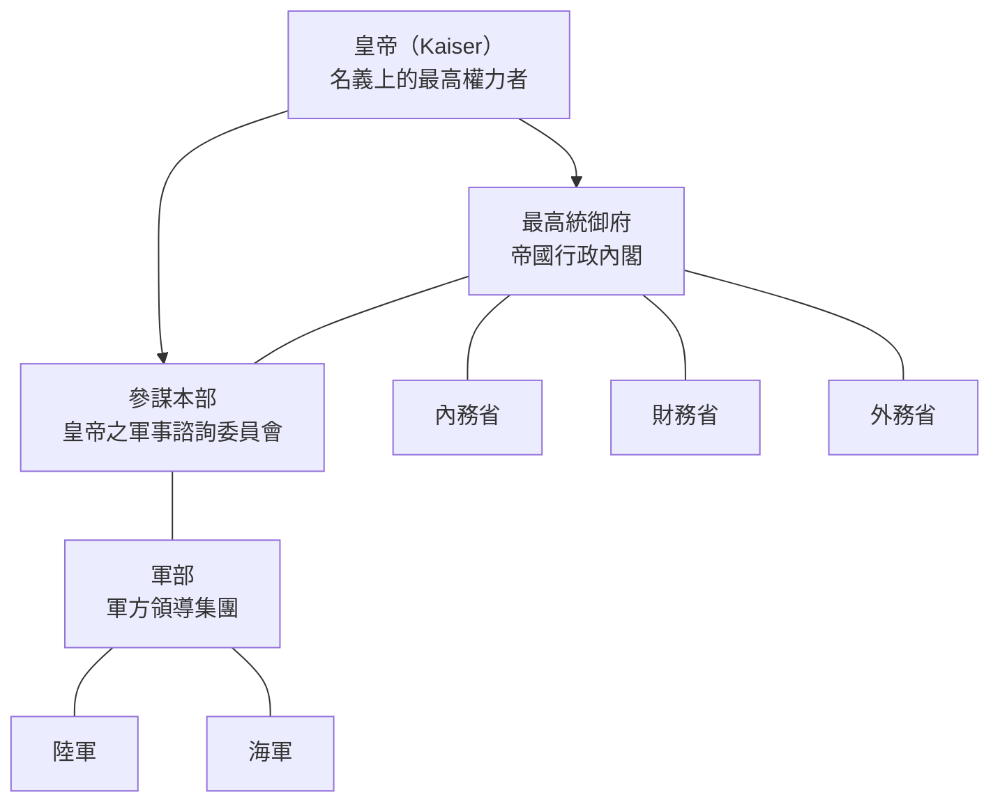

# 幼女戰記世界觀：軍部與最高統御府

## 概覽

本報告探討《幼女戰記》（幼女戦記 / Yōjo Senki / The Saga of Tanya the Evil）世界觀中兩個核心軍事/政治機構——**軍部**與**最高統御府**——各自的定義、構成，以及兩者之間的權力關係。

---

## 1. 軍部（Gunbu / ぐんぶ）

**軍部** 指的是帝國軍隊的整體領導體系——即陸軍、海軍及其高層指揮機構（包含元帥、將領群、參謀本部等）的集合體。該詞反映的是軍方作為一個獨立於文官政府的政治權力集團[^wiki-empire]。

在帝國的政治結構中，軍部是一個強大的政治勢力，雖然名義上與文官政府同屬最高統御府管轄，但實際上擁有相當大的自主性。故事中可見的軍部相關組織包括：

- **人事局**（萊根上校任職處）——處理人事調動與晉升
- **開發部**（修格爾博士任職處）——負責兵器研發
- **參謀本部**（見下節）——軍部內的核心戰略規劃機構

---

## 2. 最高統御府（Saikō Tōgofu / さいこうとうごふ）

**最高統御府** 是帝國的內閣——即帝國最高行政機構。根據檔案記載，其結構如下[^wiki-empire]：

> 「帝國內閣稱為最高統御府，由內務省、財務省、外務省、參謀本部等構成。」

最高統御府是一個**內閣級機構**，旗下同時包含文職部會（內務省、財務省、外務省）與軍職機構（參謀本部）。**參謀本部**在行政上隸屬於最高統御府，但名義上直屬皇帝陛下，是皇帝的軍事諮詢委員會。

大戰前的最高統御府基本上只是對參謀本部的決策進行形式上的批准（"rubber-stamping"）。

---

## 3. 各機構關係圖

*說明：實線（--->）表示從屬/命令關係，虛線（---）表示同屬一體或行政隸屬關係。*

---

## 4. 兩者之間的關係

| 機構 | 角色 |
|------|------|
| **皇帝** | 名義上的國家元首與最高軍事指揮官 |
| **最高統御府** | 帝國行政內閣，包含文職部會與參謀本部 |
| **參謀本部** | 皇帝的軍事諮詢委員會，軍部之核心戰略規劃機構 |
| **軍部** | 軍方整體領導集團，行使政治影響力 |

**權力運作方式如下**[^wiki-empire][^tvtropes]：

1. **皇帝**是國家的名義最高權力者
2. **最高統御府**是行政內閣，涵蓋文職部會（內務、財務、外務）以及**參謀本部**
3. **參謀本部**名義上是皇帝的軍事諮詢委員會，但行政位置上屬於最高統御府
4. **軍部**是軍方領導集團，實際驅動參謀本部的決策方向
5. 各地方面軍名義上向最高統御府報告，但作戰指揮由參謀本部負責

大戰前，最高統御府基本上只是對參謀本部決策進行形式批准，權力重心實際上在軍部/參謀本部一側。隨著戰爭進展，**前線將領**（如傑圖亞和羅梅爾）與**柏林後方的參謀本部官僚**之間出現緊張關係，後者被認為是脫離前線現實的「安樂指揮官」，最終導致了後期劇情中關於軍事政變的討論。

---

## 5. 關鍵人物隸屬

- **漢斯·馮·傑圖亞准將**（Brigadier General Hans von Zettour）—— 帝國參謀本部副後勤部長，後成為東線指揮官
- **魯德爾斯多夫將軍**（General Rudersdorf）—— 最高統御府/參謀本部高層戰略家
- **埃里希·馮·萊根中校→上校**（Lt. Col. → Col. Erich von Lehrgen）—— 參謀本部人事局戰略作戰副部長
- **譚雅·馮·德古雷查夫**（Tanya von Degurechaff）—— 帝國軍魔導師，203航空魔導大隊司令，曾受最高統御府派遣支援北方战线

---

## 參考資料

[^wiki-empire]: Youjo Senki Wiki. (n.d.). Empire. Retrieved 2026-10-03, from https://web.archive.org/web/20220715111409/https://youjo-senki.fandom.com/wiki/Empire
[^tvtropes]: TV Tropes. (n.d.). Characters: The Saga of Tanya the Evil. Retrieved 2026-10-03, from https://tvtropes.org/pmwiki/pmwiki.php/Characters/TheSagaOfTanyaTheEvil
[^wikipedia]: Wikipedia. (n.d.). The Saga of Tanya the Evil. Retrieved 2026-10-03, from https://en.wikipedia.org/wiki/The_Saga_of_Tanya_the_Evil