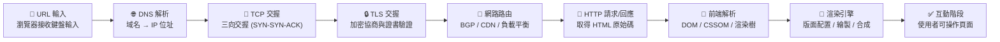
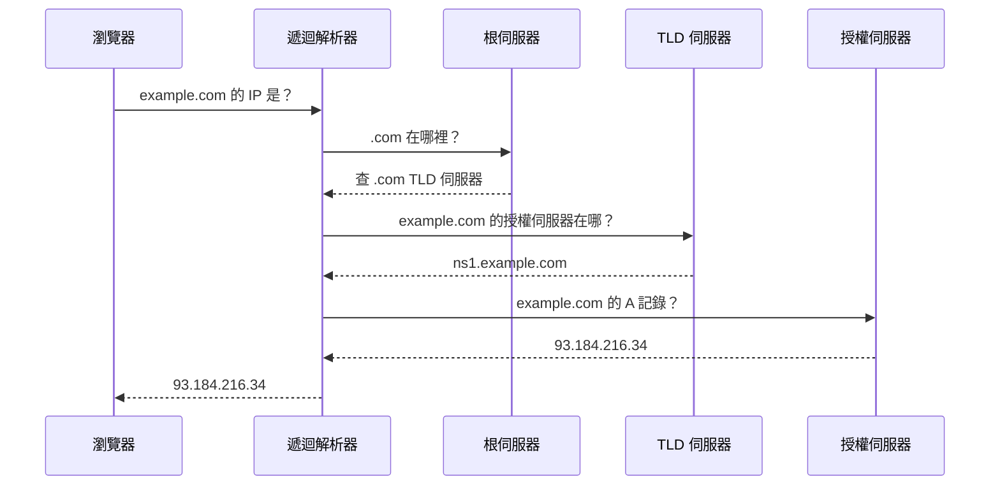
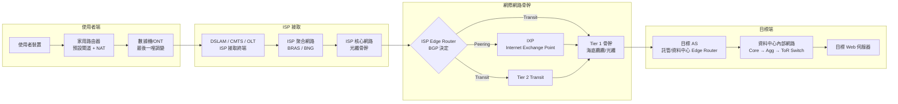
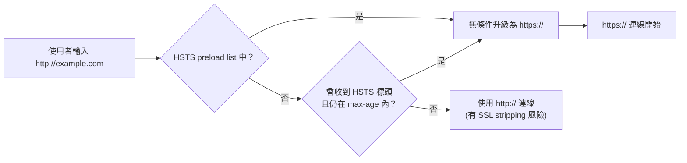
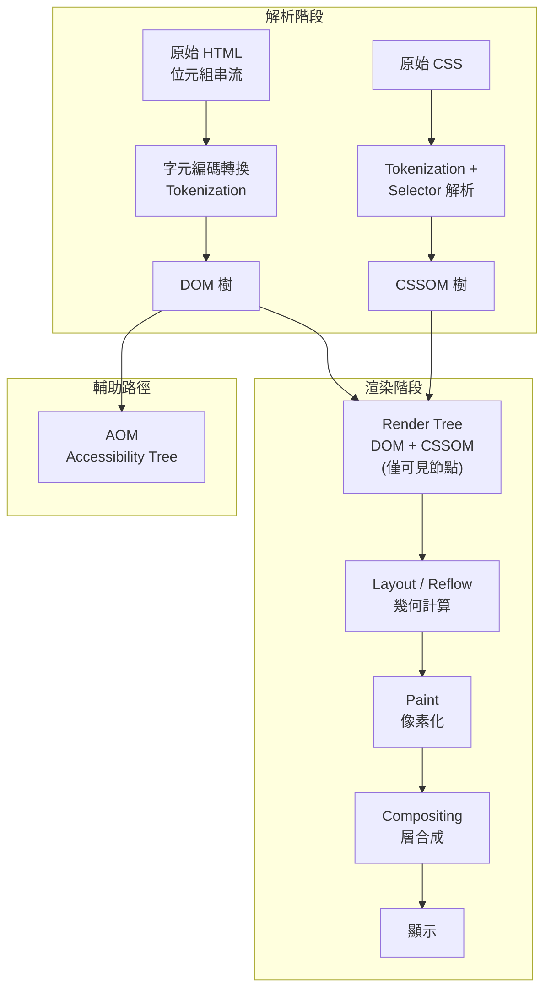
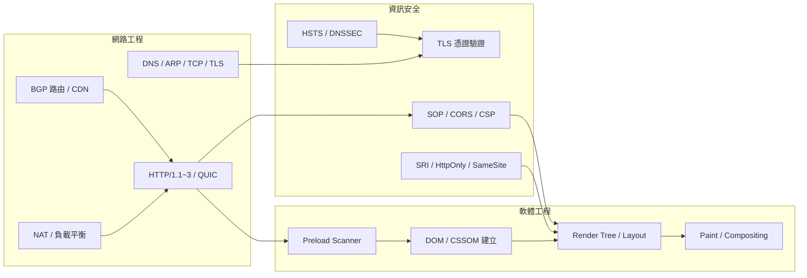

# 從 URL 輸入到頁面顯示：完整生命週期與三重視角分析

## 引言

當使用者在瀏覽器網址列中輸入一個網址並按下 Enter 鍵，到完整網頁顯示在螢幕上，這段看似瞬間完成的過程實際上涉及**數百個步驟**，橫跨電腦硬體、作業系統、網路協定、資訊安全、瀏覽器引擎等多個領域。本報告從**網路工程**、**資訊安全**與**軟體工程**三個角度，詳細剖析這個經典問題的每一個環節。

---

## 1. 宏觀流程總覽



整個流程從網路工程視角看約可劃分為**瀏覽器前處理**、**DNS 解析**、**傳輸層建立**、**安全通道建立**、**網路路由與傳輸**、**HTTP 請求/回應**、**瀏覽器渲染**與**互動**八個階段[^mdn-how-browsers-work][^alex-what-happens-when]。

---

## 2. 網路工程視角

### 2.1 鍵盤輸入→作業系統→瀏覽器

按下鍵盤按鍵時，鍵盤控制器將按鍵編碼為 scancode，透過 USB（或藍牙）傳送至電腦。作業系統的 HID（Human Interface Device）驅動程式解析該訊號，視窗管理員將其傳遞到焦點應用程式（瀏覽器），瀏覽器的網址列接收字元。按下 Enter 後，瀏覽器啟動頁面載入序列[^alex-what-happens-when]。

### 2.2 DNS 解析

DNS（Domain Name System）將人類可讀的域名（如 `example.com`）轉換為機器可讀的 IP 位址，其運作層級如下[^cloudflare-dns]：

1. **DNS 遞迴解析器（Recursor/Resolver）**——瀏覽器查詢的第一站，通常由 ISP 或第三方（Google DNS、Cloudflare 1.1.1.1）營運。
2. **根名稱伺服器（Root Nameserver）**——回應頂層域（TLD）伺服器的位址。
3. **TLD 名稱伺服器**——儲存該 TLD 下所有域名的授權名稱伺服器位址（如 `.com`、`.org`）。
4. **授權名稱伺服器（Authoritative Nameserver）**——持有該域名的實際 DNS 資源記錄（A、AAAA、CNAME 等），最終回傳 IP 位址。

完整且未快取的 DNS 查詢流程如下[^cloudflare-dns]：



DNS 快取發生在多個層級：瀏覽器 DNS 快取 → 作業系統 stub resolver → ISP/遞迴解析器快取。每筆快取記錄有 TTL（Time-to-Live）決定儲存時間[^cloudflare-dns]。

### 2.3 ARP（Address Resolution Protocol）

在 IP 封包離開本機之前，需知道下一跳（next hop）的 MAC 位址。ARP 於**資料連結層（Layer 2）**將 IP 位址解析為 MAC 位址。流程如下[^alex-what-happens-when]：

1. 檢查 **ARP 快取**——若有對應 MAC 則直接使用。
2. 若無快取：查路由表決定網路介面 → 廣播 **ARP Request** 封包（目標 MAC 為 `FF:FF:FF:FF:FF:FF`）→ 擁有目標 IP 的裝置回傳 **ARP Reply** 告知其 MAC 位址。
3. 封包即可在 Layer 2 傳送。

### 2.4 TCP 三向交握（傳輸層 Layer 4）

瀏覽器請求建立 TCP socket（`AF_INET`, `SOCK_STREAM`）到目標 IP:port。TCP 三向交握如下[^cloudflare-tcpip]：

1. **SYN**：客戶端發送 SYN 旗標 + 初始序號（ISN）。
2. **SYN-ACK**：伺服器回覆 SYN + ACK 旗標 + 自身 ISN。
3. **ACK**：客戶端回傳 ACK，連線建立。

封包在往下傳送時依序被封裝：**傳輸層**（TCP 段，含來源/目標埠）→ **網路層**（IP 封包，含來源/目標 IP）→ **鏈結層**（Ethernet 訊框，含來源/目標 MAC）。

TCP 的**壅塞控制**使用 slow start（每收到 ACK 加倍壅塞視窗）與壅塞避免（additive increase / multiplicative decrease）機制。若封包丟失，壅塞控制演算法（現代系統常用 CUBIC）會介入[^alex-what-happens-when]。

### 2.5 從家用路由器到目標伺服器的完整路徑

前幾個階段聚焦於本機端（鍵盤、DNS、ARP、TCP），現在追蹤封包離開本機後經過的每一段網路基礎設施[^cloudflare-network-layer][^cloudflare-wan]。

#### 2.5.1 預設閘道（Default Gateway）

裝置判斷目標 IP 不在本地子網路後，將封包送往**預設閘道**——通常是家用/辦公室路由器（LAN IP 如 `192.168.1.1`）。路由器是區域網路的「交通警察」，負責在不同網路之間轉送封包[^cloudflare-router]。

#### 2.5.2 路由器與 NAT

家用路由器執行以下操作：

1. **NAT（Network Address Translation）**：將私有來源 IP（`192.168.x.x`）與 port 取代為路由器 WAN 端的**公有 IP** 與新 port 號，並記錄映射表以便回應封包能正確轉回[^alex-what-happens-when]。
2. **防火牆**：阻擋未經請求的 inbound 連線。
3. **路由**：決定下一個轉送點。

#### 2.5.3 數據機（Modem / CPE）與最後一哩

路由器將封包透過 WAN port 送往**數據機**（亦稱 CPE——Customer Premises Equipment）。數據機負責實體層的調變/解調變，將數位 Ethernet 訊框轉換為適合**最後一哩（last-mile）**媒介的訊號[^cloudflare-modem]：

| 技術類型 | 數據機形式 | 訊號媒介 |
|---------|-----------|---------|
| **DSL（數位用戶線路）** | DSL 數據機 | 銅線電話線上的類比電訊號（local loop） |
| **Cable（有線電視網路）** | Cable 數據機 | HFC 混合光纖同軸上的 RF 射頻訊號 |
| **FTTH（光纖到府）** | ONT（光網路終端） | 單模光纖上的光脈衝 |
| **5G 固定無線** | 5G CPE | 空中無線電波 |

#### 2.5.4 ISP 接取網路終端

數據機的訊號反向穿過接取網路，到達 ISP 的終端設備：

- **DSL**：銅線電話線終端於 **DSLAM（DSL Access Multiplexer）**，位於電話公司的**局端（Central Office）**或路邊街頭 cabinet。DSLAM 將數百條 DSL 用戶線聚合到高速上行鏈路（光纖或 ATM/Ethernet）。
- **Cable**：同軸電纜連接到鄰近的**光節點（optical node）**，訊號經光纖到達有線電視公司的**頭端（headend）**，由 **CMTS（Cable Modem Termination System）** 終端管理數千個 cable modem。
- **FTTH**：ONT 的光纖連接到 ISP 在地 PoP 的 **OLT（Optical Line Terminal）**，使用 GPON、XG-PON 等標準。

#### 2.5.5 ISP 聚合網路與區域骨幹

穿過 DSLAM/CMTS/OLT 後，流量進入 ISP 的**聚合/區域網路**——匯集多個在地終端點的流量，回傳到 ISP 的區域資料中心或 PoP。關鍵設備包括：

- **BRAS（Broadband Remote Access Server）**：認證用戶 session、分配 IP 位址、執行服務政策。
- **BNG（Broadband Network Gateway）**：現代替代方案，將流量從接取層路由進核心層。

此階段封包已在 ISP 私有的**都會/區域骨幹**上運行，通常使用光纖鏈結（SONET/SDH、Gigabit Ethernet 或 OTN）。

#### 2.5.6 ISP 核心網路

ISP 的**核心網路**是高容量、通常具備備援的光纖骨幹，互連 ISP 所有區域 PoP 與資料中心。核心內部使用 OSPF 或 IS-IS 等 interior routing protocol，以及 **iBGP（internal BGP）** 進行內部路由交換。

您的住宅 ISP 是一個 **AS（Autonomous System）**——由唯一 **ASN** 識別的大型網路。它擁有特定的 IP 位址空間，並使用 **BGP** 向網際網路其他部分公告其路由[^cloudflare-as]。

#### 2.5.7 離開住宅 ISP：Transit vs. Peering

流量到達 ISP 邊界（edge router）後，需交接給其他網路才能抵達最終目的地：

- **Transit（付費上游）**：小型 ISP（Tier 2 與 Tier 3）向大型電信業者購買 **IP transit**。Transit 提供商將 ISP 的路由公告給其他網路，並承載所有非本地流量的傳遞[^wikipedia-transit]。
- **Peering（對等互連）**：中型至大型 ISP 之間建立直接互連，通常無償交換彼此客戶的流量。可發生在：
  - **Public peering**——在 **IXP（Internet Exchange Point）** 共享的交換架構上。
  - **Private peering**——兩 ISP 之間的直接光纖跳接（PNI）。

#### 2.5.8 Internet Exchange Point（IXP）

IXP 是實體的**共置設施（資料中心）**，多個網路營運商在此會面交換流量。IXP 讓不同 ISP 之間的流量不需依賴中介的 transit provider，減少延遲與成本[^cloudflare-ixp]。

#### 2.5.9 ISP 層級架構（Tier 1 / Tier 2 / Tier 3）

網際網路的網路提供商粗略分為三層：

| 層級 | 連線範圍 | 如何連接到網際網路 | 範例 |
|------|---------|------------------|------|
| **Tier 3** | 小型本地/區域 ISP | 僅購買 transit，無 peering 協議 | 小型鄉村 WISP |
| **Tier 2** | 區域性/全國性 ISP | 與部分網路 peering，但仍需向 Tier 1 購買 transit | Comcast、BT、多數住宅 ISP |
| **Tier 1** | 全球骨幹 | 僅透過 settlement-free peering 即可觸及所有網路，**從不購買 transit** | AT&T、Lumen(Level 3)、Telia、NTT、Cogent |

Tier 1 網路構成網際網路的**骨幹（backbone）**，它們之間透過 settlement-free peering 互連[^wikipedia-tier1]。

> 重要變化：自 2010 年前後，大型內容提供商（Google、Netflix、Meta）的私有網路與 CDN 大幅扁平化了網際網路拓撲，它們直接與多數 ISP 互連，繞過了傳統 Tier 1 transit[^wikipedia-tier1]。

#### 2.5.10 跨洲傳輸與海底光纜

若請求跨越洲際（如倫敦到舊金山），封包會經由**海底通訊電纜（submarine communications cable）**穿越海洋。主要纜纜系統包括 TAT-14（跨大西洋）、MAREA、FASTER（跨太平洋）等。這些纜纜連接 Tier 1 在不同洲的 PoP。

#### 2.5.11 到達目標資料中心

封包最終到達目標伺服器的資料中心網路：

1. 目的地 AS（託管提供商/資料中心營運商）的 edge router 接收封包。
2. 穿越資料中心內部網路：**核心路由器 → 聚合交換器 → top-of-rack 交換器 → 伺服器 NIC**。
3. 伺服器 OS 剝離 Ethernet/IP/TCP 標頭，從封包序列重組 HTTP 請求。
4. Web 伺服器軟體處理請求，回傳 HTTP 回應。

沿途封包可能經過 **10–20+ 個路由器**，跨越數個 AS，每跳耗時數毫秒。



### 2.6 路由與 BGP（網路層 Layer 3）

封包離開本機網路後，會經過多個**路由器**。每個路由器的工作[^cloudflare-routing]：

1. 讀取封包 IP 標頭中的目標位址。
2. 查閱**路由表**決定下一跳。
3. 遞減 **TTL（Time-to-Live）**——若歸零則丟棄封包。
4. 轉發封包到下一個路由器。

網際網路由約 64,000+ 個 **AS（Autonomous System）**——ISP、雲端供應商、大學等營運的大型網路——組成。**BGP（Border Gateway Protocol）**是 AS 之間交換路由資訊的標準協定[^cloudflare-bgp]：

- **External BGP（eBGP）**：不同 AS 之間使用，交換跨網際網路的路徑。
- **Internal BGP（iBGP）**：同一 AS 內部使用（可選，也可用 OSPF 或 RIP）。

BGP 依賴信任機制，設定錯誤或惡意的 BGP 挾持（BGP hijacking）可將流量重新導向。2008 年巴基斯坦 ISP 即因 BGP 設定錯誤，導致 YouTube 全球性離線[^cloudflare-bgp]。

### 2.7 Anycast 與 CDN

**Anycast** 是一種網路定址與路由方法：單一 IP 位址可由多個節點（資料中心）提供服務。請求會自動路由到**地理上最近且有容量**的資料中心，常用於 DNS 基礎設施與 CDN 服務[^cloudflare-anycast]。

**CDN（Content Delivery Network）**是地理分散的伺服器群組，將內容快取在靠近使用者的位置。DNS 解析常回傳 CDN 邊緣伺服器的 IP 而非源伺服器。CDN 將伺服器部署在 **IXP（Internet Exchange Point）**——不同網路互連的實體地點[^cloudflare-cdn]。

### 2.8 負載平衡

**負載平衡器**將流量分散到多個後端伺服器，防止單一伺服器過載。演算法分為[^cloudflare-loadbalancing]：

- **靜態演算法**：round-robin、weighted round-robin——不考慮伺服器狀態。
- **動態演算法**：least connection、resource-based——即時根據伺服器健康狀態調整。
- **GSLB（Global Server Load Balancing）**：跨全球伺服器分配流量。

### 2.9 NAT（Network Address Translation）

大多數家用與辦公室網路使用私有 IP 位址（如 `192.168.x.x`）。封包離開本機網路前往網際網路時，路由器執行 **NAT**——將私有來源 IP:port 取代為路由器的公有 IP 與新 port 號，並記錄此映射以便回應封包能正確轉回[^alex-what-happens-when]。

### 2.9 HTTP 請求/回應（應用層 Layer 7）

連線建立後，瀏覽器發送 HTTP 請求：

| 版本 | 特性 | 限制 |
|------|------|------|
| **HTTP/1.1** | 每個請求需獨立 TCP 連線或 keep-alive；head-of-line blocking | 效率低，大量請求時序列化延遲 |
| **HTTP/2** | 多工串流（multiplexing）、HPACK 標頭壓縮、server push | 底層仍使用 TCP，仍受傳輸層 head-of-line blocking 影響 |
| **HTTP/3 + QUIC** | 基於 UDP，串流為一級傳輸層概念，無 head-of-line blocking；1-RTT 交握（0-RTT 恢復） | 需要客戶端與伺服器雙方支援 |

HTTP/3 使用 **QUIC**（Quick UDP Internet Connections）作為底層傳輸協定，將 TCP 交握 + TLS 1.3 交握合併為單次 1-RTT 過程，且執行於 **user-space** 使協定更新不需依賴 OS 核心更新[^cloudflare-http3]。

### 2.10 OSI 模型全層級對照

| OSI 層 | 名稱 | 關鍵協定/裝置 | 功能 |
|--------|------|---------------|------|
| **7 — 應用層** | Application | HTTP/1.1, HTTP/2, HTTP/3, DNS, TLS | 瀏覽器發送 HTTP 請求 |
| **6 — 表達層** | Presentation | TLS（加密） | 資料翻譯、加密/解密 |
| **5 — 會話層** | Session | （由 TCP 處理） | 連線管理控制 |
| **4 — 傳輸層** | Transport | TCP, UDP, QUIC | 埠對埠傳遞、可靠性、壅塞控制 |
| **3 — 網路層** | Network | IP, BGP, OSPF, ICMP | IP 定址、跨網路封包路由 |
| **2 — 資料鏈結層** | Data Link | Ethernet (802.3), Wi-Fi (802.11), ARP | MAC 定址、跳對跳傳遞 |
| **1 — 實體層** | Physical | 銅纜、光纖、無線電波 | 位元→電子/光學/無線訊號 |

---

## 3. 資訊安全視角

從安全角度，從 URL 到頁面顯示的每一步都涉及不同的攻擊向量與防禦機制，形成**縱深防禦（defense-in-depth）**架構。

### 3.1 URL 解析與 HSTS 檢查

瀏覽器解析 URL 後，第一步檢查 **HSTS（HTTP Strict Transport Security）** 快取。HSTS 是伺服器透過 `Strict-Transport-Security` 回應標頭傳遞的政策（如 `max-age=31536000; includeSubDomains`），告訴瀏覽器：在指定時間內，僅允許 HTTPS 連線[^mdn-hsts]。

若域名在瀏覽器的 **HSTS preload list**（由 Google、Mozilla、Microsoft 等瀏覽器供應商硬編碼的域名清單）中，瀏覽器**在發送任何封包前**即靜態地將 `http://` 升級為 `https://`。

**防禦的攻擊**：SSL stripping（SSL 降級攻擊）——攻擊者在網路上將 HTTPS 連線降級為明文 HTTP[^mdn-mitm]。

**限制**：若使用者是**首次訪問**且該站不在 preload list 中，初始的 HTTP 請求仍有漏洞。HSTS 無法經由 HTTP 設定——瀏覽器會忽略不安全連線上的 HSTS 標頭，防止 MITM 攻擊者注入偽造的 HSTS 標頭[^wikipedia-hsts]。



### 3.2 DNS 安全

**攻擊向量——DNS Spoofing（DNS 快取中毒）**：攻擊者將偽造的 DNS 記錄注入 DNS 解析器快取，使解析器回傳錯誤的 IP 位址，將使用者流量導向攻擊者控制的伺服器[^wikipedia-dns-spoofing]。

**防禦機制**：
- **DNSSEC（DNS Security Extensions）**：使用密碼學數位簽章驗證 DNS 回應的真實性，防止快取中毒。但採用率仍不完整[^wikipedia-dns-spoofing]。
- **TLS 憑證驗證**：即使 DNS 被欺騙，TLS 憑證驗證是最終防線——攻擊者的伺服器必須出示目標域名的有效憑證。

### 3.3 TLS 交握與憑證驗證

對於 HTTPS 連線，TCP 建立後即進行 TLS 交握。以 TLS 1.2 搭配 ECDHE 為例[^cloudflare-tls]：

1. **Client Hello**：瀏覽器發送支援的 TLS 版本、密碼套件、client random。
2. **Server Hello**：伺服器選擇密碼套件、發送 SSL 憑證（含公鑰）、server random、Diffie-Hellman 參數與數位簽章。
3. **憑證驗證**：瀏覽器驗證伺服器憑證：
   - 檢查**憑證鏈**回歸受信任的根 CA。
   - 確認憑證未過期。
   - 檢查 **CRL（Certificate Revocation List）** 或使用 **OCSP（Online Certificate Status Protocol）** / **OCSP Stapling** 確認憑證未被撤銷。
   - 確認 **subject name / SAN** 與使用者輸入的域名匹配。
   - 檢查 **DNS CAA（Certification Authority Authorization）** 記錄確認該 CA 被授權。
4. **金鑰交換**：雙方獨立計算 premaster secret。
5. **session key 生成**：雙方用 client random、server random、premaster secret 推導對稱 session key。
6. **Finished 訊息**：雙方發送加密的 "Finished" 訊息確認交握成功。

TLS 1.3 的重大改進[^cloudflare-tls]：
- 移除不安全密碼套件（如 RSA 金鑰交換）。
- 將交握縮減為 **1-RTT**。
- 支援 **0-RTT session resumption**。
- 強制**前向保密（forward secrecy）**——即使伺服器長期私鑰遭洩露，也無法解密過去的 session。

### 3.4 HTTPS 攔截（MITM Proxy）

企業網路與防毒軟體常執行 **HTTPS 攔截**：在使用者機器安裝自訂根 CA，代理伺服器終止客戶端的 TLS 連線（使用自訂 CA 簽署的憑證），再與真實伺服器建立新的 TLS 連線。這破壞了端對端加密，但允許內容檢查。若自訂 CA 遭洩露或不當管理，所有流量都可能被解密[^mdn-mitm]。

### 3.5 HTTP 請求/回應的安全機制

#### Secure Cookie 旗標

伺服器透過 `Set-Cookie` 標頭設定的安全旗標[^mdn-cookie]：

| 旗標 | 作用 | 防禦目標 |
|------|------|----------|
| **`Secure`** | Cookie 僅經由 HTTPS 傳送 | MITM 竊取 HTTP 上的 cookie |
| **`HttpOnly`** | JavaScript 無法透過 `document.cookie` 存取 | **XSS**——即使攻擊者注入 JS 也無法偷取 session cookie |
| **`SameSite=Strict`** | Cookie 絕不隨跨站請求發送 | **CSRF** |
| **`SameSite=Lax`** | 僅 GET 安全方法的頂層導航可發送 cookie | 較弱的 CSRF 防護 |
| **`__Host-` 前綴** | 強制 `Secure`、`Path=/`、無 `Domain` 屬性 | 將 cookie 綁定至來源主機 |

### 3.6 Content Security Policy（CSP）

`Content-Security-Policy` 是**縱深防禦**的核心機制，告訴瀏覽器允許載入哪些資源。關鍵指令[^mdn-csp]：

| 指令 | 作用 | 防禦目標 |
|------|------|----------|
| **`script-src`** 使用 nonce/hash | 控制哪些 JavaScript 可執行 | **所有 XSS**（反射型、儲存型、DOM-based） |
| **`object-src 'none'`** | 封鎖 `<object>`/`<embed>` | 基於 plugin 的攻擊 |
| **`frame-ancestors 'none'`** | 禁止 iframe 嵌入 | **Clickjacking** |
| **`upgrade-insecure-requests`** | 自動將 HTTP 資源升級為 HTTPS | **Mixed content** |
| **`require-trusted-types-for 'script'`** | 強制使用 Trusted Types API | **DOM-based XSS** |

### 3.7 Same-Origin Policy（SOP）與 CORS

**Same-Origin Policy（同源政策）**是瀏覽器最基本的安全模型。兩個 URL 僅當 **scheme、host、port** 完全相同時才被視為同源[^mdn-sop]：

- **禁止**跨源**讀取**（如 `https://evil.com` 的腳本無法讀取 `https://bank.com` 的資料）。
- **允許**跨源**寫入**（連結、重新導向、表單提交）——這也是需要 **CSRF token** 的原因。
- **允許**跨源**嵌入**（``、`<script>`、`<iframe>`）——這也是需要 **CSP** 的原因。

**CORS（Cross-Origin Resource Sharing）**可選擇性放寬 SOP，透過 `Access-Control-Allow-Origin` 等標頭讓伺服器明確允許跨源存取[^mdn-sop]。

### 3.8 Subresource Integrity（SRI）

SRI 允許開發者提供**加密難湊**，瀏覽器在下載資源（如從 CDN）後驗證其完整性。攻擊者若控制第三方主機，可注入惡意內容；SRI 確保檔案與開發者預期的內容完全一致。使用方式[^mdn-sri]：

```html
<script src="https://cdn.example.com/script.js"
        integrity="sha384-abc123..."
        crossorigin="anonymous"></script>
```

### 3.9 Mixed Content 處理

當 HTTPS 頁面包含經由 HTTP 載入的子資源時，即產生 **mixed content**[^mdn-mixed-content]：

- **可升級內容**（圖片、音訊、視訊）：瀏覽器自動升級為 HTTPS。
- **可封鎖內容**（script、stylesheet、iframe、fetch、字型）：瀏覽器直接**封鎖**。

### 3.10 其他安全標頭

| 標頭 | 作用 |
|------|------|
| **`X-Content-Type-Options: nosniff`** | 防止 MIME-type sniffing（如上傳的圖片被當作 HTML 執行） |
| **`X-Frame-Options: DENY`** | 防止 clickjacking（較舊的 `frame-ancestors` 替代方案） |
| **`Referrer-Policy`** | 控制 `Referer` 標頭中傳送的資訊 |

### 3.11 全生命週期攻擊與防禦一覽

| 階段 | 攻擊向量 | 主要防禦 |
|------|---------|---------|
| **URL 輸入** | SSL stripping（HTTP 降級） | **HSTS** + preload list |
| **DNS 查詢** | DNS Spoofing / cache poisoning | **DNSSEC**；TLS 憑證驗證（最終防線） |
| **TCP 連線** | TCP hijacking | （TLS 加密保護上層） |
| **TLS 交握** | 偽造憑證的 MITM（CA 被入侵） | **憑證驗證** + Certificate Transparency |
| **TLS 交握** | 弱密碼套件、降級攻擊 | TLS 1.3 僅使用 **ECDHE**（前向保密） |
| **HTTP 請求** | Cookie 盜取（session hijacking） | **Secure**、**HttpOnly**、**SameSite** |
| **HTTP 回應** | Cross-Site Scripting（XSS） | 輸出編碼、**Trusted Types**、**CSP** |
| **HTTP 回應** | Cross-Site Request Forgery（CSRF） | CSRF token、SameSite cookie |
| **HTTP 回應** | Clickjacking | **CSP `frame-ancestors`**、`X-Frame-Options` |
| **資源載入** | Mixed content | **CSP `upgrade-insecure-requests`** |
| **資源載入** | 供應鏈攻擊（CDN 被入侵） | **Subresource Integrity（SRI）** |
| **跨源互動** | 跨源資料竊取 | **Same-Origin Policy**、**CORS** |

---

## 4. 軟體工程視角（瀏覽器渲染）

從瀏覽器內部運作的角度，頁面載入可分為**導航**、**解析**與**渲染**三大階段[^mdn-how-browsers-work]。

### 4.1 導航階段

使用者輸入 URL 或點擊連結後，瀏覽器開始導航程序，目標是將**導航時間最小化**。

### 4.2 資源預載（Preload Scanner）

當主執行緒在建立 DOM 時，一個名為 **Preload Scanner** 的次要程序會超前掃描 HTML 中高優先度的資源（CSS、JavaScript、網頁字型），**在背景提前發起下載**，減少未來的主執行緒阻塞時間[^mdn-how-browsers-work]。

### 4.3 關鍵渲染路徑（Critical Rendering Path）

#### 階段 A：DOM 樹建立（Step 1）

HTML 解析分為兩個階段：**tokenization**（標記化）與 **tree construction**（樹建立）。Token 包括起始標籤、結束標籤、屬性名稱與值。解析器建立 **DOM（Document Object Model）樹**——`<html>` 為根，巢狀元素為子節點[^mdn-how-browsers-work]。

**阻塞行為**：`<script>` 元素（無 `async` 或 `defer`）**封鎖解析**——瀏覽器暫停 HTML 解析直到 script 下載並執行。CSS 不封鎖 HTML 解析，但封鎖 JavaScript 執行。像 `` 這類非阻塞資源則在解析繼續的同時被請求[^mdn-how-browsers-work]。

#### 階段 B：CSSOM 樹建立（Step 2）

瀏覽器處理 CSS 規則，建立 **CSS Object Model（CSSOM）**——基於 CSS 選擇器的父子/兄弟關係樹。CSS 是**渲染封鎖（render-blocking）**的：瀏覽器在收到並處理所有 CSS 之前**不會渲染任何內容**（因為後面的規則可能覆蓋前面的——CSS 的 "Cascade"）[^mdn-how-browsers-work]。

#### 階段 C：JavaScript 編譯

JavaScript 檔案被**解析為 AST（Abstract Syntax Tree）**，部分瀏覽器引擎再將 AST **編譯為 bytecode**。大部分程式碼在主執行緒上執行。

#### 階段 D：Accessibility Tree（AOM）

瀏覽器建立 **Accessibility Object Model（AOM）**——DOM 的語意化版本，供輔助裝置使用。DOM 每次變更時 AOM 都會更新。在 AOM 建立之前，輔助科技無法存取頁面內容[^mdn-how-browsers-work]。

#### 階段 E：渲染樹建立（Render Tree — Step 3）

DOM 與 CSSOM 合併為 **Render Tree**（也稱 computed style tree）。瀏覽器從 DOM 根開始走訪每個**可見**節點：
- `display: none` 的元素與 `<head>` 部分被**排除**。
- `visibility: hidden` 的元素被**包含**（它們佔據空間，只是看不見）。
- 每個可見節點獲得其**計算後的樣式**[^mdn-how-browsers-work]。

#### 階段 F：版面配置 / Layout（Step 4）

瀏覽器計算渲染樹中每個節點的**幾何資訊**（尺寸與位置）。從根開始，考量**視埠（viewport）大小**。頁面上的所有東西被視為**盒子**，瀏覽器根據盒模型計算每個元素的寬度、高度與位置[^mdn-how-browsers-work]。

- **Layout** = 首次確定尺寸/位置。
- **Reflow** = 任何後續重新計算（如圖片載入後其尺寸終於確定，導致所有東西移位）。Reflow 成本很高——會觸發 repaint 與 recomposite。

#### 階段 G：繪製 / Paint（Step 5）

瀏覽器將每個佈局盒子轉換為螢幕上的**實際像素**。繪製涵蓋：文字、顏色、邊框、陰影、圖片、按鈕及元素的所有視覺部分。為優化 repaint，內容可拆分為**層（layers）**[^mdn-how-browsers-work]：

- `<video>`、`<canvas>` 或 `opacity`、3D `transform` 等 CSS 屬性的元素獲得**自己的層**。
- 層在 **GPU** 上繪製而非 CPU，釋放主執行緒。
- 但層消耗記憶體，不應過度使用。

首次真正將內容送到螢幕的時刻稱為 **First Meaningful Paint**[^mdn-how-browsers-work]。

#### 階段 H：合成 / Compositing

當多個層重疊時，需要**合成（compositing）**來以正確順序組裝它們。Reflow 觸發 repaint 再觸發 recomposite。若圖片尺寸事先宣告，則僅需重新繪製受影響的層；否則圖片到達時會引發完整 reflow[^mdn-how-browsers-work]。



### 4.4 互動性

頁面繪製完成後，應達到**可互動狀態**。**Time to Interactive（TTI）**——從初始請求到頁面能在 **50ms 內**回應使用者互動。若主執行緒忙於執行 JavaScript，則無法及時處理滾動、點擊或鍵入[^mdn-how-browsers-work]。

---

## 5. 三方視角總結



| 視角 | 核心關注 | 關鍵步驟 |
|------|---------|---------|
| **網路工程** | 資料如何從使用者終端到達伺服器並回傳 | DNS 解析、TCP/TLS 交握、BGP 路由、CDN、HTTP 協定版本 |
| **資訊安全** | 每一步有哪些攻擊面與防禦機制 | HSTS、憑證驗證、SOP/CORS/CSP、SRI、Secure Cookie |
| **軟體工程** | 瀏覽器如何將原始 HTML 轉換為像素 | DOM/CSSOM/Render Tree、Layout/Paint/Compositing、效能最佳化 |

---

## 參考文獻

[^cloudflare-modem]: Cloudflare. (n.d.). What is a modem?. Retrieved 2026-10-03, from https://www.cloudflare.com/learning/network-layer/what-is-a-modem/

[^cloudflare-router]: Cloudflare. (n.d.). What is a router?. Retrieved 2026-10-03, from https://www.cloudflare.com/learning/network-layer/what-is-a-router/

[^cloudflare-network-layer]: Cloudflare. (n.d.). What is the network layer?. Retrieved 2026-10-03, from https://www.cloudflare.com/learning/network-layer/what-is-the-network-layer/

[^cloudflare-wan]: Cloudflare. (n.d.). What is a WAN?. Retrieved 2026-10-03, from https://www.cloudflare.com/learning/network-layer/what-is-a-wan/

[^cloudflare-as]: Cloudflare. (n.d.). What is an autonomous system?. Retrieved 2026-10-03, from https://www.cloudflare.com/learning/network-layer/what-is-an-autonomous-system/

[^cloudflare-ixp]: Cloudflare. (n.d.). What is an internet exchange point?. Retrieved 2026-10-03, from https://www.cloudflare.com/learning/cdn/glossary/internet-exchange-point-ixp/

[^wikipedia-transit]: Wikipedia. (n.d.). Internet transit. Retrieved 2026-10-03, from https://en.wikipedia.org/wiki/Internet_transit

[^wikipedia-tier1]: Wikipedia. (n.d.). Tier 1 network. Retrieved 2026-10-03, from https://en.wikipedia.org/wiki/Tier_1_network

[^mdn-how-browsers-work]: Mozilla. (n.d.). How browsers work. Retrieved 2026-10-03, from https://developer.mozilla.org/en-US/docs/Web/Performance/How_browsers_work

[^alex-what-happens-when]: alex. (n.d.). What happens when... Retrieved 2026-10-03, from https://github.com/alex/what-happens-when

[^cloudflare-dns]: Cloudflare. (n.d.). What is DNS?. Retrieved 2026-10-03, from https://www.cloudflare.com/learning/dns/what-is-dns/

[^cloudflare-tcpip]: Cloudflare. (n.d.). What is TCP/IP?. Retrieved 2026-10-03, from https://www.cloudflare.com/learning/ddos/glossary/tcp-ip/

[^cloudflare-routing]: Cloudflare. (n.d.). What is routing?. Retrieved 2026-10-03, from https://www.cloudflare.com/learning/network-layer/what-is-routing/

[^cloudflare-bgp]: Cloudflare. (n.d.). What is BGP?. Retrieved 2026-10-03, from https://www.cloudflare.com/learning/security/glossary/what-is-bgp/

[^cloudflare-anycast]: Cloudflare. (n.d.). What is Anycast?. Retrieved 2026-10-03, from https://www.cloudflare.com/learning/cdn/glossary/anycast-network/

[^cloudflare-cdn]: Cloudflare. (n.d.). What is a CDN?. Retrieved 2026-10-03, from https://www.cloudflare.com/learning/cdn/what-is-a-cdn/

[^cloudflare-loadbalancing]: Cloudflare. (n.d.). What is load balancing?. Retrieved 2026-10-03, from https://www.cloudflare.com/learning/cdn/glossary/load-balancing/

[^cloudflare-http3]: Cloudflare. (n.d.). HTTP/3: the past, the present, and the future. Retrieved 2026-10-03, from https://blog.cloudflare.com/http3-the-past-present-and-future/

[^cloudflare-tls]: Cloudflare. (n.d.). What happens in a TLS handshake?. Retrieved 2026-10-03, from https://www.cloudflare.com/learning/ssl/what-happens-in-a-tls-handshake/

[^mdn-hsts]: Mozilla. (n.d.). Strict-Transport-Security. Retrieved 2026-10-03, from https://developer.mozilla.org/en-US/docs/Web/HTTP/Headers/Strict-Transport-Security

[^mdn-csp]: Mozilla. (n.d.). Content Security Policy (CSP). Retrieved 2026-10-03, from https://developer.mozilla.org/en-US/docs/Web/HTTP/CSP

[^mdn-cookie]: Mozilla. (n.d.). Set-Cookie. Retrieved 2026-10-03, from https://developer.mozilla.org/en-US/docs/Web/HTTP/Headers/Set-Cookie

[^mdn-sop]: Mozilla. (n.d.). Same-origin policy. Retrieved 2026-10-03, from https://developer.mozilla.org/en-US/docs/Web/Security/Same-origin_policy

[^mdn-sri]: Mozilla. (n.d.). Subresource Integrity. Retrieved 2026-10-03, from https://developer.mozilla.org/en-US/docs/Web/Security/Subresource_Integrity

[^mdn-mixed-content]: Mozilla. (n.d.). Mixed content. Retrieved 2026-10-03, from https://developer.mozilla.org/en-US/docs/Web/Security/Mixed_content

[^mdn-mitm]: Mozilla. (n.d.). Manipulator in the Middle (MITM). Retrieved 2026-10-03, from https://developer.mozilla.org/en-US/docs/Web/Security/Attacks/MITM

[^wikipedia-hsts]: Wikipedia. (n.d.). HTTP Strict Transport Security. Retrieved 2026-10-03, from https://en.wikipedia.org/wiki/HTTP_Strict_Transport_Security

[^wikipedia-dns-spoofing]: Wikipedia. (n.d.). DNS spoofing. Retrieved 2026-10-03, from https://en.wikipedia.org/wiki/DNS_spoofing