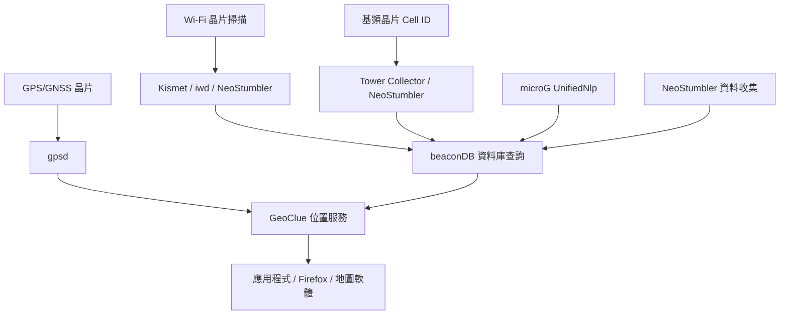

# Degoogle 情境下以 FOSS 重現定位追蹤：可行性與技術方案

## 動機與背景

Google 在 Android 生態中透過多種互補機制取得裝置位置：GPS/GNSS、Wi-Fi 訊號指紋比對（WPS, Wi-Fi Positioning System）、基地臺三角定位（Cell ID / Multilateration）、IP 地理定位、Bluetooth BLE 掃描，以及來自 Android 裝置大規模群眾外包（crowdsourcing）的反饋迴路——Google Maps 定位歷程、Google Location Services (GLS) 與 Street View 街景車戰爭走位（wardriving）共同養成了一個覆蓋全球的 Wi-Fi 基地臺位置資料庫[^wps][^street-view]。

在 degoogle 後（移除 Google Play Services、GLS、Google Maps 等）的 Android 裝置上，這些定位機制全部失效。問題在於：若使用者完全掌控手機硬體（GPS 晶片、Wi-Fi/藍牙天線、基頻晶片），能否以自由開源軟體（FOSS）自行補足這些定位能力？

答案是肯定的，但需組合多層次元件來取代 Google 的不同角色。

## Google 定位機制分解

Google 在 Android 上的定位流程可拆為三層：

1. **原始訊號擷取層**：GPS 晶片讀取衛星訊號→ NMEA 句子；Wi-Fi 晶片掃描頻段→ BSSID (MAC)、SSID、RSSI 訊號強度清單；基頻晶片讀取鄰近基地臺 Cell ID、MCC/MNC、LAC、Signal[^cell-id]。
2. **位置推論層**：將原始訊號對照資料庫推算出地理座標——Wi-Fi 指紋比對（RSSI fingerprinting）、基地臺資料庫查詢（OpenCellID）、IP 地理定位。
3. **系統整合層**：Android 的 `UnifiedNlp`（Unified Network Location Provider）模組整合上述多來源座標，提供統一的 `android.location` API 供所有 App 呼叫[^android-location]。Google 的伺服器端則接收裝置上報的 BSSID+GPS 配對，回饋強化資料庫。

移除 Google 服務後，第 2 層與第 3 層完全中斷。

## 方案總覽：FOSS 定位棧

以下為一套不依賴 Google、可完全自架（self-hosted）的定位替代方案層級示意：



## 各層元件詳細說明

### 1. 原始訊號擷取（完全 FOSS，不需依賴任何雲端）

| 訊號源 | FOSS 工具 | 說明 |
|---|---|---|
| **GPS/GNSS** | `gpsd` | 標準 Linux GPS 守護程式，透過序列埠/UART 接收 NMEA 句子，提供經緯度、高度、衛星數量、精度稀釋等資料[^gpsd]。 |
| **Wi-Fi AP 掃描** | `iwd` / `NetworkManager` / `Kismet` | `iwd` 的 `iwctl` 可列出鄰近 AP（BSSID、SSID、RSSI、通道）。Kismet 為全功能 wardriving 工具，支援 Wi-Fi 802.11a/b/g/n/ac/ax、Bluetooth/BLE、Zigbee，產生 GPS 標註的 SQLite3 紀錄（kismetdb）[^kismet]。 |
| **基地臺掃描** | `NeoStumbler` / `Tower Collector` | Android 上專用 app，取得 GSM/UMTS/LTE/NR 基地臺 Cell ID、MCC、MNC、LAC、Signal 強度[^neostumbler][^tower-collector]。 |

### 2. 位置資料庫（取代 Google 的 WPS 資料庫）

**beaconDB**[^beacondb] —— 當前最活躍的開放定位資料庫，API 相容於已終止的 Mozilla Location Service (MLS) / Ichnaea：

- 由社群群眾外包、僅限選擇性加入（opt-in）的資料收集
- 資料混淆保護隱私（obfuscated publication）
- 防濫用機制：更新既有資料需曾在實體範圍內（只能由真正到過該位置的裝置修改）
- 已收錄 **超過 1.2 億組唯一 Wi-Fi 網路**
- 正被 Ubuntu 25.04+ 採用作為 GeoClue 上游
- 支援 Wi-Fi、基地臺、Bluetooth BLE 燈塔定位

beaconDB 扮演的角色等同於 Google 的 WPS 資料庫：接受裝置上報的 `[BSSID, RSSI]` 清單，回應推估的經緯度與誤差半徑。

**自架選項**：beaconDB 本身即支援 self-hosted 部署（codeberg.org/beacondb/beacondb），可完全脫離公共網路獨自運行。若組織內部環境的 AP 清單已知，可預先載入。也可考慮已封存的 [Ichnaea](https://github.com/mozilla/ichnaea) 作為參考實作。

### 3. 系統層位置服務（取代 Android UnifiedNlp + GLS）

**GeoClue**[^geoclue]—— freedesktop.org 的標準 Linux D-Bus 位置服務：

- 提供統一的 `org.freedesktop.GeoClue` D-Bus 介面
- 支援多種來源：GPS（gpsd）、Wi-Fi 定位（beaconDB 查詢）、3G/4G 基地臺定位、IP 地理定位
- Firefox 及其他 GeoClue 感知應用可直接取得位置
- 可設定 `beaconDB` 作為上游 Wi-Fi 定位提供者

**microG GmsCore**[^microg]—— 自由軟體重新實作 Google Play Services：

- 包含 `UnifiedNlp` 模組，可直接取代 Android 的網路定位提供者
- 可設定指向 beaconDB 或自架實例作為後端
- 讓未修改的 Android App 繼續取得位置資料
- ⭐ 14.8k GitHub stars，為 degoogle Android 生態的核心專案

microG + beaconDB 構成**最直接的 Google 定位替代**：microG 攔截 Android App 對 GLS 的 `UnifiedNlp` 呼叫，轉發至 beaconDB 查詢，App 完全無感知。

### 4. 資料收集（取代 Google 的群眾外包迴路）

若要建立或貢獻區域性定位資料庫，可使用：

| 工具 | 收集資料 | 輸出 |
|---|---|---|
| **NeoStumbler**[^neostumbler] | Wi-Fi AP（BSSID/SSID/RSSI）、基地臺（Cell ID）、Bluetooth BLE | 可上傳至 beaconDB 或自架端點 |
| **Tower Collector**[^tower-collector] | GSM/UMTS/LTE/CDMA 基地臺 | 可上傳至 OpenCellID 與 beaconDB |
| **Kismet**[^kismet] | Wi-Fi、藍牙、Zigbee 等無線訊號 + GPS 座標 | kismetdb (SQLite3)，可批次匯入 beaconDB |

## 限制與注意事項

### a) 協力廠商 App 對 Google API 的硬依賴

部分 Android App 直接寫死 `UnifiedNlp` 或 Google Maps API 金鑰，microG 雖能攔截 `UnifiedNlp`，但若 App 使用 Google 專屬 API（如 Google Maps Geocoding API、Places API），仍需另外自訂代理或改用 FOSS 地圖服務（如 OrganicMaps、OsmAnd、GraphHopper）。

### b) Wi-Fi 指紋定位的環境變異性

Wi-Fi 指紋（RSSI）受建築結構、裝置天線方向、人體遮蔽、AP 頻道變動等影響顯著，Google 靠海量數據稀釋誤差，自架情境下資料量有限，定位精度可能大幅下降。學術文獻顯示純 RSSI 指紋定位在室外的中位誤差約 5–15 米，明顯低於 GPS 的 <5 米[^wps]。

### c) 基地臺定位資料庫依賴

beaconDB 的基地臺覆蓋率因地而異。偏遠地區可能缺乏資料，需先以 `Tower Collector` 進行本地採集。

### d) 部分工具成熟度

- beaconDB 為發展中專案，API 尚在演進
- microG 的 `UnifiedNlp` 模組需針對具體 Android 版本調整
- GeoClue + beaconDB 在 Ubuntu 25.04+ 為主流方案，在 Android 上則需透過 microG 銜接

## 實作路徑建議

依使用者需求由簡至繁給出三種路徑：

| 使用者情境 | 建議方案 | 定位精度 |
|---|---|---|
| 僅需室外 GPS 定位 | gpsd + GeoClue → 標準地圖 App | <5 米（GPS 信號可用時） |
| 需要 Wi-Fi 室內定位 + 室外 GPS | iwd/kismet + beaconDB (public) + GeoClue | 10–50 米（視資料密度） |
| 完全不依賴外部伺服器，完全自架 | NeoStumbler 自行採集 + 自架 beaconDB + microG + GeoClue | 15–100 米（視自我採集量） |

若希望最大化相容性且裝置為 Android，最關鍵的元件組合為：

```
NeoStumbler (資料收集) +
beaconDB (self-hosted) (資料庫) +
microG GmsCore (替換 Google Play Services) +
GeoClue (桌面系統整合)
```

## 結論

Google 在 Android 上的定位能力來自**大型資料庫 × 群眾外包 × 系統層深層整合**的乘積。FOSS 方案已能在每個環節提供對應元件——gpsd、Kismet、beaconDB、GeoClue、microG——組合後確實可重現類似的定位效果。精確度與覆蓋率不會與 Google 匹敵（尤其在起步階段資料稀疏時），但對於希望完全脫離 Google 生態、同時保留自動定位能力的使用者而言，這是一條可行的自主路徑。

---

[^wps]: Wikimedia Foundation. (n.d.). Wi-Fi Positioning System. Retrieved 2026-10-03, from https://en.wikipedia.org/wiki/Wi-Fi_positioning_system
[^street-view]: Wikimedia Foundation. (n.d.). Google Street View Privacy Concerns. Retrieved 2026-10-03, from https://en.wikipedia.org/wiki/Google_Street_View_privacy_concerns
[^cell-id]: Wikimedia Foundation. (n.d.). Mobile Phone Tracking. Retrieved 2026-10-03, from https://en.wikipedia.org/wiki/Mobile_phone_tracking
[^android-location]: microG Project. (n.d.). GmsCore — Free reimplementation of Google Play Services. Retrieved 2026-10-03, from https://github.com/microg/GmsCore
[^gpsd]: The GPSD Project. (n.d.). GPSD — GPS Daemon. Retrieved 2026-10-03, from https://gpsd.io/
[^kismet]: Kismet Wireless. (n.d.). Kismet — Wireless Sniffer, WIDS, and Wardriving Tool. Retrieved 2026-10-03, from https://kismetwireless.net/
[^neostumbler]: Mjaakko. (n.d.). NeoStumbler — Modern Android App for Wardriving. Retrieved 2026-10-03, from https://github.com/mjaakko/NeoStumbler
[^tower-collector]: Zamojski. (n.d.). Tower Collector — Android App for Cell Tower Location Collection. Retrieved 2026-10-03, from https://github.com/zamojski/TowerCollector
[^beacondb]: BeaconDB. (n.d.). BeaconDB — Ethically Sourced Location Database. Retrieved 2026-10-03, from https://beacondb.net/
[^geoclue]: freedesktop.org. (n.d.). GeoClue — D-Bus Location Service. Retrieved 2026-10-03, from https://gitlab.freedesktop.org/geoclue/geoclue
[^microg]: microG Project. (n.d.). GmsCore — Free reimplementation of Google Play Services. Retrieved 2026-10-03, from https://github.com/microg/GmsCore