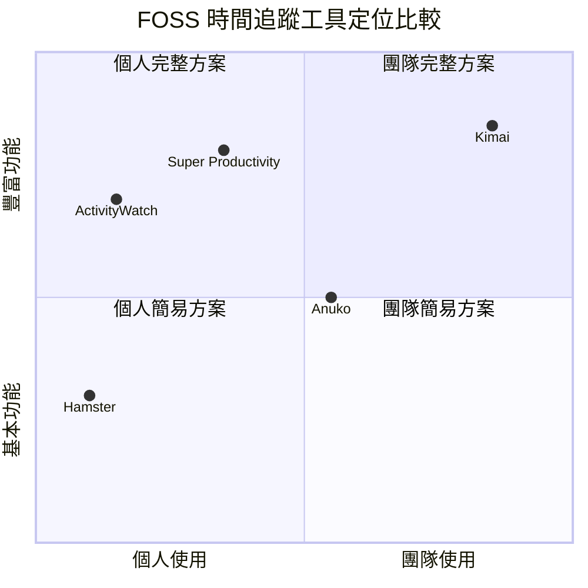

# Clockify 自由開源替代方案調查

## 概述

本報告調查可作為 Clockify（時間追蹤軟體）替代方案的自由開源軟體（FOSS），重點關注可自行架設（self-hosted）的選項。Clockify 是以團隊為導向的時間追蹤平台，具備專案管理、報表、發票等功能，但其核心商業模式為 SaaS，資料由第三方代管。本報告篩選出功能與定位最接近的五款 FOSS 替代方案，並逐一分析其功能、技術棧、授權方式及與 Clockify 的比較。

## 調查結果

### 1. Kimai — 最完整的 Clockify 替代方案

Kimai 是一款以 PHP（Symfony）撰寫、採用 AGPL-3.0 授權的開源時間追蹤軟體，是目前功能最接近 Clockify 的自架選項[^kimai]。

**功能亮點**：
- JSON REST API、發票產生、資料匯出
- 多重計時器與打卡模式（punch-in/punch-out）
- 標籤分類、多使用者、多時區、多語言（30+ 語系）
- 認證支援 SAML、LDAP、資料庫、2FA（TOTP）
- 可自訂的角色與團隊權限管理
- 使用者／客戶／專案層級時薪設定
- 專案工時與金錢預算控管
- 進階搜尋、過濾與報表
- 外掛市場（付費與免費）

**自架方式**：提供 Docker 映像、SSH+Git+Composer 安裝指南、Synology NAS 支援。

**vs Clockify**：Kimai 涵蓋了 Clockify 絕大多數核心功能（工時表、專案、團隊、報表、發票），同時提供自架資料掌控權。欠缺 Clockify 的日曆檢視與原生行動應用程式，但回應式網頁介面可在行動裝置上使用。

### 2. ActivityWatch — 自動化、重視隱私的時間追蹤

ActivityWatch 是一款以 Python + Rust 撰寫、採用 MPL-2.0 授權的自動化時間追蹤工具，主打使用者完全掌控自身資料[^activitywatch]。

**功能亮點**：
- **自動追蹤** — 記錄活躍視窗、應用程式、瀏覽器分頁、離開狀態
- 可延伸的「Watcher」系統，支援自訂追蹤
- 資料以本地為優先（local-first），注重隱私
- 去中心化同步（透過 Dropbox / Syncthing）
- REST API 搭配自訂查詢語言
- 儀表板、時間軸檢視、查詢探索工具
- 跨平台：Windows、macOS、Linux、Android（有限）

**自架方式**：資料預設儲存於本地，伺服器元件可自行架設。

**vs Clockify**：ActivityWatch 是 **自動化**時間追蹤工具，無需手動輸入。它並非 Clockify 手動工時表＋專案管理流程的替代品，而是服務於不同使用場景（量化自我、生產力分析）。在發票、專案預算、團隊管理等功能上無法取代 Clockify。

### 3. Super Productivity — 進階待辦清單＋時間追蹤

Super Productivity 是一款以 TypeScript（Angular）/ Electron 撰寫、採用 MIT 授權的生產力工具，整合任務管理與時間追蹤功能[^superproductivity]。

**功能亮點**：
- 時間方塊（Timeboxing）、時間追蹤、Pomodoro / Flowtime / Countdown 專注模式
- 完整的任務管理：子任務、專案、標籤、Kanban、Eisenhower Matrix
- 規劃工具：時間軸排程＋日曆同步
- **第三方整合**：Jira、Trello、GitHub、GitLab、Gitea、OpenProject、Linear、ClickUp、Redmine、Azure DevOps、Nextcloud Deck
- 休息提醒、反拖延功能
- 筆記、檔案附件、專案書籤
- 同步支援 SuperSync（可自架）、Dropbox、WebDAV
- 端對端加密同步選項
- 桌面應用程式（Win/Mac/Linux）、Android、iOS、網頁版
- 外掛系統與自訂主題

**自架方式**：提供 Docker 映像，SuperSync 伺服器可自行架設。

**vs Clockify**：Super Productivity 更像是附帶時間追蹤的**生產力／任務管理套裝工具**，而非 Clockify 那樣的純時間追蹤。其時間追蹤偏向個人專注模式（Pomodoro、Flowtime），而非團隊級工時管理。Jira/GitLab/GitHub 整合可自動匯入任務並建立工作日誌，對開發者尤為實用。欠缺發票功能與進階團隊報表。

### 4. Hamster — GNOME 桌面時間追蹤

Hamster 是一款以 Python（GTK3）撰寫、採用 GPL-3.0 授權的桌面時間追蹤工具，設計與 GNOME 桌面環境深度整合[^hamster]。

**功能亮點**：
- 個人桌面時間追蹤
- GNOME 桌面環境原生整合
- 以開始／結束時間記錄活動
- 報表與統計
- 標籤式分類
- 輕量、簡潔

**自架方式**：本機桌面應用程式，無需伺服器。

**vs Clockify**：Hamster 是**個人**桌面時間追蹤工具，不具備團隊協作、多使用者、發票或專案管理功能。適合只需要一個簡單、不花俏且常駐系統匣的時間追蹤工具的使用者。完全無法取代 Clockify 的團隊級功能。

### 5. Anuko Time Tracker — 簡易網頁時間追蹤

Anuko Time Tracker 是一款以 PHP / MySQL 撰寫的開源網頁時間追蹤工具，功能包含基本工時管理與發票[^anuko]。

**功能亮點**：
- 網頁式、多使用者時間追蹤
- 專案與任務管理
- 費用追蹤
- 發票產生（PDF）
- 圖表與報表
- 檔案附件
- 電子郵件通知
- 角色基礎存取控制
- 2FA 支援
- Docker 部署

**⚠️ 注意**：專案創辦人 Nik Okuntseff 於 2023 年 12 月宣布其患有臨床疾病，公司將停止營運，因此該專案的長期維護存在不確定性。

**vs Clockify**：Anuko 涵蓋基本功能（工時表、專案、報表、發票、多使用者），但精緻度不及 Clockify 與 Kimai，且專案未來不明朗。

## 比較總覽

| 工具 | 最適合 | 團隊功能 | 發票 | 自動化追蹤 | 行動支援 | 維護狀態 |
|---|---|---|---|---|---|---|
| **Kimai** | 完整 Clockify 替代 | ✅ | ✅ | ❌ | 網頁 | 活躍 |
| **ActivityWatch** | 自動化生產力分析 | ❌ | ❌ | ✅ | ❌ | 活躍 |
| **Super Productivity** | 開發者待辦＋時間方塊 | ⚠️ 有限 | ❌ | ✅ Pomodoro | ✅ 完整應用 | 活躍 |
| **Hamster** | GNOME 桌面個人使用 | ❌ | ❌ | ❌ | ❌ | 穩定、低活動 |
| **Anuko** | 小型團隊簡易追蹤 | ✅ 基本 | ✅ 基本 | ❌ | 網頁 | 前景不明 |

## 結論

若需要功能最接近 Clockify 且可自架的 FOSS 替代方案，**Kimai** 是最佳選擇：它具備專業級功能、活躍維護、支援團隊協作、專案預算、發票與報表。對於追求自動化時間記錄的開發者或個人使用者，**ActivityWatch** 與 **Super Productivity** 分別在自動化追蹤與任務管理＋時間方塊整合上有獨特優勢。

---

## 參考資料

[^kimai]: Kimai. (n.d.). Kimai — open-source time tracking. Retrieved 2026-10-01, from https://kimai.org

[^activitywatch]: ActivityWatch. (n.d.). ActivityWatch — open-source automatic time tracking. Retrieved 2026-10-01, from https://activitywatch.net

[^superproductivity]: Super Productivity. (n.d.). Super Productivity — open-source time tracker & todo app. Retrieved 2026-10-01, from https://super-productivity.com

[^hamster]: Project Hamster. (n.d.). Hamster — time tracking for GNOME. Retrieved 2026-10-01, from https://github.com/projecthamster/hamster

[^anuko]: Anuko. (n.d.). Anuko Time Tracker. Retrieved 2026-10-01, from https://github.com/anuko/timetracker