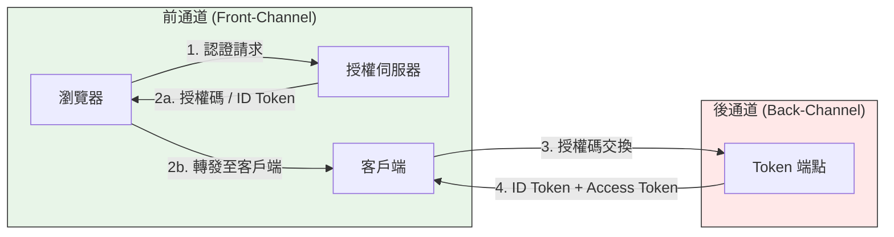

# OpenID Connect (OIDC) 的認證流程（Flows）

## 概述

如同 OAuth 2.0 有多種授權類型（grant types），OpenID Connect（OIDC）也存在多種認證流程。事實上，OIDC 的認證流程直接建立在 OAuth 2.0 的授權類型之上，並額外提供**使用者身份驗證**（Authentication）的語意，而 OAuth 2.0 本身僅處理**委託授權**（Authorization）。[^schill]

OIDC Core 1.0 規範定義了三種**核心認證流程**，由 `response_type` 參數決定。[^core-spec] 此外，新興的 **CIBA（Client-Initiated Backchannel Authentication）** 為無瀏覽器的分離式認證場景提供了全新的流程。[^ciba]

```mermaid
flowchart LR
    subgraph OAuth2["OAuth 2.0 (Authorization Framework)"]
        direction LR
        AC[Authorization Code]
        IM[Implicit]
        CC[Client Credentials]
        DG[Device Grant]
    end

    subgraph OIDC["OIDC (Authentication Layer)"]
        AC --> OIDC_AC["Authorization Code Flow"]
        IM --> OIDC_IM["Implicit Flow"]
        OIDC_HY["Hybrid Flow<br/>(OIDC only)"]
        OIDC_CIBA["CIBA Flow<br/>(Backchannel)"]
    end

    OAuth2 --|"OIDC builds on OAuth 2.0"| OIDC
```

## 一、三種核心流程（Core 1.0）

### 1. 授權碼流程（Authorization Code Flow）

- **`response_type=code`**
- 最安全、最推薦的流程。[^okta-flows]
- 客戶端先從 `/authorize` 端點取得授權碼（code），再經由**後通道**（back-channel）向 `/token` 端點交換 ID Token 和 Access Token。
- 瀏覽器（前通道）僅傳遞短期授權碼，不暴露 Token。
- 搭配 **PKCE（Proof Key for Code Exchange, RFC 7636）** 後，安全性進一步提升，現在被視為所有類型應用程式的預設最佳做法。[^pkce]

### 2. 隱含流程（Implicit Flow）

- **`response_type=id_token` 或 `id_token token`**
- ID Token 直接從 `/authorize` 端點經由瀏覽器 redirect 傳回（前通道），無須 `/token` 端點交換。
- 由於 Token 暴露在 URL fragment、瀏覽器紀錄及 Referer header 中，安全性較差。[^security]
- **目前已遭廢棄（deprecated）**，OAuth 2.1 已移除前通道 Token 遞送。[^oauth21]

### 3. 混合流程（Hybrid Flow）

- **`response_type=code id_token`、`code token` 或 `code id_token token`**
- **OIDC 獨有的流程**，在 OAuth 2.0 中沒有直接對應。
- 客戶端從 `/authorize` 端點**同時**取得 ID Token（前通道）和授權碼，再用授權碼向 `/token` 端點交換 Access / Refresh Token（後通道）。[^hybrid]
- 最初設計是為了讓應用程式在完成後通道交換前立即取得使用者身份資訊。
- 目前被視為**舊有（legacy）** 流程。[^curity]



## 二、OIDC 流程與 OAuth 2.0 授權類型對照

| OIDC 流程 | 對應 OAuth 2.0 類型 | OIDC 新增的元素 |
|---|---|---|
| 授權碼流程 | Authorization Code Grant (RFC 6749 §4.1) | `scope=openid`、`nonce`、ID Token（JWT）、UserInfo 端點 |
| 隱含流程 | Implicit Grant (RFC 6749 §4.2) | `nonce` 驗證、`at_hash`（Access Token hash） |
| 混合流程 | 無直接對應（OIDC 獨有） | 前通道 ID Token + 後通道 Token 交換 |
| N/A | Client Credentials Grant | 沒有使用者，故無 ID Token，不屬 OIDC |
| N/A | Device Authorization Grant | 無 OIDC 標準定義，部分實作自行擴充 |

所有 OIDC 流程都要求：
- `scope` 參數包含 `openid`（必要）[^core-spec]
- `nonce` 參數（防止重播攻擊）
- 回傳的 ID Token 必須驗證 `iss`、`aud`、`exp`、`nonce` 及簽章[^schill]

## 三、OAuth 2.0 與 OIDC 的本質差異

| | OAuth 2.0 | OpenID Connect (OIDC) |
|---|---|---|
| 目的 | **授權** — 「這個應用能存取什麼？」 | **認證 + 授權** — 「這個使用者是誰？」 |
| Token 產出 | Access Token（不透明或 JWT） | **ID Token**（必為 JWT） + Access Token |
| 使用者身份 | 非內建，不受規範 | 內建於 ID Token claims（`sub`、`name`、`email` 等） |
| 標準 Scope | 任意（`read`、`write` 等） | `openid`、`profile`、`email`、`address`、`phone` |
| 規範制定 | RFC 6749（IETF） | OpenID Connect Core 1.0（OpenID Foundation） |
| 發現端點 | `/.well-known/oauth-authorization-server` | `/.well-known/openid-configuration`[^discovery] |

## 四、前通道（Front-Channel）與後通道（Back-Channel）

| 通道 | 說明 | 途徑 | 使用流程 |
|---|---|---|---|
| 前通道 | 通過使用者瀏覽器以 HTTP redirect 傳遞資料 | 使用者的瀏覽器 | 授權碼流程（傳遞 code）、隱含流程（傳遞 Token）、混合流程（傳遞 ID Token + code） |
| 後通道 | 伺服器對伺服器的直接安全通訊 | 無瀏覽器參與 | 授權碼交換、CIBA 全程、UserInfo 端點 |

**安全性原則：** 前通道只應承載短期授權碼（code），Token 等敏感資料必須透過後通道交換。[^verint]

## 五、CIBA（Client-Initiated Backchannel Authentication）

CIBA 是 OpenID Foundation 制定的最新標準（CIBA Core 1.0），專為**分離式認證**（decoupled authentication）設計。[^ciba]

### 流程特點
- 消費裝置（如 kiosk、智慧電視、客服終端）請求認證，但認證在使用者自己的裝置（如手機）上完成。
- **完全不走瀏覽器 redirect**，全程使用後通道。
- 客戶端後端向 `/bc-authorize` 端點發送 POST。
- 授權伺服器推送通知至使用者的認證裝置（手機 push、email 等）。
- 客戶端輪詢（poll） `/token` 端點取得結果。

### 適用場景
- AI 代理人需人類介入授權（human-in-the-loop）
- 客服人員需存取來電者資訊（來電者透過手機 push 核准）
- 輸入受限裝置（租借腳踏車、零售 kiosk）[^auth0-ciba]

## 六、其他 OIDC 延伸規範

- **RP-Initiated Logout** — 由 Relying Party 發起登出
- **Front-Channel Logout / Back-Channel Logout** — 單一登出（Single Logout）規範
- **Pushed Authorization Requests (PAR, RFC 9126)** — 將授權請求推送到後通道
- **JWT-Secured Authorization Requests (JAR, RFC 9101)** — JWT 保護授權請求
- **Rich Authorization Requests (RAR, RFC 9396)** — 結構化授權請求

## 七、總結對照表

| 流程 | 狀態 | `response_type` | 前通道 Token？ | 後通道交換？ | 建議？ |
|---|---|---|---|---|---|
| 授權碼流程 | 推薦 | `code` | 否 | 是 | ✅ 建議（搭配 PKCE） |
| 授權碼 + PKCE | **最佳做法** | `code` + `code_challenge` | 否 | 是 | ✅ **預設首選** |
| 隱含流程 | **廢棄** | `id_token`、`id_token token` | 是（ID Token 在 URL fragment） | 否 | ❌ 不建議 |
| 混合流程 | **舊有** | `code id_token`、`code token`、`code id_token token` | 是（ID Token） | 是（access/refresh Token） | ⚠️ 僅特殊需求 |
| CIBA | 現行標準 | 無（純後通道） | 否（無瀏覽器） | 是（全程後通道） | ✅ 分離式認證 |

## 參考文獻

[^core-spec]: OpenID Foundation. (n.d.). OpenID Connect Core 1.0 Specification. Retrieved 2026-10-03, from https://openid.net/specs/openid-connect-core-1_0.html
[^schill]: Schillace, B. (n.d.). OpenID Connect Flows Explained. Scott Brady. Retrieved 2026-10-03, from https://www.scottbrady.io/openid-connect/openid-connect-flows
[^okta-flows]: Okta. (n.d.). OAuth 2.0 and OpenID Connect Overview. Retrieved 2026-10-03, from https://developer.okta.com/docs/concepts/oauth-openid/
[^pkce]: Auth0. (n.d.). Authorization Code Flow with Proof Key for Code Exchange (PKCE). Retrieved 2026-10-03, from https://auth0.com/docs/get-started/authentication-and-authorization-flow/authorization-code-flow-with-proof-key-for-code-exchange-pkce
[^security]: Crowder, B. (n.d.). OAuth 2.0 & OpenID Connect Flows — A Quick Reference Guide. Retrieved 2026-10-03, from https://barrycrowder.com/blog/post/oauth-20-openid-connect-flows-a-quick-reference-guide/
[^hybrid]: Curity. (n.d.). OIDC Hybrid Flow Deep Dive. Retrieved 2026-10-03, from https://curity.io/resources/learn/oauth-hybrid-flow/
[^oauth21]: IETF. (n.d.). The OAuth 2.1 Authorization Framework (Draft). Retrieved 2026-10-03, from https://datatracker.ietf.org/doc/draft-ietf-oauth-v2-1/
[^ciba]: OpenID Foundation. (n.d.). Client-Initiated Backchannel Authentication (CIBA) Core 1.0. Retrieved 2026-10-03, from https://openid.net/specs/openid-client-initiated-backchannel-authentication-core-1_0.html
[^auth0-ciba]: Auth0. (n.d.). Client-Initiated Backchannel Authentication (CIBA) Flow. Retrieved 2026-10-03, from https://auth0.com/docs/get-started/authentication-and-authorization-flow/client-initiated-backchannel-authentication-flow
[^verint]: Verint. (n.d.). OIDC and OAuth 2.0 Communication Channels — Front Channel vs Back Channel. Retrieved 2026-10-03, from https://verintconnect.com/business-products/vcpssp/w/vcpssp/91261/oidc-and-oauth-2-0-communication-channels
[^discovery]: IAM Day by Day. (n.d.). OAuth 2.0 vs OpenID Connect Comparison Guide. Retrieved 2026-10-03, from https://iamdaybyday.com/guides/oauth-vs-oidc/