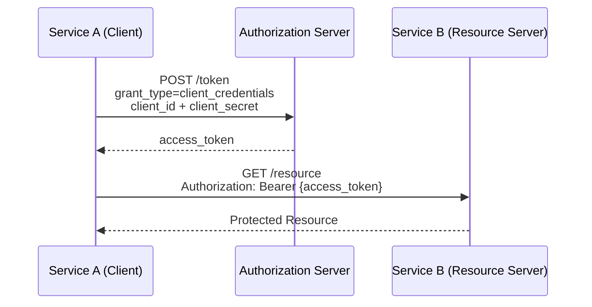
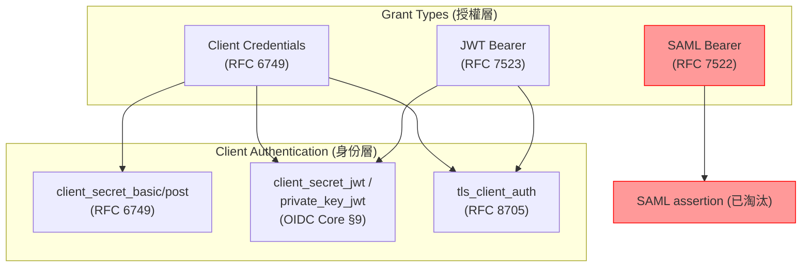

# M2M（Machine-to-Machine）場景適用的 OAuth 2.0 與 OIDC 流程

## 概覽

本報告整理 Machine-to-Machine（M2M）場景下適用的 OAuth 2.0 與 OpenID Connect（OIDC）授權流程。M2M 的特點是沒有使用者參與，客戶端（機器、服務、後端、CLI）以自己的身份而非使用者身份請求資源。

---

## 1. OAuth 2.0 原生 M2M 流程

### 1.1 Client Credentials Grant（客戶端憑證流程）— 最主要的 M2M 流程

RFC 6749 §4.4 定義的 Client Credentials Grant 是 OAuth 2.0 中最基本、最廣泛使用的 M2M 流程[^rfc6749]。客戶端直接用自己的 `client_id` 和 `client_secret`（或其他客戶端認證方式）向 token endpoint 請求 access token，無需使用者重導向、無需登入、無 refresh token。

**運作方式：**

**適用場景：**
- Microservice 間呼叫
- Cron job / 定時任務
- 後端 API 呼叫其他後端 API
- IoT 裝置、CLI 工具

**限制：** RFC 6749 明確指出此 grant type **只能由 confidential client 使用**，且 client 原本就應是資源的擁有者或已預先授權。

### 1.2 JWT Bearer Authorization Grant（RFC 7523）— 斷言式 M2M

RFC 7523 定義了以 JWT 作為授權斷言（authorization grant）來換取 access token 的流程[^rfc7523]。本質上是「token exchange」模式——已存在的信任關係透過一組簽署 JWT 來表達，無需使用者互動。

- **Grant type URI：** `urn:ietf:params:oauth:grant-type:jwt-bearer`
- **運作方式：** 客戶端出示一組事先取得且簽署好的 JWT（含 `iss`、`sub`、`aud`、`exp` 等 claims），AS 驗證簽章與 claims 後回傳 access token。
- **適用場景：** 跨信任域的聯邦式 M2M，外部 Identity Provider 已對客戶端進行認證；不同信任域之間的橋接；委派場景的 token exchange。

### 1.3 SAML 2.0 Bearer Authorization Grant（RFC 7522）— 舊版企業流程

RFC 7522 是 SAML 版本的斷言授權流程[^rfc7522]，用於企業/聯邦環境中已有 SAML 信任機制的場景。但最新的 draft-ietf-oauth-rfc7523bis **已明確不建議新應用使用 SAML 進行客戶端認證**。

---

## 2. OIDC 與 M2M 的關係

### 2.1 OIDC 並無專屬的「M2M 流程」

OIDC 本質是基於 OAuth 2.0 的**使用者認證協定**，不以 M2M 為主要設計目標。然而，OIDC Core 1.0 **Section 9: Client Authentication** 定義的一套客戶端認證方法，對 M2M 安全極具價值[^oidc-core]，因為 Client Credentials Grant 或其他 M2M grant types 仍需要客戶端向 token endpoint 證明身份。

### 2.2 OIDC 定義的客戶端認證方法

| 方法 | 機制 | 安全等級 |
|------|------|---------|
| `client_secret_basic` | HTTP Basic Auth（`Authorization: Basic Base64(id:secret)`） | 基準 |
| `client_secret_post` | request body 中攜帶 `client_id` + `client_secret` | 低（不建議） |
| `client_secret_jwt` | 以 shared secret 作為 HMAC 密鑰簽署 JWT | 高 |
| `private_key_jwt` | 以客戶端非對稱私鑰（RSA/ECDSA）簽署 JWT | 最高 |

**對於 M2M 場景：** `private_key_jwt` 越來越被推薦優於 `client_secret_basic` / `client_secret_post`，原因包括：
- 沒有 shared secret 在網路上傳輸（只傳簽署的 JWT）
- 具備不可否認性（non-repudiation）：AS 可驗證 JWT 確實由該客戶端簽署
- 客戶端的公鑰可以在不與 AS 協調的情況下輪換

此外，RFC 8705 定義的 `tls_client_auth` 與 `self_signed_tls_client_auth`（mTLS 客戶端認證）也適用於 M2M，但需要 TLS 憑證基礎設施[^rfc8705]。

---

## 3. Grant Type 與 Client Authentication 的區別（重要）

**Grant type** 控制「客戶端在請求什麼授權」：
- `client_credentials` = 客戶端以自己名義行動
- `jwt-bearer` / `saml2-bearer` = 客戶端基於既有斷言行動

**Client authentication method** 控制「客戶端如何向 token endpoint 證明身份」：
- `client_secret_basic` / `client_secret_post` = 共享密鑰
- `private_key_jwt` / `client_secret_jwt` = 斷言式認證
- `tls_client_auth` = 憑證式認證

**兩者正交。** 例如你可以用 `private_key_jwt` 作為 authentication method + `client_credentials` 作為 grant type。

---

## 4. 場景對應推薦

| 場景 | 建議方案 |
|------|---------|
| 內部簡單 service-to-service（同一信任域） | Client Credentials + `client_secret_basic` |
| 高安全內部 service-to-service | Client Credentials + `private_key_jwt` |
| 跨信任域 / 聯邦式 M2M | JWT Bearer Grant（RFC 7523） |
| 企業 PKI 基礎設施完備 | Client Credentials + mTLS（RFC 8705） |
| 高輪換率的微服務網格 | Client Credentials + `private_key_jwt` |
| 舊版 SAML 聯邦 | SAML Bearer Grant（RFC 7522）— 僅限既有系統 |

---

## 5. 近期重要發展

### 5.1 draft-ietf-oauth-rfc7523bis（2026 年進入 RFC Queue）

這是一個重要的安全更新[^rfc7523bis]，解決了 Stuttgar 大學研究人員發現的「audience injection」漏洞。關鍵變更：

1. **客戶端認證 JWT（`private_key_jwt` / `client_secret_jwt`）：** `aud` claim **必須**包含 AS 的 issuer identifier（依 RFC 8414），**不得**使用 token endpoint URL。
2. **授權斷言 JWT（RFC 7523 §2.1）：** 客戶端負責確保 audience 正確，AS 可用 issuer identifier 或 token endpoint URL 來識別。
3. **新增明確 typ：** 客戶端認證 JWT **應該**使用 `typ: client-authentication+jwt`。
4. **SAML 淘汰：** 新應用**不得**使用 SAML assertion 進行客戶端認證。

### 5.2 RFC 8705（2020 年）— mTLS 客戶端認證

mTLS 提供兩種互補機制：
1. **客戶端認證：** TLS 交握時出示 X.509 憑證
2. **憑證綁定 access token（Certificate-Bound Access Tokens）：** AS 在 access token 中嵌入 `cnf`（confirmation）claim

這是最強的 access token 防盜機制，FAPI 2.0 要求或推薦使用。

### 5.3 RFC 8414（2018 年）— AS 中繼資料

定義了 `issuer` 中繼資料參數，在更新的 RFC 7523bis 規範中成為 audience 驗證的關鍵依據[^rfc8414]。

---

## 總結

- **Client Credentials Grant 是 M2M 的通用標準方案。**
- **JWT Bearer Grant 適合跨信任域的聯邦式 M2M。**
- **`private_key_jwt`（OIDC §9）是最安全的客戶端認證方式，避免 shared secret 在網路傳輸。**
- **draft-ietf-oauth-rfc7523bis 即將強制規範 JWT audience 格式，對所有使用 JWT client authentication 的 M2M 系統有直接影響。**

---

## 參考文獻

[^rfc6749]: Internet Engineering Task Force. (2012). The OAuth 2.0 Authorization Framework. RFC 6749. Retrieved 2026-10-03, from https://www.rfc-editor.org/info/rfc6749

[^rfc7523]: Internet Engineering Task Force. (2015). JWT Profile for OAuth 2.0 Client Authentication and Authorization Grants. RFC 7523. Retrieved 2026-10-03, from https://www.rfc-editor.org/info/rfc7523

[^rfc7522]: Internet Engineering Task Force. (2015). SAML 2.0 Profile for OAuth 2.0 Client Authentication and Authorization Grants. RFC 7522. Retrieved 2026-10-03, from https://www.rfc-editor.org/info/rfc7522

[^rfc8705]: Internet Engineering Task Force. (2020). Mutual TLS Profiles for OAuth 2.0 Clients. RFC 8705. Retrieved 2026-10-03, from https://www.rfc-editor.org/info/rfc8705

[^rfc8414]: Internet Engineering Task Force. (2018). OAuth 2.0 Authorization Server Metadata. RFC 8414. Retrieved 2026-10-03, from https://www.rfc-editor.org/info/rfc8414

[^oidc-core]: OpenID Foundation. (2014). OpenID Connect Core 1.0. Section 9: Client Authentication. Retrieved 2026-10-03, from https://openid.net/specs/openid-connect-core-1_0.html

[^rfc7523bis]: Internet Engineering Task Force. (2026). JWT Profile for OAuth 2.0 Client Authentication and Authorization Grants (bis). draft-ietf-oauth-rfc7523bis-11. Retrieved 2026-10-03, from https://datatracker.ietf.org/doc/draft-ietf-oauth-rfc7523bis/