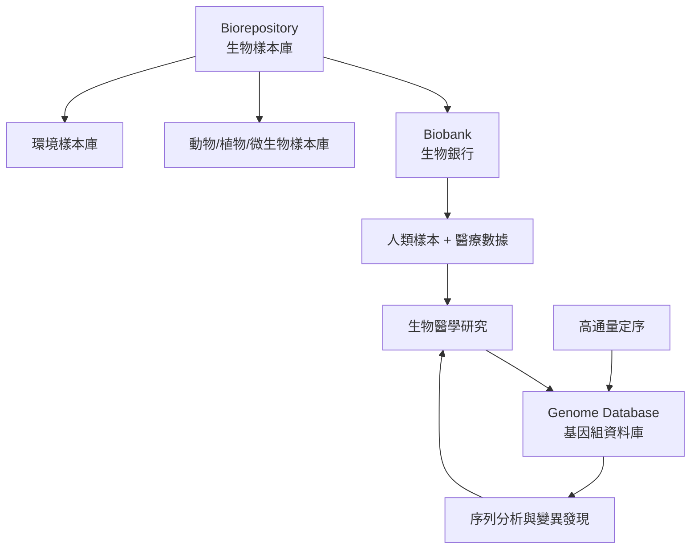

# Biobank、Biorepository 與 Genome Database 概念解析

## 1. 前言

隨著生命科學與基因組學的快速發展，生物樣本與基因資料的儲存、管理與共享已成為現代生物醫學研究的核心基礎設施。本報告釐清 **Biobank**（生物銀行）、**Biorepository**（生物樣本庫）與 **Genome Database**（基因組資料庫）三個容易混淆的概念，說明其定義、功能、類型、實例與相互關係。

---

## 2. Biorepository（生物樣本庫）

### 2.1 定義

Biorepository 是收集、編目、處理、儲存與分發生物樣本（biospecimens）以供實驗室研究使用的設施[^biorepo]。樣本來源涵蓋人類、動物、植物、微生物等多種生物。每個樣本通常關聯對應的醫療或研究數據，並透過實驗室資訊管理系統（LIMS）追蹤。

四大核心作業流程：

1. **收集（Accession）** — 接收樣本，記錄資訊至追蹤系統
2. **處理（Processing）** — 將樣本轉化為適合長期保存的型態（如 DNA 萃取、血漿分裝）
3. **儲存與庫存（Storage / Inventory）** — 在受控環境下保存（常溫、冷藏、−20°C、−70°C/−80°C 或液態氮）
4. **分發（Distribution）** — 依研究需求檢索與運送樣本

標準作業程序（SOP）是確保樣本品質、減少變異性與維護監管鏈的關鍵[^biorepo]。

### 2.2 類型

| 分類方式 | 類型 | 說明 |
|----------|------|------|
| 依樣本來源 | 人類樣本庫、動物樣本庫、植物樣本庫（種子庫）、微生物樣本庫（如 ATCC）、環境樣本庫 | 涵蓋所有生物領域 |
| 依目的 | 疾病導向、族群導向、細胞株庫、DNA 基因庫、虛擬生物樣本庫 | 從臨床研究到生態保育 |
| 依規模 | 單一實驗室、醫院附屬、國家級（如 UK Biobank）、商業性（如 IQVIA） | 從小型到大型 |

### 2.3 著名實例

- **American Type Culture Collection（ATCC）** — 世界最大的微生物與細胞株收藏
- **Svalbard Global Seed Vault** — 挪威斯瓦爾巴全球種子庫，保存作物多樣性
- **NINDS Human Cell and Data Repository** — NIH 的神經疾病細胞株庫

---

## 3. Biobank（生物銀行）

### 3.1 定義

Biobank 是 **Biorepository 的一種子類型**，專門用於收集、儲存與管理**人類**生物樣本及其關聯數據，以供生物醫學研究使用[^biobank]。此術語於 1990 年代末期出現，權威定義為「為研究目的而系統性收集的人類生物材料及相關資訊的有組織集合」。

Biobank 通常配備低溫儲存設施，規模從實驗室的單一冷凍櫃到倉庫級大型設施不等。營運主體包括醫院、大學、非營利組織、製藥公司與政府機構。

### 3.2 與 Biorepository 的區別

| 面向 | Biorepository | Biobank |
|------|---------------|---------|
| **範疇** | 更廣 — 任何人、動物、植物、微生物樣本 | 狹義 — 主要為**人類**樣本 |
| **關係** | 上層概念（母類別） | 子類別 |
| **主要用途** | 所有生命科學研究 | 生物醫學研究、精準醫療 |

**結論：所有 Biobank 都是 Biorepository，但非所有 Biorepository 都是 Biobank。**[^biorepo]

### 3.3 類型

| 分類 | 類型 | 說明 |
|------|------|------|
| 依目的 | **疾病導向**（如 Biobank Graz）— 附屬於醫院，收集特定疾病樣本以尋找生物標記；**族群導向**（如 UK Biobank）— 收集一般人口樣本以研究疾病易感性；**虛擬生物銀行** — 整合多個流行病學隊列 |
| 依控制實體 | 政府/公共（中國國家基因庫）、學術/非營利（UK Biobank）、商業（deCODE Genetics）、公私合夥（FinnGen） |
| 依樣本類型 | 血液、尿液、組織切片、唾液、幹細胞、基因材料 |

### 3.4 全球主要 Biobank

| Biobank | 國家 | 規模 / 重點 |
|---------|------|-------------|
| **UK Biobank** | 英國 | 50 萬參與者，1500 萬+樣本，30 PB 數據，全基因組定序[^ukb] |
| **All of Us** | 美國（NIH） | 目標 100 萬參與者，聚焦多元族群代表性[^allofus] |
| **Biobank Graz** | 奧地利 | 約 2000 萬個樣本，全球最大臨床生物銀行之一 |
| **China National GeneBank** | 中國深圳 | 47,500+ 平方公尺，首個國家級基因庫，含活體生物銀行[^cngb] |
| **Estonian Genome Project** | 愛沙尼亞 | 5.2 萬參與者，連結國民身分證 |
| **FinnGen** | 芬蘭 | 公私合夥，50 萬+參與者 |

### 3.5 倫理考量

- **知情同意** — 因無法預測所有未來用途，採用廣泛同意（broad consent）或動態同意（dynamic consent）
- **隱私與安全** — 去識別化為標準做法，但存在再識別風險（如 2026 年 UK Biobank 資料暴露事件）
- **所有權** — 各國法律不同；冰島規定政府保管但捐贈者擁有，愛沙尼亞與東加由政府擁有
- **參與者多樣性** — 歷史樣本以歐洲裔為主，近期倡議（All of Us、Native BioData Consortium）致力改善
- **商業化與利益分享** — 參與者是否應從商業價值中獲益，持續存在爭議[^biobank]

---

## 4. Genome Database（基因組資料庫）

### 4.1 定義

Genome Database 是**生物資料庫（biological database）**的一種，專門用於儲存、組織、標註與提供基因組資訊——即生物體的完整 DNA 序列（含所有基因）[^seqdb]。這些數位化儲存體包含核酸序列、基因標註及相關的生物學元數據，涵蓋單一或多個物種。

關鍵特徵：
- **數位儲存** — 序列資料（FASTA、FASTQ、GenBank 格式等）
- **標註（annotation）** — 功能性標籤標記基因、調控區域、變異等
- **開放公共存取** — 多數主要資料庫免費提供
- **交叉引用** — 資料庫之間互相連結（如 GenBank ↔ dbSNP ↔ PubMed）
- **版本化管理** — 定期更新

### 4.2 類型

| 類型 | 說明 | 實例 |
|------|------|------|
| **基因組序列資料庫（Primary）** | 儲存原始核酸序列、組裝基因組與基因標註 | GenBank、ENA、DDBJ、RefSeq |
| **基因組瀏覽器/標註資料庫** | 圖形化互動介面呈現基因組與豐富標註 | Ensembl、UCSC Genome Browser |
| **變異資料庫（Secondary）** | 專門編錄基因組變異 | dbSNP、dbVar、ClinVar |
| **族群/計畫資料庫** | 大規模定序計畫產生的變異目錄 | 1000 Genomes Project、gnomAD |
| **模式生物資料庫** | 特定物種的深入策展知識庫 | FlyBase、WormBase、SGD、TAIR |

### 4.3 著名實例

#### A. GenBank（NCBI）

- 成立於 1982 年，美國 NCBI 維護
- 截至 2026 年 4 月：**53.90 兆鹼基**、**62.7 億筆序列紀錄**、涵蓋 **58.1 萬+ 物種**[^genbank]
- 屬於國際核酸序列資料庫聯盟（INSDC，與 ENA、DDBJ 合作）
- 最豐富的人類序列（2880 萬筆），其次為 SARS-CoV-2、小鼠
- 功能：BLAST 序列比對、比較基因組學、參考序列

#### B. Ensembl（EMBL-EBI）

- 1999 年啟動，歐洲生物資訊學研究所（EMBL-EBI）維護
- 提供 **16,146 個基因組**的標註與瀏覽（脊椎動物為主，含植物、真菌、細菌等子專案 Ensembl Genomes）[^ensembl]
- 整合基因預測、變異、調控特徵、比較基因組學、同源性關係
- 存取方式：網頁、REST API、Perl API、BioMart、FTP、MySQL

#### C. dbSNP（NCBI）

- 1998 年創立，儲存單核苷酸多態性（SNP）與短片段插入/刪除
- Build 153（2019 年）：**~2 億筆提交**、**>6.75 億個獨特人類變異**[^dbsnp]
- 每個變異獲得 Submitted SNP ID（ss#），相同變異聚類為 Reference SNP cluster ID（rs#）
- 自 2017 年起僅接受人類變異資料

#### D. 1000 Genomes Project

- 2008–2015 年國際合作計畫，定序 **2,504 人**、**26 個族群**[^1000g]
- 發現每人攜帶約 250–300 個功能喪失變異、50–100 個已知遺傳疾病相關變異
- 多數變異頻率低於 1% 的變異被首次發現
- 資料持續透過 International Genome Sample Resource（IGSR）提供

### 4.4 目的總覽

| 目的 | 說明 |
|------|------|
| **保存歸檔** | 永久保存所有公開序列資料 |
| **功能標註** | 鑑定與標記基因、調控區域、功能元件 |
| **變異編錄** | 記錄已知基因變異及其族群頻率 |
| **比較基因組學** | 跨物種比較以研究生演化 |
| **疾病關聯** | 連結基因變異與性狀/疾病（GWAS） |
| **參考比對** | 提供標準化參考基因組 |
| **視覺化探索** | 可自訂的基因組瀏覽器 |

---

## 5. 三者關係

- **Biorepository** 是最上層概念，處理所有生物樣本的實體儲存
- **Biobank** 是 Biorepository 的子集，專注於人類樣本的醫學研究用途
- **Genome Database** 則是數位層面的基礎設施，儲存與管理從樣本中提取的基因組序列及變異數據
- 三者形成「樣本收集 → 生物銀行管理 → 基因組資料庫分析」的完整鏈條，共同支撐現代生物醫學研究

---

## 6. 結論

| 概念 | 核心本質 | 主要用途 |
|------|----------|----------|
| Biorepository | 生物樣本的**實體儲存設施**（含人類與非人類） | 保存與分發樣本 |
| Biobank | 人類樣本的**實體+資料管理系統** | 連結樣本與健康數據，供醫學研究 |
| Genome Database | 基因組序列與變異的**數位資料庫** | 儲存、查詢、分析基因資訊 |

三者協作構成現代生物醫學研究的核心基礎設施：Biobank 提供高品質的人類樣本與健康數據，Genome Database 提供基因組分析所需的參考與工具，而 Biorepository 則涵蓋更廣泛的樣本類型與研究範疇。

---

## 參考文獻

[^biorepo]: Wikipedia. (n.d.). Biorepository. Retrieved 2026-10-01, from https://en.wikipedia.org/wiki/Biorepository
[^biobank]: Wikipedia. (n.d.). Biobank. Retrieved 2026-10-01, from https://en.wikipedia.org/wiki/Biobank
[^ukb]: Wikipedia. (n.d.). UK Biobank. Retrieved 2026-10-01, from https://en.wikipedia.org/wiki/UK_Biobank
[^allofus]: Wikipedia. (n.d.). All of Us (initiative). Retrieved 2026-10-01, from https://en.wikipedia.org/wiki/All_of_Us_(initiative)
[^cngb]: Wikipedia. (n.d.). China National GeneBank. Retrieved 2026-10-01, from https://en.wikipedia.org/wiki/China_National_GeneBank
[^genbank]: Wikipedia. (n.d.). GenBank. Retrieved 2026-10-01, from https://en.wikipedia.org/wiki/GenBank
[^ensembl]: Wikipedia. (n.d.). Ensembl genome database project. Retrieved 2026-10-01, from https://en.wikipedia.org/wiki/Ensembl_genome_database_project
[^dbsnp]: Wikipedia. (n.d.). dbSNP. Retrieved 2026-10-01, from https://en.wikipedia.org/wiki/DbSNP
[^1000g]: Wikipedia. (n.d.). 1000 Genomes Project. Retrieved 2026-10-01, from https://en.wikipedia.org/wiki/1000_Genomes_Project
[^seqdb]: Wikipedia. (n.d.). Sequence database. Retrieved 2026-10-01, from https://en.wikipedia.org/wiki/Sequence_database