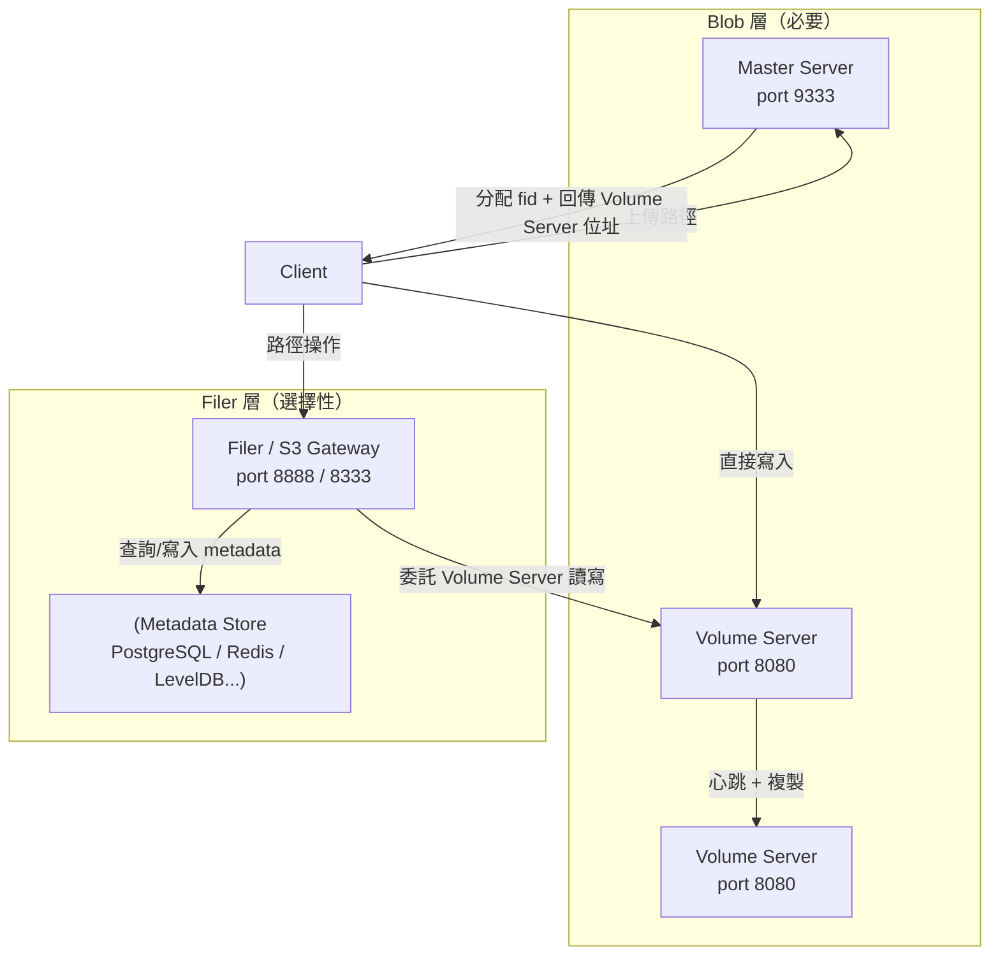
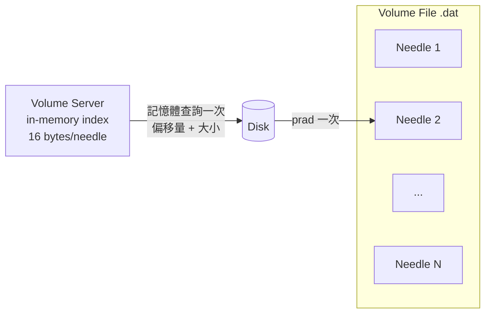
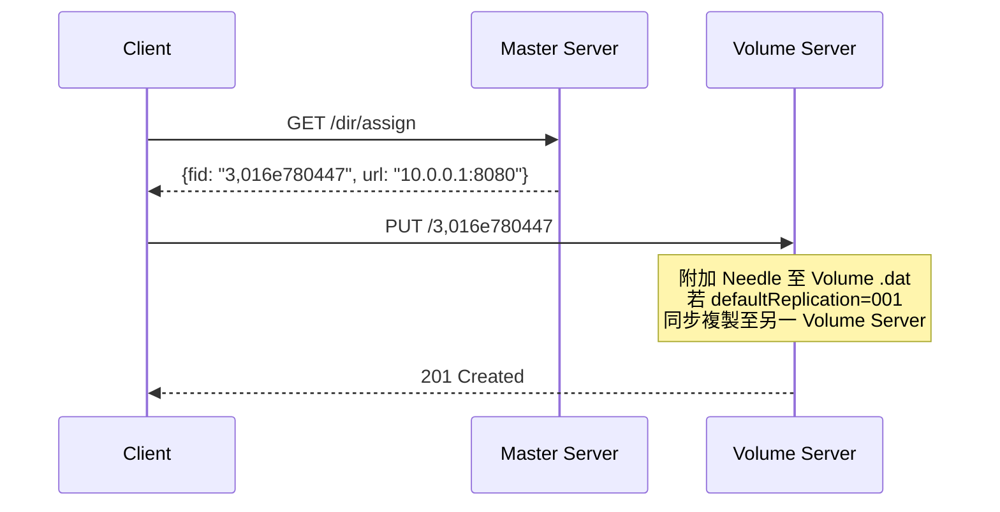
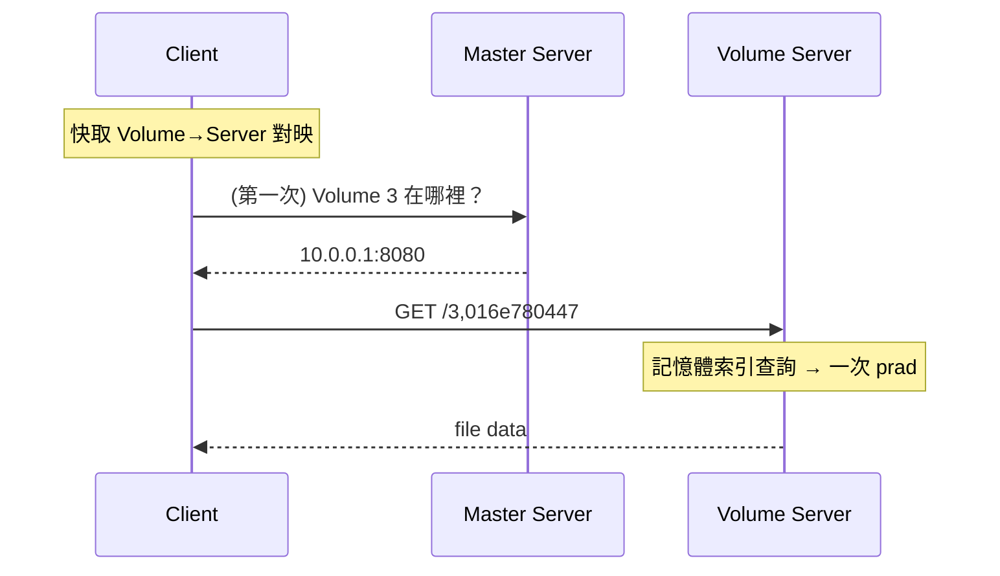
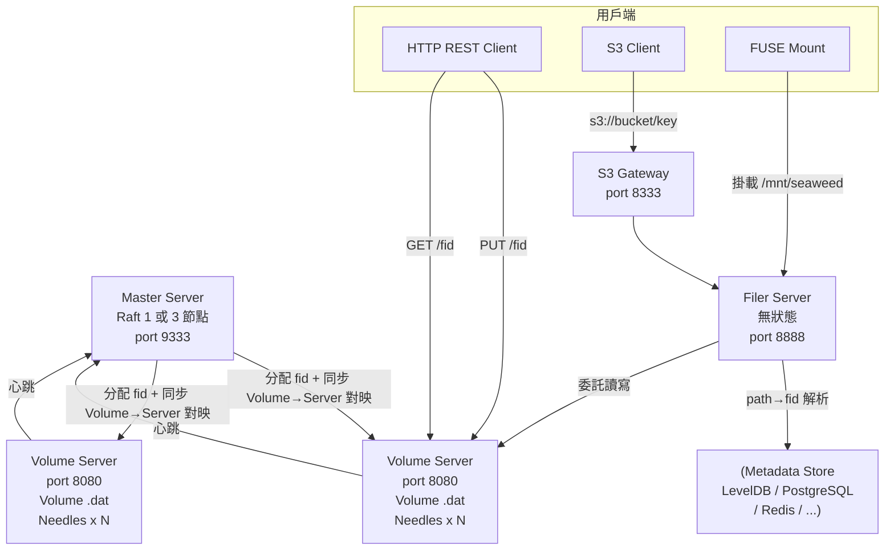

# SeaweedFS 使用前應具備的先備知識：領域模型與核心概念

SeaweedFS 是一套基於 Facebook Haystack 論文設計的分散式儲存系統，以 O(1) 磁碟存取、水平擴充及多協定支援（S3、FUSE、WebDAV、SFTP）為主要特色[^gh-readme]。本文說明在使用 SeaweedFS 前應理解的領域模型、架構概念與部署規劃知識。

## 一、兩層式架構（核心心智模型）

SeaweedFS 最重要的設計原則是將**資料路徑**與**元資料路徑**徹底分離，形成兩層式（Two-Layer）架構[^bigiron]。

### Blob 層（必要）

- **Master Server**：追蹤 Volume→Volume Server 的對應關係，分配 File ID（fid），不參與資料路徑。
- **Volume Server**：儲存實際檔案資料，維持每個 blob 16 位元組的記憶體內索引，實現 O(1) 磁碟讀取[^haystack]。

### Filer 層（選擇性）

- **Filer Server**：在 blob 層之上提供目錄樹命名空間（POSIX 路徑、S3 bucket 等）。
- **S3 Gateway**：提供 AWS S3 相容 API，每個 S3 bucket 對映到一個 Collection。

Filer 層的元資料儲存在外部後端（LevelDB、PostgreSQL、Redis 等），Filer 本身是無狀態的，可執行多個例項做負載平衡[^components]。

## 二、核心領域模型

### 2.1 File ID（fid）

所有檔案的唯一識別碼，格式為 `<volume_id>,<needle_key>`，例如 `3,01637037d6`[^rest-api]。

| 欄位 | 型別 | 大小 | 說明 |
|------|------|------|------|
| volume_id | uint32 | 4 Bytes | 所屬 Volume |
| file_key | uint64 | 8 Bytes | 隨機金鑰 |
| file_cookie | uint32 | 4 Bytes | Cookie，防止 URL 猜測 |

fid 編碼了 volume ID，用戶端快取 volume→server 對映後可直接向 Volume Server 讀取，不需查詢 Master。

### 2.2 Needle（針）

Volume 檔案（`.dat`）中的每一筆 blob 記錄。Needle 包含以下欄位[^needle]：

- **Cookie**（4 Bytes）：亂數，防止暴力猜測
- **Id**（8 Bytes）：唯一識別
- **Data / DataSize**：實際檔案內容（可變長度）
- **Flags**：壓縮、名稱、MIME 類型、Chunk Manifest 等位元遮罩
- **Checksum**（4 Bytes）：CRC32 完整性檢查
- **Padding**：8 Bytes 對齊

每筆 needle 在磁碟上約 40 Bytes 元資料，無 per-file inode 開銷。

### 2.3 Volume（Volume）

- 大型 append-only 磁碟檔（預設 ~30 GB，可設定），將多個小型檔案（needles）連續打包。
- 每份 Volume 儲存於一部 **Volume Server**（複本可在其他 Volume Server）。
- Volume 層級設定複本策略與 TTL。
- 已刪除空間透過 **Vacuum（壓縮）** 回收[^bigiron]。
- Volume 檔包含 `.dat`（資料）、`.idx`（索引）、`.vif`（Volume 資訊）三個檔案。

### 2.4 Collection（集合）

Collection 是 Volume 的邏輯分組[^gh-readme]：

- 若 Collection 內無 Volume，首次寫入時自動建立
- 同一 Collection 內的 Volume 可有不同 TTL 或複本設定
- **刪除 Collection** 即刪除其所有 Volume（瞬間完成）
- 每個 **S3 bucket** 對應一個專屬 Collection

### 2.5 Chunk（大型檔案分塊）

超過數 MB 的檔案被自動切分為多個 chunks[^large-file]。每個 chunk 儲存為一筆 needle，愈大檔案可分散至不同 Volume 以實現平行讀取。Chunk Manifest（JSON）記錄所有 chunk 的 fid、偏移量與大小。

### 2.6 複本（Replication）

Volume 層級的 3 位數 XYZ 複本碼[^replication]：

| 位數 | 意義 |
|------|------|
| **X** | 其他資料中心的複本數 |
| **Y** | 同一資料中心其他機櫃的複本數 |
| **Z** | 同一機櫃其他 Volume Server 的複本數 |

**總份數 = 1（原件）+ X + Y + Z**

常用值：

| 值 | 意義 | 磁碟開銷 |
|-----|------|---------|
| `000` | 無複本 | 1× |
| `001` | 同機櫃另一臺 Volume Server | 2× |
| `010` | 不同機櫃 | 2× |
| `100` | 不同資料中心 | 2× |
| `110` | 不同機櫃 + 不同資料中心 | 3× |
| `200` | 兩個不同資料中心 | 3× |

寫入為同步（W=N），所有複本確認後才回傳成功；讀取為 R=1（任一複本）。

### 2.7 抹除編碼（Erasure Coding）

熱資料使用複本（速度優先），溫/冷資料非同步轉換為 Reed-Solomon 抹除編碼（預設 RS 10+4）以節省空間[^bigiron]。編碼成本不在寫入路徑上。

### 2.8 雲端分層（Cloud Tiering）

已封閉的 Volume 可透明地卸載至 S3 相容雲端儲存，在地保留快取[^gh-readme]。

## 三、資料流程

### 寫入路徑

### 讀取路徑

**關鍵：Master 永遠不在讀取路徑上。**

## 四、總覽圖

## 五、部署規劃應知事項

### 5.1 各元件埠號

| 元件 | 埠號 | 用途 |
|------|------|------|
| Master HTTP/Raft | 9333 | 叢集協調、fid 分配 |
| Master gRPC | 19333 | 內部 gRPC |
| Volume HTTP | 8080 | 資料讀寫 |
| Volume gRPC | 18080 | 內部 gRPC |
| Filer HTTP | 8888 | POSIX 路徑操作 |
| Filer gRPC | 18888 | 內部 gRPC |
| S3 API | 8333 | S3 相容端點 |
| Admin UI | 23646 | Web 儀表板 |

### 5.2 營運責任

1. **耐用性是選擇加入的** — 未設定複本碼時無任何冗餘[^bigiron]。
2. **Volume 滿載監控** — Volume 寫滿後寫入會停止，需預先建立新 Volume 或新增 Volume Server。
3. **定期 Vacuum** — 刪除檔案僅寫入墓碑（tombstone），需透過 Vacuum 回收空間。
4. **備份 Filer 元資料儲存** — 失去 Namespace 等同資料無法定位（雖然 Volume 上的 blob 仍在）。
5. **Raft Quorum 健康** — Master 需奇數節點（1 或 3），失去 quorum 時停止 Volume 分配。
6. **TLS 非預設** — 內部通訊為純 HTTP，正式環境需 nginx 做 TLS termination。

### 5.3 Filer Metadata Store 選擇

| 儲存後端 | 適用場景 |
|----------|----------|
| **LevelDB**（內嵌） | 單節點、開發、Homelab |
| **PostgreSQL** | 正式多 Filer 環境，所有 Filer 共用同一 Metadata Store |
| **MySQL / MariaDB** | 正式備選 |
| **Redis** | 高效能 Metadata |
| **SQLite** | 內嵌輕量備選 |

### 5.4 Volume 容量規劃

| 參數 | 說明 |
|------|------|
| `-volumeSizeLimitMB=30720` | 單一 Volume 最大大小（預設 30 GB） |
| `-max=0` | 此 Volume Server 可建立的 Volume 數量（0=無限制） |
| `-minFreeSpacePercent=7` | 保留給 Vacuum 的最低剩餘空間百分比 |

## 六、何時選用 SeaweedFS

| ✅ 適合 | ❌ 不適合 |
|---------|----------|
| 大量小型檔案（數十億個） | 大型串流檔案（單一檔案數十 GB） |
| 需要 S3 + FUSE + WebDAV 同一套資料 | 需要 100% S3 相容（建議 MinIO） |
| 輕量級分散式儲存 | 需要「開箱即用」耐用性（建議 Ceph） |
| 接受自行設定配置 | 需要嚴格交易一致性 |
| 物件計數為瓶頸 | 高吞吐量大檔案為瓶頸 |

## 參考文獻

[^gh-readme]: GitHub. (n.d.). SeaweedFS — README. Retrieved 2026-10-01, from https://github.com/seaweedfs/seaweedfs
[^bigiron]: Big Iron. (n.d.). SeaweedFS as the flexible middle ground between MinIO and Ceph. Retrieved 2026-10-01, from https://www.bigiron.cc/guides/seaweedfs-as-the-flexible-middle-ground-between-minio-and-ceph
[^haystack]: Facebook. (2010). Finding a Needle in a Haystack: Facebook's photo storage. Retrieved 2026-10-01, from https://www.usenix.org/legacy/event/osdi10/tech/full_papers/Beaver.pdf
[^components]: SeaweedFS Wiki. (n.d.). Components. Retrieved 2026-10-01, from https://github.com/seaweedfs/seaweedfs/wiki/Components
[^rest-api]: SeaweedFS Wiki. (n.d.). REST API. Retrieved 2026-10-01, from https://github.com/seaweedfs/seaweedfs/wiki/REST-API
[^needle]: SeaweedFS Source. (n.d.). needle.go. Retrieved 2026-10-01, from https://github.com/seaweedfs/seaweedfs/blob/master/weed/storage/needle/needle.go
[^replication]: SeaweedFS Wiki. (n.d.). Replication. Retrieved 2026-10-01, from https://github.com/seaweedfs/seaweedfs/wiki/Replication
[^large-file]: SeaweedFS Wiki. (n.d.). Large File Handling. Retrieved 2026-10-01, from https://github.com/seaweedfs/seaweedfs/wiki/Large-File-Handling