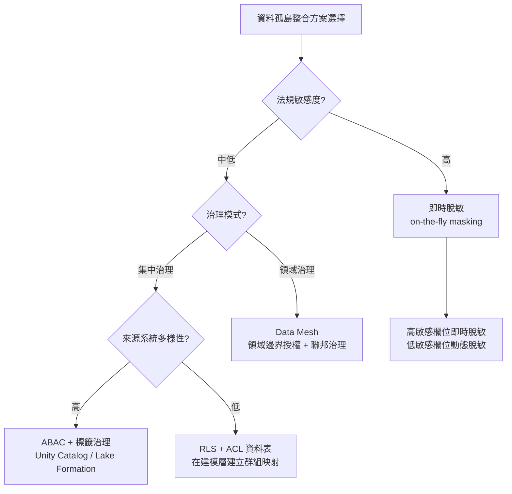

# 資料孤島整合之授權保護範式：從 ETL 到 Data Lakehouse 的治理策略

## 摘要

在 Data Project 與 ETL 領域中，從資料孤島（Data Silos）提取資料至 Data Lake 或 Data Warehouse 時，系統帳戶往往具備廣泛讀取權限，導致原始系統的細粒度 AuthN/AuthZ 規則在提取過程中被「剝離」。本報告梳理業界針對此問題發展出的主要範式，包括屬性式存取控制（ABAC）、資料脫敏策略、Apache Ranger 集中授權框架、Data Mesh / Data Fabric 架構，以及各方案的適用場景。

## 核心矛盾：為什麼授權規則會遺失？

當資料從 CRM、ERP 等來源系統經由 ETL/ELT 管線被提取到集中式資料平台時：

- ETL 通常使用單一服務帳戶進行讀取，該帳戶具備廣泛的資料存取能力
- 來源系統的授權規則可能嵌入在應用層邏輯、UI 能見度設定、或資料庫列層級的安全控制中
- 提取過程不會自動保留這些授權語義——它們必須在目標平台上**重新建模和施加** [^tension]

[^tension]: OpenDataLakehouse. (n.d.). Attribute-Based Access Control (ABAC). Retrieved 2026-01-10, from https://opendatalakehouse.com/kb/attribute-based-access-control/

## 範式一：屬性式存取控制（ABAC）搭配標籤治理

ABAC 已成為現代 Data Lakehouse 中細粒度授權的主導範式。其核心理念是：存取決策基於**主體**（使用者）、**資源**（資料物件）、**環境**（上下文）和**動作**（操作）的屬性，由政策引擎在查詢時動態評估[^abac]。

主要實現：

- **Databricks Unity Catalog ABAC**：透過標籤（tag）來治理——資料在入庫時被賦予標籤（如 `PII`、`classification=confidential`），政策綁定在標籤層面。新建立的資料表若匹配標籤，自動被納入治理範圍，無需逐個授權[^databricks-abac]。
- **AWS Lake Formation TBAC**：Tag-Based Access Control，允許 `GRANT SELECT ON ALL TABLES WITH LF-TAG (classification=internal) TO ROLE data_engineers`。標籤與資源的配對自動繼承[^aws-tbac]。
- **Open Policy Agent (OPA)**：通用政策引擎，使用 Rego 語言撰寫 ABAC 規則，可整合至 Trino、Polaris 等查詢引擎與目錄服務中[^opa]。

ABAC 的關鍵優勢：政策可重用、基於元數據標籤自動覆蓋新資源、降低 RBAC 的維護成本。

[^abac]: OpenDataLakehouse. (n.d.). Attribute-Based Access Control (ABAC). Retrieved 2026-01-10, from https://opendatalakehouse.com/kb/attribute-based-access-control/
[^databricks-abac]: Databricks. (n.d.). ABAC Core Concepts in Unity Catalog. Retrieved 2026-01-10, from https://docs.databricks.com/aws/en/data-governance/unity-catalog/abac/core-concepts
[^aws-tbac]: AWS. (n.d.). Lake Formation Attribute-Based Access Control. Retrieved 2026-01-10, from https://docs.aws.amazon.com/lake-formation/latest/dg/attribute-based-access-control.html
[^opa]: Open Policy Agent. (n.d.). OPA Overview. Retrieved 2026-01-10, from https://openpolicyagent.org/

## 範式二：列層級安全（RLS）與欄位層級安全（CLS）

這是實現細粒度存取控制的基礎原語：

- **列層級安全（RLS）**：根據使用者身分過濾資料列。典型實作是在報表層維繫 ACL 資料表，將使用者群組對應到允許的商業屬性值（如區域、部門、租戶 ID）。Snowflake、BigQuery、Databricks、Redshift 皆有原生支援[^rls-cls]。
- **欄位層級安全（CLS）**：控制欄位可視性——完全封鎖、動態遮罩（部分顯示、空值化、雜湊化），或於儲存時加密。
- **網格層級安全（Cell-Level Security）**：RLS + CLS 的組合，AWS Lake Formation 與 Databricks ABAC 皆有支援[^cell]。

ACL 模式是 Data Vault 領域的常見做法：在轉換階段建立中央 ACL 資料表，呈現層透過 View/Macro 根據當前使用者的群組歸屬進行過濾，以群組而非個人為管理單位[^aclvault]。

[^rls-cls]: Stackable. (n.d.). What are Row-Level and Column-Level Security in a Data Lakehouse? Retrieved 2026-01-10, from https://stackable.tech/en/blog/what-are-row-level-and-column-level-security-in-a-data-lakehouse/
[^cell]: AWS. (n.d.). Lake Formation Data Filtering (Cell-Level Security). Retrieved 2026-01-10, from https://docs.aws.amazon.com/lake-formation/latest/dg/data-filtering.html
[^aclvault]: Scalefree. (n.d.). Row & Column-Level Security in the Reporting Layer (ACL Pattern). Retrieved 2026-01-10, from https://www.scalefree.com/knowledge/webinars/data-vault-friday/row-column-level-security-in-the-reporting-layer/

## 範式三：資料脫敏（Data Masking）策略

依脫敏發生的時機點可分為三種架構模式[^masking]：

1. **靜態脫敏（Static Masking）**：在載入前轉換敏感值，儲存脫敏後的副本至倉儲。適用於開發/測試環境。代價：副本與生產資料存在時間差。
2. **動態脫敏（Dynamic Masking）**：儲存原始值，在查詢時由倉儲引擎根據呼叫者角色/會話環境即時轉換。Snowflake 的 `CREATE MASKING POLICY`、BigQuery 的 Dataplex 政策標籤、Databricks 的欄位遮罩皆屬此類。優勢：無需維護副本、政策即時生效、集中稽核。代價：每次讀取皆需評估政策運算式。
3. **即時脫敏（On-the-fly Masking）**：在 ETL 管線中完成脫敏，資料離開來源時已遮罩，倉儲從未取得原始值。對 GDPR/HIPAA/PCI 等法規環境最強，適合高敏感欄位。

業界常見生產配置：高監管欄位（國民身份證字號、臨床資料）在入庫時即遮罩；低敏感欄位（顯示名稱、email 域名）原始落地，透過動態脫敏政策在查詢時保護。

方法學：替代（Substitution）、洗牌（Shuffling）、空值化（Nulling）、部分遮罩（Partial Masking）、雜湊（Hashing）、確定性加密（Deterministic Encryption）、格式保留加密（Format-Preserving Encryption）、代幣化（Tokenization）。

[^masking]: Data Warehouse Info. (n.d.). Data Masking in the Data Warehouse. Retrieved 2026-01-10, from https://datawarehouseinfo.com/practice/data-masking/

## 範式四：Apache Ranger —— 集中式細粒度授權框架

Apache Ranger 為 Hadoop 生態系及其延伸提供統一的授權管理層[^ranger]：

- 統一的 UI / REST API 管理授權政策
- 支援 20+ 資料服務（HDFS、Hive、Impala、Kafka、Solr、Trino、Polaris）的細粒度授權
- RBAC 與 ABAC 皆支援
- 透過 Plugin 機制在各服務內執行政策並記錄稽核軌跡
- 原生支援欄位脫敏與列層級過濾

對於從 Hadoop 生態遷移至 Lakehouse 的企業，Ranger 可作為治理骨幹。

[^ranger]: Apache Ranger. (n.d.). Introduction. Retrieved 2026-01-10, from https://ranger.apache.org/

## 範式五：Data Mesh —— 去集中化授權與聯邦治理

Data Mesh 將資料視為由領域團隊擁有的產品。授權在 Data Mesh 架構中遵循以下原則[^datamesh-security]：

- **聯邦治理、在地執行**：全球性安全/合規標準由中央定義，各領域團隊在其邊界內自行執行。政策即程式碼（Policy-as-Code）工具允許領域團隊將需求編碼至基礎設施。
- **零信任資料存取**：基於使用者身份、裝置狀態、上下文因素做出存取決策，不依賴網路位置。
- **可觀察的資料血緣**：跨領域追蹤資料的產出、轉換、消費過程。
- **預設安全的資料產品**：每個資料產品附帶預配置的安全控制（欄位加密、存取政策、結構驗證）。

Data Mesh 的授權哲學與前四種範式不同——它不試圖在中央位置複製來源系統的授權，而是將授權保持在領域邊界，跨域存取則由企業級政策治理。AWS 提出的 Secure Data Mesh 模式即採用分散式資料資產所有權、集中式治理的方式[^aws-datamesh]。

[^datamesh-security]: DZone. (2023). Data Mesh Security: How to Protect Decentralized Data Architectures. Retrieved 2026-01-10, from https://dzone.com/articles/data-mesh-security-decentralized-data
[^aws-datamesh]: AWS. (n.d.). Secure Data Mesh with Distributed Data Asset Ownership on AWS. Retrieved 2026-01-10, from https://aws.amazon.com/solutions/guidance/secure-data-mesh-with-distributed-data-asset-ownership-on-aws/

## 範式六：Data Fabric —— 統一存取與治理層

Data Fabric 透過活躍元數據層（Active Metadata Layer）連接、治理、交付分散環境中的資料，而不需要物理集中。從授權角度，Data Fabric[^datafabric]：

- 以增強的資料目錄（Augmented Data Catalog）追蹤資料流動、處理與存取
- 對跨來源、湖、倉儲、消費點施加一致的治理政策
- 支援政策即程式碼在分散資料資產中執行
- 提供單一定義點，將授權規則傳播至底層系統

Data Fabric 與 Data Mesh 的關鍵區別：前者是技術驅動（整合、虛擬化、元數據治理），後者是組織驅動（領域擁有權、文化轉變、產品思維）。

[^datafabric]: IBM. (n.d.). What is a Data Fabric? Retrieved 2026-01-10, from https://www.ibm.com/think/topics/data-fabric

## 範式比較與場景建議

| 場景 | 建議範式 | 理由 |
|------|----------|------|
| 多來源系統匯入 Data Lakehouse | ABAC + 標籤治理（Unity Catalog / Lake Formation） | 新資源自動繼承政策，維護成本最低 |
| 來源系統有複雜應用層授權（如 SAP） | 將授權語義建模為 ACL 資料表，在報表層施加 RLS | 應用層授權無法自動擷取，需重新實現 |
| 受監管資料（GDPR/HIPAA/PCI） | 即時脫敏（高敏感欄位）+ 動態脫敏（低敏感欄位） | 倉儲從未取得原始敏感值 |
| Hadoop 生態遷移至 Lakehouse | Apache Ranger | 既有治理骨幹可重用 |
| 大型組織，強領域擁有權 | Data Mesh，搭配 Privacera/Immuta 管理跨域政策 | 授權保持在領域邊界，中央定義跨域規則 |
| 混合/多雲環境 | Data Fabric，以元數據層統一治理 | 跨物理位置的統一政策執行點 |

## 總結

資料孤島整合的授權保護不可能透過單一銀彈解決。業界共識是採用**多層次、混合範式**的策略：

1. **提取階段**：對高敏感欄位施以即時脫敏，確保倉儲絕不落地原始資料
2. **建模階段**：以標籤/ACL 資料表建模來源系統授權語義
3. **治理階段**：透過 ABAC/Ranger/Data Fabric 框架定義集中或聯邦政策
4. **消費階段**：以 RLS/Dynamic Masking 在查詢時施加最終防線

其中 ABAC 搭配標籤治理是最具增長潛力的範式，因其將授權從「逐物件授權」提升至「語義層級治理」，使新資料自然繼承保護。