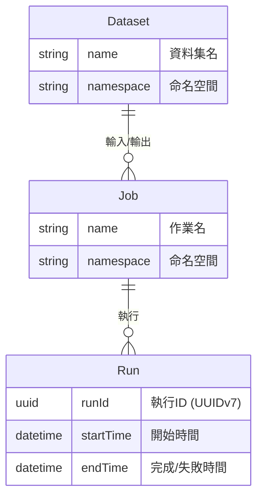

# OpenLineage 介紹

## 1. 什麼是 OpenLineage

**OpenLineage** 是一個**資料血緣（lineage）收集與分析的開放標準規範（Open Standard）**。它為資料 pipeline 中各個作業使用哪些資料集作為輸入/輸出，提供了統一的記錄和傳輸格式[^what-is-ol]。

OpenLineage 本身不是元資料伺服器，它只定義**事件格式規範**。實際接收、儲存、視覺化事件需要搭配後端（如 Marquez）使用[^ol-vs-marquez]。

主要目標：

- 追蹤資料的產生、消費和轉換過程
- 簡化下游影響分析
- 協助問題根源定位（RCA）
- 提升組織整體資料 pipeline 的可視性

## 2. 歷史與組織

| 項目 | 內容 |
|---|---|
| **起源** | 約 2017 年，WeWork 的首席工程師 Julien Le Dem 因 pipeline 映射需求開發了 Marquez，後獨立為 OpenLineage[^history] |
| **目前託管** | **LF AI & Data Foundation**（Linux Foundation 旗下）的 Graduate 專案。2021 年 5 月由 Datakin 捐贈，2023 年 7 月晉升 Graduate[^lfaidata] |
| **許可證** | Apache 2.0 |
| **主要貢獻者** | WeWork、DataHub、Apache Spark、Astronomer、Atlan 等[^github] |
| **治理** | Technical Steering Committee（TSC）運作，每月召開會議 |

## 3. 架構

OpenLineage 架構由 3 個主要元件構成[^architecture]：

```
[Producers] → OpenLineage Events → [Backend] → [Consumers]
```

| 元件 | 角色 |
|---|---|
| **Producers（生產者）** | 嵌入 Airflow、Spark、dbt 等資料工具，產生並發送 OpenLineage 格式的血緣事件 |
| **Backend（後端）** | 接收、儲存、分析血緣事件的伺服器。參考實作為 **Marquez**，支援 HTTP、Kafka 等協定 |
| **Consumers（消費者）** | 取得儲存的血緣元資料，用於 UI 展示、API 查詢、資料 catalog 整合 |

## 4. 核心模型與 RunEvent

OpenLineage 由以下 3 個核心實體構成[^spec]：



**RunEvent** 是 OpenLineage 的核心 JSON 物件，結構如下[^run-event]：

| 欄位 | 說明 |
|---|---|
| `eventType` | `START`、`COMPLETE`、`FAIL`、`RUNNING`、`OTHER` |
| `eventTime` | ISO 8601 時間戳 |
| `run` | `{ runId: UUID }` |
| `job` | `{ namespace, name }` |
| `inputs` | 輸入資料集陣列 |
| `outputs` | 輸出資料集陣列 |
| `facets` | 上下文元資料（擴充點） |
| `producer` | URI |
| `schemaURL` | 模式驗證 URL |

執行生命週期：

1. 作業開始時 → 發送 `START` 事件
2. 作業進行中 → 可選發送 `RUNNING` 事件
3. 作業完成時 → 發送 `COMPLETE` 或 `FAIL` 事件

## 5. Facets（面向）— 可擴充性的關鍵

**Facets** 是可以附加到核心實體的「原子元資料片」，是 OpenLineage 可擴充性的核心機制[^facets]。

| 類型 | 範例 |
|---|---|
| **Run Facets** | `parent`（父執行連結）、`dbt_version`、`dbt_run`、`externalQuery` |
| **Job Facets** | `sql`（執行的 SQL）、`sourceCode`、`jobType`、`dbt_node_metadata` |
| **Dataset Facets** | `schema`（欄名/型別）、`columnLineage`、`dataQualityMetrics`、`dataQualityAssertions`、`documentation`、`dbt_model`、`dbt_exposures` |

除標準 facets 外，還可定義**自訂 facets**。命名規則為 `{prefix}_{name}`（如 `bigQuery_statistics`），用專案前綴防止衝突。自訂 facets 可升級為標準 facets[^custom-facets]。

## 6. 整合生態

OpenLineage 提供與諸多資料工具的整合[^integrations]：

| 整合對象 | 類型 | 主要功能 |
|---|---|---|
| **Apache Airflow** | 原生 provider | 自動為所有 DAG/任務產生 RunEvent，自動取得 schema、欄級血緣、資料品質、SQL facets |
| **dbt** | 原生 adapter | 兩種解析方式：Artifact Processor（事後解析）和 Structured Log Processor（即時串流）。輸出欄級血緣 |
| **Apache Spark** | 原生 agent | 支援 Spark 2.4+，取得欄級血緣、schema、行數資訊。支援 BigQuery、Databricks、Delta Lake 等 catalog handler |
| **Apache Flink** | 整合模組 | 串流處理的血緣追蹤，支援 Kinesis 等資料來源 |
| **Great Expectations** | Validation Action | 資料品質檢查執行後發送 OpenLineage 事件，附加品質指標和斷言結果作為 facets |
| **Apache Hive** | 整合模組 | 從 Hive 查詢收集血緣 |
| **Trino** | 整合 | 從 Trino 查詢收集血緣 |
| **Feast** | 整合 | 特徵 store 元資料 |
| **SQL Parser** | Rust 實作 | 解析 SQL 語句提取表級血緣，提供 Java/Python 綁定 |

## 7. 支援的後端

| 後端 | 說明 |
|---|---|
| **Marquez（參考實作）** | LF AI & Data 專案。PostgreSQL 後端、Dropwizard 的 API 伺服器、React 的 UI。透過 REST API（`/api/v1/lineage`）接收血緣事件[^marquez] |
| **HTTP Backend（通用）** | 可向任意 HTTP 伺服器 POST 事件 |
| **Kafka** | 可將事件生產到 Kafka broker |
| **Datadog** | Python 用戶端支援向 Datadog 發送 HTTP 請求 |
| **Google Cloud** | 支援 GCS（Google Cloud Storage）和 GCP Lineage API 傳輸 |
| **自訂後端** | 使用用戶端函式庫（Python/Java/Go）實作任意後端 |

## 8. 與相關專案的關係

| 專案 | 類型 | 與 OpenLineage 的關係 |
|---|---|---|
| **Marquez** | 血緣元資料伺服器 | OpenLineage 的**參考實作**，實作了 OpenLineage 規範的後端。獨立的 LF AI & Data 專案但緊密協作[^marquez] |
| **DataHub（LinkedIn 出品）** | 綜合元資料平台 | 除血緣外還提供資料發現、治理、品質、業務詞彙。可接收 OpenLineage 格式事件。規模更大、功能更全[^datahub] |
| **Amundsen（Lyft 出品）** | 資料 catalog | 專注資料發現和元資料管理。2026 年 9 月封存。與 OpenLineage 是不同的思路 |
| **OpenMetadata** | 資料 catalog | 更偏向 catalog 應用層面，與 OpenLineage 互補。有觀點將 OpenLineage 視為「佈線格式」、OpenMetadata 視為「catalog 應用」[^comparison] |
| **Datakin** | 資料可觀測性平台 | OpenLineage 的初期贊助方。商業可觀測性平台 |

### 重要：OpenLineage ≠ Marquez

- **OpenLineage** = 規範/標準（定義事件格式）
- **Marquez** = 實作了該規範的**參考實作後端**（實際儲存和視覺化資料的伺服器）

只要伺服器相容 OpenLineage 規範，即可替代 Marquez 作為後端[^ol-vs-marquez]。

## 9. 最新版本與近期發展

- **最新穩定版**: **v1.53.0**（2026-09-01 發佈）[^releases]
- **前版本**: v1.52.0（2026-07-23）
- **發佈頻率**: 約 3~6 週一次 major 版本

### v1.53.0 主要變更[^v1530]

- **規範**: 新增 Explicit Lineage Facets — 無需笛卡兒積推理即可宣告資料集/欄位/作業級關係
- **Spark**: 支援 Python 3.14 和 Spark 4.2。新增 ClickHouse V2 catalog handler、Lakehouse catalog handler
- **dbt**: Glue 資料集 symbolic link
- **Flink**: Kinesis lineage visitor
- **SQL**: 支援括號 JOIN
- **Java**: Oracle TNS 連線描述符支援，GCP Lineage/GCS 傳輸重試設定
- **Python**: 遷移至 httpx2，資料集正規化功能
- **安全**: Jackson 升級至 2.18.9（CVE 修復）

## 10. 使用場景與案例

### 主要使用場景

- **資料 pipeline 可觀測性**: 提供 pipeline 全域依賴關係地圖
- **根源定位（RCA）**: 故障時快速定位上游作業或資料集
- **影響分析**: 在刪除表或修改欄類型前掌握所有下游影響
- **資料治理與合規**: 滿足 GDPR、CCPA、SOX 等法規對資料流的追溯要求
- **資料品質保證**: 透過與 Great Expectations 整合將品質檢查結果融入血緣

### 案例

- **Northwestern Mutual**: 公開了 OpenLineage + Marquez 的資料可觀測性實踐[^nwm]
- **WeWork**: OpenLineage 和 Marquez 的發源地，持續貢獻專案
- **Astronomer**: 在 Airflow 的 Cosmos 專案中推動 OpenLineage 整合
- **Atlan**: 在資料 catalog 產品中消費 OpenLineage 事件以提供血緣視覺化
- **AWS**: 透過部落格介紹了 Amazon SageMaker/DataZone 的 OpenLineage 相容 API[^aws]

## 總結

OpenLineage 正迅速成為資料血緣收集的**業界標準規範**。它以統一格式取代了各工具自有的血緣收集方式，提供與 Airflow、dbt、Spark 等主要資料工具的原生整合。作為 LF AI & Data Foundation 的 Graduate 專案，在活躍社群支援下持續新增欄級血緣、串流處理血緣等高階功能。以 Marquez 為後端，使用者只需極簡基礎設施即可實現血緣圖視覺化和 API 查詢。

[^what-is-ol]: OpenLineage. (n.d.). What is OpenLineage? Retrieved 2026-10-03, from https://openlineage.io/
[^architecture]: OpenLineage. (n.d.). Architecture Overview. Retrieved 2026-10-03, from https://openlineage.io/docs/
[^spec]: OpenLineage. (n.d.). Specification. Retrieved 2026-10-03, from https://openlineage.io/docs/spec/
[^run-event]: OpenLineage. (n.d.). RunEvent. Retrieved 2026-10-03, from https://openlineage.io/docs/spec/
[^facets]: OpenLineage. (n.d.). Facets. Retrieved 2026-10-03, from https://openlineage.io/docs/spec/facets/
[^custom-facets]: OpenLineage. (n.d.). Custom Facets. Retrieved 2026-10-03, from https://openlineage.io/docs/spec/facets/
[^integrations]: OpenLineage. (n.d.). Integrations. Retrieved 2026-10-03, from https://openlineage.io/docs/integrations/
[^ol-vs-marquez]: Marquez Project. (n.d.). Marquez Documentation. Retrieved 2026-10-03, from https://marquezproject.ai/
[^marquez]: Marquez Project. (n.d.). Retrieved 2026-10-03, from https://marquezproject.ai/
[^datahub]: DataHub. (n.d.). DataHub. Retrieved 2026-10-03, from https://datahubproject.io/
[^comparison]: PiStack. (2026-04-20). OpenLineage vs DataHub vs Apache Atlas: Self-Hosted Data Lineage Guide 2026. Retrieved 2026-10-03, from https://www.pistack.xyz/posts/2026-04-20-openlineage-vs-datahub-vs-apache-atlas-self-hosted-data-lineage-guide-2026/
[^releases]: OpenLineage. (n.d.). Releases. Retrieved 2026-10-03, from https://github.com/OpenLineage/OpenLineage/releases
[^v1530]: OpenLineage. (2026-09-01). Release v1.53.0. Retrieved 2026-10-03, from https://github.com/OpenLineage/OpenLineage/releases/tag/1.53.0
[^history]: LF AI & Data Foundation. (n.d.). OpenLineage Project. Retrieved 2026-10-03, from https://lfaidata.foundation/projects/openlineage
[^lfaidata]: LF AI & Data Foundation. (n.d.). OpenLineage. Retrieved 2026-10-03, from https://lfaidata.foundation/projects/openlineage
[^github]: OpenLineage. (n.d.). OpenLineage GitHub Repository. Retrieved 2026-10-03, from https://github.com/OpenLineage/OpenLineage
[^nwm]: OpenLineage. (n.d.). OpenLineage at Northwestern Mutual. Retrieved 2026-10-03, from https://openlineage.io/blog/openlineage-at-northwestern-mutual/
[^aws]: Amazon Web Services. (n.d.). Capture Data Lineage from dbt, Apache Airflow, and Apache Spark with Amazon SageMaker. Retrieved 2026-10-03, from https://aws.amazon.com/blogs/big-data/capture-data-lineage-from-dbt-apache-airflow-and-apache-spark-with-amazon-sagemaker/