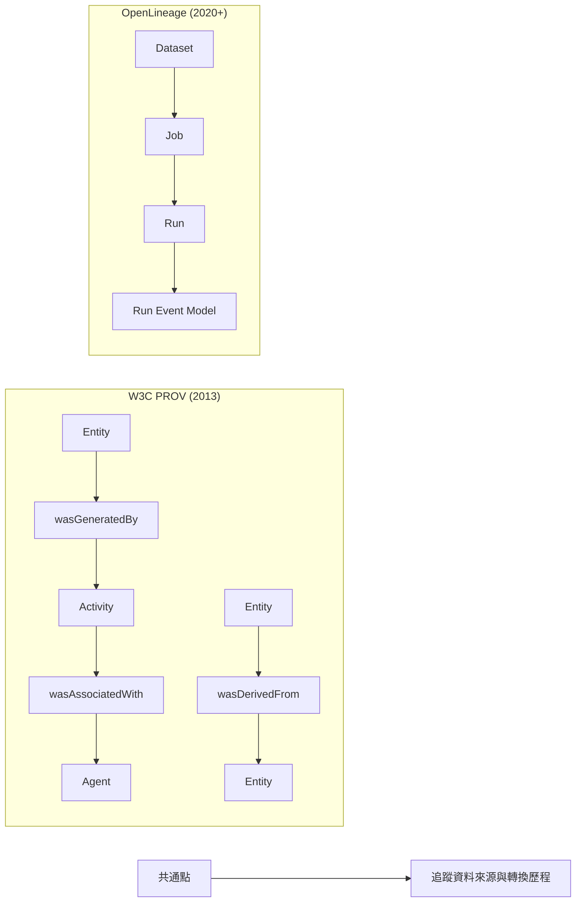

# W3C PROV 的實用性分析

## 概述

W3C PROV（Provenance）是 World Wide Web Consortium（W3C）在 2013 年發布的一組推薦標準，用於描述資料的來源（provenance）——即關於資料的歷史、產生過程與影響因素的資訊[^prov-overview]。本文旨在評估其實用性，涵蓋核心概念、設計目的、業界採用狀況、與類似標準的比較，以及實際應用中的優點與限制。

## 核心概念

PROV 資料模型（PROV-DM）以三個主要類別與其間的關係為核心[^prov-dm]：

### 三大基本類型

| 類型 | 說明 | 範例 |
|---|---|---|
| **Entity**（實體） | 世界中的事物（在特定狀態下） | 檔案、資料集、資料庫記錄 |
| **Activity**（活動） | 隨時間發生的事情 | 資料轉換、ETL 流程、模型訓練 |
| **Agent**（代理） | 對活動承擔責任的角色 | 人員、組織、軟體 |

### 核心關係

```
Entity ← wasGeneratedBy → Activity
Entity ← used → Activity
Entity ← wasDerivedFrom → Entity
Activity ← wasAssociatedWith → Agent
Entity ← wasAttributedTo → Agent
Agent ← actedOnBehalfOf → Agent
```

### 標準家族

| 標準 | 用途 |
|---|---|
| PROV-DM | 核心資料模型 |
| PROV-O | OWL2 本體映射至 RDF |
| PROV-N | 人類可讀的文字表示法 |
| PROV-XML | XML 綱要 |
| PROV-JSON | JSON 序列化格式 |

## 設計目的

PROV 的設計目標包括[^prov-primer]：

1. **互通性**：讓不同系統能夠交換 provenance 資訊
2. **通用性**：領域無關，可應用於科學、企業、政府等場景
3. **語意豐富**：透過 OWL 本體提供形式化語意，支援自動化推理
4. **Web 原生**：使用 URI、RDF、Linked Data 等 Web 架構
5. **可擴展**：允許透過子類化與自訂屬性擴展

## 業界採用狀況

### 已完成標準化

- **ISO 23494**（Biotechnology — Provenance information model for biological material and data）：以 W3C PROV 為基礎，2026 年發布 Parts 1-2，由 ISO/TC 276 工作組 5 開發[^iso23494]
- **EOSC-Life Common Provenance Model**：歐洲開放科學雲計畫，基於 PROV[^commonprovenance]

### 工具生態系

| 工具 | 語言 | 功能 |
|---|---|---|
| ProvToolbox | Java | 建立、轉換、驗證 PROV，支援所有序列化格式[^provtoolbox] |
| prov (Python) | Python | 完整 PROV-DM 實作，支援 PROV-N/PROV-JSON/PROV-XML/PROV-O/PROV-JSONLD[^provpython] |
| PROV Translator | Web | 在不同 PROV 格式之間轉換[^provtranslator] |
| Apache Atlas | Java | 企業級 provenance 引擎，基於 PROV-O 本體[^apacheatlas] |

### 已使用 PROV 的組織

- CAISO、PJM、ERCOT、ENTSO-E（能源產業）
- BBMRI-ERIC（生物銀河）
- EOSC-Life、BY-COVID 計畫

## 與 OpenLineage 的比較

OpenLineage 是 LF AI & Data Foundation 的畢業級專案（2020 年起），專注於資料管線的 lineage 收集[^openlineage]。



| 比較維度 | W3C PROV | OpenLineage |
|---|---|---|
| 標準組織 | W3C（2013） | LF AI & Data Foundation（2020+） |
| 核心模型 | Entity、Activity、Agent | Dataset、Job、Run |
| 語意豐富度 | 高（OWL2 本體，12+ 關係） | 中低（扁平 JSON Schema） |
| 領域範圍 | 通用（跨領域） | 資料工程/MLOps |
| 學習曲線 | 陡峭（RDF/OWL/SPARQL） | 較平緩（JSON 為主） |
| 整合難度 | 高（需自訂 mapping） | 低（Spark/Airflow/dbt 原生整合） |
| 即時性 | 批次/事後記錄 | 事件驅動即時蒐集 |
| 監管合規 | 強（RDF 鏈條） | 中（需擴充） |

PROV 與 OpenLineage 為互補關係而非競爭：PROV 適合跨域 provenance 交換與高階治理，OpenLineage 適合資料管線內部的 lineage 自動化蒐集[^data-landscape]。

## 實用性評估

### 優點

1. **W3C 標準地位**：經過廣泛共識，具備權威性與穩定性，適合需要正式標準的場景（如法規合規、政府計畫）
2. **語意精確度**：形式化本體可表達委託、引用、修訂等複雜關係，對稽核與監管鏈至關重要
3. **跨域互通**：作為 W3C 推薦標準，設計目標即是跨系統、跨組織交換 provenance
4. **未來適應性**：不綁定特定執行引擎或工具堆疊，同一模型可描述 ETL 管線與 AI 訓練流程
5. **可擴展性**：核心模型可透過領域特定本體（如 PROV-One、ISO 19115）擴展
6. **來源之來源**：Bundle 機制可表達「誰做了什麼斷言」，支援信任歸因

### 缺點

1. **學習曲線陡峭**：需要同時理解 RDF、OWL、URI、SPARQL 等語意網技術
2. **實作成本高**：PROV 是抽象概念模型；沒有「一鍵安裝」的自動化工具，需為每個系統建立自訂 mapping
3. **維護更新緩慢**：2013 年後未發布新版，對現代 MLOps 工具鏈的原生支援不足
4. **非即時設計**：模型為批次/事後記錄設計，缺乏事件驅動 API
5. **主流工程工具採用有限**：資料工程領域已收斂至 OpenLineage[^data-landscape]
6. **冗長性**：即使表達簡單關係也需要較多元餘資訊
7. **工具碎片化**：多個實作（Python、Java、JS）由不同團隊維護，功能一致性不足
8. **實作不相容問題**：2025 年 ESWC 論文指出 Prov Python 與 ProvToolbox 之間存在不相容[^eswc2025]

### 適用場景

| 適合 | 不適合 |
|---|---|
| 法規合規/稽核需求高的場景 | 僅需管線內部 lineage 的場景 |
| 跨組織 provenance 交換 | 需要快速實作最小可行方案的專案 |
| 語意網/知識圖譜整合 | 缺乏 RDF/OWL 經驗的團隊 |
| 科學研究與 FAIR 資料管理 | 主要使用 Spark/Airflow/dbt 的資料工程 |
| 長期數位保存 | 需要即時串流 lineage 的場景 |

## 結論

W3C PROV 的實用性取決於使用場景。對於需要跨域互通、語意豐富、法規層級 provenance 的專案（如 ISO 23494 生物科技 provenance、能源產業合規、知識圖譜整合），PROV 仍然是目前最成熟的標準選擇。然而，對於聚焦於現代資料工程工具鏈的團隊，OpenLineage 提供了更低摩擦的替代方案。兩者並非互斥——最佳實踐可能是使用 OpenLineage 進行自動化 lineage 蒐集，再映射至 PROV 模型進行高階治理與報告。

## 參考文獻

[^prov-overview]: W3C. (2013). PROV-OVERVIEW: An Overview of the PROV Family of Documents. Retrieved 2026-10-03, from https://www.w3.org/TR/2013/NOTE-prov-overview-20130430/
[^prov-dm]: W3C. (2013). PROV-DM: The PROV Data Model. Retrieved 2026-10-03, from https://www.w3.org/TR/prov-dm/
[^prov-primer]: W3C. (2013). PROV-PRIMER: A Primer on PROV. Retrieved 2026-10-03, from https://www.w3.org/TR/prov-primer/
[^prov-o]: W3C. (2013). PROV-O: The PROV Ontology. Retrieved 2026-10-03, from https://www.w3.org/TR/prov-o/
[^iso23494]: ISO. (2026). ISO 23494-1:2026 — Biotechnology — Provenance information model for biological material and data — Part 1: Design concepts and general requirements. Retrieved 2026-10-03, from https://www.iso.org/standard/87714.html
[^provtoolbox]: Moreau, L. (n.d.). ProvToolbox: Java library for creating and converting PROV provenance. Retrieved 2026-10-03, from https://github.com/lucmoreau/ProvToolbox
[^provpython]: Huynh, T. D. (n.d.). prov: A Python library for W3C PROV. Retrieved 2026-10-03, from https://github.com/trungdong/prov
[^provtranslator]: OpenProv. (n.d.). PROV Translator. Retrieved 2026-10-03, from https://openprovenance.org/services/view/translator
[^apacheatlas]: Apache Software Foundation. (n.d.). Apache Atlas: Data governance engine with native W3C PROV support. Retrieved 2026-10-03, from https://atlas.apache.org/
[^openlineage]: LF AI & Data Foundation. (n.d.). OpenLineage: An open standard for dataset lineage collection. Retrieved 2026-10-03, from https://openlineage.io/
[^data-landscape]: Data Landscape. (n.d.). Standards — PROV. Retrieved 2026-10-03, from https://www.data-landscape.com/standards/prov/
[^commonprovenance]: Common Provenance Model. (n.d.). Retrieved 2026-10-03, from https://commonprovenancemodel.org
[^eswc2025]: Moreau, L., & Ashworth, M. (2025). Interoperability of W3C PROV Implementations. In *Proceedings of the 20th Extended Semantic Web Conference (ESWC 2025)*. Retrieved 2026-10-03, from https://link.springer.com/chapter/10.1007/978-3-031-78952-6_54