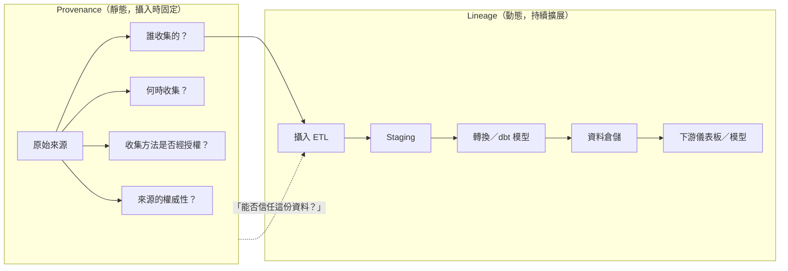

# ETL/Data Project 領域中的 Provenance 與 Lineage

ETL（Extract, Transform, Load）以及廣義的資料工程專案中，**Provenance（來源追溯）** 與 **Lineage（血緣/資料流向）** 是兩個經常被混用但實質不同的關鍵概念。本文說明兩者的定義、差異、在實務中的角色，以及相關工具與標準。

## 定義

### Data Lineage（資料血緣）

Data Lineage 是資料從源頭到終點完整流動過程的**營運記錄**，追蹤資料經過了哪些系統、接受了哪些轉換（ETL/ELT）、最終饋送給哪些下游資產（儀表板、模型、報表）。它回答的是：**「資料往哪裡去？它如何被改變？」**[^atlan_lineage]

> Data lineage tracks the lifecycle of data, including its origins and where it moves over time. It gives visibility into the analytics pipeline and provides a road map for understanding how data gets from its source to its end-user.[^atlan_lineage]

### Data Provenance（資料來源追溯）

Data Provenance 是關於資料「從哪裡來」的**歷史記錄**——誰建立了它、在什麼條件下建立、以及它承載了何種可信度或權威性。它回答的是：**「這筆資料來自哪裡？我可以信任它嗎？」**[^snowflake_prov]

> Data provenance is the record of metadata from data's original sources, providing the historical context and authenticity of data.[^montecarlo]

## 差異總覽

| 面向 | Data Lineage | Data Provenance |
|---|---|---|
| **核心問題** | 資料往哪裡去？如何被轉換？ | 資料從哪裡來？可以信任嗎？ |
| **範圍** | 從源頭到消費的端到端生命週期 | 與來源建立及處理相關的歷史記錄 |
| **關注點** | 移動、轉換、依賴關係 | 來源、真實性、保管鏈、權威性 |
| **主要使用者** | 資料工程師、分析師、平台團隊 | 稽核員、合規團隊、AI 治理人員 |
| **時間維度** | 連續且動態（隨資料持續累積） | 靜態／特定時間點（於建立或攝入時固定） |
| **關鍵場景** | 影響分析、偵錯、遷移、根因分析 | 稽核、信任驗證、法規認證 |
| **記憶口訣** | 「如果我把這個欄位改了，哪些儀表板會壞？」 | 「這份訓練資料的收集有取得適當同意嗎？」 |

**Cyberhaven** 的歸納最為精簡：Provenance 是**靜態的**——在資料被建立或攝入的那一刻就已固定；Lineage 是**動態的**——只要資料存在，它就會持續擴大。[^cyberhaven]

**DataHub** 補充：Lineage 告訴你資料進入你的環境之後發生了什麼，但它無法告訴你來源是否具備權威性、資料是否以適當方式收集、或者保管鏈是否支持目前的使用目的。[^datahub]

## 在 ETL/Data Project 中的角色

### Data Lineage 的角色

Lineage 是運作中資料團隊的**營運骨幹**，具體應用包括：

- **影響分析（Impact Analysis）**：在變更上游 schema、棄用欄位或改寫 dbt 模型之前，Lineage 能完整呈現下游儀表板、報表、管線的波及範圍。[^atl_impact]
- **根因分析與偵錯**：當儀表板指標異常時，工程師可以沿著 Lineage 逆向追蹤——從 dbt 模型 → Staging 表 → 攝入工作 → 來源系統——找出問題所在。[^datahub_debug]
- **資料遷移**：從 Teradata 遷移至 Snowflake 時，Lineage 地圖能協助將依賴關係分組，安全地分批遷移。[^datahub_debug]
- **法規遵循（資料流向）**：在 GDPR/CCPA 下，Lineage 顯示敏感個人資料流經哪些系統。[^atlan_lineage]

### Data Provenance 的角色

Provenance 是**信任與治理層**，具體應用包括：

- **資料可信度判斷**：驗證資料集是由內部產生還是第三方提供，以及來源是否具備權威性。[^snowflake_prov]
- **AI/ML 訓練資料認證**：根據歐盟 AI Act 第 10 條，Provenance 必須記載訓練資料的來源、準備方式、以及是否在適當控管下經過審查。[^snowflake_prov]
- **稽核與鑑識**：當敏感資料出現在不該出現的地方時，Provenance 可重建保管鏈，辨識政策違反或安全漏洞。[^montecarlo]
- **科學／研究驗證**：臨床試驗資料需要證明是由經認可的人員、按照核准的方法收集，並有完整的保管鏈記錄。[^snowflake_prov]

### 兩者協同的必要性

Lineage 若無 Provenance，只能告訴你資料如何移動，卻無法告訴你來源是否可信。Provenance 若無 Lineage，只能告訴你來源可信，卻無法告訴你攝入之後發生過什麼。成熟的治理方案需要兩者並存。[^ovaledge]

## 工具與標準

### Data Lineage 工具與標準

| 工具／標準 | 類型 | 說明 |
|---|---|---|
| **OpenLineage** | 開放標準 | 收集管線執行之元資料／Lineage 的開放標準。Airflow、dbt、Spark、Snowflake 支援。[^openlineage] |
| **Marquez** | 開源工具 | 收集、彙總 OpenLineage 事件，提供網頁 UI 與 REST API。 |
| **Apache Atlas** | 開源 | 元資料管理與治理工具，支援 OpenLineage 整合的 Lineage 追蹤。[^openlineage] |
| **Egeria** | 開源框架 | 開放元資料治理框架，可擷取 OpenLineage 事件並與既有元資料關聯。[^openlineage] |
| **OpenMetadata** | 開源 | 欄位層級 Lineage，支援無程式碼編輯、dbt 整合、查詢過濾。 |
| **Spline** | 開源 | 最初為 Apache Spark Lineage 設計，現支援多種資料來源。 |
| **Snowflake** | 商業 | 原生物件／欄位層級 Lineage、外部 Lineage（透過 OpenLineage）、ML Lineage。 |
| **DataHub** | 商業 | 跨平台 Lineage 圖譜，包含所有權、稽核戳記、來源 URN、執行記錄。[^datahub] |
| **Monte Carlo** | 商業 | 資料可觀測性平台，自動化欄位層級 Lineage、監控與警示。 |
| **Atlan** | 商業 | 自動化端到端欄位層級 Lineage，互動式圖譜可視化。[^atlan_lineage] |
| **OvalEdge** | 商業 | 透過解析 SQL、ETL 腳本、工作流程記錄自動繪製 Lineage。[^ovaledge] |

### Data Provenance 工具與標準

| 工具／標準 | 類型 | 說明 |
|---|---|---|
| **W3C PROV（PROV-DM、PROV-O）** | 開放標準 | W3C 制定的正式 Provenance 規範，定義 Entity、Activity、Agent 等概念，以 RDF/OWL 機器可讀格式表達。[^w3c_prov] |
| **Open Provenance Model** | 開放標準 | W3C PROV 的前身，仍被參考用於 Provenance 交換。 |
| **ProvToolbox / Prov-Python / ProvJS** | 程式庫 | W3C PROV 資料模型的 Java、Python、JavaScript 實作。 |
| **RO-Crate** | 開放標準 | Research Object Crate，用於將資料與其 Provenance 元資料打包，常見於科學研究領域。 |
| **CamFlow** | 工具 | Linux 環境系統呼叫層級的 Provenance 追蹤。 |
| **Linux Provenance Modules** | 工具 | 核心層級的 Provenance 擷取。 |
| **Kepler** | 工具 | 科學工作流程系統，內建 Provenance 追蹤。 |
| **區塊鏈基礎的 Provenance** | 新興技術 | 用於藥品、法律、金融領域的抗竄改稽核軌跡。 |

**從 DataHub 的觀點**：Provenance 不是單一功能，而是只有在所有權、來源追蹤、稽核歷史、攝入元資料同時存在且互相連結時，才能回答的問題。多數資料目錄將 Lineage 包裝為命名功能，因為它較容易打包；而 Provenance 則留給客戶自行從日誌和報表中組裝。[^datahub]

## 實例

### Data Lineage 實例

**銀行業（BCBS 239 / Basel III 合規）**：跨國銀行實作 Lineage 系統，當監管機構詢問某項風險指標如何計算時，銀行可沿著 ETL 管線逆向追蹤（CRM → Staging → dbt 轉換 → 倉儲 → Looker 儀表板），驗證正確性並證明合規。[^atlan_lineage]

**電商偵錯**：電商公司的收入儀表板出現異常下降。工程師利用 Lineage 逆向追蹤，發現某個 dbt 模型中的過濾條件被錯誤套用在另一個欄位上，問題在數分鐘內被修復。[^atlan_lineage]

### Data Provenance 實例

**藥品臨床試驗（FDA 合規）**：藥廠必須證明臨床資料是由經認證的實驗室、按照核准方法、在有完整保管鏈記錄的條件下收集。Provenance 提供可稽核的軌跡，證明誰建立了資料、何時建立、且無竄改。[^snowflake_prov]

**AI 訓練資料稽核（EU AI Act）**：根據歐盟 AI Act，部署高風險 AI 系統的組織必須記錄訓練資料的來源、收集方法、處理方式、以及是否適當。Provenance 回答了這些問題；Lineage 只能顯示哪些特徵檢視和資料集連接到模型。[^snowflake_prov]

### 兩者協同的實例

**Salesforce 資料外洩案例（Cyberhaven）**：員工從 Salesforce 匯出客戶試算表。Provenance 正確標記為敏感資料。但員工將資料複製到新文件、改名為通用名稱、再貼到個人 AI 助理。僅靠 Provenance 追蹤止步於匯出。Lineage 追蹤則將分類標記攜帶到更名、複製、貼上的後續步驟，防止了 Provenance 單獨無法攔截的資料外洩。[^cyberhaven]

## 參考資料

[^atlan_lineage]: Atlan. (n.d.). *Data Lineage vs. Data Provenance: What's the Difference?* Retrieved 2026-10-03, from https://atlan.com/data-lineage-vs-data-provenance/

[^snowflake_prov]: Snowflake. (n.d.). *What Is Data Provenance?* Retrieved 2026-10-03, from https://www.snowflake.com/en/data-governance/data-lineage/data-provenance/

[^montecarlo]: Monte Carlo. (n.d.). *Data Provenance vs. Data Lineage: What's the Difference?* Retrieved 2026-10-03, from https://montecarlo.ai/blog-data-provenance-vs-data-lineage-difference

[^cyberhaven]: Cyberhaven. (n.d.). *Data Lineage vs. Provenance: Why Both Matter for Data Security.* Retrieved 2026-10-03, from https://www.cyberhaven.com/blog/data-lineage-vs-provenance

[^datahub]: DataHub. (n.d.). *Data Lineage vs. Data Provenance: The Difference Explained.* Retrieved 2026-10-03, from https://datahub.com/blog/data-lineage-vs-data-provenance/

[^ovaledge]: OvalEdge. (n.d.). *Data Lineage vs. Data Provenance.* Retrieved 2026-10-03, from https://www.ovaledge.com/blog/data-lineage-vs-data-provenance

[^openlineage]: OpenLineage. (n.d.). *OpenLineage and Egeria.* Retrieved 2026-10-03, from https://openlineage.io/blog/openlineage-egeria/

[^w3c_prov]: W3C. (n.d.). *PROV Overview: An Overview of the PROV Family of Documents.* Retrieved 2026-10-03, from https://www.w3.org/TR/prov-overview/

[^atl_impact]: Atlan. (n.d.). *What Is Data Lineage?* Retrieved 2026-10-03, from https://atlan.com/data-lineage-vs-data-provenance/

[^datahub_debug]: DataHub. (n.d.). *Data Lineage vs. Data Provenance.* Retrieved 2026-10-03, from https://datahub.com/blog/data-lineage-vs-data-provenance/