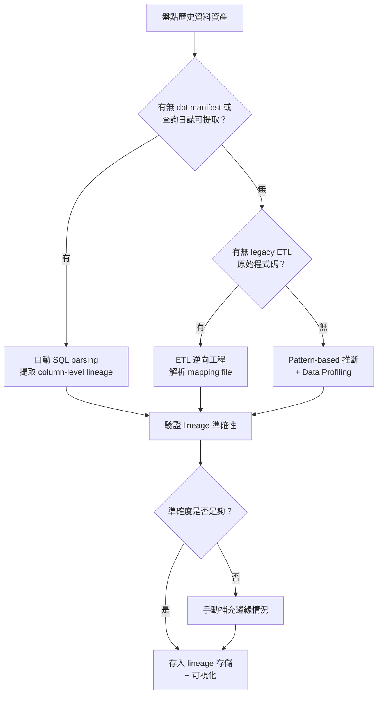

# 歷史遺留資料之 provenance 與 lineage 補登作業研究報告

## 目錄

1. 核心概念：Data Provenance 與 Data Lineage
2. 補登（Backfill）之定義與驅因
3. Legacy Data 補登策略總覽
4. 常見補登方法
5. 相關工具與框架
6. 手動、半自動、自動方式之權衡取捨
7. 資料倉儲中的 Lineage Extraction
8. 總結與建議

---

## 1. 核心概念：Data Provenance 與 Data Lineage

### 1.1 Data Provenance（資料起源）

**Data Provenance** 記錄的是資料的**起源、擁有權與鏈條（chain of custody）**——即資料「從哪裡來、由誰建立、在什麼條件下被蒐集、是否可被信任」。核心問題是：這份資料從哪裡來？我可以信任它嗎？主要使用者為稽核員、合規團隊、AI 治理負責人。[^snowflake-provenance]

### 1.2 Data Lineage（資料血緣）

**Data Lineage** 追蹤的是資料從源頭到目的地**完整歷程**——包括經過哪些系統、經歷何種轉換、餵入哪些下游資產。它是**操作性的**，回答資料「流向哪裡、如何改變」。粒度涵蓋物件級（table-level）與欄位級（column-level）。主要使用者為資料工程師、分析師、平台團隊。[^airbyte-lineage]

### 1.3 兩者之協同

成熟治理需要兩者兼備：[^snowflake-provenance]

- **Lineage 缺乏 Provenance**：你知道資料如何移動，但不知道源頭是否可信。
- **Provenance 缺乏 Lineage**：你知道源頭可信，但不知道進入平台後發生了什麼。

補登時通常需要先釐清 provenance（文件化歷史資料的原始來源），再建立 lineage（追蹤 ETL 流程與轉換邏輯）。

---

## 2. 補登（Backfill）之定義與驅因

在 provenance/lineage 脈絡下，**補登（backfill）** 指：為已存在但缺乏 provenance 與 lineage 記錄的歷史遺留資料，追溯性地建立其中繼與起源資訊。[^ovaledge-techniques]

主要驅因：

- 舊有資料系統從未設計 lineage 追蹤功能
- ETL 作業文件遺失或原始開發團隊已離職
- 合規要求（GDPR、CCPA、SOX、歐盟 AI Act）要求追溯資料來源
- AI/ML 模型需證明訓練資料的來源與處理手法
- 遷移至新平台時需了解依賴關係

---

## 3. Legacy Data 補登策略總覽

### 3.1 基本流程

1. **盤點與分類**：鑑別所有歷史資料資產，分類其 lineage 現狀（完全未知、部分已知、文件存在但過時）
2. **逆向工程**：分析 legacy ETL 程式碼、SQL 腳本、資料庫查詢歷史
3. **推斷與驗證**：使用 pattern-based 或 parsing-based 方法推斷 lineage，再以實際資料驗證
4. **存儲與可視化**：將補登結果存儲於 lineage 資料庫/圖形資料庫，提供 UI 可視化
5. **持續維護**：建立治理流程確保新的 lineage 不再缺失

### 3.2 優先級劃分

| 優先級 | 對象 | 建議方法 |
|--------|------|----------|
| **P0（最高）** | 法規報告、財務報表、AI 訓練資料 | 手動驗證 + parsing-based 雙重確認 |
| **P1** | Executive dashboards、關鍵 KPI | Parsing-based + 查詢日誌 |
| **P2** | 一般 ETL pipeline | 查詢日誌 / pattern-based |
| **P3** | 已停用/已取代的管線 | 可跳過或最低限度文件化 |

---

## 4. 常見補登方法

### 4.1 模式推斷型（Pattern-Based）

分析元數據（表名、欄位名、數據值、結構模式）來推斷 lineage，不需讀取轉換程式碼。對 legacy 系統特別有用——當無法直接解析轉換邏輯時，可透過欄位名稱比對、數值分布比對來推斷。但複雜轉換（如多層巢狀 JOIN、衍生欄位）精確度較低。[^ovaledge-techniques]

### 4.2 語法解析型（Parsing-Based / Code Scanning）

逆向工程轉換邏輯——解析 SQL、ETL 腳本、Python 程式碼。這是最精確的方法，因為跟隨實際邏輯而非推斷。能從歷史 ETL 程式碼中提取精確的 column-level lineage。限制是需支援每種語言/工具的不同 parser。[^ovaledge-techniques]

### 4.3 SQL 靜態分析（Static SQL Analysis）

收集所有歷史 ETL 中的 SQL 語句（INSERT...SELECT、CREATE TABLE AS、MERGE），使用 SQL parser（如 sqlglot、sqllineage、LineageX）解析 AST（抽象語法樹），提取 table-level 和 column-level 依賴關係。[^datahub-column-lineage]

工具範例：DataHub 的 SQL parser（基於 sqlglot，宣稱準確率 97-99%）。[^datahub-open-source]

### 4.4 ETL 逆向工程（Reverse Engineering ETL Pipeline）

解析 legacy ETL 工具的 proprietary 格式：[^dataworkers-legacy-etl]

- **Informatica**：mapping XML exports
- **SSIS**：DTSX packages
- **Talend**：job exports

新興方法是使用 AI agent 輔助解析 legacy ETL，生成 dbt model 與 Airflow DAG。

### 4.5 Git Log / 程式碼歷史分析

分析 ETL 程式碼的 Git 歷史，追蹤程式碼變更與 schema 演變。適用於原始 lineage 未記錄，但程式碼版本控制完整之場景。

### 4.6 Data Profiling（資料剖析）

透過統計分析欄位值分布、交叉表格比對來推斷 lineage。若完全無程式碼可分析時，這是唯一可行的推斷方法。[^ovaledge-benefits]

### 4.7 ML/AI 輔助推斷

使用 LLM 理解 legacy ETL 程式碼並生成 lineage 文件。AI agent（如 Data Workers、Accelyst、DeepMig）可解析 legacy pipeline 定義、生成人類可讀的文件、推斷依賴關係並進行風險評分。[^dataworkers-lineage-agent]

### 4.8 查詢日誌重播（Query Log Replay）

對資料倉儲的歷史查詢日誌進行批次解析，重建所有過去執行的 DML 語句所建立的 lineage。[^snowflake-access-history]

---

## 5. 相關工具與框架

### 5.1 OpenLineage（開放標準）

Linux Foundation 維護的開放標準，定義 lineage event 的格式與 API。此為協定而非單一工具——定義 RunEvent 模型，讓任何管線元件發出 lineage events。支援 Apache Spark、Airflow、dbt、Great Expectations 等。補登價值在於提供標準化格式，可將歷史分析結果包裝為 OpenLineage event 統一儲存。[^openlineage]

### 5.2 Marquez（OpenLineage 參考實現）

OpenLineage 的參考實現——專門的 lineage 伺服器，提供：[^marquez]

- OpenLineage-compatible REST API（接收/儲存 lineage events）
- PostgreSQL 儲存
- Web UI 查詢 lineage graph
- **Run API**：記錄每次 DAG 執行的狀態、輸入/輸出資料集

補登特點：可查詢 lineage graph 來決定哪些上游 DAG 需要 backfill，並提供 script（`backfill.sh`）自動背填下游 DAGs。[^openlineage-backfill]

### 5.3 DataHub（LinkedIn 開源元數據平台）

Apache 2.0 開源元數據平台，具備自動 column-level lineage 提取。功能包括：[^datahub-open-source]

- SQL parsing（基於 sqlglot，準確率 97-99%）
- 圖形化元數據模型（雙向 lineage graph：上游回溯 + 下游影響分析）
- 20+ 原生連接器（Snowflake、BigQuery、Redshift、dbt、Airflow、Looker、Tableau）
- OpenLineage REST endpoint 接收事件

補登價值：可從查詢歷史批次提取 lineage，補登結果可作為圖形化 lineage graph 統一查詢。[^datahub-automatic-lineage]

### 5.4 Apache Atlas

Hadoop/大數據生態系的元數據管理工具。補登適用場景為 Hadoop/Hortonworks 環境。限制為現代 data stack 整合較弱，開發速度放緩。

### 5.5 OpenMetadata

具備 lineage、cataloging、observability 的元數據平台。商業版為 Collate。

### 5.6 Pachyderm

資料版本控制 + pipeline 編排（Git-like 版本管理）。提供自動資料版本化、不可變的 lineage 記錄（immutable audit trail）、DAG 可視化。對新資料有自動 lineage，但對歷史遺留資料需額外導入流程。[^pachyderm][^atlan-pachyderm]

### 5.7 dbt 生態系工具

dbt 本身生成 `manifest.json` 包含完整 model 依賴關係和 column-level lineage：[^dbt-column-lineage]

| 工具 | 說明 |
|------|------|
| **dbt Column-Level Lineage（內建）** | dbt v2+ 在 dbt Explorer 中提供 CLL |
| **dbt-col-lineage** | PyPI 套件，提供 column-level lineage + impact analysis |
| **dbt-column-lineage-extractor** | 從 manifest.json 提取 CLL，輸出 JSON/Mermaid |
| **dbt-colibri** | CLI + self-hostable dashboard，SQLGlot 解析 |
| **dbt-fal / sqlfluff** | 程式碼分析輔助 |

### 5.8 Enterprise 商業工具

| 工具 | 特點 |
|------|------|
| **Atlan** | Modern catalog，自動 lineage，快速啟動（1-4 週） |
| **Select Star** | 自動 lineage 追蹤 |
| **Collibra** | 企業級 data governance + lineage，AI-powered extraction |
| **Informatica** | 傳統 ETL 廠商，支援 lineage |
| **Monte Carlo** | Data observability + anomaly detection + lineage |
| **OvalEdge** | Pattern-based + parsing-based，170+ connectors |
| **Datadef** | Visual documentation，design intent lineage |

### 5.9 SQL Parsing 專用工具

| 工具 | 說明 |
|------|------|
| **sqlglot** | Python SQL parser，支援多種方言（Snowflake、BigQuery 等），用於 DataHub 核心 |
| **sqllineage** | 輕量 Python 套件，static column-level lineage |
| **LineageX** | arXiv 論文之 light Python library，純 static analysis |
| **sqllens** | TypeScript SQL parser，AST → IR → semantic layer |
| **SQLFlow (Gudu)** | 商業 SQL lineage 工具，支援 Snowflake |

---

## 6. 手動、半自動、自動方式之權衡取捨

### 6.1 純手動方式

| 項目 | 說明 |
|------|------|
| **優點** | 對邊緣情況完全可控；可在自動化無法觸及的 legacy 系統中使用；合規簽核可直接引用 |
| **缺點** | 耗時、容易出錯、幾乎無法擴展；資料一變動文件就過時；需持續投入人力 |
| **補登適用性** | 僅適用於小型環境或高價值（如法規關鍵）的 legacy 管線 |

### 6.2 半自動方式（Hybrid）

| 項目 | 說明 |
|------|------|
| **做法** | 自動 parsing 為主 + 手動覆蓋邊緣情況 |
| **優點** | 兼顧廣泛覆蓋與精確性；自動化的「大量覆蓋」+ 手動的「邊緣驗證」 |
| **缺點** | 需管理兩套系統（工具 + 手動文件）；可能出現重複或不一致 |
| **補登適用性** | **最務實的 Legacy backfill 策略**——先用自動 parsing 覆蓋大部分，再用手動補足 legacy 特有邏輯 |
| **典型組合** | dbt manifest parsing（自動） + legacy SSIS mapping 文件化（手動） |

### 6.3 全自動方式

| 項目 | 說明 |
|------|------|
| **優點** | 速度最快、覆蓋完整、持續更新、零人工介入 |
| **缺點** | 需高品質 parser 支援每種工具/語言；初期 setup 耗時 |
| **補登適用性** | 有限——若無可解析的程式碼或查詢日誌，自動化無法進行。最佳場景為從查詢日誌重建 lineage |

### 6.4 綜合比較

| 維度 | 手動 | 半自動 | 全自動 |
|------|------|--------|--------|
| **準確度** | 中（人為錯誤風險） | 高（自動解析 + 人工驗證） | 中高（取決於 parser 品質） |
| **啟動時間** | 立即 | 1-4 週 | 1-12 週 |
| **可擴展性** | 極差 | 良好 | 極佳 |
| **維護成本** | 極高 | 中 | 低 |
| **Legacy 相容性** | 極佳 | 佳 | 有限 |
| **最佳適用** | 小型/高價值合規 | 多數企業環境 | 現代 data stack |

---

## 7. 資料倉儲中的 Lineage Extraction

### 7.1 Snowflake

Snowflake 提供多種 lineage 相關功能：[^snowflake-access-history]

| 功能 | 說明 |
|------|------|
| **ACCESS_HISTORY** | `SNOWFLAKE.ACCOUNT_USAGE.ACCESS_HISTORY`——記錄每次查詢讀/寫的物件與欄位。**最適合補登**，提供完美 column-level lineage（需 Enterprise Edition） |
| **QUERY_HISTORY** | `SNOWFLAKE.ACCOUNT_USAGE.QUERY_HISTORY`——SQL 語句記錄，可解析提取 table-level lineage（所有版本可用） |
| **Object Tagging** | `TAG_REFERENCES_WITH_LINEAGE`——治理標籤透過 lineage 繼承 |
| **External Lineage** | 透過 OpenLineage-compatible events 引入外部 ETL 工具的 lineage |
| **ML Lineage** | 追蹤 source tables → feature views → datasets → models → services |

**補登做法**：[^data-lineage-tool]
1. 查詢歷史 ACCESS_HISTORY 回溯至所需時間範圍
2. 對每個 query 使用 SQL parser 解析 column-level lineage
3. 將結果存儲到 lineage 存儲（DataHub/Marquez/自建圖資料庫）
4. 可參考 `cristiscu/data-lineage-tool`（GitHub）自動化此流程

### 7.2 BigQuery

- **INFORMATION_SCHEMA.JOBS**：查詢記錄，包含 SQL 語句
- **Audit Logs**：更詳細的存取記錄
- Column-level 需結合 SQL parser 解析

### 7.3 dbt

dbt 是 lineage 提取的**最佳起點**：[^dbt-column-lineage]

- `manifest.json`：每次 `dbt run` 自動生成，包含完整 model 依賴、column-level lineage、測試中繼資料
- **dbt Explorer / dbt Cloud**：UI 提供 column-level lineage 可視化
- **OpenLineage Integration**：dbt 可發出 OpenLineage events

**補登做法**：若歷史 dbt runs 的 `manifest.json` 有保留，可直接從中提取；若無，需重新 `dbt compile`（僅需 manifest，不需實際執行）。

### 7.4 通用資料倉儲補登模式

```
1. 從倉儲查詢日誌提取所有 INSERT / MERGE / CREATE TABLE AS SELECT 語句
2. 使用 sqlglot 或 OpenLineage SQL parser 解析 AST
3. 解析出 lineage edges（source -> target，包含 column mapping）
4. 去重：透過 SQL fingerprinting（標準化 SQL）
5. 寫入 lineage 存儲（PostgreSQL / Neo4j / DataHub / Marquez）
6. 可視化供使用者查詢
```

完整實作範例可參考 datadef.io 的指南。[^datadef-implement]

---

## 8. 總結與建議

### 8.1 務實的補登路徑

1. **快速啟動**：先從 **dbt manifest**（若有）和 **Snowflake/BigQuery 查詢日誌** 自動提取 lineage，這通常能覆蓋 70-80%
2. **深度挖掘**：對 legacy SSIS/Informatica pipeline，使用 **ETL 逆向工程工具**（或 AI agent）解析 mapping files
3. **填補缺口**：對無程式碼可解析的部分，使用 **pattern-based 推斷** + **手動驗證**
4. **統一存儲**：使用 **OpenLineage 標準** 格式，儲存至 **Marquez / DataHub** 或商業 lineage 平台
5. **治理嵌入**：將 lineage 檢查納入 CI/CD，確保**新資料不再需要補登**

### 8.2 關鍵要點

- **資料血緣（lineage）是關於流動與轉換**；**資料起源（provenance）是關於來源與信任**——補登時兩者都需要，但方法不同
- **自動化 parsing 是高效補登的核心**——但對 legacy 特有邏輯，需混合 pattern-based 和手動驗證
- **不要追求完美覆蓋**——先覆蓋關鍵管線（P0/P1），逐步擴展，否則補登計畫本身會因太過龐大而失敗
- **治理流程是補登成功的關鍵**——補登做完後，如果沒有治理流程確保新的 lineage 不再缺失，歷史將重演
- **工具選擇需考量升級路徑**——開源工具遲早需要升級到商業版，選擇有明確升級路徑的專案（如 DataHub Core → DataHub Cloud）

### 8.3 Mermaid：補登決策流程



---

[^snowflake-provenance]: Snowflake. (n.d.). Data Provenance vs. Data Lineage: What's the Difference? Retrieved 2026-10-03, from https://www.snowflake.com/en/data-governance/data-lineage/data-provenance/
[^airbyte-lineage]: Airbyte. (n.d.). How to Track Data Lineage in ETL Pipelines. Retrieved 2026-10-03, from https://airbyte.com/data-engineering-resources/track-data-lineage-etl-pipelines
[^ovaledge-techniques]: OvalEdge. (n.d.). Data Lineage Techniques. Retrieved 2026-10-03, from https://www.ovaledge.com/blog/data-lineage-techniques
[^ovaledge-benefits]: OvalEdge. (n.d.). Data Lineage: Definition, Benefits & Best Practices. Retrieved 2026-10-03, from https://www.ovaledge.com/blog/data-lineage-benefits
[^datahub-open-source]: DataHub. (n.d.). Open Source Data Lineage. Retrieved 2026-10-03, from https://datahub.com/blog/open-source-data-lineage/
[^datahub-column-lineage]: DataHub. (n.d.). Column-Level Lineage Comes to DataHub. Retrieved 2026-10-03, from https://datahub.com/blog/column-level-lineage-comes-to-datahub/
[^datahub-automatic-lineage]: DataHub. (n.d.). Automatic Lineage Extraction. Retrieved 2026-10-03, from https://docs.datahub.com/docs/generated/lineage/automatic-lineage-extraction
[^openlineage]: OpenLineage. (n.d.). OpenLineage Documentation v1.46.0. Retrieved 2026-10-03, from https://openlineage.io/docs/1.46.0/guides/airflow-backfill-dags/
[^openlineage-backfill]: OpenLineage. (n.d.). Backfilling Airflow DAGs Using Marquez. Retrieved 2026-10-03, from https://openlineage.io/docs/1.46.0/guides/airflow-backfill-dags/
[^marquez]: Inferensys. (n.d.). OpenLineage vs Marquez: Differences. Retrieved 2026-10-03, from https://inferensys.com/differences/ai-model-registry-and-model-bill-of-materials-platforms/ml-metadata-and-lineage-stores/openlineage-vs-marquez
[^dataworkers-legacy-etl]: Data Workers. (n.d.). Legacy ETL Modernization with AI Agents. Retrieved 2026-10-03, from https://dataworkers.io/resources/legacy-etl-modernization/
[^dataworkers-lineage-agent]: Data Workers. (n.d.). Lineage Agent for Column-Level Capture. Retrieved 2026-10-03, from https://dataworkers.io/resources/lineage-agent-column-level-capture/
[^dbt-column-lineage]: dbt Labs. (n.d.). Column-Level Lineage in dbt Explorer. Retrieved 2026-10-03, from https://docs.getdbt.com/docs/explore/column-level-lineage
[^snowflake-access-history]: Snowflake. (n.d.). Access History in Snowflake. Retrieved 2026-10-03, from https://docs.snowflake.com/en/user-guide/access-history
[^pachyderm]: Pachyderm. (n.d.). Pachyderm GitHub Repository. Retrieved 2026-10-03, from https://github.com/pachyderm/pachyderm
[^atlan-pachyderm]: Atlan. (n.d.). Pachyderm Data Lineage: A Deep Dive. Retrieved 2026-10-03, from https://atlan.com/pachyderm-data-lineage/
[^data-lineage-tool]: Cristiscu. (n.d.). Data Lineage Tool. Retrieved 2026-10-03, from https://github.com/cristiscu/data-lineage-tool
[^datadef-implement]: Datadef. (n.d.). How to Implement Data Lineage. Retrieved 2026-10-03, from https://datadef.io/guides/en/how-to-implement-data-lineage