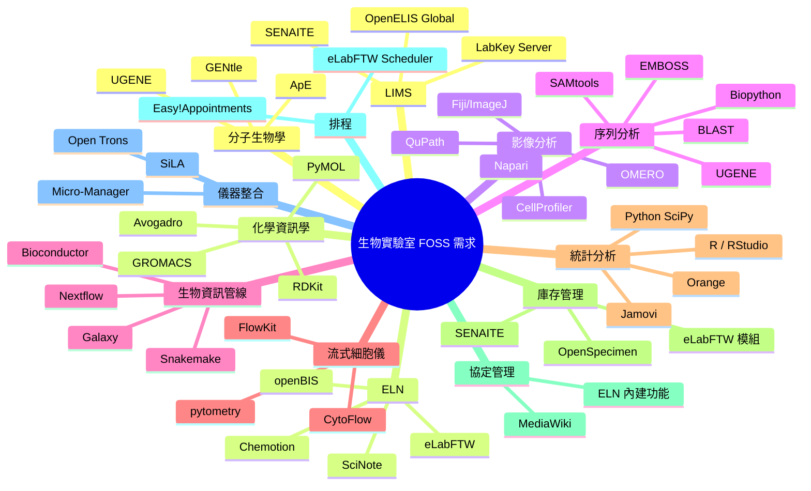

# 生物實驗室全面採用自由開源軟體（FOSS）之需求分析

## 摘要

本報告旨在系統性地盤點一個生物實驗室若完全採用自由開源軟體（Free and Open Source Software, FOSS）來處理所有營運與研究工作，將會面臨哪些類型的需求，以及各需求類別中可供選擇的主要 FOSS 解決方案。報告涵蓋實驗室資訊管理、電子實驗筆記本、生物影像分析、序列分析、生物資訊學流程、流式細胞儀分析、統計分析、庫存管理、協定管理、排程、儀器整合、分子生物學工具、化學資訊學、臨床資料管理等範疇。

## 1. 實驗室資訊管理系統（LIMS）

**需求說明：** 樣本追蹤、工作流程管理、條碼掃描、儀器資料整合、稽核軌跡、品質控制/品質保證、ISO 15189／ISO 17025 認證支援。

**主要 FOSS 解決方案：**

- **OpenELIS Global**：專為公共衛生與臨床實驗室設計的全功能 LIMS，部署於 26+ 國家，服務 1,870 萬+ 病人。原生支援 FHIR R4、HL7 協定，具備 Westgard 品質管制圖、試劑庫存管理、角色權限控制、AES-256 加密。[^openelis]
- **SENAITE**：源自 Bika LIMS 的 Python/Plone 架構 LIMS，內建 ISO/IEC 17025 品質流程控制、儀器資料自動匯入、RESTful API。[^senaite]
- **LabKey Server**：Apache 2.0 授權的 LIMS + ELN 混合平台，整合樣本管理、分析流程、電子資料捕獲，廣泛用於生物科技與製藥實驗室。[^labkey]

## 2. 電子實驗筆記本（ELN）

**需求說明：** 取代紙本筆記本，具備時間戳記、全文檢索、協作編輯、實驗記錄、儀器資料匯入、法規符合性（如 21 CFR Part 11）。

**主要 FOSS 解決方案：**

- **eLabFTW**：目前最受歡迎的開源 ELN（AGPL v3 授權）。具備 RFC 3161 信任時間戳記、庫存管理、預約排程、化合物資料庫（PubChem 整合）、21 CFR Part 11 功能。以 Docker 部署，512 MB RAM 即可運行。[^elabftw]
- **openBIS**：ETH Zurich 開發的 ELN + LIMS 混合平台，強調 FAIR 資料原則，支援 Jupyter 整合、大數據連結（BigDataLink）、API 延伸。[^openbis]
- **Chemotion ELN**：德國 KIT 開發的化學領域 ELN，內建化學結構繪製與有機合成工作流程。[^chemotion]
- **SciNote ELN**：Mozilla Public License v2.0 授權，專為生命科學設計的 ELN，具備模組化附加系統。[^scinote]

## 3. 生物影像分析（Bioimage Analysis）

**需求說明：** 細胞計數、影像分割、螢光定量、3D 重建、共定位分析、高通量篩選、病理影像分析。

**主要 FOSS 解決方案：**

- **Fiji/ImageJ**：科學影像處理的黃金標準，支援數百種外掛（分割、追蹤、3D 渲染、自動化巨集），透過 Bio-Formats 支援所有主流顯微鏡格式。[^fiji]
- **CellProfiler**：Broad Institute 開發的高通量細胞影像分析管線，不需程式背景即可建立自動化分析流程，支援 GPU 加速深度學習。[^cellprofiler]
- **QuPath**：專為數位病理學與全切片影像設計，原生處理 SVS/NDPI 格式，內建深度學習分類器。[^qupath]
- **Napari**：Python 生態系的多維度影像快速視覺化工具，支援外掛與 scikit-image 整合。[^napari]
- **Ilastik**：互動式機器學習影像分類與分割工具，不需撰寫程式。[^ilastik]
- **OMERO**：顯微鏡影像管理伺服器，支援以 web 方式管理、視覺化、分享影像，可與 Fiji、QuPath、CellProfiler 整合。[^omero]

## 4. DNA／蛋白質序列分析

**需求說明：** 序列比對、BLAST 搜尋、引子設計、基因體組裝、變異位點偵測、親緣分析、motif 搜尋。

**主要 FOSS 解決方案：**

- **BLAST**：NCBI 的序列相似性搜尋標準工具。[^blast]
- **EMBOSS**：歐洲分子生物學開放軟體套裝，包含約 200 個序列分析工具。[^emboss]
- **Biopython**：Python 生物運算工具組，支援序列 I/O、BLAST 解析、GenBank 存取。[^biopython]
- **UGENE**：整合式生物資訊學桌面環境，內建多重序列比對（ClustalW/O, MUSCLE, MAFFT）、引子設計（Primer3）、限制酶分析、NGS 組裝瀏覽、親緣樹建構。[^ugene]
- **SAMtools／BCFtools**：高通量定序資料（SAM/BAM 格式）處理與變異位點偵測的核心工具。[^samtools]
- **BEDtools**：基因體區間運算工具集，用於交集、合併、計數等基因體算術操作。[^bedtools]

## 5. 生物資訊學流程管理（Bioinformatics Pipelines）

**需求說明：** 建立可再現、可擴充的分析流程，處理 NGS 資料，串接多個生物資訊工具。

**主要 FOSS 解決方案：**

- **Galaxy**：網頁式資料密集生物學平台，8,500+ 工具、拖曳式工作流程建立，不需程式背景。最大公開伺服器 usegalaxy.org 每日服務大量使用者。[^galaxy]
- **Nextflow** + **nf-core**：領域特定語言（DSL）的工作流程管理器。nf-core 提供 100+ 條經過驗證的生產級流程（RNA-seq、ChIP-seq、變異位點偵測等）。[^nextflow]
- **Snakemake**：Python 語法的工作流程管理系統。[^snakemake]
- **CWL (Common Workflow Language)**：可攜式工作流程描述標準。[^cwl]
- **Bioconductor**：R 語言的生物資訊學套件集，提供數千個基因組分析套件。[^bioconductor]

## 6. 流式細胞儀分析（Flow Cytometry）

**需求說明：** FCS 檔案匯入、設門（gating）、細胞群辨識、長條圖、統計分析、叢集辨識。

**主要 FOSS 解決方案：**

- **FlowKit**：Python 套件，定位為 FlowJo 的開源替代方案。支援 GatingML 2.0、FlowJo workspace（.wsp）相容性。[^flowkit]
- **CytoFlow**：以貝氏統計為核心的流式細胞儀分析 Python 套件，使用貝氏高斯混合模型進行自動設門。[^cytoflow]
- **pytometry**：scverse 生態系成員，將 .fcs 檔案直接讀入 AnnData 物件，可與單細胞 RNA-seq 分析無縫銜接。[^pytometry]
- **Flowing Software**：具 GUI 的開放式流式細胞儀分析工具。[^flowing]
- **Bioconductor flow 系列套件**（flowCore、flowClust 等）：R 語言的流式細胞儀分析工具。[^bioconductor]

## 7. 統計分析

**需求說明：** 假設檢定、回歸分析、繪圖、t 檢定、ANOVA、多變量分析、存活分析、可再現報告。

**主要 FOSS 解決方案：**

- **R** + **RStudio（Posit）**：統計分析的主導語言及其整合開發環境。Bioconductor 等數千個生物統計套件皆基於 R。[^r]
- **Python 科學運算生態系**（SciPy、NumPy、pandas、statsmodels）：完整的統計計算棧。[^scipy]
- **Jamovi**：基於 R 的 GUI 統計分析工具，定位為 SPSS 與 GraphPad Prism 的免費替代。[^jamovi]
- **Orange**：視覺化程式設計的資料探勘與機器學習工具。[^orange]
- **Jupyter**：可再現分析的互動式筆記本。[^jupyter]
- **PSPP**：SPSS 的免費替代。[^pspp]

## 8. 實驗室庫存管理（Inventory Management）

**需求說明：** 追蹤試劑、耗材、樣本、冷凍儲存位置、有效期限、庫存量、訂購管理。

**主要 FOSS 解決方案：**

- **eLabFTW**（內建庫存模組）：庫存管理與 ELN 整合，可管理質體、化學品、抗體、細胞株。[^elabftw]
- **OpenSpecimen**：生物樣本庫管理，追蹤樣本來源與衍生物。[^openspecimen]
- **SENAITE**：內建庫存管理與試劑即時監控。[^senaite]

## 9. 協定管理（Protocol Management）

**需求說明：** 建立、儲存、分享、版本控管實驗操作步驟與標準作業程序（SOP）。

**主要 FOSS 解決方案：**

- **MediaWiki**（或 BookStack）：以 Wiki 形式管理協定，搭配版本控管。[^mediawiki]
- 多數 ELN 系統（eLabFTW、openBIS、Chemotion）皆內建協定管理功能。[^elabftw]

## 10. 實驗室排程（Scheduling）

**需求說明：** 預約儀器使用時段、管理共同設備、實驗室成員行事曆。

**主要 FOSS 解決方案：**

- **Easy!Appointments**：網頁式預約排程系統。[^easyappointments]
- **eLabFTW Scheduler**：內建於 eLabFTW 的儀器排程功能。[^elabftw]

## 11. 實驗室儀器整合（Equipment Integration）

**需求說明：** 串接微量盤讀取器、熱循環器、序列分析儀等儀器至中央資料系統，自動化資料收集。

**主要 FOSS 解決方案：**

- **Micro-Manager**：顯微鏡控制與自動化軟體（LGPL 授權），可作為 ImageJ/Fiji 外掛。[^micromanager]
- **Open Trons**：開放原始碼液體處理機器人（硬體與軟體皆開源）。[^opentrons]
- **SiLA 標準**：實驗室自動化裝置通訊開放標準。[^sila]
- **LabKey Server**：支援儀器資料整合與自動化擷取。[^labkey]

## 12. 分子生物學工具（Molecular Biology Tools）

**需求說明：** 虛擬選殖、引子設計、限制酶圖譜、質體地圖繪製、瓊凝膠模擬。

**主要 FOSS 解決方案：**

- **UGENE**：內建引子設計、選殖模擬、限制酶分析。[^ugene]
- **ApE**（A plasmid Editor）：DNA 序列編輯器、質體地圖繪製。[^ape]
- **GENtle**：DNA 序列分析與編輯（類似 Vector NTI 的開源替代）。[^gentle]

## 13. 化學資訊學與分子模擬（Cheminformatics & Molecular Modeling）

**需求說明：** 分子可視化、分子對接、分子動態模擬、化學資料庫搜尋。

**主要 FOSS 解決方案：**

- **RDKit**：最主流的開源化學資訊學工具包，支援分子指紋、子結構搜尋、構形生成。[^rdkit]
- **PyMOL**（開源版本）：蛋白質與核酸分子 3D 可視化，發表級圖片產出。[^pymol]
- **Avogadro**：跨平台分子編輯器與可視化工具。[^avogadro]
- **AutoDock Vina**：分子對接預測工具。[^autodock]
- **GROMACS**：分子動態模擬引擎，適用於蛋白質、脂質、核酸模擬。[^gromacs]
- **Open Babel**：化學檔案格式轉換（支援 140+ 格式）。[^openbabel]

## 14. 資料整合平台

**需求說明：** 集中化資料儲存、多體學資料整合、團隊協作、資料分享。

**主要 FOSS 解決方案：**

- **LabKey Server**：Apache 2.0 授權，整合 LIMS、ELN、樣本管理、分析流程。[^labkey]
- **Galaxy**：資料密集生物學的整合平台。[^galaxy]
- **InterMine**：生物資料倉儲系統，支援多資料來源整合與查詢。[^intermine]
- **OMERO**：顯微鏡影像資料管理平台。[^omero]

## 15. 需求分類總覽圖

## 16. 選擇策略建議

根據實驗室類型的不同，優先需求與建議方案各有側重：

- **臨床診斷／公共衛生實驗室**：OpenELIS Global 為首選，具備 FHIR 原生支援、國家級規模部署實績、法規認證完備。
- **學術研究實驗室**：eLabFTW（輕量 ELN + 庫存）搭配 Galaxy 或 Nextflow（生物資訊管線）為常見組合。
- **生技／製藥實驗室**：LabKey Server（LIMS + ELN + 分析整合）提供最全面的解決方案。
- **核心設施／跨領域研究中心**：openBIS 以 FAIR 資料原則為核心，適合需要詳細 metadata 管理的環境。
- **以影像為主的實驗室**：Fiji/ImageJ + CellProfiler + OMERO 構成完整的影像擷取、分析、管理棧。
- **以計算為主的實驗室**：Jupyter + R/Python 生態系 + Nextflow/Galaxy 為資料分析與管線管理的核心。

## 參考文獻

[^openelis]: OpenELIS Global. (n.d.). Features and Functionality. Retrieved 2026-10-03, from https://openelis-global.org/features-and-functionality/
[^senaite]: SENAITE. (n.d.). SENAITE LIMS. Retrieved 2026-10-03, from https://www.senaite.com/
[^labkey]: LabKey. (n.d.). LabKey Server Platform. Retrieved 2026-10-03, from https://www.labkey.com/
[^elabftw]: eLabFTW. (n.d.). eLabFTW — Electronic Lab Notebook. Retrieved 2026-10-03, from https://www.elabftw.net/
[^openbis]: openBIS. (n.d.). Open Biology Information System. Retrieved 2026-10-03, from https://openbis.ch/
[^chemotion]: Chemotion ELN. (n.d.). Chemotion — Electronic Lab Notebook. Retrieved 2026-10-03, from https://chemotion.net/
[^scinote]: SciNote. (n.d.). Open Source ELN. Retrieved 2026-10-03, from https://www.scinote.net/open-source-code/
[^fiji]: Fiji. (n.d.). Fiji Is Just ImageJ. Retrieved 2026-10-03, from https://en.wikipedia.org/wiki/Fiji_(software)
[^cellprofiler]: CellProfiler. (n.d.). CellProfiler — Cell Image Analysis Software. Retrieved 2026-10-03, from https://en.wikipedia.org/wiki/CellProfiler
[^qupath]: QuPath. (n.d.). QuPath — Open Source Software for Digital Pathology. Retrieved 2026-10-03, from https://qupath.github.io/
[^napari]: napari. (n.d.). napari — Multi-dimensional Image Viewer for Python. Retrieved 2026-10-03, from https://napari.org/
[^ilastik]: ilastik. (n.d.). ilastik — Interactive Machine Learning for Bioimage Analysis. Retrieved 2026-10-03, from https://ilastik.org/
[^omero]: OME. (n.d.). OMERO — Open Microscopy Environment. Retrieved 2026-10-03, from https://www.openmicroscopy.org/omero/
[^blast]: NCBI. (n.d.). BLAST — Basic Local Alignment Search Tool. Retrieved 2026-10-03, from https://blast.ncbi.nlm.nih.gov/
[^emboss]: EMBOSS. (n.d.). European Molecular Biology Open Software Suite. Retrieved 2026-10-03, from https://en.wikipedia.org/wiki/EMBOSS
[^biopython]: Biopython. (n.d.). Biopython — Python Tools for Computational Biology. Retrieved 2026-10-03, from https://biopython.org/
[^ugene]: UGENE. (n.d.). UGENE — Integrated Bioinformatics Tools. Retrieved 2026-10-03, from https://ugene.net/
[^samtools]: SAMtools. (n.d.). SAMtools — Utilities for SAM/BAM format. Retrieved 2026-10-03, from https://en.wikipedia.org/wiki/SAMtools
[^bedtools]: BEDtools. (n.d.). BEDtools — Genome Arithmetic. Retrieved 2026-10-03, from https://bedtools.readthedocs.io/
[^galaxy]: Galaxy. (n.d.). Galaxy — Data-Intensive Biology Platform. Retrieved 2026-10-03, from https://galaxyproject.org/
[^nextflow]: Nextflow. (n.d.). Nextflow — Scalable Scientific Workflows. Retrieved 2026-10-03, from https://nextflow.io/
[^snakemake]: Snakemake. (n.d.). Snakemake — Python Workflow Management. Retrieved 2026-10-03, from https://snakemake.github.io/
[^cwl]: CWL. (n.d.). Common Workflow Language. Retrieved 2026-10-03, from https://www.commonwl.org/
[^bioconductor]: Bioconductor. (n.d.). Bioconductor — Open Source Bioinformatics. Retrieved 2026-10-03, from https://bioconductor.org/
[^flowkit]: FlowKit. (n.d.). FlowKit — Python Flow Cytometry Toolkit. Retrieved 2026-10-03, from https://flowkit.github.io/
[^cytoflow]: CytoFlow. (n.d.). CytoFlow — Bayesian Flow Cytometry Analysis. Retrieved 2026-10-03, from https://cytoflow.github.io/
[^pytometry]: pytometry. (n.d.). pytometry — Flow Cytometry in scverse. Retrieved 2026-10-03, from https://pytometry.readthedocs.io/
[^flowing]: Flowing Software. (n.d.). Flowing — Open Source Flow Cytometry Analysis. Retrieved 2026-10-03, from https://flowingsoftware.com/
[^r]: R Project. (n.d.). R — Statistical Programming Language. Retrieved 2026-10-03, from https://www.r-project.org/
[^scipy]: SciPy. (n.d.). SciPy — Scientific Computing in Python. Retrieved 2026-10-03, from https://scipy.org/
[^jamovi]: Jamovi. (n.d.). Jamovi — Statistical Analysis Desktop Application. Retrieved 2026-10-03, from https://jamovi.org/
[^orange]: Orange. (n.d.). Orange — Data Mining Toolbox. Retrieved 2026-10-03, from https://orangedatamining.com/
[^jupyter]: Project Jupyter. (n.d.). Jupyter — Interactive Computing. Retrieved 2026-10-03, from https://jupyter.org/
[^pspp]: GNU PSPP. (n.d.). PSPP — Statistical Analysis. Retrieved 2026-10-03, from https://www.gnu.org/software/pspp/
[^openspecimen]: OpenSpecimen. (n.d.). OpenSpecimen — Biobanking Software. Retrieved 2026-10-03, from https://openspecimen.org/
[^mediawiki]: MediaWiki. (n.d.). MediaWiki — Wiki Software. Retrieved 2026-10-03, from https://www.mediawiki.org/
[^easyappointments]: Easy!Appointments. (n.d.). Easy!Appointments — Open Source Scheduling. Retrieved 2026-10-03, from https://easyappointments.org/
[^micromanager]: Micro-Manager. (n.d.). Micro-Manager — Microscope Control Software. Retrieved 2026-10-03, from https://micro-manager.org/
[^opentrons]: OpenTrons. (n.d.). OpenTrons — Open Source Lab Automation. Retrieved 2026-10-03, from https://opentrons.com/
[^sila]: SiLA. (n.d.). SiLA — Standardization in Lab Automation. Retrieved 2026-10-03, from https://sila-standard.com/
[^ape]: ApE. (n.d.). A plasmid Editor. Retrieved 2026-10-03, from https://jorgensen.biology.ucsd.edu/ape/
[^gentle]: GENtle. (n.d.). GENtle — DNA Sequence Analysis Software. Retrieved 2026-10-03, from https://gentle.magnusmanske.de/
[^rdkit]: RDKit. (n.d.). RDKit — Cheminformatics Toolkit. Retrieved 2026-10-03, from https://rdkit.org/
[^pymol]: PyMOL. (n.d.). PyMOL — Molecular Visualization System. Retrieved 2026-10-03, from https://pymol.org/
[^avogadro]: Avogadro. (n.d.). Avogadro — Cross-Platform Molecular Editor. Retrieved 2026-10-03, from https://avogadro.cc/
[^autodock]: AutoDock Vina. (n.d.). AutoDock Vina — Molecular Docking. Retrieved 2026-10-03, from https://vina.scripps.edu/
[^gromacs]: GROMACS. (n.d.). GROMACS — Molecular Dynamics Simulation. Retrieved 2026-10-03, from https://www.gromacs.org/
[^openbabel]: Open Babel. (n.d.). Open Babel — Chemical File Format Conversion. Retrieved 2026-10-03, from https://openbabel.org/
[^intermine]: InterMine. (n.d.). InterMine — Biological Data Warehouse. Retrieved 2026-10-03, from https://intermine.org/