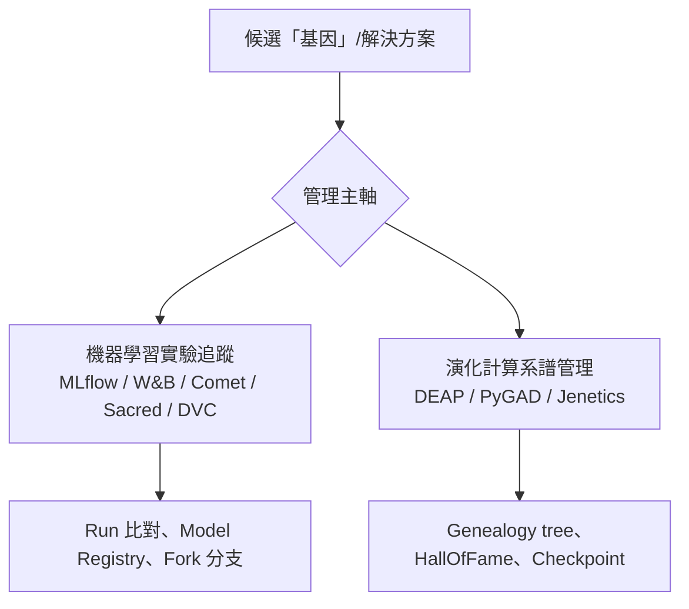
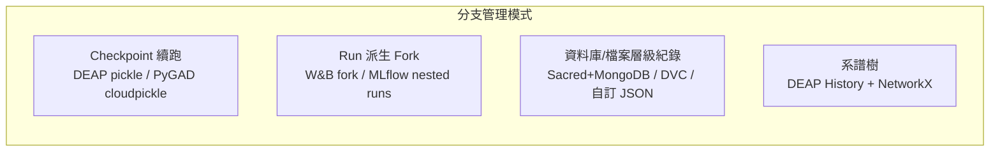

# 機器學習與基因演算法的「基因」迭代管理：工具與實務做法

## 摘要

處理機器學習（Machine Learning）與基因演算法（Genetic Algorithm, GA）的學者或工程師，在面對大量「候選解決方案」（candidate solutions）、超參數組合或演化種群（population）時，需要一套能記錄、比對、版本化並回溯不同迭代（iteration）與分支（branch）的方法。本報告整理兩大領域的成熟實務：機器學習側以「實驗追蹤平台」（experiment tracking） 為主，強調跨 run 的比對與模型版本化；演化計算側則以「系譜追蹤」（genealogy）與「檢查點」（checkpoint）為主，強調單一演化軌跡內個體的親緣關係與可續跑性。兩者雖目標相近，卻演化出截然不同的工具慣例。



## 一、核心概念的兩條管理路線

「基因」在不同脈絡下有不同所指。在基因演算法中，「基因」通常是染色體（chromosome）上的最小單元，而「個體」（individual）是完整解決方案；在機器學習中，「基因」常被類比為「一組超參數配置」或「一次訓練 run 的權重」。這兩種理解各自催生出不同的管理工具與慣例[^deap-overview][^ml-track]。

- **演化計算路線**：以 **DEAP** 為代表性框架，把「種群」（population）視為個體的串列，每個個體帶有 fitness。管理核心是跨世代的統計（Logbook）、歷史最優（HallOfFame）與完整親緣樹（genealogy tree）[^deap-tools]。
- **機器學習路線**：以 **MLflow**、**Weights & Biases（W&B）**、**Comet** 等平台為代表，把每次執行視為一個 **run**，run 內記錄參數、指標與產物（artifact），強調跨 run 的搜尋與比對[^mlflow-tracking][^wandb]。

## 二、機器學習的實驗追蹤：run 層級的管理

機器學習工程師最常使用的工具以「run」為管理單位，並提供視覺化比對與模型登錄（registry）功能。

### 2.1 MLflow

MLflow 是開源且被廣泛採用的解決方案（GitHub 約 28.3k stars[^mlflow-gh]）。其 Tracking 元件以 **Run** 為核心，Run 再歸屬於 **Experiment**；每個 Run 記錄參數、指標、程式碼版本與產物（artifacts，如權重檔）[^mlflow-tracking]。後端儲存支援檔案系統（`mlruns/`）或資料庫（PostgreSQL、MySQL、SQLite），產物可存放於本機或 S3 等物件儲存[^mlflow-tracking]。其 Model Registry 提供模型版本化與階段管理（Staging → Production → Archived）[^mlflow-tracking]。

針對「分支」概念，MLflow 支援 **巢狀 run（nested runs）**，即一個父 run 下可掛多個子 run，以近似模型的實驗分支樹[^wandb-fork]。

### 2.2 Weights & Biases（W&B）

W&B（現屬 CoreWeave Forge，GitHub 約 11.3k stars[^wandb-gh]）提供 run 追蹤、超參數 sweep、artifact 版本化與集中式儀表板[^wandb]。其最接近「git 分支」的功能是 **run forking**：可從某個 run 的指定 step 派生新 run，新 run 會繼承來源 run 截至該 step 的歷史與檔案：

```python
wandb.init(
    project="<project>",
    fork_from=f"{source_run_id}?_step={fork_step}",
)
```

另有 **rewind** 操作可將 run 回溯到某 step 而維持相同 run ID[^wandb-fork]。這在 ML 工具中是與基因演算法「從某世代繼續演化」最可類比的功能。

### 2.3 Sacred

Sacred（IDSIA，GitHub 約 1.5k stars[^sacred-gh]）以設定、組織、紀錄與重現實驗為主，採用 **Config Scope** 與 **Config Injection** 機制[^sacred].它會自動記錄執行時的 git commit hash 與 workspace 是否乾淨（dirty），確保可重現性[^sacred-observer]。結果預設寫入 **MongoDB**，也支援 FileStorageObserver、SQLObserver 與 TinyDBObserver[^sacred-observer]。

### 2.4 DVC

DVC（Data Version Control）被稱為「Git for data」，把大型資料與模型用 Git 搭配管理。資料存放於以 hash 為鍵（content-addressable）的快取中，Git 只追蹤輕量的 `.dvc` 中繼檔。其實驗管理功能（`dvc exp run`、`dvc exp show`、`dvc exp diff`）可用於追蹤不同參數的實驗結果[^dvc-exp]。

### 2.5 TensorBoard

TensorBoard 提供指標視覺化（scalars、histograms）。其輸出格式包括以 newline-delimited JSON 儲存的 scalars、以 **Numpy .npz** 壓縮檔儲存的 tensors，以及以 binary `.bin`（GraphDef protocol buffer）儲存的 blobs[^tensorboard]。

## 三、演化計算的系譜管理：世代層級的管理

基因演算法的學者則更關注「單一個體的出身與親緣」，而非 run 層級的比對。

### 3.1 DEAP — 最完整的系譜工具

DEAP（Distributed Evolutionary Algorithms in Python，GitHub 約 6.4k stars[^deap-gh]）提供多個內建機制管理跨世代的軌跡[^deap-tools]：

- **Logbook**：依世代順序的字典串列，記錄各世代的族群統計（avg、max、min、std），並支援多目標的 chapters[^deap-part3]。
- **HallOfFame**：保留「曾存在於任何世代」的最佳個體，而非僅目前世代，避免好解在演化後期被洗掉[^deap-tools]。
- **History**：完整系譜類別，自動透過 mate/mutate 的 decorator 記錄親子關係，內含兩個屬性[^deap-history]：
  - `genealogy_tree`：以「個體索引 → 父母索引」組成的字典，相容 **NetworkX**，可直接繪製演化樹。
  - `genealogy_history`：以個體編號為鍵的完整個體紀錄。
  - `getGenealogy(individual, max_depth)` 可取得特定個體在給定深度內的家譜。
- **Checkpointing**：官方教學示範用 `pickle` 將整個演化狀態（種群、目前世代、HallOfFame、Logbook、亂數狀態）序列化成單一字典，可從當下狀態精確續跑[^deap-checkpoint]。

```python
cp = dict(population=population, generation=gen, halloffame=halloffame,
          logbook=logbook, rndstate=random.getstate())
with open("checkpoint_name.pkl", "wb") as cp_file:
    pickle.dump(cp, cp_file)
```

DEAP 官方明確提到其產出「與 NetworkX 相容的演化系譜」，這是多數 ML 追蹤工具所沒有的能力[^deap-overview]。

### 3.2 PyGAD

PyGAD（GitHub 約 2.2k stars[^pygad-gh]）主打以 NumPy 為核心的輕量 GA，內建 `save(filename)` / `load(filename)` 以 **cloudpickle** 完整儲存 GA 實例[^pygad-doc].其內建屬性直接保存各種演化痕跡：`population`、`initial_population`、`best_solutions`、`solutions`（全部世代的解）、`solutions_fitness` 等[^pygad-doc]。也提供 `on_generation` 等生命週期回呼，讓使用者自行在指定階段做 custom checkpoint[^pygad-doc]。

### 3.3 Jenetics

Jenetics（Java）明確區分 **Gene → Chromosome → Genotype → Phenotype → Population** 的層次[^jenetics]。其 `Engine<G,C>` 產生 `EvolutionStream`（Java Stream API），可對演化過程做 lazily 的逐步處理，並以 `EvolutionResult.toBestGenotype()` 收集最佳結果[^jenetics]。`jenetics.xml` 模組提供 Genotype/Chromosome/Gene 的 XML 序列化[^jenetics-gh]。

### 3.4 Inspyred

Inspyred（GitHub 約 202 stars[^inspyred-pypi]）並未內建如 PyGAD/DEAP 那般的 save/load 功能，主要透過 **Observers**（每代後呼叫）與 **Terminators**（停止條件）機制，讓使用者以自訂 observer 實作檢查點[^inspyred-pypi]。因 star 數偏低，僅列作對照參考。

## 四、跨領域「分支」的幾種實作方式

綜合兩大領域，對「不同迭代的分支」的管理大致可歸納為四種模式，對應不同的工具慣例：



| 模式 | 代表工具 | 解決的問題 |
|---|---|---|
| Checkpoint 續跑 | DEAP、PyGAD | 從某世代狀態精確重啟，等同「從迭代中點分支」[^deap-checkpoint][^pygad-doc] |
| Run 派生 Fork | W&B、MLflow | 從某 run 的 step 派生新 run，ML 側最接近 git branch[^wandb-fork] |
| 檔案/資料庫紀錄 | Sacred、DVC、自訂 | 以 JSON/SQL/MongoDB 保存每次嘗試的設定與結果[^sacred-observer][^dvc-exp] |
| 系譜樹 | DEAP + NetworkX | 記錄個體親緣與 fitness 軌跡，視覺化演化樹[^deap-history] |

## 五、常用的資料儲存格式

實務上「基因」的儲存格式會依規模與可讀性需求而不同[^pygad-doc][^sacred-observer][^mlflow-tracking]：

| 格式 | 優點 | 常見使用者 |
|---|---|---|
| Pickle / Cloudpickle | 直接保存 Python 物件（含 lambda、函式） | DEAP（pickle）、PyGAD（cloudpickle） |
| NumPy `.npy` / `.npz` | I/O 快、節省記憶體、支援壓縮 | PyGAD 內部種群儲存 |
| JSON | 人類可讀、跨語言、版本友善 | Sacred（config.json、run.json） |
| SQL 資料庫 / SQLite | 可查詢、支援增量紀錄 | Sacred（SQLObserver）、MLflow |
| MongoDB | 查詢強、文件結構貼合實驗層次 | Sacred（MongoObserver，官方建議）、W&B |
| HDF5 | 大型數值陣列、支援壓縮與中繼資料 | 大型演化計算之研究團隊 |
| Content-addressable 快取 | 以 hash 為鍵去重、可複現 | DVC |

## 六、文獻脈絡與缺口

值得注意的是，**幾乎沒有文獻或成熟實務建議直接以「git branch」去版本化 GA 單一世代或單一基因**。原因在於 git 以「檔案層級的 diff 有向無環圖（DAG）」建模，而演化種群是每個世代都會大幅改變的二維陣列（pop_size × num_genes），兩者抽象層次不符[^ml-track]。實務上的版本化多落在 **run / 實驗** 層級，而非 **個體 / 基因** 層級。

另一方面，演化計算社群擁有 ML 追蹤工具所欠缺的 **系譜/親緣** 能力（DEAP History + NetworkX），而 ML 工具則在 **模型版本化、registry 與部署管線** 上更成熟[^deap-overview][^mlflow-tracking]。兩套慣例可視為同一需求的兩種分工，若要同時管理「演化個體的親緣」與「實驗層級的版本」，實務上常需自行整合（例如將 DEAP 檢查點與 MLflow artifact 併用）。

## 結語

處理「基因」迭代與分支管理的實務，依領域而有清晰分工：機器學習工程師偏向 **MLflow / W&B / Comet / Sacred / DVC** 等 run 層級追蹤平台，強調跨 run 比對、fork 分支與模型 registry；基因演算法學者與工程師則偏向 **DEAP / PyGAD / Jenetics** 等演化框架，強調 Logbook 統計、HallOfFame、checkpoint 續跑與 NetworkX 系譜樹。真正的「分支基因管理」通常以「從特定世代檢查點續跑」或「從特定 run 派生新 run」的形式落實，而非以檔案版本控制器逐基因管理。

---

## 參考文獻

[^deap-overview]: DEAP. (n.d.). *DEAP - Distributed Evolutionary Algorithms in Python*. Retrieved 2026-10-01, from https://deap.readthedocs.io/en/master/overview.html

[^deap-tools]: DEAP. (n.d.). *DEAP Tools API — Statistics, HallOfFame, Logbook, History*. Retrieved 2026-10-01, from https://deap.readthedocs.io/en/master/api/tools.html

[^deap-part3]: DEAP. (n.d.). *Logging Statistics Tutorial*. Retrieved 2026-10-01, from https://deap.readthedocs.io/en/master/tutorials/basic/part3.html

[^deap-checkpoint]: DEAP. (n.d.). *Checkpointing Tutorial*. Retrieved 2026-10-01, from https://deap.readthedocs.io/en/master/tutorials/advanced/checkpoint.html

[^deap-history]: DEAP. (n.d.). *deap.tools.History*. Retrieved 2026-10-01, from https://deap.readthedocs.io/en/master/api/tools.html#deap.tools.History

[^deap-gh]: DEAP (n.d.). *deap/deap*. Retrieved 2026-10-01, from https://github.com/DEAP/deap

[^mlflow-tracking]: MLflow. (n.d.). *MLflow Tracking*. Retrieved 2026-10-01, from https://www.mlflow.org/docs/latest/ml/tracking.html

[^mlflow-gh]: MLflow. (n.d.). *mlflow/mlflow*. Retrieved 2026-10-01, from https://github.com/mlflow/mlflow

[^wandb]: Weights & Biases. (n.d.). *W&B Documentation*. Retrieved 2026-10-01, from https://docs.wandb.ai/

[^wandb-fork]: Weights & Biases. (n.d.). *Forking runs*. Retrieved 2026-10-01, from https://docs.wandb.ai/guides/runs/forking

[^wandb-gh]: Weights & Biases. (n.d.). *wandb/wandb*. Retrieved 2026-10-01, from https://github.com/wandb/wandb

[^sacred]: IDSIA. (n.d.). *Sacred — Configure, Organize, Log and Reproduce Experiments*. Retrieved 2026-10-01, from https://github.com/IDSIA/sacred

[^sacred-observer]: Sacred. (n.d.). *Observer Documentation*. Retrieved 2026-10-01, from https://sacred.readthedocs.io/en/stable/observers.html

[^sacred-gh]: IDSIA. (n.d.). *IDSIA/sacred*. Retrieved 2026-10-01, from https://github.com/IDSIA/sacred

[^dvc-exp]: DVC. (n.d.). *Experiment Management*. Retrieved 2026-10-01, from https://docs.dvc.org/user-guide/experiment-management

[^tensorboard]: TensorBoard. (n.d.). *TensorBoard.dev*. Retrieved 2026-10-01, from https://tensorboard.dev/

[^pygad-gh]: Ahmed F. Gad. (n.d.). *ahmedfgad/GeneticAlgorithmPython (PyGAD)*. Retrieved 2026-10-01, from https://github.com/ahmedfgad/GeneticAlgorithmPython

[^pygad-doc]: PyGAD. (n.d.). *PyGAD Module Documentation — save(), load(), population attributes*. Retrieved 2026-10-01, from https://pygad.readthedocs.io/en/latest/pygad.html

[^jenetics]: Jenetics. (n.d.). *Jenetics - Java Genetic Algorithm Library*. Retrieved 2026-10-01, from https://jenetics.io/

[^jenetics-gh]: Jenetics. (n.d.). *jenetics/jenetics*. Retrieved 2026-10-01, from https://github.com/jenetics/jenetics

[^inspyred-pypi]: Inspyred. (n.d.). *inspyred*. Retrieved 2026-10-01, from https://pypi.org/project/inspyred/

[^ml-track]: MLflow. (n.d.). *MLflow Documentation Home*. Retrieved 2026-10-01, from https://www.mlflow.org/docs/latest/index.html
